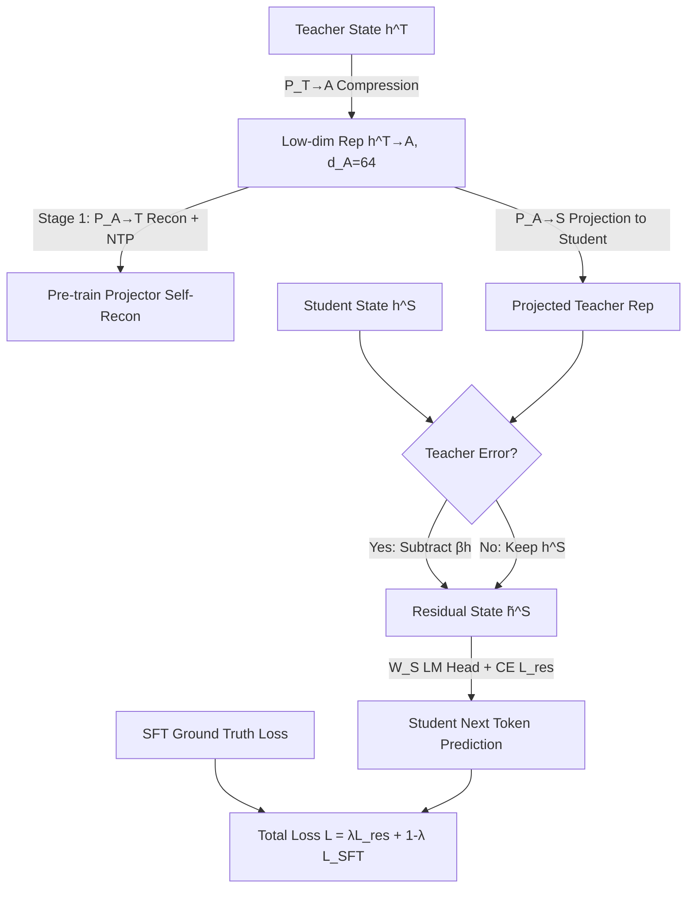

# Knowledge Distillation for Large Language Models through Residual Learning

**Conference**: ICLR 2026  
**OpenReview**: [https://openreview.net/forum?id=Dh6KxUxG20](https://openreview.net/forum?id=Dh6KxUxG20)  
**Code**: TBD  
**Area**: Model Compression / Knowledge Distillation  
**Keywords**: Knowledge Distillation, Residual Learning, White-box Distillation, Cross-tokenizer Distillation, MoE Distillation, LLM Compression  

## TL;DR
Addressing the issue where "the teacher itself can be wrong" in white-box distillation, this paper proposes residual learning: allowing the student to learn the difference between its own representation and the teacher's only at positions where the teacher makes incorrect predictions. By incorporating low-dimensional projection, MoE expert fusion, and cross-tokenizer attention, the method consistently outperforms existing white-box approaches in both same- and cross-tokenizer distillation.

## Background & Motivation

**Background**: Knowledge Distillation (KD) is the primary method for transferring capabilities from large models to small ones. Black-box KD performs supervised fine-tuning only on teacher-generated text, which is simple but wastes rich information in middle-layer representations. White-box KD further aligns logit distributions or hidden states for better performance and has been extended to **cross-tokenizer** scenarios (e.g., ULD, DSKD, ALM) where teacher and student vocabularies differ.

**Limitations of Prior Work**: Current white-box methods almost exclusively rely on **divergence matching** (KL/reverse KL/JS and their variants), which assumes the teacher is always correct. However, teachers are imperfect—they make wrong predictions and carry biases. Forcing students to mimic the teacher's distribution transfers these flaws, limiting the student's generalization. Furthermore, **teacher hacking** (where students learn surface patterns rather than true knowledge) persists. These issues are exacerbated in MoE-to-dense distillation due to vast structural differences.

**Key Challenge**: White-box KD aims to extract intermediate knowledge from the teacher, but this knowledge is "noisy/biased." One must utilize teacher knowledge without blindly trusting it, yet the divergence matching paradigm cannot distinguish "useful knowledge" from "teacher errors."

**Goal**: Design a white-box KD framework universal across diverse scenarios (same-tokenizer, cross-tokenizer, MoE-to-dense) that extracts teacher knowledge while preventing the student from replicating teacher errors to improve generalization.

**Core Idea**: **Residual Learning**—instead of forcing the student to approximate the teacher's distribution as a whole, the student utilizes the residual "student representation - projected teacher representation" for next-token prediction only at **positions where the teacher predicts incorrectly**, encouraging the student to complement the teacher's knowledge.

## Method

### Overall Architecture

The framework consists of two stages. **Stage 1 (Pre-training Projectors)**: A pair of linear projectors compresses teacher hidden states into an architecture-agnostic low-dimensional space $A$ ($d_A=64$), reconstructs them back to the teacher space, and optimizes the projectors via self-reconstruction and next-token prediction using the reconstructed states. **Stage 2 (Distillation)**: The compressed teacher representation is projected into the student space. Only where the teacher's top-1 prediction differs from the ground truth is the teacher representation subtracted from the student's hidden state to obtain a **residual hidden state** for next-token prediction. This is combined with standard SFT to train the student. For cross-tokenizer scenarios, cross-model attention aligns tokens; for MoE teachers, self-attention fuses expert outputs before aggregation.

### Key Designs

**1. Low-dimensional Self-reconstruction Pre-training Projector: Compressing teacher knowledge into architecture-agnostic compact vectors.** Directly aligning high-dimensional states is hindered by structural differences and noise. This paper trains projectors $P^{T\to A}$ and $P^{A\to T}$ to compress states into space $A$ and reconstruct them. The reconstructed state $h^{T'}_i$ is passed to the teacher head for next-token prediction optimized by $L_{CE}=-\sum_i \log\,\mathrm{softmax}(W_T h^{T'}_i)$. This forces the low-dimensional space to retain task-related semantics while discarding redundancy. During distillation, $P^{T\to A}$ is **frozen**. Ablations show that removing pre-training drops the score from 20.01 to 17.39, proving the necessity of "compression before distillation."

**2. Residual Learning: "Subtraction" only at teacher errors to learn complementary knowledge.** This is the core contribution. The projected teacher representation $h^{(T\to A)\to S}_i$ is used to define the residual hidden state:

$$\tilde h^S_i = h^S_i - \beta\, h^{(T\to A)\to S}_i \cdot \mathbb{1}\big[\arg\max P_T(x_i|x_{:i-1}) \neq x_i\big]$$

The indicator function ensures the teacher term is subtracted only when the **teacher's top-1 prediction is incorrect**. Here, the student is guided to capture its own understanding distinct from the teacher. When the teacher is correct, the residual simplifies to the student's state. The residual is then used for $L_{res}=-\sum_i \log\,\mathrm{softmax}(W_S \tilde h^S_i)$, suppressing teacher hacking and bias transfer.

**3. Adaptive Scaling Factor $\beta$: Balancing magnitudes of teacher and student terms.** $\beta$ determines the teacher's contribution weight. If too large, student representations are overwhelmed; if too small, distillation benefits vanish. It is calculated adaptively:

$$\beta = \sqrt{\frac{d_S}{d_A}} \times \frac{1}{n}\sum_{i=1}^{n_S} \frac{\lVert h^S_i\rVert}{\lVert h^{(T\to A)\to S}_i\rVert}$$

The first term $\sqrt{d_S/d_A}$ corrects dimension differences, while the second (norm ratio averaged over the sequence) aligns scales, preventing either side from dominating. Removing $\beta$ causes the largest performance drop (20.01 $\to$ 16.25).

**4. MoE Expert Fusion and Cross-model Attention.** For MoE teachers, scaled dot-product self-attention allows experts to absorb complementary information: $\tilde h^{(m)}_i=\sum_j \alpha_{mj} h^{(j)}_i$. This utilizes total expert knowledge in one forward pass. For cross-tokenizer scenarios, a cross-model attention matrix $A_{ij}$ is constructed using normalized low-dimensional representations to compute weighted teacher representations $\hat h^{T\to A}_i$, enabling alignment without explicit token rules.

## Key Experimental Results

**Settings**: Trained on Dolly (~11k train / 1k val), evaluated on Dolly, SelfInst, VicunaEval, S-NI, and UnNI. Covers same-tokenizer (Mixtral-8×7B $\to$ Mistral-7B, LLaMA2-7B $\to$ TinyLLaMA-1.1B) and cross-tokenizer (Mixtral $\to$ GPT2-120M) setups.

### Main Results

Same-tokenizer KD (Avg. Rouge-L %):

| Teacher $\to$ Student | Student SFT | ULD | MultiLevelOT | DSKD | ABKD | **Ours** | Teacher |
|---|---|---|---|---|---|---|---|
| Mixtral-8×7B $\to$ Mistral-7B | 25.77 | 28.41 | 29.16 | 26.18 | 29.86 | **30.68** | 30.67 |
| LLaMA2-7B $\to$ TinyLLaMA-1.1B | 21.98 | 23.67 | 21.65 | 24.55 | 24.37 | **25.17** | 26.68 |

Cross-tokenizer KD (Avg. Rouge-L %):

| Teacher $\to$ Student | Student SFT | ULD | MultiLevelOT | ALM | DSKD | **Ours** |
|---|---|---|---|---|---|---|
| Mixtral-8×7B $\to$ TinyLLaMA-1.1B | 21.98 | 22.71 | 20.96 | 20.53 | 23.89 | **25.09** |
| Mixtral-8×7B $\to$ GPT2-120M | 16.36 | 17.19 | 16.09 | 16.15 | 18.40 | **20.01** |

Ours ranks first across all four settings. On Mixtral $\to$ Mistral-7B, the score (30.68) **matches the teacher’s zero-shot performance** (30.67).

### Ablation Study

Mixtral-8×7B $\to$ GPT2-120M (Avg. Rouge-L %):

| Variant | Avg. | $\Delta$ |
|---|---|---|
| **Ours** | **20.01** | — |
| w/o $\beta$ | 16.25 | $-3.76$ |
| w/o accuracy mask | 19.59 | $-0.42$ |
| w/o pretraining $P^{T\to A}$ | 17.39 | $-2.62$ |
| w/o MoE fusion – Avg Pooling | 18.43 | $-1.58$ |

### Key Findings
- **$\beta$ is critical**: Removing the adaptive scaling factor leads to the largest drop ($-3.76$).
- **Compression is necessary**: Scanning $d_A$ shows $d_A=64$ is optimal, while larger dimensions (768/1024) drop performance significantly, indicating compression acts as a regularizer.
- **Plug-and-play**: Adding $L_{res}$ to DSKD improves results by $+1.20$, demonstrating the mechanism's generalizability.

## Highlights & Insights
- **Paradigm Shift**: Moving from "indiscriminate imitation" to "complementary learning at teacher errors" directly addresses the overlooked assumption of teacher perfection.
- **Indicator + Adaptive $\beta$**: Using truth alignment to gauge trust and norm ratios for scaling creates a stable and meaningful residual.
- **Unified Framework**: The low-dimensional space $A$ facilitates compression, cross-tokenizer alignment, and MoE fusion simultaneously.
- **Empirical Generality**: The loss function acts as a portable "module" that enhances existing white-box methods.

## Limitations & Future Work
- **Narrow Task Range**: Primarily validated on instruction following; reasoning-intensive tasks and code generation are not yet covered.
- **Scale**: The largest student is 7B; effectiveness on larger students or even stronger teachers remains unverified.
- **Hard Thresholding**: The binary indicator for teacher correctness might ignore useful information in sub-optimal but informative teacher predictions.
- **Scalability**: Constructing $n_S \times n_T$ attention matrices may be costly for long sequences or massive vocabularies.

## Related Work & Insights
- **White-box KD Divergence Family**: Residual learning acts as a "patch" to this paradigm and can be superimposed rather than replaced.
- **Cross-tokenizer KD**: While leveraging DSKD's attention concept, this work uses low-dimensional similarity instead of token embedding alignment to bypass inherent divergence matching flaws.
- **MoE Distillation**: Compared to prior methods using random sampling or routing adjustments, this self-attention expert fusion is more efficient and respects teacher expertise.

## Rating
- **Novelty**: ⭐⭐⭐⭐ — The combination of residual learning, error-based indicators, and adaptive $\beta$ is a fresh and targeted entry point for handling imperfect teachers.
- **Experimental Thoroughness**: ⭐⭐⭐ — Solid across four settings with full ablations and plug-and-play validation, though limited in task variety and model scale.
- **Writing Quality**: ⭐⭐⭐⭐ — Clear motivation, complete formulas, and consistent logic across components.
- **Value**: ⭐⭐⭐⭐ — Highly practical for LLM compression as a portable enhancement for cross-tokenizer and MoE scenarios.

<!-- RELATED:START -->

## Related Papers

- [\[ICLR 2026\] Distillation of Large Language Models via Concrete Score Matching](distillation_of_large_language_models_via_concrete_score_matching.md)
- [\[ICLR 2026\] Knowledge Fusion of Large Language Models Via Modular Skillpacks](knowledge_fusion_of_large_language_models_via_modular_skillpacks.md)
- [\[ICLR 2026\] Pedagogically-Inspired Data Synthesis for Language Model Knowledge Distillation](pedagogically-inspired_data_synthesis_for_language_model_knowledge_distillation.md)
- [\[ICLR 2026\] FutureMind: Equipping Small Language Models with Strategic Thinking-Pattern Priors via Adaptive Knowledge Distillation](futuremind_equipping_small_language_models_with_strategic_thinking-pattern_prior.md)
- [\[ICLR 2026\] What Layers When: Learning to Skip Compute in LLMs with Residual Gates](what_layers_when_learning_to_skip_compute_in_llms_with_residual_gates.md)

<!-- RELATED:END -->
