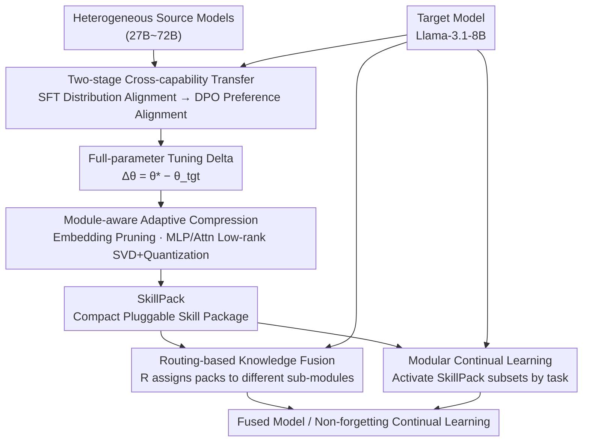

# Knowledge Fusion of Large Language Models Via Modular Skillpacks

**Conference**: ICLR 2026  
**arXiv**: [2505.18502](https://arxiv.org/abs/2505.18502)  
**Code**: [duguodong7/GraftLLM](https://github.com/duguodong7/GraftLLM)  
**Area**: Model Compression / Knowledge Fusion  
**Keywords**: knowledge grafting, SkillPack, heterogeneous model fusion, continual learning, delta compression

## TL;DR

Ours proposes GraftLLM—extracting the capabilities of heterogeneous source models into compact and transferable "SkillPacks" (modular skill packages). By storing parameter increments through a module-aware adaptive compression strategy, it supports knowledge transfer, heterogeneous model fusion, and non-forgetting continual learning, significantly outperforming existing PEFT and parameter fusion methods across multiple scenarios.

## Background & Motivation

Cross-capability transfer is a core challenge in LLM research, involving multi-task fusion, model compression, and continual learning. Works such as FuseLLM and FuseChat have demonstrated the potential to integrate multi-model capabilities into lightweight models, but existing methods primarily focus on **small-scale homogeneous models**, with limited applicability to large-scale heterogeneous models.

For knowledge transfer between large-scale heterogeneous models, existing methods face three major difficulties:

**Catastrophic forgetting in full-parameter fine-tuning**: Knowledge distillation combined with full-parameter fine-tuning can overwrite the inherent capabilities of the target model while acquiring source model capabilities.

**Insufficient capacity of PEFT methods**: Although parameter-efficient methods like LoRA can avoid large-scale forgetting, the adapter capacity is limited, making it difficult to fully absorb complex knowledge from source LLMs, especially in complex training scenarios like DPO where performance drops significantly.

**Parameter conflict issues**: Directly fusing parameter increments from multiple models leads to inter-task interference and performance degradation.

**Core Problem**: How to efficiently and composably transfer the expertise of heterogeneous source models while maintaining the general capabilities of the target model?

## Method

### Overall Architecture

GraftLLM decouples and stores "transferred capabilities" and the "target model body" as a "Target Model + SkillPack" duo. The pipeline consists of four steps: first, a two-stage distillation (SFT to align distribution, DPO to align preferences) is used to learn source model capabilities into the full-parameter fine-tuning weights of the target model, obtaining the parameter delta $\Delta\theta$; next, module-aware compression compresses this massive delta into a compact, pluggable SkillPack according to the layer structure; during inference, a routing function assigns several SkillPacks back to different sub-modules of the target model based on the source model/task type, completing heterogeneous fusion without touching body parameters; applying the same mechanism sequentially naturally supports non-forgetting continual learning.

### Key Designs

**1. Two-stage Cross-capability Transfer: Distribution Alignment followed by Preference Alignment**

Relying on a single step of distillation makes it difficult to both supplement complex source capabilities and maintain alignment quality. Therefore, transfer is split into SFT and DPO steps. In the SFT stage, the negative log-likelihood $\mathcal{L}_{SFT}(\theta) = -\mathbb{E}[\log p_\theta(y_i, x_i)]$ is minimized on high-quality data $\mathcal{D}_{SFT}$ generated by the source model to flatten output distribution differences; subsequently, in the DPO stage, preference pairs $(y_w, y_l)$ are constructed from the best and worst responses generated by the source model for the same input, using $\mathcal{L}_{DPO} = -\mathbb{E}[\log\sigma(\beta \log\frac{\pi_\theta(y_w|x)}{\pi_{ref}(y_w|x)} - \beta \log\frac{\pi_\theta(y_l|x)}{\pi_{ref}(y_l|x)})]$ to further align preferences with the source model. The choice of DPO is motivated by findings that LoRA-like methods fail exactly here—preference alignment collapses when capacity is insufficient, while full-parameter fine-tuning remains stable.

**2. Module-aware Adaptive Compression: Selecting Optimal Operators per Layer Structure**

Storing full-parameter deltas is too costly, but redundancy characteristics vary greatly across modules. Uniform compression would compromise accuracy, so each module type is addressed specifically. Embedding and Output Head layers, which are sensitive to vocabulary alignment and task adaptation, undergo magnitude pruning, retaining the $\alpha$ proportion of weights with the largest absolute values; MLP modules use SVD decomposition $\Delta\theta = \mathbf{U}\Sigma\mathbf{V}^\top$ to exploit parameter redundancy; Attention modules perform low-rank SVD, keeping only components corresponding to the top $r$ singular values. Mixed-precision quantization is stacked on SVD: bit precision $k$ is adaptively assigned based on component importance, and group quantization $\hat{\mathbf{V}}_{[r]}^\top = \text{Quant}_k(\mathbf{V}_{[r]}^\top, \mathbf{x})$ is performed using GPTQ, ensuring high precision for sensitive components and low bits for redundant ones. The final SkillPack is denoted as $\Delta\hat{\theta} = \{C_m(\Delta\theta\_m)\}_{m \in \mathcal{M}}$, where each module $m$ is paired with a compression operator $C_m$ most suited to its structure.

**3. Routing-based Knowledge Fusion: Isolating Multiple Skills to Avoid Interference**

Traditional parameter fusion causes inter-task interference by directly summing increments. GraftLLM uses routing to manage them independently. Multiple SkillPacks are integrated via $\theta_{fused} = \theta_{tgt} + \sum_{i=1}^{n} \mathcal{R}(\Delta\hat{\theta}_i)$, where the routing function $\mathcal{R}$ assigns each SkillPack to its corresponding sub-module based on the source model or task type. In implicit fusion, $\mathcal{R}$ is a lightweight feed-forward classifier; in explicit fusion, it is directly assigned by task type without extra training. By isolating skills in different locations, this bypasses the parameter conflict bottlenecks of methods like Task Arithmetic and TIES.

**4. Modular Continual Learning: On-demand Activation and Plug-and-Play**

Since base parameters remain untouched and capabilities are encapsulated in independent SkillPacks, continual learning becomes the addition/deletion of SkillPacks rather than weight overwriting. Each task $t$ only activates a relevant subset $\mathcal{S}_t$, constructing the current model as $\theta_t = \theta_{tgt} + \sum_{\Delta\hat{\theta}_i \in \mathcal{S}_t} \mathcal{R}(\Delta\hat{\theta}_i)$. New skills do not touch old ones, naturally avoiding catastrophic forgetting; conversely, unloading a SkillPack enables "unlearning" or detoxification.

### Loss & Training

The target model is Llama-3.1-8B-Instruct. Source models include large heterogeneous models such as Gemma-2-27B-it, Mistral-Large-Instruct, Qwen-2.5-72B-Instruct, and Llama-3.1-70B-Instruct. Explicit fusion follows the FuseChat 2.0 settings (OpenChat-3.5-7B as pivot, 6 chat models as sources); implicit fusion follows FuseChat 3.0 (Llama-3.1-8B-I and Qwen-2.5-7B-I as targets). The continual learning scenario involves sequentially learning math → coding to test the suppression of forgetting via modular isolation.

## Key Experimental Results

### Knowledge Transfer and Compression (SFT Setting)

GraftLLM maintains performance close to full-parameter fine-tuning on general tasks like MMLU (gap < 1%), while parameter volume is much smaller than the full model. LoRA performs adequately in simple SFT scenarios but significantly degrades or fails in complex DPO scenarios.

### DPO Setting (GSM8K + MATH)

| Method | Parameter Efficiency | GSM8K+MATH Avg | Description |
|------|---------|---------------|------|
| Full-parameter Tuning | 100% | Highest | Upper bound |
| LoRA (r=32/64/128) | Very low | Severe degradation | Nearly fails under DPO |
| Other compression methods | Medium | Medium | Also struggle under DPO |
| **GraftLLM** | Medium-low | **Near full-parameter** | Remains stable under DPO |

### Explicit Knowledge Fusion (AlpacaEval 2.0 + MT-Bench)

| Method Type | AlpacaEval 2.0 LC Win Rate | MT-Bench Avg Score |
|----------|---------------------------|-------------------|
| Best Parameter Fusion (DARE, etc.) | Medium | Medium |
| Best Routing Method (Twin-Merging) | High | High |
| **GraftLLM** | **+8.07% over best fusion** | **Surpasses all source models** |

With only a 28% increase in parameters, it elevates a 7B model to levels comparable to Mixtral-8x7B and Qwen1.5-Chat-72B.

### Implicit Knowledge Fusion (10 benchmarks)

GraftLLM demonstrates advantages over existing methods across 10 benchmarks on both Llama-3.1-8B-Instruct and Qwen-2.5-7B-Instruct target models.

### Ablation Study

| Configuration | Key Metric | Description |
|------|---------|------|
| Without SVD compression | Highest performance | But large storage cost |
| Uniform compression strategy | Performance drop | Module-specific compression provides gains |
| SFT only (without DPO) | Base capability transfer | DPO significantly improves alignment quality |
| Different SVD rank $r$ | Performance saturates as $r$ increases | Efficiency sweet spot exists |

### Continual Learning

| Method | Coding performance after Math | Math performance after Coding | Description |
|------|------------|------------|------|
| LoRA | Medium | Severe forgetting | Inter-task interference |
| Model Grafting | Medium | Partial forgetting | Limited improvement |
| Model Tailor | Medium | Partial forgetting | Limited improvement |
| **GraftLLM** | **Highest** | **Nearly no forgetting** | Modular isolation |

### Key Findings

- **Failure of PEFT under DPO**: Methods like LoRA work in simple SFT scenarios but suffer from severe capacity shortage in complex training like DPO, a significant but previously overlooked observation.
- **Necessity of module-wise compression**: The embedding layer is sensitive to pruning, the attention layer is suited for low-rank decomposition, and the MLP layer is suited for SVD—uniform strategies perform poorly.
- **Plug-and-play nature of SkillPack**: Since target model parameters are not modified, SkillPacks can be freely loaded/unloaded, naturally supporting operations like forgetting and detoxification.
- **Routing mechanism eliminates parameter conflicts**: The performance of traditional parameter fusion methods (e.g., Task Arithmetic, TIES) is limited by inter-task parameter conflicts; the routing mechanism isolates different skills into independent SkillPacks.

## Highlights & Insights

- **"Target Model + SkillPack" storage paradigm**: Translates the cross-model capability transfer problem into a modular, composable representation, which is conceptually clear and practical.
- **Module-aware adaptive compression** design philosophy: Different architectural components have different compression characteristics, an insight with broad applicability in the field of delta parameter compression.
- **SFT+DPO two-stage pipeline**: First bridges distribution differences via SFT, then fine-tunes preference alignment via DPO, proving more robust than single-stage methods.
- **Natural support for continual learning**: Modular design ensures that adding new skills does not affect existing ones, solving the catastrophic forgetting problem in LLM continual learning.

## Limitations & Future Work

- The design and training of the routing mechanism are not fully detailed; how to automatically select the optimal SkillPack combination for new tasks remains to be clarified.
- The module assignment for compression strategies (which module uses pruning vs. SVD vs. quantization) seems manually set; automated search might further optimize this.
- Experiments are mainly based on the Llama family as target models; generalization to more heterogeneous architectures (e.g., Mamba, hybrid architectures) needs verification.
- SFT data depends on source model generation; data quality is limited by source model capabilities.
- As the number of SkillPacks increases, routing calculation overhead and selection accuracy may become bottlenecks.

## Related Work & Insights

This paper integrates research from three directions: **Knowledge Distillation** (FuseLLM, FuseChat series), **Model Grafting/Pruning** (Task Arithmetic, TIES-Merging, DARE, and other task vector works), and **Model Compression** (SVD, quantization like GPTQ, BitDelta). The innovation of GraftLLM lies in combining the performance advantages of full-parameter fine-tuning with parameter-efficient storage—performing full-parameter tuning first to acquire complete capabilities, then achieving efficient storage via differentiated compression, avoiding the "insufficient capacity" issue of PEFT methods. The SkillPack concept is similar to LoRA adapters but more powerful as it originates from full-parameter tuning deltas rather than low-rank constraints.

## Rating

- Novelty: ⭐⭐⭐⭐ (SkillPack concept and module-aware compression are novel, though individual components are not entirely new)
- Experimental Thoroughness: ⭐⭐⭐⭐⭐ (Knowledge transfer + explicit fusion + implicit fusion + continual learning across 10 benchmarks)
- Writing Quality: ⭐⭐⭐⭐ (Method is clear and experiments are rich, though paper titles appear slightly inconsistent across versions)
- Value: ⭐⭐⭐⭐ (Modular capability transfer approach is practical and serves as a reference for multi-task LLM deployment)

<!-- RELATED:START -->

## Related Papers

- [\[ICLR 2026\] Knowledge Distillation for Large Language Models through Residual Learning](knowledge_distillation_for_large_language_models_through_residual_learning.md)
- [\[ICLR 2026\] S2R-HDR: A Large-Scale Rendered Dataset for HDR Fusion](s2r-hdr_a_large-scale_rendered_dataset_for_hdr_fusion.md)
- [\[ICLR 2026\] Distillation of Large Language Models via Concrete Score Matching](distillation_of_large_language_models_via_concrete_score_matching.md)
- [\[ICLR 2026\] MoSA: Mosaic Shared Adaptation of Large Language Models](mosa_mosaic_shared_adaptation_of_large_language_models.md)
- [\[ICLR 2026\] Landscape of Thoughts: Visualizing the Reasoning Process of Large Language Models](landscape_of_thoughts_visualizing_the_reasoning_process_of_large_language_models.md)

<!-- RELATED:END -->
