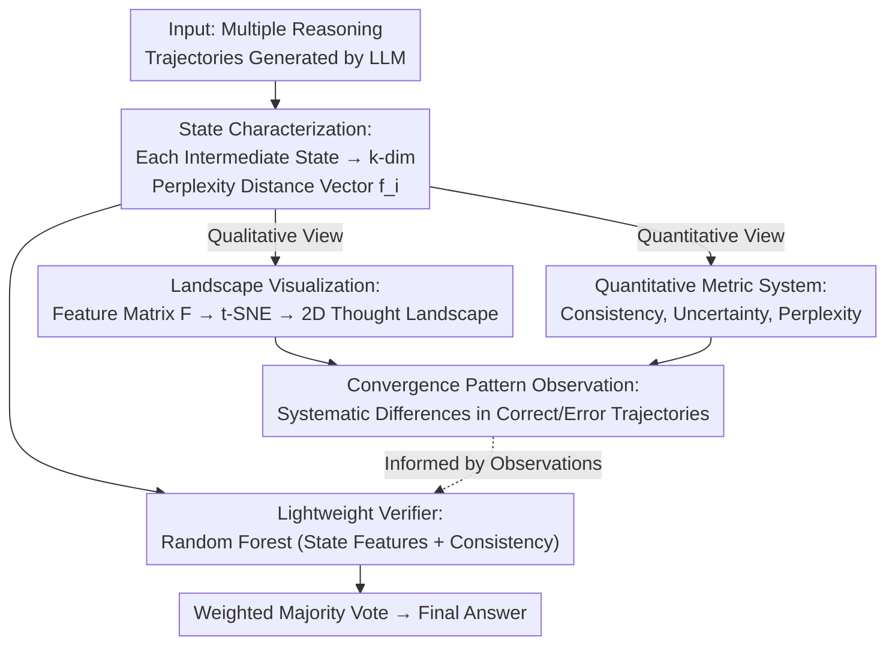

# Landscape of Thoughts: Visualizing the Reasoning Process of Large Language Models

**Conference**: ICLR 2026  
**arXiv**: [2503.22165](https://arxiv.org/abs/2503.22165)  
**Code**: [GitHub](https://github.com/tmlr-group/landscape-of-thoughts)  
**Area**: Model Compression  
**Keywords**: LLM Reasoning Visualization, Reasoning Trajectory Analysis, t-SNE, Test-time Scaling, Lightweight Verifier

## TL;DR
The authors propose Landscape of Thoughts (LoT), the first tool to visualize LLM reasoning trajectories as 2D topographic maps. By using perplexity-based features and t-SNE projections, LoT reveals behavioral patterns in reasoning and can be adapted into a lightweight verifier to improve reasoning accuracy and test-time scaling effects.

## Background & Motivation
The step-by-step reasoning capability of LLMs is widely applied in scenarios like agents, yet the reasoning behavior remains difficult to interpret. Existing analysis methods either rely on specific decoders/tasks or require manual reading of trajectories—which is neither scalable (taking 50 minutes for 100 trajectories) nor conducive to dataset-level aggregation. This hinders model development, reasoning research, and safety monitoring.

**Key Challenge**: There is a lack of a general, automated, and scalable tool capable of analyzing LLM reasoning trajectories from the individual sample to the entire dataset level. **Core Idea**: LoT represents each intermediate state during reasoning as a "distance" feature vector relative to each candidate answer, then uses t-SNE to project these into a 2D space to form a "thought landscape," intuitively demonstrating reasoning convergence patterns.

## Method

### Overall Architecture
LoT aims to solve the invisible problem of "what the LLM's step-by-step reasoning process actually looks like." It is a **post-analysis tool** that does not modify the model or intervene in reasoning; it only "examines" generated reasoning trajectories after the fact. The pipeline is as follows: given a multiple-choice dataset, the LLM generates several reasoning trajectories. LoT first encodes each textual intermediate state into a set of numerical features. Then it branches into two paths: **qualitative visualization**, projecting high-dimensional features into 2D to draw "thought landscapes" for observing convergence patterns; and **quantitative metrics**, quantifying reasoning behavior using consistency, uncertainty, and perplexity. These observed patterns (systematic differences in convergence speed between correct and incorrect trajectories) can then be utilized to train a **lightweight verifier** using the same state features, which weights multiple trajectories during test-time to improve accuracy.

### Key Designs

**1. State Characterization: Converting Textual Intermediate States into Comparable Numerical Vectors**

Reasoning trajectories are text strings and cannot be directly analyzed mathematically. The **Core Idea** of LoT is to measure distance using the LLM's own likelihood without an external encoder: for an intermediate state $s_i$ in a trajectory, it calculates the perplexity to each candidate option $c_j$ sequentially: $d(s_i, c_j) = \text{PPL}(c_j \mid s_i)$. These are concatenated into a $k$-dimensional feature vector $\bm{f}_i$ (where $k$ is the number of options) after normalization. Intuitively, this vector records "how close the model is to each answer from its current reasoning state." Using perplexity has two benefits: it naturally reflects the model's confidence in an answer, and normalization by token length allows for fair comparison between options of different lengths.

**2. Topography Visualization: Compressing High-Dimensional Features into 2D Landscapes via t-SNE**

To make the reasoning process intuitive, LoT takes the state features of all trajectories in a dataset, plus the $k$ options themselves as "landmark" features, and stacks them into a feature matrix $\bm{F} \in \mathbb{R}^{k \times (rn+k)}$ ($r$ trajectories, $n$ states per trajectory, $k$ option landmarks). This is projected onto a 2D plane using t-SNE. t-SNE is chosen for its ability to preserve local neighborhood structures, faithfully unfolding the convergence trends of trajectories as they approach specific options in the distance space. Finally, trajectories are colored by correctness, and density maps are overlaid to show state distributions at different reasoning stages, placing "where reasoning converges, how fast it converges, and if it is correct" right before the eyes.

**3. Quantitative Metric System: Quantifying Reasoning Behavior via Three Metrics**

The landscapes provide qualitative intuition; dataset-level aggregation requires calculable scalars. LoT defines three metrics built directly on state features $\bm{f}_i$. **Consistency** measures whether the optimal choice of an intermediate state matches the final state: $\text{Consistency}(s_i) = \mathbb{1}(\arg\min \bm{f}_i = \arg\min \bm{f}_n)$. Earlier consistency indicates the model "made up its mind" sooner. **Uncertainty** uses the entropy of the feature vector, reflecting the model's hesitation at that step. **Perplexity** is the thought-level perplexity, measuring the model's confidence in its generated thought segment. Together, these allow cross-model and cross-dataset comparisons of "who converges faster and who is more certain."

**4. Lightweight Verifier: Turning Visual Observations into Classifiers**

The topography reveals a usable pattern—correct and incorrect trajectories systematically differ in convergence speed and consistency. LoT leverages these features to train a Random Forest classifier $g$, which takes state features and consistency measures as input and outputs a "correct/incorrect" label for the trajectory. At inference, instead of simple majority voting, this verifier scores each trajectory for **weighted majority voting**. It does not rely on any additional pretrained language models, making it exceptionally lightweight.

## Key Experimental Results

### Main Results

| Model/Method | AQuA (Acc%) | MMLU | CommonsensQA | StrategyQA |
|-----------|-------------|------|--------------|------------|
| Llama-1B (CoT, No Verifier) | 15.8 | - | - | - |
| Llama-3B (CoT, No Verifier) | 42.0 | - | - | - |
| Llama-70B (CoT, No Verifier) | 84.4 | 80.2 | 75.8 | 64.8 |
| With Verifier (10 trajectories) | Consistent Gain | Consistent Gain | Consistent Gain | Consistent Gain |
| Verifier (50 trajectories) | >65% | - | - | - |

### Ablation Study / Transferability

| Training Data → Test Data | Gain (ΔAcc) | Description |
|---------------------|------|--------------|
| AQuA → StrategyQA | +4.5% | Cross-dataset positive transfer |
| 70B → 3B | +5.5% | Cross-model scale positive transfer |
| 1B → 70B | Positive | Small model training usable for large models |

### Key Findings
- Larger models exhibit faster trajectory convergence, higher consistency, and lower uncertainty/perplexity.
- Incorrect trajectories converge to wrong answers earlier than correct trajectories do (allowing for early detection).
- Consistency of intermediate states is generally low, revealing instability in the reasoning process.
- The verifier significantly outperforms baseline voting with 50 trajectories (>65% vs ~30%), demonstrating strong test-time scaling.

## Highlights & Insights
- The **Novelty** lies in transforming reasoning behavior into a visualization problem, analogous to t-SNE's contribution to high-dimensional data analysis.
- The **State Characterization** is clever: using perplexity as a bridge to connect textual space with numerical space.
- The lightweight verifier does not rely on pretrained language models; Random Forest alone effectively distinguishes correct/incorrect trajectories.
- The potential for cross-model/cross-dataset transfer opens directions for universal reasoning monitoring.

## Limitations & Future Work
- Restricted to multiple-choice formats; open-ended tasks require new characterization schemes.
- Dependency on likelihood estimation limits use with closed-source models.
- Cross-dataset transfer is not always positive; feature transferability needs improvement.
- t-SNE projection may lose certain structural information.

## Related Work & Insights
- **vs. Manual Inspection**: LoT provides automated, scalable analysis avoiding subjective bias.
- **vs. Metric Analysis**: Combining qualitative landscapes with quantitative metrics reveals patterns invisible to either method alone.
- **vs. LLM-based Verifiers**: Lightweight and fast, requiring no additional language models.

## Rating
- **Novelty**: ⭐⭐⭐⭐⭐ First reasoning trajectory visualization tool, pioneering perspective.
- **Experimental Thoroughness**: ⭐⭐⭐⭐ Evaluated across multiple models/methods/datasets, though lacks direct comparison with LLM-verifiers.
- **Writing Quality**: ⭐⭐⭐⭐⭐ Exquisite charts, well-organized observations.
- **Value**: ⭐⭐⭐⭐ Practical value for reasoning research and safety monitoring; verifier utility is specialized.

<!-- RELATED:START -->

## Related Papers

- [\[ICLR 2026\] Scaling Reasoning Hop Exposes Weaknesses: Demystifying and Improving Hop Generalization in Large Language Models](scaling_reasoning_hop_exposes_weaknesses_demystifying_and_improving_hop_generali.md)
- [\[ICLR 2026\] BeyondBench: Contamination-Resistant Evaluation of Reasoning in Language Models](beyondbench_contamination-resistant_evaluation_of_reasoning_in_language_models.md)
- [\[ACL 2026\] LightReasoner: Can Small Language Models Teach Large Language Models Reasoning?](../../ACL2026/model_compression/lightreasoner_can_small_language_models_teach_large_language_models_reasoning.md)
- [\[AAAI 2026\] Efficient Reasoning for Large Reasoning Language Models via Certainty-Guided Reflection Suppression](../../AAAI2026/model_compression/efficient_reasoning_for_large_reasoning_language_models_via_certainty-guided_ref.md)
- [\[ICLR 2026\] Knowledge Fusion of Large Language Models Via Modular Skillpacks](knowledge_fusion_of_large_language_models_via_modular_skillpacks.md)

<!-- RELATED:END -->
