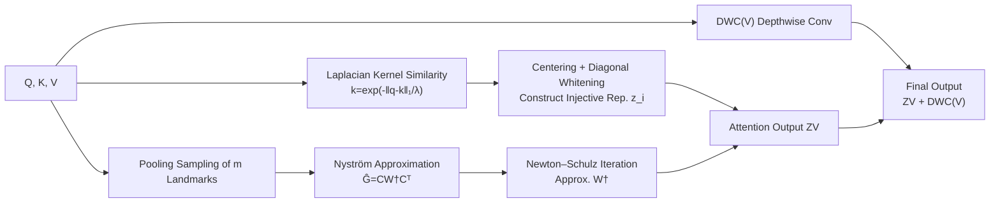

# LaplacianFormer: Rethinking Linear Attention with Laplacian Kernels

**Conference**: ICLR 2026  
**OpenReview**: [https://openreview.net/forum?id=bJZExGYWqx](https://openreview.net/forum?id=bJZExGYWqx)  
**Code**: The paper states it is open-sourced (LaplacianFormer, see original text for link)  
**Area**: Efficient Attention / Vision Transformer Backbones  
**Keywords**: Linear Attention, Laplacian Kernel, Nyström Approximation, Newton–Schulz Iteration, Injective Feature Mapping, CUDA Acceleration  

## TL;DR
LaplacianFormer argues that existing linear attention mechanisms lack a theoretical basis for defaulting to Gaussian kernels, which excessively suppress moderately correlated tokens. By substituting the Gaussian kernel with a slower-decaying, non-vanishing gradient Laplacian kernel (based on the $\ell_1$ distance) and combining it with injective normalization, Nyström low-rank approximation, and Newton–Schulz inversion, the model achieves a superior accuracy-efficiency trade-off on ImageNet with linear complexity.

## Background & Motivation
**Background**: The $O(N^2)$ complexity of softmax attention limits the scalability of Transformers for high-resolution vision tasks. Linear attention reduces this complexity to $O(Nd^2)$ via a kernel function $\mathrm{Sim}(q_i,k_j)=\phi(q_i)\phi(k_j)^\top$, enabling the computation of $K^\top V$ first.

**Limitations of Prior Work**: From SOFT and Skyformer to Gaussian Kernelized Attention, the vast majority of linear attention variants adopt the Gaussian kernel to define similarity as a "default convention" rather than a theoretically supported design—no prior work explains why Gaussian kernels are suitable for characterizing query-key interactions.

**Key Challenge**: The Gaussian kernel assumes that similarity decays rapidly according to the $\ell_2^2$ distance. However, the authors analyzed official weights from DeiT/PVT/Swin and found that real Q-K $\ell_2^2$ distances exhibit a **heavy-tailed distribution with large variance and many outliers**. The exponential function in the Gaussian kernel amplifies these tail effects: a few outlier keys dominate the entire attention map, while moderately relevant keys are suppressed. This harms expressivity and leads to vanishing gradients and unstable optimization during early training. In contrast, the $\ell_1$ distance is more concentrated and robust to outliers.

**Goal**: To replace the Gaussian kernel with one that is theoretically and empirically sound, while maintaining linear complexity, expressivity (injectivity/full-rank), and practical deployment efficiency.

**Core Idea**: **Replace the Gaussian kernel with a Laplacian kernel $k(x,y)=\exp(-\|x-y\|_1/\lambda)$**. It decays more slowly, and due to the piecewise linear nature of the $\ell_1$ norm, its gradient does not vanish when $x\approx y$ ($\partial k/\partial x_i = \tfrac{1}{\lambda}\mathrm{sign}(x_i-y_i)\,k$), whereas the Gaussian kernel gradient approaches zero linearly. Simply replacing the Gaussian kernel with a Laplacian kernel in representative models (e.g., SOFT++, Skyformer) results in faster convergence and more structured attention maps.

## Method

### Overall Architecture
LaplacianFormer uses PVT as a backbone and replaces self-attention with Laplacian-based linear attention. An attention block proceeds as follows: first, calculate the similarity vector between queries and all keys using the Laplacian kernel; apply "centering + whitening" to construct an **injective normalized representation** $z_i$; to avoid direct $N\times N$ kernel matrix inversion or eigendecomposition, use **Nyström low-rank approximation** to compress the kernel matrix into a landmark-sampled form; the required inverse of the landmark kernel matrix is solved via **Newton–Schulz iteration** using only matrix multiplications; finally, the output is augmented with a depthwise separable convolution to supplement local context. The entire forward/backward pass is accelerated with custom CUDA kernels.

### Key Designs

**1. Injective Normalized Laplacian Attention: Ensuring different queries yield distinct outputs.** Simply using the Laplacian kernel is insufficient—the low-rank approximation in linear attention can degrade expressivity. Drawing from the concept of attention injectivity, the authors construct a whitened kernel representation for each query $q_i$:
$$z_i = \Sigma^{-\frac{1}{2}}\Big([k(q_i,k_1),\dots,k(q_i,k_N)]^\top - \tfrac{1}{N}\sum_j k(q_i,k_j)\Big) + \tfrac{1}{N},$$
where the similarity vector is de-meaned and then standardized by a whitening matrix $\Sigma^{-1/2}$. Since an ideal $\Sigma^{-1/2}$ requires $O(N^3)$ eigendecomposition, the authors use a **diagonal estimation**: computing the mean $\mu_j$ and variance $\sigma_j^2$ dimension-wise across a batch of similarity vectors to normalize $\tilde g_{ij}=(g_{ij}-\mu_j)/\sqrt{\sigma_j^2+\varepsilon}$, corresponding to a diagonal whitening matrix $D^{-1/2}$. This preserves centering and scaling while reducing time/space complexity from quadratic to linear. The paper proves in the appendix that this transformation is **injective** under mild assumptions, thereby retaining fine-grained distinctions between tokens like softmax and yielding full-rank attention maps. The final output is $\mathrm{Attention}=ZV+\mathrm{DWC}(V)$, using depthwise convolution to recover local context.

**2. Nyström Low-rank Approximation of the Laplacian Kernel Matrix: Avoiding explicit $N\times N$ computation.** The Laplacian kernel matrix $G$ is still $N\times N$. The authors use the Nyström method to select $m\ll N$ landmark tokens, approximating the kernel matrix as $\hat G = C W^\dagger C^\top$, where $C_{i\ell}=\exp(-\tfrac{1}{\lambda}\|q_i-\tilde k_\ell\|_1)$ is the cross-kernel between all queries and landmarks, and $W_{\ell\ell'}$ is the kernel matrix between landmarks, with $W^\dagger$ being its pseudo-inverse. Landmark selection follows PVTv2: reshaping the query tensor into a spatial map and aggregating landmark tokens via $r\times r$ average pooling. This step compresses the rank and computation of the kernel matrix to $O(N)$.

**3. Newton–Schulz Iteration for Pseudo-inverse + Fused CUDA Kernels: GPU-friendly, SVD/Inversion-free.** Nyström requires $W^\dagger$, but explicit inversion or SVD is slow and unstable on GPUs. Since $W$ is symmetric positive semi-definite, the authors approximate the pseudo-inverse using Newton–Schulz iteration: first, $W\leftarrow W+\epsilon I$ ensures strict positive definiteness; then initialize $X_0=\alpha W^\top$ ($\alpha=2/\|W\|_2$ to ensure convergence $\|I-\alpha WW^\top\|<1$); finally, iterate $X_{k+1}=X_k(2I-WX_k)$. This process **involves only matrix multiplication and addition**, proving more robust than Conjugate Gradient (CG) for ill-conditioned matrices (e.g., condition number $\kappa=50$). Two custom CUDA kernels are provided: one **fuses** Laplacian distance calculation and exponential transformation to reduce memory access, and another optimizes Newton–Schulz matrix multiplication via tiling and register reuse, achieving <0.05ms latency for per-layer forward/backward passes, suitable for edge deployment.

## Key Experimental Results

### Main Results: ImageNet-1K Classification (Grouped by FLOPs)

| FLOPs | Model | Params | FLOPs | Top-1 % |
|---|---|---|---|---|
| <3G | BiFormer-T | 13.1M | 2.2G | 81.4 |
| <3G | **LaplacianFormer-Tiny** | 12.1M | 2.1G | **81.4** |
| 3–8G | BiFormer-S / InLine-CSwin-S | ~25–33M | 4.5–6.8G | 83.8 |
| 3–8G | **LaplacianFormer-Small** | 25.7M | 4.8G | **83.8** |
| 8–10G | SViT-B | 52M | 9.9G | 84.8 |
| 8–10G | **LaplacianFormer-Medium** | 46.3M | 7.43G | **85.3** |
| 10–14G | MogaNet-L | 82.5M | 15.9G | 84.7 |
| 10–14G | **LaplacianFormer-Large** | 63.1M | 11.2G | **85.6** |
| >14G | MLLA-B / SViT-L | 95–96M | 15.6–16.2G | 85.3 |
| >14G | **LaplacianFormer-Huge** | 78.5M | 15.5G | **85.8** |

LaplacianFormer achieves the highest Top-1 accuracy across all FLOPs groups while being more efficient in parameters and computation (Medium reaches 85.3% with only 7.43G). GPU memory scales **linearly** with sequence length, comparable to Performer/SOFT and far superior to vanilla Transformers.

### Downstream: Detection & Segmentation (Mask R-CNN / RetinaNet, 1× schedule)

| Backbone | $AP^b$ | $AP^m$ | RetinaNet $AP^b$ |
|---|---|---|---|
| SOFT++-Tiny | 41.2 | 38.2 | 41.9 |
| **LaplacianFormer-Tiny** | **43.2** | **40.3** | **42.5** |
| SOFT++-Medium | 46.6 | 42.0 | 44.3 |
| **LaplacianFormer-Medium** | **48.0** | **43.5** | **47.2** |

Across all scales, it outperforms corresponding backbones like SOFT++, PVT, and Agent-PVT.

### Ablation Study

| Setting | Variant | Result |
|---|---|---|
| Inverter (Tiny / Small) | CG vs **Newton–Schulz** | 79.2/81.4 → **81.4/83.8** |
| Kernel Scale $\lambda$ (Tiny) | 0.5 / 1 / 2 / **4** / 8 | 79.4 / 79.6 / 80.1 / **81.4** / 78.5 |

### Key Findings
- **Kernel Swap is Immediately Effective**: Replacing the Gaussian kernel in SOFT++/Skyformer with the Laplacian kernel (ceteris paribus) leads to faster convergence, more structured attention maps, and better rank profiles.
- **Newton–Schulz is Steadier than CG**: CG degrades significantly under ill-conditioned cases. NS converges stably after an initial warm-up, yielding a ~2% accuracy gain.
- **$\lambda=4$ is Optimal**: Too small a scale suppresses long-range interactions, while too large a scale over-smooths attention and dilutes local details.

## Highlights & Insights
- **Challenging Default Conventions with Empirical Observations**: By identifying the heavy-tailed distribution of real Q-K distances and demonstrating the vanishing gradients of Gaussian kernels at close range, the authors provide a solid empirical and theoretical foundation for why Gaussian kernels are unsuitable.
- **Injectivity as a Lever for Expressivity**: Formalizing "distinguishing between different tokens" as an injective transformation and reducing $O(N^3)$ whitening to linear via diagonal approximation links theoretical goals with engineering implementation cleanly.
- **End-to-End GPU Optimization**: The combination of Nyström, Newton–Schulz, and fused CUDA kernels purposefully avoids inversion/SVD/eigendecomposition, making the method truly deployable for high-throughput edge cases rather than just a theoretical complexity analysis.

## Limitations & Future Work
- **Comparison Limited to Gaussian**: The authors explicitly focus on "Laplacian vs. Gaussian." Comparisons with other kernel families (e.g., Cosine, Polynomial) are left for future work; thus, "Laplacian as the optimal kernel" is not yet definitive.
- **Diagonal Whitening Approximation**: Diagonal whitening ignores correlations between dimensions of similarity vectors. The injectivity proof also relies on "mild assumptions," which might deviate in certain distributions.
- **Evaluation Centered on Vision**: The primary testing ground is ImageNet and vision downstream tasks. While long-sequence tasks are mentioned, systematic validation on NLP/Long-context tasks is not fully explored.
- **Fixed $\lambda$ Hyperparameter**: The kernel scale $\lambda=4$ is fixed globally. Whether it should be adaptive per layer/head or if it remains robust across different resolutions has not been investigated.

## Related Work & Insights
- **Linear Attention Lineage**: Nyströmformer (Nyström decomposition), SOFT (learnable low-rank kernels), Skyformer (Gaussian kernel + Nyström), Performer (FAVOR+ random features), cosFormer (Cosine re-weighting), and Hedgehog (structured linear transforms). The differentiation here lies in moving away from the "Gaussian convention."
- **Attention Injectivity**: Drawing on InLine (Han et al. 2024a) regarding full-rank/injective attention, the paper treats "retaining fine-grained token distinction" as a primary design criterion for linear attention.
- **Inspiration**: When a design becomes a "default" in the community (like Gaussian kernels in linear attention), revisiting it with data distribution and gradient analysis often reveals low-hanging fruit for improvement.

## Rating
- **Novelty**: ⭐⭐⭐⭐ — Successfully targets the "Gaussian default convention" with a systematic replacement using Laplacian kernels and injective normalization. The motivation is robust, though the kernel swap is a localized innovation.
- **Experimental Thoroughness**: ⭐⭐⭐⭐ — Comprehensive ImageNet scaling, detection/segmentation, and thorough ablations on inverters/scales; however, lacks comparison with non-Gaussian kernels and large-scale NLP validation.
- **Writing Quality**: ⭐⭐⭐⭐ — High-quality logical flow from empirical distribution to gradient analysis. Formulas and algorithms are clearly presented with intuitive illustrations.
- **Value**: ⭐⭐⭐⭐ — Provides a theoretically grounded, plug-and-play efficient attention solution with optimized CUDA implementation, offering clear practical value for edge-deployed Vision Transformers.

<!-- RELATED:START -->

## Related Papers

- [\[ICLR 2026\] SLA: Beyond Sparsity in Diffusion Transformers via Fine-Tunable Sparse–Linear Attention](sla_beyond_sparsity_in_diffusion_transformers_via_fine-tunable_sparselinear_atte.md)
- [\[NeurIPS 2025\] Linear Attention for Efficient Bidirectional Sequence Modeling](../../NeurIPS2025/model_compression/linear_attention_for_efficient_bidirectional_sequence_modeling.md)
- [\[CVPR 2025\] LALIC: Linear Attention Modeling for Learned Image Compression](../../CVPR2025/model_compression/linear_attention_modeling_for_learned_image_compression.md)
- [\[CVPR 2026\] Trainable Log-linear Sparse Attention for Efficient Diffusion Transformers](../../CVPR2026/model_compression/trainable_log-linear_sparse_attention_for_efficient_diffusion_transformers.md)
- [\[ICLR 2026\] Rethinking Residual Errors in Compensation-based LLM Quantization](rethinking_residual_errors_in_compensation-based_llm_quantization.md)

<!-- RELATED:END -->
