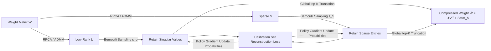

# Large Language Model Compression with Global Rank and Sparsity Optimization

**Conference**: ICLR 2026  
**OpenReview**: [https://openreview.net/forum?id=ZaPmQ0NHs4](https://openreview.net/forum?id=ZaPmQ0NHs4)  
**Code**: TBD  
**Area**: Model Compression / LLM Pruning  
**Keywords**: Low-rank+sparse decomposition, RPCA, Global resource allocation, Policy gradient, Training-free pruning  

## TL;DR
This paper proposes CAP—a two-stage LLM compression framework that first uses Robust Principal Component Analysis (RPCA) to decompose weight matrices into low-rank and sparse candidate subspaces, then utilizes a global budget allocation based on Bernoulli probabilities and policy gradients to automatically decide which singular values and sparse entries to retain across layers. This approach requires no manual thresholds and no backpropagation through the original weights.

## Background & Motivation
**Background**: Among various LLM compression routes, quantization maintains the model structure but targets only precision, while pruning is flexible in parameter reduction but often requires fine-tuning or distillation to recover performance. To preserve critical info under aggressive compression, a "low-rank + sparse" compound decomposition is a natural path—the low-rank part captures global correlations, while the sparse part characterizes outliers or domain-specific knowledge.

**Limitations of Prior Work**: Methods represented by LoSparse suffer from several flaws: (1) dependence on **manually set singular value thresholds**, which easily mis-deletes moderately sized but important singular values; (2) the update processes for the low-rank and sparse parts remain relatively independent, lacking true collaborative optimization; (3) they typically require expensive backpropagation or iterative pruning to update parameters.

**Key Challenge**: Transformers exhibit huge differences in redundancy from shallow to deep layers (within the same block, the singular value spectra of attention and FFN are similar, but they differ significantly across layers). Applying a fixed target rank $R$ to all layers leads to some layers being over-pruned and others under-pruned. However, **the search space for global joint optimization of every weight is prohibitively large**.

**Goal**: Under a unified parameter budget $K$, automatically detect the redundancy of each layer and coordinate the interaction between low-rank and sparse components, without relying on heuristic thresholds or backpropagation of the original LLM weights.

**Core Idea**: **First, compress the massive weight-wise search space into two high-quality candidate pools—"low-rank directions + sparse outliers"—using RPCA, then perform budget-aware global discrete selection using Bernoulli probabilities + policy gradients.**

## Method

### Overall Architecture
CAP is a decoupled two-stage process: Stage 1 utilizes RPCA to decompose each weight matrix $W$ into a low-rank matrix $L$ and a sparse matrix $S$. The goal here is not to reach the compression target directly, but to transform the difficult "weight-wise pruning" problem into selecting candidates from two structured subspaces. Stage 2 then performs budget-aware global allocation on these two candidate pools, learning the retention probability for each singular value/sparse entry, and finally truncating to a compressed model that strictly satisfies the budget via top-K selection.

### Key Designs
**1. Principled RPCA Decomposition: Shrinking the search space into "low-rank + sparse" candidate pools.** Stage 1 does not pursue the target compression rate but provides a high-quality candidate library for subsequent selection. It formulates decomposition as a convex optimization: $\min_{L,S} \|L\|_* + \lambda\|S\|_1 \;\text{s.t.}\; W = L+S$, where the nuclear norm $\|L\|_*$ is the tightest convex relaxation of the rank function, and the $\ell_1$ norm $\|S\|_1$ is the standard convex relaxation of $\ell_0$ sparsity. Thus, this step yields globally optimal solutions for the "low-rank + sparse" separation objective. Crucially, the hyperparameter $\lambda$ determines the "nature" of the decomposition rather than the final compression rate (set as $\lambda = 1/\sqrt{\max(m,n)}$ in the paper); attempting to control sparsity by tuning $\lambda$ causes unpredictable changes in the rank of $L$, leading to inferior decomposition. The solution uses ADMM: $L$ is updated via Singular Value Thresholding (SVT) $L_{k+1}=U\,\text{diag}(\text{shrink}_{\mu^{-1}}(\sigma))V^\top$, and $S$ is updated via element-wise soft thresholding, with the multiplier $Y$ updated synchronously to separate $W$ into a low-dimensional subspace capturing directional patterns and a sparse subspace carrying local refinements.

**2. Bernoulli Probabilistic Global Budget Allocation: Selecting parameters across types using a unified "cost-performance" metric.** The candidate pool from RPCA does not satisfy the budget. Stage 2 must select which rank-1 components and sparse entries to retain. Each retention decision is modeled as a Bernoulli variable $m_{\sigma_i}\sim\text{Bernoulli}(s_{\sigma_i})$ and $m_{S_{ij}}\sim\text{Bernoulli}(s_{S_{ij}})$. The compressed matrix is $\tilde W = U\,\text{diag}(\sigma\odot m_\sigma)V^\top + S\odot m_S$, with the budget constraint $\sum_i s_{\sigma_i}(m+n) + \sum_{i,j} s_{S_{ij}} \le K$. Note that retaining one singular value requires storing $(m+n)$ vector parameters, while retaining one sparse entry takes only 1 parameter—explicitly encoding "cost" into the constraints. The beauty is that the learned probability $s_k$ acts as a comparable "utility-cost ratio" proxy across parameter types, allowing different parameters to be allocated uniformly in a single global ranking.

**3. REINFORCE Policy Gradient + Global top-K Truncation: Bypassing thresholds and original weight backprop.** Since retention decisions are discrete samples and not directly differentiable, CAP uses REINFORCE-style policy gradients to optimize the expected loss on a calibration set: $\min_s \mathbb{E}_{m\sim p(m|s)}[\mathcal{L}(\tilde W)]$. The gradient is $\nabla_{s_k}\mathbb{E}[\mathcal{L}] = \mathbb{E}[\mathcal{L}(\tilde W)\nabla_{s_k}\log p(m|s_k)]$, where $\nabla_{s_k}\log p(m_k|s_k) = (m_k - s_k)/(s_k(1-s_k)+\epsilon)$. To reduce variance, a moving average baseline is maintained $\delta \leftarrow \beta\delta + (1-\beta)\mathcal{L}(\tilde W)$, and probabilities are updated as $s_k \leftarrow s_k - \eta(\mathcal{L}(\tilde W)-\delta)\nabla_{s_k}\log p(m_k|s_k)$, followed by projecting $s$ back onto the budget simplex. The entire optimization involves only forward passes on a small calibration set, with **no backpropagation through the original LLM weights**. After convergence, $s_k$ is used as an importance score for global ranking to select the top-K components for a deterministic binary mask, strictly adhering to the budget. The retained low-rank part is then factorized into $U'=[\sqrt{\sigma_1}u_1,\dots]$ and $V'=[\sqrt{\sigma_1}v_1,\dots]$, such that $\tilde W = U'(V')^\top + S\odot m_S$, further reducing inference storage and computation costs.

## Key Experimental Results

### Main Results (50% compression, Zero-Shot Avg Acc % / WikiText PPL)

| Method | Phi-3 Mini Acc | LLaMA-3 8B Acc | LLaMA-3 70B Acc | Phi-3 Mini PPL | LLaMA-3 8B PPL |
|------|------|------|------|------|------|
| Dense (0%) | 72.85 | 70.79 | 76.53 | 9.42 | 8.56 |
| SparseGPT | 66.36 | 64.66 | 73.17 | 16.80 | 11.95 |
| Wanda | 65.03 | 63.27 | 72.85 | 17.23 | 12.36 |
| OATS | 68.41 | 65.71 | 73.30 | 15.18 | 10.87 |
| OWL | 65.78 | 63.95 | 73.25 | 16.85 | 12.18 |
| AlphaPruning | 65.95 | 64.12 | 73.42 | 16.72 | 12.05 |
| **CAP (Ours)** | **69.12** | **66.85** | **74.18** | **14.68** | **10.35** |

### Instruction Models / Joint Compression Comparison

| Setting | Metric | Baseline | CAP |
|------|------|------|------|
| LLaMA-3.1-8B-Inst 50% | GSM8K (8-shot %) | Wanda 45.6 | **56.8 (+11.2)** |
| LLaMA-3.1-8B-Inst 50% | LongBench-v2 (%) | Wanda 25.1 | **27.2 (+2.1)** |
| LLaMA-3.1-8B-Inst 50% | WikiText PPL | Wanda 7.26 | **6.61 (−0.65)** |
| OPT-6.7B 50%+Quant | Zero-shot Acc | SLiM-LoRA 47.1 | **48.2** |
| LLaMA-2 13B 50%+Quant | Zero-shot Acc | SLiM-LoRA 57.9 | **59.2** |

### Key Findings
- **Low-rank backbone is crucial for reasoning**: CAP significantly outperforms Wanda by +11.2% on GSM8K, suggesting that unstructured pruning destroys precise reasoning circuits, while the low-rank backbone preserved by CAP maintains them.
- **Sparse components are indispensable**: Compared to pure SVD methods (SVD-LLM v2 / Dobi-SVD / Basis Sharing), CAP achieves a PPL of 5.85 vs 6.08 at 20% compression, proving the necessity of the sparse part.
- **RPCA is a superior initialization**: Training-free CAP is already competitive; adding fine-tuning (CAP w/ FT) significantly exceeds LoSparse which requires iterative fine-tuning, validating the superiority of RPCA as an initialization.

## Highlights & Insights
- **Decoupling "Optimization Difficulty" into "Convex Decomposition + Discrete Allocation"**: Stage 1's convex optimization ensures the decomposition is globally optimal, while Stage 2 uses policy gradients to handle discrete budget allocation. This division balances theoretical principledness with practical flexibility.
- **Unified comparable probability scores** are the masterstroke—allowing singular values (expensive) and sparse entries (cheap) to be globally ranked via top-K under the same metric, automatically achieving resource allocation across layers and types.
- **Completely Training-free**: Does not backpropagate through original LLM weights; it only performs lightweight policy gradient optimization on 128 C4 calibration sequences (3 iterations, sliding window 5, learning rate 0.05), making it memory-friendly.

## Limitations & Future Work
- The authors admit in the Discussion that the policy gradient in Stage 2 is a **heuristic optimizer**, which does not guarantee global optimality for non-convex pruning objectives but empirically finds effective allocations via the high-quality RPCA subspaces.
- Some baseline numbers in the main table (OWL/AlphaPruning) are very close to original unstructured methods, and reports on variance/multiple runs are lacking. Gains on larger models (e.g., 70B) are relatively modest.
- RPCA's ADMM decomposition itself has a one-time computational overhead for super-large matrices. Throughput and resource consumption analysis are delegated to the appendix and not fully expanded in the main text.
- Policy gradients have high variance and require a moving baseline for mitigation; robustness under more aggressive compression rates (>50%) or smaller calibration sets remains to be verified.

## Related Work & Insights
- **Low-rank + Sparse Composite**: LoSparse (pruning residuals after SVD, requires thresholds+FT), LPAF (pruning then SVD then mixed-rank FT), SLiM (fitting quantization error with low-rank). CAP differs as its low-rank components "emerge" through joint RPCA optimization rather than acting as an error-fitting tool.
- **Inter-layer Sparsity Allocation**: OWL, AlphaPruning, and OATS use second-order/spectral info to allocate layer-wise sparsity. CAP unifies this into a probabilistic global budget optimization.
- **Insight**: Reparameterizing the "discrete decision for each weight" as Bernoulli probabilities + policy gradients + budget simplex projection is a general paradigm transferable to other structured compression tasks (e.g., mixed-precision quantization bit-width allocation).

## Rating
- **Novelty**: ⭐⭐⭐⭐ — The combination of RPCA candidate pools and Bernoulli global budget allocation is novel, and "unified probability scores across types" is an interesting idea, though low-rank+sparse and policy gradient pruning have individual precedents.
- **Experimental Thoroughness**: ⭐⭐⭐⭐ — Covers LLaMA-1/2/3, OPT, Phi-3, Qwen2.5, and BERT across various scales; includes Zero-shot/PPL/GSM8K/LongBench/GLUE, but lacks variance reports and detailed throughput in the main text.
- **Writing Quality**: ⭐⭐⭐⭐ — Clear logic from motivation to method and experiment. Full formulas and framework diagrams. Discussion honestly notes the heuristic nature of Stage 2.
- **Value**: ⭐⭐⭐⭐ — Training-free, memory-friendly, and provides significant gains over Wanda on challenging reasoning tasks; high practical value for real-world LLM deployment.

<!-- RELATED:START -->

## Related Papers

- [\[ICLR 2026\] LSA: Layer-wise Sparsity Allocation for Large Language Model Pruning Based on Minimal Linear Reconstruction Error](lsa_layer-wise_sparsity_allocation_for_large_language_model_pruning_based_on_min.md)
- [\[ICML 2025\] RADIO: Rate-Distortion Optimization for Large Language Model Compression](../../ICML2025/model_compression/radio_rate-distortion_optimization_for_large_language_model_compression.md)
- [\[ICLR 2026\] GPTailor: Large Language Model Pruning Through Layer Cutting and Stitching](gptailor_large_language_model_pruning_through_layer_cutting_and_stitching.md)
- [\[ICLR 2026\] WINA: Weight Informed Neuron Activation for Accelerating Large Language Model Inference](wina_weight_informed_neuron_activation_for_accelerating_large_language_model_inf.md)
- [\[ICLR 2026\] MaskPro: Linear-Space Probabilistic Learning for Strict (N:M)-Sparsity on LLMs](maskpro_linear-space_probabilistic_learning_for_strict_nm-sparsity_on_llms.md)

<!-- RELATED:END -->
