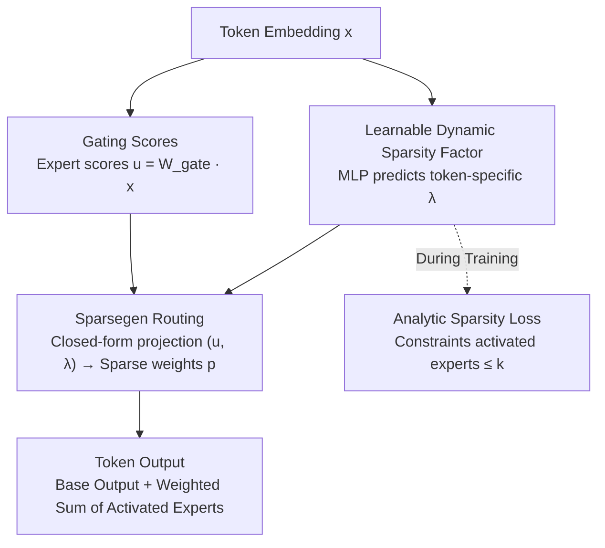

# LD-MoLE: Learnable Dynamic Routing for Mixture of LoRA Experts

**Conference**: ICLR 2026  
**arXiv**: [2509.25684](https://arxiv.org/abs/2509.25684)  
**Code**: [GitHub](https://github.com/eshentw/LD-MoLE)  
**Area**: Model Compression  
**Keywords**: LoRA, Mixture-of-Experts, Dynamic Routing, Sparsegen, parameter-efficient fine-tuning

## TL;DR
LD-MoLE is proposed, utilizing the Sparsegen closed-form projection to replace traditional TopK routing. It achieves differentiable, dynamic, and token-adaptive LoRA expert allocation. Combined with a lightweight MLP to predict sparsity factors and an analytic sparsity loss, it outperforms fixed-routing and ReLU-routing baselines across multiple benchmarks.

## Background & Motivation
LoRA + MoE (MoLE) is a promising direction for efficient fine-tuning of large models: multiple low-rank LoRA modules act as experts, and a routing network determines which experts to use for each token. However, existing methods generally rely on TopK routing, which faces three major limitations:

**Hyperparameter Sensitivity**: The value of $k$ requires careful tuning, and the optimal $k$ varies across different tasks.

**Non-differentiability**: TopK selection is a discrete operation, hindering end-to-end optimization.

**Fixed Allocation**: Every token activates the same number of experts, failing to adapt to varying token complexities.

ReMoE attempts to solve this with ReLU routing but suffers from instability where some tokens might not be assigned to any experts. The core problem is: Can a routing mechanism be designed that is both stable/differentiable and capable of adaptively controlling the number of experts?

The key insight of LD-MoLE is to leverage Sparsegen—a closed-form projection on the probability simplex—to ensure at least one expert is assigned to every token while achieving dynamic expert selection via a learnable sparsity parameter $\lambda$.

## Method

### Overall Architecture
LD-MoLE addresses the long-standing issues of TopK routing being non-differentiable and requiring manual tuning of $k$. It attaches multiple LoRA experts to the linear projections of each Transformer layer. For each incoming token, the routing module reads its embedding and operates along two parallel branches: one performs gating to produce expert scores $\bm{u}$, and the other uses a lightweight MLP to predict a token-specific sparsity factor $\lambda$. Both are fed into the Sparsegen closed-form projection to obtain sparse weights $\bm{p}$ on the probability simplex, which determine which experts are activated and their respective weights. The final output for the token is the sum of the base weight output and the weighted sum of outputs from all activated experts. During training, an analytic sparsity loss uses $\lambda$ to constrain the number of activated experts within a target range. The entire routing process, from scoring to sparse allocation, is closed-form and differentiable everywhere, allowing for end-to-end training with the base model.

### Key Designs

**1. Sparsegen Routing: Replacing Discrete TopK with Closed-form Projection**

The drawback of TopK is its discrete nature; deciding whether to select an expert involves a hard jump, lacking well-defined gradients for end-to-end optimization. LD-MoLE adopts Sparsegen: given gate-produced expert scores $\bm{u} = \bm{W}_{\text{gate}} \bm{x}$, it solves a projection problem with sparse regularization:

$$\bm{p} = \arg\min_{\bm{p}} \|\bm{p} - \bm{u}\|^2 - \lambda\|\bm{p}\|^2, \quad \text{s.t. } \bm{p} \geq 0,\ \mathbf{1}^\top \bm{p} = 1$$

This has a closed-form solution $\bm{p}_i = \left[\frac{\bm{u}_i - \tau}{1-\lambda}\right]_+$, where $\tau$ is the threshold satisfying the simplex constraint. This solution is naturally sparse (components subtracted to a negative value are truncated to 0) and possesses well-defined subgradients and bounded upper bounds, ensuring stable optimization. The sparsity factor $\lambda$ acts as a dial: as $\lambda \to 1^-$, the allocation becomes extremely sparse; as $\lambda \to -\infty$, it tends toward a uniform distribution.

**2. Learnable Dynamic Sparsity Factor: Let Each Token Decide Its Expert Count**

The fundamental problem with fixed $k$ is the "one-size-fits-all" approach—every token activates the same number of experts regardless of difficulty. However, token modeling complexity varies significantly; complex tokens require multiple experts, while simple ones may only need one. LD-MoLE uses a lightweight shared MLP $f(\bm{x}) = \lambda \in \mathbb{R}$ to directly predict a unique $\lambda$ from the token embedding, which is then fed into Sparsegen to control the number of activated experts at a token level. This MLP shares parameters across input dimensions (usually only 2 types), resulting in minimal parameter overhead while transforming $k$ from a hyperparameter into a learned variable.

**3. Analytic Sparsity Loss: Constraining Expert Count via Mathematical Properties**

Having a dynamic $\lambda$ is insufficient without a mechanism to suppress the number of active experts to a target range without heuristic tuning. LD-MoLE utilizes the analytic properties of Sparsegen: according to Proposition 2, activating exactly $k$ experts corresponds to a specific interval $[\lambda_{\text{lower}}(k), \lambda_{\text{upper}}(k))$. Consequently, the sparsity loss is defined as $\mathcal{L}_{\text{sparse}} = \text{ReLU}(\lambda_{\text{lower}}(k) - \lambda)$—penalizing the predicted $\lambda$ if it has not entered the "at most $k$ experts" interval. This constraint is derived directly from the mathematical properties of the router, eliminating the need for heuristic parameter tuning.

### Loss & Training
Total Loss: $\mathcal{L}_{\text{total}} = \mathcal{L}_{\text{LM}} + \alpha \mathcal{L}_{\text{lb}} + \beta \mathcal{L}_{\text{sparse}}$
- $\mathcal{L}_{\text{LM}}$: Standard cross-entropy (next-token prediction or sequence classification).
- $\mathcal{L}_{\text{lb}}$: Load balancing loss to prevent routing collapse.
- $\mathcal{L}_{\text{sparse}}$: Sparsity control loss.

Configuration: 8 LoRA experts, rank=8, scaling=16. Trained for 10 epochs on 4×H200 GPUs.

## Key Experimental Results

### Main Results

| Method | Model | MMLU-P | ARC-C | ARC-E | OBQA | CommQA | SWAG | HellaS | CoLA | RTE | Avg |
|------|------|--------|-------|-------|------|--------|------|--------|------|-----|-----|
| MoLA(8888) | Llama-3B | 40.3 | 71.6 | 83.5 | 81.0 | 79.8 | 83.6 | 87.5 | 85.8 | 90.6 | 78.2 |
| MoLA(2468) | Llama-3B | 42.3 | 71.9 | 83.9 | 83.6 | 80.0 | 84.0 | 87.3 | 86.0 | 89.5 | 78.7 |
| ReMoLE | Llama-3B | 48.0 | 75.3 | 89.3 | 83.4 | 79.5 | 90.5 | 93.4 | 84.0 | 89.5 | 81.4 |
| **LD-MoLE** | Llama-3B | **49.6** | 74.6 | **89.5** | 83.8 | 80.3 | **90.8** | **93.6** | 85.5 | **91.0** | **82.0** |
| **LD-MoLE** | Llama-8B | **56.0** | **83.7** | **91.6** | **88.0** | 83.0 | **92.3** | **95.5** | 85.3 | **91.3** | **85.2** |

### Ablation Study

| Configuration | Avg Score | Description |
|------|--------|------|
| LD-MoLE (β=0) | 82.0 | No sparsity loss, full performance |
| LD-MoLE (β>0, k≤4) | ~81.5 | Reduced active experts, slight performance drop |
| MoLA(2468) vs MoLA(8888) | 78.7→78.2 | Inter-layer allocation is more critical in fixed routing |
| ReMoLE (Unstable) | CoLA drop | ReLU routing can assign zero experts |

### Key Findings
- Dynamic routing generally outperforms fixed routing on instruction tuning tasks, while the difference is smaller for classification tasks.
- LD-MoLE guarantees at least one expert per token (Lemma 1), avoiding the instability of ReMoLE.
- Sparsity loss effectively reduces the number of active experts without significantly impacting performance.
- MoLA(2468) outperformed MoLA(8888), indicating that many experts are wasted under fixed routing.

## Highlights & Insights
- The application of Sparsegen in MoE routing is a key innovation, balancing differentiability and sparsity.
- The shared MLP design for predicting $\lambda$ is simple and efficient with minimal parameter overhead.
- The analytic sparsity loss is derived directly from mathematical properties, avoiding heuristics.

## Limitations & Future Work
- Main experiments were only validated on 3B and 1.7B scale models; larger models have not been tested.
- Training cost (4×H200, 10 epochs) remains relatively high for a PEFT method.
- Specific inference latency for routing calculations (sorting + MLP) was not reported.

## Related Work & Insights
- **vs MoLA (TopK)**: LD-MoLE adapts $k$, avoiding hyperparameter tuning.
- **vs ReMoE (ReLU)**: LD-MoLE is more stable by guaranteeing at least one assigned expert.
- **vs Soft MoE**: LD-MoLE is sparse, offering higher computational efficiency.

## Rating
- Novelty: ⭐⭐⭐⭐ Application of Sparsegen routing in MoLE is novel with solid theoretical analysis.
- Experimental Thoroughness: ⭐⭐⭐⭐ Evaluated on multiple models and tasks, though lacking inference efficiency comparisons.
- Writing Quality: ⭐⭐⭐⭐ Clear mathematical derivations, despite many symbols.
- Value: ⭐⭐⭐⭐ Provides a superior mathematical framework for MoE routing.

<!-- RELATED:START -->

## Related Papers

- [\[ICLR 2026\] LoRA-Mixer: Coordinate Modular LoRA Experts Through Serial Attention Routing](lora-mixer_coordinate_modular_lora_experts_through_serial_attention_routing.md)
- [\[ICLR 2026\] Unveiling Super Experts in Mixture-of-Experts Large Language Models](unveiling_super_experts_in_mixture-of-experts_large_language_models.md)
- [\[ICLR 2026\] MoBE: Mixture-of-Basis-Experts for Compressing MoE-based LLMs](mobe_mixture-of-basis-experts_for_compressing_moe-based_llms.md)
- [\[ICLR 2026\] Coupling Experts and Routers in Mixture-of-Experts via an Auxiliary Loss](coupling_experts_and_routers_in_mixture-of-experts_via_an_auxiliary_loss.md)
- [\[ICLR 2026\] Dr.LLM: Dynamic Layer Routing in LLMs](drllm_dynamic_layer_routing_in_llms.md)

<!-- RELATED:END -->
