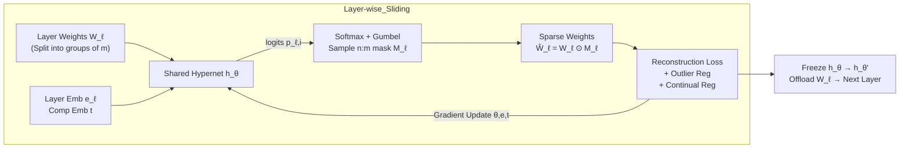

# Learning Semi-Structured Sparsity for LLMs via Shared and Context-Aware Hypernetwork

**Conference**: ICLR 2026  
**OpenReview**: [https://openreview.net/forum?id=lqjQs2lVNm](https://openreview.net/forum?id=lqjQs2lVNm)  
**Code**: [https://github.com/futuresun912/HyperPrune](https://github.com/futuresun912/HyperPrune)  
**Area**: Model Compression / LLM Pruning  
**Keywords**: n:m semi-structured sparsity, hypernetwork, layer-wise pruning, continual learning, feature outlier regularization  

## TL;DR
This work employs a lightweight hypernetwork, shared across layers and conditioned on layer/component embeddings, to directly generate n:m semi-structured sparsity masks for LLMs layer-by-layer. By merging the advantages of "fast but coarse" heuristics and "refined but expensive" optimization, it enables pruning LLaMA-2 models ranging from 7B to 70B on a single A100 while achieving the state-of-the-art precision-sparsity trade-off.

## Background & Motivation
**Background**: LLM deployment is costly. Pruning is particularly attractive because it preserves the original architecture, is compatible with quantization, and n:m semi-structured sparsity is natively supported by modern GPUs (A100/H100), offering approximately 2× matrix multiplication speedup. Current LLM pruning follows two paths: **one-pass heuristics** (e.g., SparseGPT, Wanda), which are cheap but suffer accuracy drops at high sparsity and lack native n:m support; and **optimization-based methods** (e.g., MaskLLM, MaskPro), which learn masks for high accuracy but incur extreme costs (MaskLLM requires thousands of GPU hours and large calibration sets, while MaskPro suffers from high variance in policy gradients and linear memory expansion with model size).

**Key Challenge**: While hardware favors n:m structured sparsity, current methods either fail to provide n:m patterns (heuristics) or are computationally unaffordable for billion-parameter models (optimization).

**Goal**: To **directly and efficiently** learn n:m structured masks within a single-GPU budget without sacrificing accuracy, scaling up to 70B models.

**Core Idea (Hypernetwork + Local Group Masks)**: Instead of learning independent, massive binary masks for entire weight matrices, a **shared lightweight hypernetwork** $h_\theta: \mathbb{R}^m \mapsto \mathbb{R}^m$ outputs logits corresponding to n:m mask patterns for each group of $m$ consecutive weights. This reduces the output space from the entire weight matrix to the size of $|S_{n:m}|$ (e.g., only 6 valid patterns for 2:4). Layer and component embeddings are used as conditions to adapt to different positions. Combined with "layer-wise sequential pruning + continual learning regularization + feature outlier regularization," the method remains memory-efficient while preserving cross-layer knowledge.

## Method

### Overall Architecture
HyperPrune decomposes the mask optimization of the entire model into a **layer-wise sliding** process. For each step, only the $\ell$-th layer weights $W_\ell$ are loaded into memory. A **globally shared** hypernetwork $h_\theta$ generates n:m masks group-by-group, resulting in sparse weights $\widehat{W}_\ell = W_\ell \odot M_\ell$. The parameters $\theta$ and embeddings are optimized using layer-level reconstruction loss. Once a layer is pruned, the current hypernetwork is frozen to serve as a "teacher" for the next layer, and the weights are offloaded before moving to the next layer. The optimization is driven by "reconstruction loss + feature outlier regularization + continual pruning regularization," using Gumbel-Softmax to relax discrete mask sampling for end-to-end training.

### Key Designs

**1. Shared Local Hypernetwork**: This design transforms "learning the entire mask" into "selecting a pattern for each group of $m$ weights," drastically reducing the output space. Directly optimizing binary masks $M_\ell$ layer-by-layer is infeasible for LLMs (e.g., a single FFN projection in LLaMA-70B exceeds 1.7 billion parameters). HyperPrune partitions each weight matrix into $d_1 d_2 / m$ tuples along rows. The hypernetwork only needs to output $|S_{n:m}|$ logits (6 for 2:4) for a single group $W_{\ell,i}$, computed as $p_{\ell,i} = \mathrm{Softmax}(h_\theta(W_{\ell,i}))$, followed by $M_{\ell,i} \sim \mathrm{Categorical}(p_{\ell,i})$ over the valid pattern set $S_{2:4}$. Generating 6 logits from $m=4$ weights requires only a few thousand parameters, orders of magnitude less than a naive full-matrix hypernetwork. This approach also captures local dependencies within groups.

**2. Context-Aware Embeddings**: A single shared network achieves "multi-faceted" functionality via layer and component embeddings. Pruning requirements vary across depths and components (e.g., Q/K/V/O in MHSA vs. U/D/G in FFN). HyperPrune introduces trainable layer embeddings $e_\ell \in \mathbb{R}^d$ and component embeddings $t \in \mathbb{R}^d$ (seven globally shared). Mask generation is modified to $M_{\ell,i} \sim h_\theta(W_{\ell,i}, e_\ell, t)$, adding only $d \times (L+7)$ parameters. This balances generalization from shared parameters with specialization from embeddings, targeting $\min_{\theta,e,t} \mathbb{E}_x \| f(\{W_{\ell,i}\}, x_{\ell-1}) - f(\{W_{\ell,i} \odot M_{\ell,i}\}, x_{\ell-1}) \|^2$.

**3. Information Theory Foundation (Theorem 1)**: The authors prove that under n:m constraints, **maximizing the mutual information between the dense and pruned model outputs** is approximately equivalent to **minimizing the expected squared difference of their outputs**: $\max_{M \in S_{n:m}} I(f(W,x); f(W{\odot}M, x)) \Leftrightarrow \min_{\{p_i\}} \mathbb{E}_x \| f(W,x) - f(W \odot \mathbb{E}[M], x) \|^2$. The derivation treats sparse output as a noisy version of dense output; for linear layers with Gaussian inputs, maximizing mutual information approximates minimizing the output difference. Replacing the discrete mask $M$ with its block-level expectation $\mathbb{E}[M]$ (parameterized by a differentiable distribution) yields an end-to-end trainable proxy. This provides the first information-theoretic justification for structured mask learning and the use of Gumbel-Softmax relaxation.

**4. Continual Pruning Regularization**: A risk of layer-wise optimization is that tuning the hypernetwork for layer $\ell$ might overwrite knowledge learned for layers $1, \dots, \ell-1$. Drawing from continual learning, the parameters $\theta'$ from layer $\ell-1$ initialize layer $\ell$, and a penalty is applied to the discrepancy between the new and old hypernetwork outputs: $R_{\text{continual}} = \mathbb{E}_{W} \big[ \frac{1}{\ell-1} \sum_{\ell'=1}^{\ell-1} \| h_{\theta'}(W_{\ell'}, e_{\ell'}, t) - h_\theta(W_{\ell'}, e_{\ell'}, t) \|^2 \big]$. The factor $\frac{1}{\ell-1}$ normalizes the regularization scale. This acts as a functional knowledge distillation to stabilize mask quality across layers.

**5. Feature Outlier Regularization**: LLMs (>6B) often produce heavy-tailed feature outliers with high amplitudes and strong semantic meaning. Pruning weights connected to these outliers significantly degrades performance. HyperPrune biases the model to preserve weights aligned with high-amplitude activations: $R_{\text{outlier}} = \mathbb{E}_{x} \mathbb{E}_{M} \big[ \| (W_\ell \odot M_\ell) \cdot \mathrm{Diag}(x_{\ell-1}) \|^2 \big]$. This term decomposes into $\sum (\widehat{W}_{\ell,ij} \mathbb{E}[x_{\ell-1,j}])^2 + \sum \widehat{W}_{\ell,ij}^2 \mathrm{Var}[x_{\ell-1,j}]$. The first term recovers the "weight × mean activation" importance score of Wanda, while the second captures feature variance, ensuring robustness for features that are zero-mean but influential. The final objective is $\min_{\theta,e,t} \mathbb{E}\|f(W_\ell, x) - f(\widehat{W}_\ell, x)\|^2 - \lambda_1 R_{\text{outlier}} + \lambda_2 R_{\text{continual}}$.

## Key Experimental Results

### Main Results: LLaMA-2 Language Modeling + Seven Zero-Shot Tasks under 2:4 Sparsity
Experiments were conducted on a single A100 (80GB) using 128 sequences from C4 for calibration. PPL was measured on Wikitext-2, and zero-shot accuracy via LM Evaluation Harness.

| Model | Method | Wikitext PPL ↓ | Average 7-task Acc ↑ |
|------|------|----------------|-------------------|
| LLaMA-2 7B | Dense | 5.12 | 59.71 |
|  | SparseGPT | 10.39 | 51.00 |
|  | Wanda | 11.09 | 48.78 |
|  | Pruner-Zero | 10.35 | 52.02 |
|  | MaskPro | 12.29 | 52.81 |
|  | **Ours** | **10.11** | **53.76** |
| LLaMA-2 13B | MaskPro | 8.16 | 58.97 |
|  | **Ours** | **7.60** | **59.25** |
| LLaMA-2 70B | Pruner-Zero | 4.87 | 67.69 |
|  | **Ours** | **5.13** | **68.57** |

Ours achieves the best precision-sparsity trade-off across all scales. For the 7B model, it obtains the lowest PPL (10.11) and highest average accuracy (53.76%). For 70B, it reaches 68.57% average accuracy, outperforming all baselines (MaskPro failed on 70B due to memory constraints).

### Ablation Study (LLaMA-2-7B, Wikitext PPL)

| Configuration | PPL ↑ |
|----------|---------|
| Full HyperPrune | 10.11 |
| − Layer/Comp Emb (le/ce) | 11.36 |
| − Outlier Reg (fo) | 11.06 |

Removing any embedding component significantly degrades performance (layer embeddings have a slightly larger impact). Omitting continual pruning (cp) or feature outlier (fo) regularization also results in higher PPL, proving all components are essential.

### Key Findings
- **Efficiency**: 2:4 sparsity provides a kernel-level speedup of 1.55–1.65× on A100. End-to-end latency for LLaMA-2-7B drops from 248ms to 174ms (1.43×). Mask training takes only **7–15 GPU hours and 15–22GB VRAM** (7B/13B), an order of magnitude lower than MaskPro and a vast improvement over MaskLLM (1200–2300 GPU hours), making 70B models feasible.
- **Data Scalability**: As calibration samples increase from 1 to 512, HyperPrune shows steady improvement in PPL and accuracy, whereas Wanda/SparseGPT reach a plateau quickly.

## Highlights & Insights
- **"Output Space Collapse" is the key**: Previous hypernetwork attempts in LLM pruning failed due to massive output spaces. Restricting the hypernetwork to select n:m patterns for small groups collapses the problem into a lightweight classification task, which is the core innovation for scalability.
- **Bridging Theory and Heuristics**: The expansion of the feature outlier regularization term reveals that Wanda's importance score is a special case. This provides an information-theoretic and variance-aware explanation for existing heuristics.
- **Layer-wise Sliding + Continual Learning**: Memory consumption scales with a single layer rather than the full model, enabling the pruning of 70B models on 80GB VRAM. Continual learning regularization rectifies the loss of cross-layer knowledge inherent in step-by-step optimization.

## Limitations & Future Work
- **Calibration Data Dependency**: Robustness may decrease with insufficient calibration data or significant domain shifts.
- **Hypernetwork Capacity-Generalization Trade-off**: The lightweight hypernetwork might have limited expressiveness; exploring adaptive or hierarchical designs is suggested.
- **Limited Sparsity Patterns**: Experiments primarily focused on 2:4; validation on more aggressive patterns (e.g., 1:4) or non-LLaMA architectures is needed.
- **Hardware Coverage**: Validation was mainly on A100; future work should evaluate more inference stacks and integration with quantization or LoRA.

## Related Work & Insights
- **One-pass Heuristic Pruning**: Magnitude, SparseGPT, and Wanda are cheap but suffer accuracy loss at high sparsity and lack native n:m focus. HyperPrune treats Wanda as a special case within its optimization framework.
- **Optimization-based Pruning**: MaskLLM uses probabilistic masks for strict n:m but has astronomical costs. MaskPro reduces costs via linear space probabilization but suffers from high gradient variance. HyperPrune's "layer-wise + shared hypernetwork" approach keeps memory costs tied to a single layer.
- **Hypernetwork Methods**: Drawing from HyperShot and HyperTransformer, HyperPrune is the first to successfully apply "embedding-conditioned parameter/mask generation" to structured LLM pruning.
- **Insight**: The paradigm of translating "hardware-friendly discrete constraints" into "differentiable mutual information/reconstruction objectives" via Gumbel-Softmax is a universal framework applicable to quantization and KV-cache compression.

## Rating
- **Novelty**: ⭐⭐⭐⭐ — First to apply shared context-aware hypernetworks to LLM n:m pruning; the "group-level output collapse" is a significant insight.
- **Experimental Thoroughness**: ⭐⭐⭐⭐ — Covers 7B to 70B, zero-shot tasks, and efficiency metrics; however, limited to 2:4 patterns and LLaMA-2 style models.
- **Writing Quality**: ⭐⭐⭐⭐ — Clear motivation and well-justified theoretical framing for the regularization terms.
- **Value**: ⭐⭐⭐⭐⭐ — High practical value for resource-constrained deployment, enabling 70B model pruning on a single GPU with real hardware acceleration.

<!-- RELATED:START -->

## Related Papers

- [\[ICLR 2026\] MaskPro: Linear-Space Probabilistic Learning for Strict (N:M)-Sparsity on LLMs](maskpro_linear-space_probabilistic_learning_for_strict_nm-sparsity_on_llms.md)
- [\[ICLR 2026\] GlowQ: Group-Shared Low-Rank Approximation for Quantized LLMs](glowq_group-shared_low-rank_approximation_for_quantized_llms.md)
- [\[ICLR 2026\] ARMOR: High-Performance Semi-Structured Pruning via Adaptive Matrix Factorization](armor_high-performance_semi-structured_pruning_via_adaptive_matrix_factorization.md)
- [\[ICLR 2026\] Sculpting Subspaces: Constrained Full Fine-Tuning in LLMs for Continual Learning](sculpting_subspaces_constrained_full_fine-tuning_in_llms_for_continual_learning.md)
- [\[ICLR 2026\] Channel-Aware Mixed-Precision Quantization for Efficient Long-Context Inference](channel-aware_mixed-precision_quantization_for_efficient_long-context_inference.md)

<!-- RELATED:END -->
