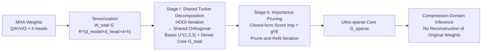

# LeSTD: LLM Compression via Learning-based Sparse Tensor Decomposition

**Conference**: ICLR 2026  
**OpenReview**: [https://openreview.net/forum?id=0oHaazjMUX](https://openreview.net/forum?id=0oHaazjMUX)  
**Code**: TBD  
**Area**: Model Compression / Tensor Decomposition / LLM  
**Keywords**: Tucker Decomposition, Sparse Core Tensor, Data-free Compression, Multi-Head Attention, Post-Training Compression  

## TL;DR
LeSTD packages the Q/K/V/O weight matrices of a Multi-Head Attention (MHA) layer into a 4th-order tensor to perform a "cross-head shared" Tucker decomposition. It then sparsifies the dense core tensor using pruning supported by closed-form importance scores, breaking the "dense core bottleneck" of tensor decomposition methods to maintain accuracy at higher compression rates while enabling direct inference in the compressed domain.

## Background & Motivation
**Background**: Post-training LLM compression has become a mainstream practical choice because it avoids expensive retraining. Low-rank decomposition methods (SVD/Tucker) reduce storage by exploiting structural redundancy in weights. Early methods like SVD-LLM and ASVD followed "matrix-by-matrix" compression, which is intuitive but ignores high-order correlations across matrices and attention heads.

**Limitations of Prior Work**: The authors first conducted a diagnostic experiment (Figure 1)—reconstructing other heads in the same layer using rank-$r$ orthogonal bases learned from a single head. They found that "intra-layer explained energy" is systematically higher than "inter-layer" energy and increases with the number of heads. This indicates that **heads within the same layer indeed share a common subspace**, and matrix-by-matrix compression wastes this structural information. While TensorLLM captured this shared basis using Tucker decomposition, it decomposes the tensor into factor matrices + a **core tensor**, which remains dense and grows polynomially with the Tucker rank.

**Key Challenge**: To maintain accuracy, the Tucker rank must be sufficiently large. However, as the rank increases, the core tensor becomes a new storage burden—the **dense core bottleneck**, which sets a hard upper bound on the compression ratio. Existing tensor methods only achieve "dimension reduction" without eliminating internal redundancy within the compressed latent space.

**Goal**: To further eliminate internal redundancy within the core tensor based on the shared subspace, achieving truly high compression ratios without significant performance degradation.

**Key Insight**: A **two-stage, data-free framework**—Stage I uses iterative optimization to learn a high-quality shared orthogonal basis and a dense core for all heads; Stage II uses **closed-form importance scores** to guide pruning within this orthogonal basis, compressing the core tensor into an "ultra-sparse" state and allowing the model to perform inference directly in the compressed domain without reconstructing original weights.

## Method

### Overall Architecture
LeSTD targets MHA blocks and operates in two sequential stages. Stage I tensorizes the Q/K/V/O weight matrices of $h$ heads into a 4th-order tensor $\mathcal{W}_{total}\in\mathbb{R}^{d_{model}\times d_{head}\times 4\times h}$. It performs a shared Tucker decomposition along modes 1, 2, and 3 (leaving the head dimension uncompressed) to obtain shared orthogonal factor matrices $U^{(1)}, U^{(2)}, U^{(3)}$ and per-head dense core slices $\mathcal{G}_i$. Stage II performs importance pruning on the core tensor to obtain an ultra-sparse core $\mathcal{G}_{sparse}$. During inference, original weights are not reconstructed; instead, all Q/K/V/O projections are computed directly using a combination of the shared factors and the sparse core.

### Key Designs

**1. Cross-Head Shared Subspace Tucker Decomposition (Stage I): Compressing the entire MHA block as a unified object.** Unlike per-matrix SVD, LeSTD first stacks the four weight matrices $[W^Q_i, W^K_i, W^V_i, (W^O_i)^\top]$ of each head into a 3D tensor, then stacks these along the head dimension into a 4th-order tensor $\mathcal{W}_{total}$. Decomposition is performed only on modes 1, 2, and 3, leaving the head dimension (mode 4) uncompressed: $\mathcal{W}_{total}\approx \mathcal{G}_{total}\times_1 U^{(1)}\times_2 U^{(2)}\times_3 U^{(3)}$. This ensures all heads **share the same set of orthogonal factor matrices** $U^{(n)}$ (encoding intra-layer public subspaces), while each head retains its own core slice $\mathcal{G}_i=\mathcal{G}_{total}[:,:,:,i]$ to carry head-specific information. The optimization goal is to minimize reconstruction error under orthogonality constraints: $\min \|\mathcal{W}_{total}-\hat{\mathcal{W}}_{total}\|_F^2, \text{ s.t. } (U^{(n)})^\top U^{(n)}=I$. This is solved using Higher-Order Orthogonal Iteration (HOOI): the tensor is projected into the current subspaces of other modes, and mode-$n$ unfolding is used with truncated SVD to update $U^{(n)}$ with top-$R_n$ left singular vectors, followed by recalculating $\mathcal{G}_{total}$. This step elevates "per-head similarity" to a "joint representation," making the degradation curve smoother than per-matrix SVD.

**2. Closed-form Importance Score Driven Core Pruning (Stage II): Providing theoretical grounds for "Magnitude Pruning."** Since the dense core remains a bottleneck, Stage II prunes it within the orthogonal basis from Stage I. The key insight is: because factor matrices are column-orthogonal, the rank-1 basis tensors $\mathcal{B}_\beta=u^{(1)}_{r_1}\circ u^{(2)}_{r_2}\circ u^{(3)}_{r_3}\circ e_i$ formed by their outer products are mutually orthogonal and have unit norms. Thus, $\hat{\mathcal{W}}_{total}$ is exactly the orthogonal projection of $\mathcal{W}_{total}$ onto the span of $\{\mathcal{B}_\beta\}$. Setting an individual core coefficient $g_\beta$ to zero is equivalent to removing its rank-1 contribution, and the new residual energy is exactly $E_{(g_\beta=0)}=\|R+g_\beta\mathcal{B}_\beta\|_F^2=E+g_\beta^2$ (cross-terms vanish because $\langle R,\mathcal{B}_\beta\rangle=0$). Thus, normalized importance is closed-form: $\text{Imp}(g_\beta)=\dfrac{E_{(g_\beta=0)}-E}{E}=\dfrac{g_\beta^2}{E}$. Because the basis is orthogonal, sorting by Imp is **exactly equivalent to sorting by $|g_\beta|$**. This provides a rigorous proof that "magnitude pruning is the optimal k-term approximation under Frobenius loss (hard thresholding)" rather than purely heuristic. Algorithm 1 iteratively calculates importance, prunes the smallest $\lceil\alpha k\rceil$ elements, and refits until the target sparsity $S_{target}$ is reached.

**3. Closed-form Refit after Pruning: Offsetting finite-precision drift.** After pruning a set of indices $\Lambda$, a 1D least squares solution is found for each surviving coefficient $g_\gamma$: $g_\gamma^\star=\arg\min\|\mathcal{W}_{total}-(g'_\gamma\mathcal{B}_\gamma+\sum_{\beta\neq\gamma,\beta\notin\Lambda}g_\beta\mathcal{B}_\beta)\|_F^2$. Using $\langle\mathcal{B}_\beta,\mathcal{B}_\gamma\rangle=\delta_{\beta\gamma}$, all mixed terms vanish, resulting in a simple closed-form update: $g_\gamma\leftarrow\langle\mathcal{W}_{total},\mathcal{B}_\gamma\rangle$. While this theoretically equals the original coefficient in exact arithmetic, performing a refit after each pruning step stabilizes reconstruction quality under finite precision.

**4. Compression-Domain Inference without Weight Reconstruction: Converting storage advantage to throughput advantage.** LeSTD never instantiates dense matrices during inference. A one-time left-projection $Y=XU^{(1)}$ is reused across all heads and Q/K/V projections. The sparse core and the third-mode factor are contracted into a small, pre-computable offline matrix $M_{i,t}[r_1,r_2]=\sum_{r_3}\mathcal{G}_{sparse}[r_1,r_2,r_3,i]\,U^{(3)}[t,r_3]$. Since $\mathcal{G}_{sparse}$ is sparse, $M_{i,t}$ is typically also sparse. Consequently, projections like $Q_i=YM_{i,1}(U^{(2)})^\top$ do not require generating $W^Q_i$. On the output side, using the identity $W^O_i=U^{(2)}M_{i,4}^\top(U^{(1)})^\top$, the $(U^{(1)})^\top$ multiplication is delayed and performed only once at the end: $\sum_i O'_i=(\sum_i (O_iU^{(2)})M_{i,4}^\top)(U^{(1)})^\top$. The entire pipeline only uses $U^{(1)}, U^{(2)}$, pre-computed sparse $M_{i,t}$, and activations, saving reconstruction costs and achieving **tokens/sec improvements directly in standard Transformers libraries without custom kernels**.

## Key Experimental Results

### Main Results
Evaluated on GPT-J (6B), Llama2-13B, and OPT-30B across four datasets: WikiText-2, MathQA, GSM8K, and TruthfulQA. Comparison against ASVD, SVD-LLM, TensorLLM, and SliceGPT. Selected WikiText-2 Perplexity (lower is better):

| Model / Ratio | Method | 0.2 | 0.4 | 0.6 | 0.8 |
|---|---|---|---|---|---|
| GPT-J | SVD-LLM | 100.08 | 50.11 | 20.19 | 14.95 |
| GPT-J | TensorLLM | 89.52 | 49.70 | 9.90 | 8.92 |
| GPT-J | **Ours** | **80.37** | **49.56** | **9.51** | **8.92** |
| OPT-30B | SVD-LLM | 50.25 | 20.09 | 14.34 | 11.95 |
| OPT-30B | TensorLLM | 49.53 | 19.97 | 14.92 | 11.95 |
| OPT-30B | **Ours** | **42.70** | 20.13 | **14.02** | **9.98** |

At an aggressive compression ratio of 0.2, LeSTD's perplexity is approximately 15% lower than SVD-LLM (OPT-30B: 42.70 vs. 50.25) and about 10% lower than TensorLLM with dense cores (GPT-J: 80.37 vs. 89.52). On MathQA and GSM8K, LeSTD typically matches or exceeds the best baseline by approximately 3 points. It remains stable on TruthfulQA where SliceGPT and per-matrix SVD often collapse.

### Ablation Study
The paper decomposes the contributions of the two stages and performs sensitivity analysis on Tucker ranks in Appendix C, confirming that both components (Stage I shared basis and Stage II sparse pruning) are effective. Throughput comparisons (Figure 5, Appendix D) show that under moderate compression (0.8), LeSTD is at least on par with the fastest baselines: GPT-J on WikiText-2 slightly exceeds SVD-LLM (11571.82 vs. 11521.82 tokens/sec), and Llama2-13B shows a ~3% improvement.

### Key Findings
- The shared subspace hypothesis was confirmed by diagnostic experiments: intra-layer explained energy is consistently higher than inter-layer and increases with the number of heads, providing empirical evidence for "joint compression."
- The dense core is indeed a bottleneck: as compression ratios become more aggressive (→0.2), the advantage of LeSTD over TensorLLM becomes more pronounced because the latter must maintain a large rank to support the dense core.
- Accuracy advantages are most prominent at the most aggressive compression settings; methods converge at moderate compression, meaning the value of sparse cores is realized in "high compression" scenarios.

## Highlights & Insights
- **Theoretizing "Magnitude Pruning"**: Within an orthogonal Tucker basis, the error increment from zeroing a coefficient is exactly $g_\beta^2$. Thus, magnitude sorting is the Frobenius-optimal k-term approximation. This elevates an empirical pruning criterion to a closed-form, provable metric, which is the cleanest contribution of the paper.
- **Data-free + No Custom Kernels**: The process does not rely on calibration data, and compression-domain inference achieves throughput gains directly in standard Transformers libraries, lowering the barrier for engineering deployment.
- **Diagnostics-First Approach**: A diagnostic experiment with explained energy establishes whether a shared subspace exists before designing the shared decomposition, ensuring the method's motivation is grounded in empirical evidence.

## Limitations & Future Work
- **MHA-Only**: The method focuses on the Q/K/V/O weights of multi-head attention and does not address the FFN layers, which typically account for a larger share of the parameters, thus limiting the overall model compression ratio.
- **Scale up to 30B**: The largest model tested is OPT-30B; its scalability to hundred-billion-parameter range models (like larger Llama series) remains unverified.
- **Complexity in Stage II Ratio Calculation**: The compression ratio of sparse cores requires specific budget controls (Appendix G), which is more complex compared to the "rank-to-ratio" conversion in per-matrix methods.
- **Sequential Execution**: Stage I and II are optimized decoupled and sequentially. Joint end-to-end optimization of the shared basis and sparsity patterns might further improve performance.

## Related Work & Insights
LeSTD follows the "MHA global Tucker decomposition for shared bases" approach of TensorLLM but addresses its weakness by shifting the focus from "finding better bases" to "compressing internal redundancy in the latent space." It is complementary to per-matrix SVD (ASVD, SVD-LLM), structural pruning (SliceGPT), and quantization (PB-LLM, BiLLM)—a sparse tensor core can be viewed as a "low-rank + sparse" hybrid representation. The key takeaway is: **the next layer of redundancy often hides within your compressed representation**. Using orthogonal bases to achieve closed-form error control is a powerful tool for theorizing heuristic pruning, an idea that can be transferred to FFN, KV cache, or quantization residual compression.

## Rating
- **Novelty**: ⭐⭐⭐⭐ Precisely identifies the "dense core bottleneck" in tensor decomposition for LLM compression and provides a sparse core solution with closed-form theoretical support. The combination of cross-head sharing and orthogonal basis pruning shows clear incremental value.
- **Experimental Thoroughness**: ⭐⭐⭐ Covers three models and four datasets including throughput evaluation, but many main results and ablations are moved to the appendix. Max model size is 30B, and FFN is not covered.
- **Writing Quality**: ⭐⭐⭐⭐ Logical flow from diagnostic experiments to motivation, two-stage methodology, and closed-form derivations is coherent and easy to follow.
- **Value**: ⭐⭐⭐⭐ Data-free, no custom kernels required, and maintains accuracy under aggressive compression, making it deployment-friendly. The proof for "optimality of magnitude pruning" has reusable value for future sparse compression research.

<!-- RELATED:START -->

## Related Papers

- [\[ICLR 2026\] TD-MoE: Tensor Decomposition for MoE Models](td-moe_tensor_decomposition_for_moe_models.md)
- [\[ICLR 2026\] TRAC: Tensor-Train Based Across-Layer Compression for Parameter-Efficient Fine-Tuning](trac_tensor-train_based_across-layer_compression_for_parameter-efficient_fine-tu.md)
- [\[ICLR 2026\] Alignment-Enhanced Integration of Connectivity and Spectral Sparsity in Dynamic Sparse Training of LLM](alignment-enhanced_integration_of_connectivity_and_spectral_sparsity_in_dynamic_.md)
- [\[ICLR 2026\] Incentivizing Agentic Reasoning in LLM Judges via Tool-Integrated Reinforcement Learning](incentivizing_agentic_reasoning_in_llm_judges_via_tool-integrated_reinforcement_.md)
- [\[ICLR 2026\] SAFA-SNN: Sparse-aware Fast Adaptive Spiking Neural Network for On-device Few-Shot Class-Incremental Learning](safa-snn_sparsity-aware_on-device_few-shot_class-incremental_learning_with_fast-.md)

<!-- RELATED:END -->
