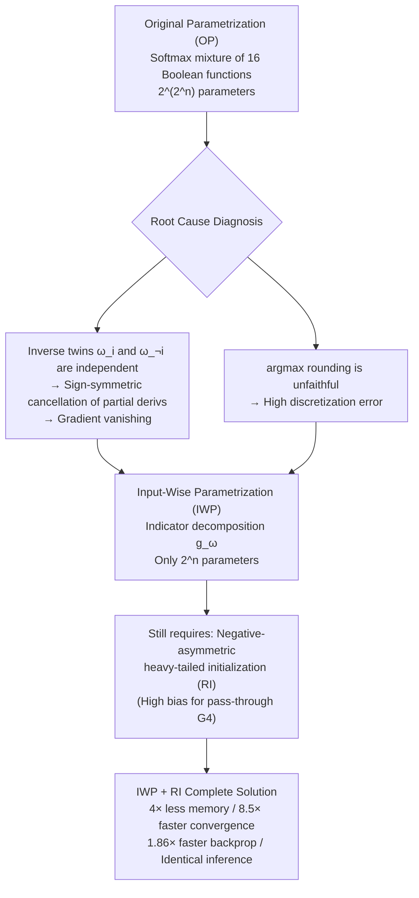

# Light Differentiable Logic Gate Networks

**Conference**: ICLR 2026  
**OpenReview**: [https://openreview.net/forum?id=EaGQ5luZtf](https://openreview.net/forum?id=EaGQ5luZtf)  
**Code**: To be confirmed  
**Area**: Model Compression / Efficient Inference (Differentiable Logic Gate Networks)  
**Keywords**: Differentiable Logic Gate Networks, Reparameterization, Gradient Vanishing, Discretization Error, Hardware-Efficient Inference, FPGA  

## TL;DR
This paper identifies that the root causes of gradient vanishing, discretization errors, and high training costs in Differentiable Logic Gate Networks (DLGN) lie in the "function-wise enumeration" parametrization of logic gate neurons. It proposes a non-redundant Input-Wise Parametrization (IWP), reducing the parameter count per gate from $2^{2^n}$ to $2^n$ ($4\times$ reduction for binary inputs). Combined with a negative-asymmetric heavy-tailed residual initialization, this makes the network more memory-efficient, enables $8.5\times$ faster convergence, and speeds up backpropagation by up to $1.86\times$, while maintaining or improving accuracy on CIFAR-100.

## Background & Motivation
**Background**: Differentiable Logic Gate Networks (DLGN, Petersen et al. 2022) bind each neuron to a binary Boolean function $G:\{0,1\}^2\to\{0,1\}$, where each neuron connects to only two preceding neurons. Utilizing bitwise operations, they can process millions of images per second on a single CPU core or achieve sub-10ns inference for CIFAR-10 on FPGAs, offering an unmatched performance-efficiency tradeoff. Subsequent work extended this to convolutional (CDLGN) and recurrent structures.

**Limitations of Prior Work**: To enable gradient optimization, the original method relaxes each neuron into a probability simplex over 16 Boolean functions $g(p,q)=\sum_{i=1}^{16}\omega_i g_i(p,q)$, using softmax to map real parameters $\Omega_i$ into weights. This "function-wise enumeration" parametrization leads to three chronic issues: **gradient vanishing** (gradient norms concentrate at 0 and decay to $10^{-34}$ after 40 layers), **discretization error** (the gate selected by argmax during inference is often not the function closest to the neuron's true state due to parameter redundancy), and **high training costs**. Subsequent work only used Residual Initialization (RI, providing a high initial bias to the pass-through gate $G_4(A,B)=A$) as a "patch," which treats symptoms rather than the root cause.

**Key Challenge**: All remedies attribute the problem to initialization while ignoring the **true root cause in the parametrization itself**. Among the 16 Boolean functions, every $G_i$ has an inverse twin $G_{\neg i}=1-G_i$. Assigning independent weights to these twins creates self-cancellation in partial derivatives, flattening the gradient norm layer by layer. This redundancy also makes argmax rounding unfaithful.

**Goal**: Eradicate these issues at the parametrization level to allow DLGN to scale deeper.

**Key Insight**: Replace "function-wise enumeration" softmax mixing with "input-wise" indicator function decomposition. Any binary Boolean function can be uniquely represented by indicators $E_{ij}$ of the four input combinations. This requires only $2^n$ parameters to non-redundantly express all $2^{2^n}$ Boolean functions of $n$ variables ($4$ parameters vs. $16$ for the binary case). This eliminates gradient self-cancellation caused by inverse twins and ensures argmax rounding achieves minimum error under any Minkowski norm.

## Method

### Overall Architecture
The original DLGN parameterizes each logic gate neuron as a probability mixture over 16 Boolean functions (requiring $2^{2^n}=16$ parameters for $n=2$). This paper switches to an equivalent but non-redundant "input-dimension" perspective: first proving any Boolean function can be uniquely decomposed by "input combination indicators," then constructing **Input-Wise Parametrization (IWP)** to logarithmically compress parameters to $2^n$. The analysis then shows why IWP still requires negative-asymmetric heavy-tailed initialization (RI) to stabilize gradients. The complete solution is IWP+RI. The modification only requires rewriting weight initialization and two CUDA functions (forward/backward); the inference dynamics remain identical, achieving "faster and more efficient training" without sacrificing DLGN's inference advantages.

### Key Designs

**1. Input-Wise Parametrization (IWP): Replacing Function Enumeration with Indicator Decomposition.** The root cause is the original parametrization treating 16 Boolean functions as independent bases despite the redundancy of inverse twins. This paper returns to a fundamental representation: any $G(k,\ell)$ can be written as a unique linear combination of indicators for the four input combinations $G(k,\ell)=\sum_{i,j}\alpha_{ij}E_{ij}(k,\ell)$, where $E_{ij}(k,\ell)=\mathbb{1}\{(k,\ell)=(i,j)\}$ and $\alpha_{ij}\in\{0,1\}$. This decomposition applies to the probabilistic relaxation: relaxing binary coefficients $\alpha_{ij}$ to the continuous interval $\omega_{ij}\in[0,1]$ and rounding back with $\omega_{ij}>0.5$ yields an accurate differentiable parametrization:

$$
g_\omega(p,q)=(1-p)(1-q)\,\omega_{00}+(1-p)q\,\omega_{01}+p(1-q)\,\omega_{10}+pq\,\omega_{11}.
$$

Since the basis of the $n$-ary Boolean function space is only $2^n$-dimensional, IWP expresses the same function class with logarithmically fewer parameters. It reduces per-gate parameters from 16 to 4 in the binary case (shrinking the model by $4\times$) and makes gates with more than 6 inputs viable. Each $\omega_{ij}$ is mapped from a real parameter $\Omega_{ij}$ via an activation $\rho:\mathbb{R}\to[0,1]$ (the paper uses scaled sine $\sin_{01}(x)=0.5+0.5\sin x$ instead of sigmoid).

**2. Non-redundant Elimination of Gradient Cancellation and Discretization Error.** In the original parametrization, the partial derivative is a weighted sum of sign-symmetric random variables $\frac{\partial g}{\partial p}=\sum_{i=1}^{8}(\omega_i-\omega_{\neg i})\frac{\partial g_i}{\partial p}$, where inverse twins $\omega_i-\omega_{\neg i}$ pull gradients toward zero. In IWP, the partial derivative becomes:

$$
\frac{\partial g_\omega(p,q)}{\partial p}=(1-q)(\omega_{10}-\omega_{00})+q(\omega_{11}-\omega_{01})=\mathbb{E}_{B\sim\mathrm{Ber}(q)}[\omega_{1B}-\omega_{0B}],
$$

The parametrization no longer introduces additional self-cancellation. Furthermore, the paper proves that rounding the output of $g_\omega$ to the nearest binary value achieves the minimum error under any norm based on uniform distance metrics, solving the discretization error at its root.

**3. Negative-Asymmetric Heavy-Tailed Residual Initialization.** IWP solves cancellation "within the neuron," but if initialization remains indifferent to functions and their twins, gradients across different neurons will still be sign-symmetrically distributed and converge to zero. A suitable initialization must be both **heavy-tailed** (concentrating weights $\omega_{ij}$ near 0/1) and **negative-asymmetric**. Residual Initialization (RI), which provides a high bias for the pass-through gate $G_4$, is the simplest instance satisfying both. This paper identifies RI as the simplest member of the broader class of "heavy-tailed, negative-asymmetric initializations" and explains its optimality: RI generates gate output distributions that push optimization to proceed layer-by-layer (earlier-to-later), allowing deep networks to stabilize. The pass-through gate $G_4$ uniquely enjoys a constant uniform gradient of 1. Multi-gate initializations like AND-OR are theoretically more anti-concentrated but are slightly inferior in stability and discretization error. The final solution is **IWP + RI**.

## Key Experimental Results

Experiments utilize DLGN and CDLGN (CIFAR-10 M architecture) from Petersen 2022/2024, upgraded to CIFAR-100 (with random crop + horizontal flip), using 3 seeds per model.

### Main Results (Across Vision/Language Benchmarks, Discretized Test Acc % / BLEU)

| Model | ImageNet32 | CIFAR-100 | CIFAR-10 | Fashion-MNIST | MNIST | WMT'14 (BLEU) |
|-------|------------|-----------|----------|---------------|-------|---------------|
| DLGN **OP** (Original) | 4.84 | 27.7 | 55.33 | 81.39 | 92.43 | 15.11 |
| DLGN **IWP** (Ours) | **4.93** | **29.5** | **57.47** | **82.34** | **94.02** | **17.38** |
| 2-layer CNN (Comparable) | 5.19 | 39.2 | 64.01 | 77.66 | 92.91 | – |

IWP consistently outperforms OP across all datasets; 3x depth was used for ImageNet32.

### Ablation Study (CIFAR DLGN 3x Depth, Hyperparameter Robustness, Discretized Test Acc %)

| Optimizer | OP | IWP | | GroupSum Temp $\tau$ | OP | IWP |
|-----------|----|-----|---|----------------------|----|-----|
| Adam | 31.0 | **32.5** | | $\tau=3$ | 12.5 | **18.6** |
| NAG | 27.1 | **30.2** | | $\tau=10$ | 25.5 | **27.1** |
| SGD | 18.3 | **30.9** | | $\tau=30$ | 31.0 | **32.5** |
| Adadelta| 17.9 | **30.8** | | $\tau=100$ | 21.5 | **24.8** |

OP collapses (17-18%) when replacing Adam, while IWP remains stable above 30% for all optimizers. Sensitivity to temperature $\tau$ is also significantly reduced.

### Key Findings
- **Gradient Vanishing**: OP gradient norms drop below machine precision after 16 layers and to $10^{-34}$ after 40 layers; IWP with RI maintains gradient norms significantly higher than OP+RI.
- **Depth Scalability**: Even with $20 \times$ depth, OP plateaus at ~28% accuracy and cannot match IWP. In CDLGN with $5 \times$ depth, IWP accuracy is over $1.3 \times$ higher than OP, primarily due to OP's discretization error.
- **Training Efficiency**: Parameters reduced from $16 \to 4$. For an 80-layer DLGN (batch=1), backprop is $1.86 \times$ faster, and forward pass is $1.11 \times$ faster. IWP requires $8.5 \times$ fewer training steps to converge.
- **Higher Arity**: Due to $2^n$ parameters, 6-input gates become feasible, providing stronger expressivity and another $8.4 \times$ convergence acceleration, fitting modern FPGA 6-input LUTs.

## Highlights & Insights
- **Elevating "Patch" to "Pathology"**: Transcending initialization tweaks, this paper uses the mechanisms of inverse-twin cancellation and unfaithful rounding to demonstrate the root cause is parametrization.
- **Logarithmic Compression with Zero Loss**: The $2^{2^n}\to 2^n$ shift is an equivalent reparametrization that saves memory and enables high-arity designs.
- **Unified Initialization Theory**: Categorizing RI as "heavy-tailed + negative-asymmetric" and explaining it via earlier-to-later optimization provides a clear principle for future designs.
- **Engineering Friendly**: Localized changes to initialization and two kernels (forward/backward) accelerate training without sacrificing DLGN deployment benefits.

## Limitations & Future Work
- **Depth Diminishing Returns**: Expressivity gains fade beyond a certain depth, suggesting bottlenecks in fixed random connectivity or input preprocessing. Learnable connections are a potential solution.
- **Generalization Gap**: IWP only slightly beats OP during relaxation. Data augmentation and dropout failed to close the gap significantly; designing generalization-promoting constraints is an open problem.
- **Batch Size Scaling**: Efficiency gains over OP diminish at large batch sizes as parameter tensors become a smaller fraction of the workload.
- **High-Arity FPGA Integration**: End-to-end hardware benefits of 6-input gates remain for future exploration.

## Related Work & Insights
- **DLGN Lineage**: Petersen 2022 (Original) $\to$ 2024 (Convolutional + RI) $\to$ Bührer 2025 (Recurrent). This paper is the "parametrization reconstruction" node in this tree.
- **Hardware-Efficient Models**: Related to BNNs and LogicNets, but DLGN directly estimates logic gate outputs rather than using surrogate representations.
- **Insights**: (1) Residual philosophy resurfaces as "pass-through bias" in logic gates; (2) The "parametrization first, initialization second" methodology is applicable to other differentiable discrete structures.

## Rating
- **Novelty**: ⭐⭐⭐⭐ — Identifies root causes at the parametrization level and provides a logarithmic non-redundant solution.
- **Experimental Thoroughness**: ⭐⭐⭐⭐ — Covers multiple datasets, depth scaling, robustness, and efficiency; lacks only large-scale task validation.
- **Writing Quality**: ⭐⭐⭐⭐ — Clear derivation of mechanisms and smooth transition between theory and experiment.
- **Value**: ⭐⭐⭐⭐ — Substantial practical acceleration ($8.5 \times$ convergence) and memory savings for hardware-efficient AI.

<!-- RELATED:START -->

## Related Papers

- [\[ICLR 2026\] Differentiable JPEG-based Input Perturbation for Knowledge Distillation Amplification via Conditional Mutual Information Maximization](differentiable_jpeg-based_input_perturbation_for_knowledge_distillation_amplific.md)
- [\[ICLR 2026\] Adaptive Width Neural Networks](adaptive_width_neural_networks.md)
- [\[ICLR 2026\] Lookup multivariate Kolmogorov-Arnold Networks](lookup_multivariate_kolmogorov-arnold_networks.md)
- [\[ICLR 2026\] A Recovery Guarantee for Sparse Neural Networks](a_recovery_guarantee_for_sparse_neural_networks.md)
- [\[ICLR 2026\] Robust Training of Neural Networks at Arbitrary Precision and Sparsity](robust_training_of_neural_networks_at_arbitrary_precision_and_sparsity.md)

<!-- RELATED:END -->
