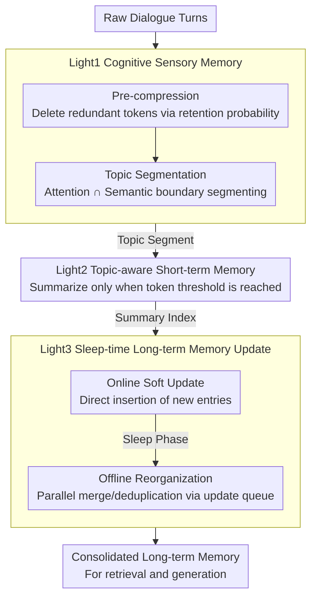

# LightMem: Lightweight and Efficient Memory-Augmented Generation

**Conference**: ICLR 2026  
**arXiv**: [2510.18866](https://arxiv.org/abs/2510.18866)  
**Code**: [GitHub](https://github.com/zjunlp/LightMem)  
**Area**: Model Compression  
**Keywords**: LLM memory systems, sensory memory, short-term memory, long-term memory, sleep-time update

## TL;DR
LightMem is proposed as a three-stage lightweight memory system inspired by the human Atkinson-Shiffrin memory model. Through cognitive sensory memory pre-compression, topic-aware short-term memory integration, and offline sleep-time updates, it achieves up to a 7.7% accuracy improvement on LongMemEval while reducing token consumption by up to 38x.

## Background & Motivation
LLMs struggle to effectively utilize historical information in dynamic and complex interaction environments, where memory systems serve as a solution. However, existing memory systems face three major efficiency pain points:

**Redundant Sensory Input**: Raw dialogues contain substantial irrelevant information; direct processing wastes resources and may impair in-context learning capabilities.

**Coarse-grained Organization**: Partitioning by fixed windows leads to semantic confusion, while partitioning by single turns results in frequent API calls; neither is ideal.

**Real-time Update Bottleneck**: Memory updates executed during inference introduce latency, and serial processing is required due to read-write dependencies.

The core challenge is the trade-off between performance and efficiency—existing systems are either accurate but expensive or efficient but coarse. The core idea of LightMem is to mimic the three-layer structure of human memory: fast filtering (sensory memory) $\rightarrow$ organizational sorting (short-term memory) $\rightarrow$ deep consolidation (long-term memory, executed offline).

## Method

### Overall Architecture
LightMem addresses the contradiction where "memory systems are accurate but too expensive" due to noisy raw dialogues and inference-path bottlenecks in memory updates. It passes dialogue information through three "Light" modules: Light1 performs pre-compression and topic segmentation to remove noisy tokens and segment by topic; Light2 aggregates topic segments and summarizes them once thresholds are met for indexing into long-term memory; Light3 performs "soft updates" online (inserting new items without modifying old ones) while deferring expensive merging and deduplication to an offline "sleep" phase for parallel execution. Consequently, only lightweight operations remain during user interaction, with heavy computation moved offline.

### Key Designs

**1. Light1 Cognitive Sensory Memory: Filtering redundancy and segmenting topics before memory entry**

Addressing the pain points of noisy dialogues and semantic confusion from fixed windows, Light1 includes pre-compression and topic segmentation. Pre-compression utilizes LLMLingua-2 as a compressor to estimate a retention probability $P(\text{retain } x_i \mid \bm{x}; \theta)$ for each token, setting the threshold $\tau$ at the $r$-th percentile to keep high-information tokens. Post-compression, topic segmentation maintains a sensory buffer. Once full, it triggers a hybrid segmentation: the attention boundary $\mathcal{B}_1$ identifies local maxima in attention between adjacent turns, while the semantic boundary $\mathcal{B}_2$ identifies where embedding similarity drops below a threshold. The final boundary is the intersection $\mathcal{B} = \mathcal{B}_1 \cap \mathcal{B}_2$. This dual-signal approach prevents topic fragmentation caused by fixed windows and reduces API overhead compared to turn-based segmentation.

**2. Light2 Topic-aware Short-term Memory: Summarizing by "topic segments" instead of fixed windows**

Topic segments from Light1 are temporarily stored in the Short-term Memory (STM) buffer until a token threshold is met, triggering an LLM call for a concise summary. Each topic is organized as {topic, {$\text{sum}_i$, $\text{user}_i$, $\text{model}_i$}}, retaining both the summary and raw turns. Summaries are indexed via embeddings into long-term memory. Using topic segments as the summarization granularity is a key insight: it avoids high API frequency (per-turn) and semantic blurring (fixed windows) by aligning with topic boundaries.

**3. Light3 Sleep-time Long-term Memory Update: Moving expensive merging and deduplication from online to offline**

Memory updates typically involve merging and deduplication, which have read-write dependencies and must be serialized, creating latency bottlenecks. Light3 splits this into two parts: the online phase performs "soft updates" where new entries are simply inserted, resulting in near-zero overhead during interaction. True reorganization is deferred to the offline "sleep" phase. During sleep, an update queue $\mathcal{Q}(e_i) = \text{Top}_k\{(e_j, \text{sim}(v_i, v_j)) \mid t_j \geq t_i\}$ is calculated for each memory entry $e_i$, allowing only later entries to update earlier ones to preserve causal consistency. Since queues for different entries are independent, these updates can run in parallel, significantly reducing total reorganization latency.

### Loss & Training
LightMem is a training-free pipeline system. Its core hyperparameters are the compression rate $r$ and the STM buffer capacity $th$.

## Key Experimental Results

### Main Results (LongMemEval-S, GPT-4o-mini)

| Method | ACC(%) | Total Token(k) | API Calls | Runtime(s) |
|------|--------|------------|---------|------------|
| FullText | 56.80 | 105.07 | - | - |
| A-MEM | 62.60 | 1605.81 | 986 | 5132 |
| MemoryOS | 44.80 | 2991.75 | 2938 | 8030 |
| Mem0 | 53.61 | 1152.62 | 812 | 4248 |
| **LightMem** (r=0.7,th=512) | **68.64** | **28.25** | **18** | **284** |
| + Offline Update | 67.07 | 111.69 | 144 | 496 |

### Ablation Study

| Config | ACC(%) | Token Efficiency | Description |
|------|--------|-----------|------|
| r=0.5, th=256 | 64.29 | 30.81k | Low compression, more info retained |
| r=0.6, th=256 | 67.78 | 35.11k | Moderate compression |
| r=0.7, th=512 | 68.64 | 28.25k | Optimal accuracy-efficiency balance |
| w/o Compression | Lower | High | Redundant info interferes with ICL |
| w/o Topic Segment | Lower | Lower | Semantic confusion leads to inaccurate summaries |

### Key Findings
- LightMem achieves the highest accuracy with the lowest token consumption: a 6% accuracy improvement over A-MEM with a 57x reduction in tokens.
- Online costs are extremely low: tokens are reduced by up to 106x and API calls by up to 159x.
- Moderate compression ($r=0.7$) outperforms low compression ($r=0.5$), indicating that redundancy removal indeed improves in-context learning.
- Parallel sleep-time updates are several times faster than serial updates.

## Highlights & Insights
- The three-stage mapping of human memory models is natural and effective: sensory filtering $\rightarrow$ working memory $\rightarrow$ long-term consolidation.
- The "Sleep-time Update" concept is elegant, completely decoupling expensive operations from user interaction.
- The training-free, plug-and-play design makes it easy to integrate with any LLM backend.
- The discovery that compression actually enhances performance provides valuable guidance for memory system design.

## Limitations & Future Work
- The quality of the compression model (LLMLingua-2) affects downstream performance.
- Topic segmentation thresholds require tuning, and cross-domain generalization remains a question.
- No adaptive mechanism exists for the timing and frequency of offline updates.
- Evaluation was primarily on dialogue; other long-term interaction modes (e.g., code development) have not been tested.

## Related Work & Insights
- **vs A-MEM**: Higher accuracy and over 60x better token efficiency.
- **vs MemoryOS**: Avoids the high latency caused by real-time updates.
- **vs NaiveRAG**: Structured memory organization is more effective than simple retrieval.

## Rating
- Novelty: ⭐⭐⭐⭐ The three-stage memory architecture is cleverly designed, and the sleep-time update concept is novel.
- Experimental Thoroughness: ⭐⭐⭐⭐⭐ LongMemEval + LoCoMo benchmarks, multiple backbone models, and comprehensive efficiency analysis.
- Writing Quality: ⭐⭐⭐⭐ Clear structure with detailed complexity analysis.
- Value: ⭐⭐⭐⭐⭐ High practicality and massive efficiency gains offer significant engineering value.

<!-- RELATED:START -->

## Related Papers

- [\[ICLR 2026\] Q&C: When Quantization Meets Cache in Efficient Generation](qc_when_quantization_meets_cache_in_efficient_generation.md)
- [\[ICLR 2026\] Quantized Gradient Projection for Memory-Efficient Continual Learning](quantized_gradient_projection_for_memory-efficient_continual_learning.md)
- [\[ICML 2025\] Lego Sketch: A Scalable Memory-augmented Neural Network for Sketching Data Streams](../../ICML2025/model_compression/lego_sketch_a_scalable_memory-augmented_neural_network_for_sketching_data_stream.md)
- [\[ICLR 2026\] Towards Lossless Memory-efficient Training of Spiking Neural Networks via Gradient Checkpointing and Spike Compression](towards_lossless_memory-efficient_training_of_spiking_neural_networks_via_gradie.md)
- [\[ICLR 2026\] QKV Projections Require a Fraction of Their Memory](qkv_projections_require_a_fraction_of_their_memory.md)

<!-- RELATED:END -->
