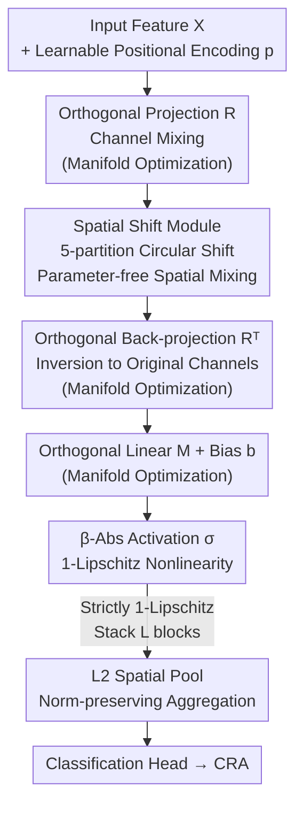

# LipNeXt: Scaling up Lipschitz-based Certified Robustness to Billion-parameter Models

**Conference**: ICLR 2026  
**arXiv**: [2601.18513](https://arxiv.org/abs/2601.18513)  
**Code**: None  
**Area**: Others / Adversarial Robustness  
**Keywords**: Lipschitz constraints, Certified robustness, Orthogonal matrices, Manifold optimization, Spatial shift module

## TL;DR

Ours proposes LipNeXt—the first unconstrained, convolution-free 1-Lipschitz architecture. By utilizing orthogonal manifold optimization to learn orthogonal matrices and a Spatial Shift Module driven by Theorem 1 for spatial mixing, the model successfully scales to the billion-parameter level. It establishes new SOTA Certified Robust Accuracy (CRA) on CIFAR-10/100, Tiny-ImageNet, and ImageNet, achieving a +8% CRA Gain at $\varepsilon=1$ on ImageNet.

## Background & Motivation

**Adversarial Robustness Challenge**: Adversarial examples pose a major threat to safety-critical applications (autonomous driving, medical imaging, malware detection). Empirical defenses fail to provide formal guarantees, and models remain vulnerable to stronger attacks.

**Two Paths for Certified Robustness**: (a) Randomized Smoothing (RS) provides probabilistic guarantees through noise averaging; (b) Lipschitz methods provide deterministic (worst-case) guarantees using the Lipschitz constant of the network. This paper focuses on the latter.

**Scaling Bottleneck of Lipschitz Methods**: Existing methods mostly use VGG-style architectures with $\leq 32$M parameters, which underperform on CIFAR-100 and significantly degrade on ImageNet. Gains from increasing model size saturate rapidly.

**Orthogonal Matrices as Key and Bottleneck**: Tight Lipschitz bounds require all weights to be orthogonal. Existing explicit (SOC, Cayley, LOT-Orth, Cholesky-Orth) and implicit (AOL, CPL, SLL layers) methods introduce significant computational overhead (FFT, matrix inverse, power iteration), limiting scalability and low-precision training.

**Incompatibility of Attention with Lipschitz Control**: Transformer attention lacks direct means for Lipschitz constraint. However, ConvNeXt and MetaFormer suggest that Transformer-era macro designs can be integrated with Lipschitz architectures.

**Goal**: Can a 1-Lipschitz architecture be designed without constrained reparameterization or convolutions, allowing certified robustness to benefit from scaling laws like standard training?

## Method

### Overall Architecture

LipNeXt decomposes a block into four serial 1-Lipschitz components: an orthogonal projection $R \in \mathcal{M}_C$ for channel mixing, a Spatial Shift $\mathcal{S}$ for spatial mixing, $R^\top$ to project channels back, and a final orthogonal linear layer $M$ with $\beta$-Abs activation. The block is formulated as $Z = \sigma(M R^\top \mathcal{S}(R(X + p)) + b)$, where $p \in \mathbb{R}^{H \times W \times 1}$ is a learnable positional encoding. Each component is individually proven to maintain a 1-Lipschitz constant, ensuring the entire network is strictly 1-Lipschitz without post-hoc constraints. After stacking $L$ blocks, an L2 Spatial Pool $[\text{L2Pool}(X)]_c = \sqrt{\sum_{h,w} X_{h,w,c}^2$ aggregates spatial dimensions, preserving norm-sensitivity to the classification head.

### Key Designs

**1. FastExp Manifold Optimization: Direct training on the orthogonal manifold with overhead reduced to 5 matrix multiplications.**

Explicit reparameterizations (matrix exponential, Cayley, Cholesky-Orth) are scaling bottlenecks. This work treats orthogonal matrices as points on a manifold. Given that the learning rate $\eta \sim 10^{-3}$ is small for large models, the Frobenius norm of the parameter matrix $A$ in the exponential map is also small. Thus, an adaptive truncated Taylor expansion $\text{FastExp}(A)$ is used: $I+A+\tfrac12A^2$ for $\|A\|_F < 0.05$, up to $A^4$ for larger norms, and exact exponential only if $\|A\|_F \ge 1$. Polar Retraction via SVD is performed at the end of each epoch to correct drift. A manifold version of Lookahead is used, accumulating skew-symmetric updates in the tangent space: $X_{\text{slow}} \leftarrow X_{\text{slow}} \cdot \text{FastExp}(\tfrac12 \sum_{j=t-K+1}^{t} \Delta_j)$.

**2. Spatial Shift Module: Deriving fixed spatial shifts from Theorem 1.**

To avoid power iteration in convolutions, Ours proves Theorem 1: For a kernel $K \in \mathbb{R}^{k \times k}$ with unit stride and circular padding, the convolution $f_K$ is norm-preserving iff $K$ has exactly one non-zero element with value $\pm 1$. Thus, norm-preserving depthwise convolution must degenerate into a spatial shift. The implementation splits features into 5 partitions (up, down, left, right, and stationary shifts). Circular padding is used to maintain norm-preservation, and an explicit positional encoding $p$ is added to compensate for the lack of spatial information inherent in circular padding.

**3. β-Abs Activation: A 1-Lipschitz and GPU-friendly nonlinearity.**

MinMax activation requires sorting/pairing, which is inefficient for large models. Ours defines $[\beta\text{-Abs}(\boldsymbol{x})]_i = |x_i|$ for $i \le \beta d$, otherwise $x_i$, with $\beta \in [0, 1]$. This element-wise piecewise function is naturally 1-Lipschitz and GPU-friendly. When $\beta = 0.5$, it contains MinMax as a special case via orthogonal rotation.

### Loss & Training

Certified robust training follows the LiResNet++ recipe and uses the EMMA loss. Due to the elimination of power iteration and FFT, LipNeXt can be trained in bfloat16, whereas LiResNet and BRONet often require higher precision for numerical stability (e.g., FFT in complex space).

## Key Experimental Results

### Main Results: CIFAR-10/100 + Tiny-ImageNet

| Dataset | Model | #Params | Clean Acc | CRA@36/255 | CRA@72/255 | CRA@108/255 |
|---------|-------|---------|-----------|------------|------------|-------------|
| CIFAR-10 | LiResNet | 83M | 81.0 | 69.8 | 56.3 | 42.9 |
| CIFAR-10 | BRONet | 68M | 81.6 | 70.6 | 57.2 | 42.5 |
| CIFAR-10 | **LipNeXt L32W1024** | **64M** | **81.5** | **71.2** | **59.2** | **45.9** |
| CIFAR-10 | **LipNeXt L32W2048** | **256M** | **85.0** | **73.2** | **58.8** | 43.3 |
| CIFAR-100 | LiResNet | 83M | 53.0 | 40.2 | 28.3 | 19.2 |
| CIFAR-100 | BRONet | 68M | 54.3 | 40.2 | 29.1 | 20.3 |
| CIFAR-100 | **LipNeXt L32W2048** | **256M** | **57.4** | **44.1** | **31.9** | **22.2** |
| Tiny-IN | BRONet | 75M | 41.2 | 29.0 | 19.0 | 12.1 |
| Tiny-IN | **LipNeXt L32W2048** | **256M** | **45.5** | **35.0** | **25.9** | **18.0** |

### Main Results: ImageNet

| Model | #Params | Training Speed (min/epoch) | CRA@ε=1 | Clean@ε=36/255 | CRA@ε=36/255 |
|-------|---------|---------------------------|---------|----------------|---------------|
| LiResNet | 51M | 5.3 | 14.2 | 45.6 | 35.0 |
| BRONet | 86M | 10.5 | - | 49.3 | 37.6 |
| **LipNeXt 1B** | **1B** | **8.9** | **21.1** | **55.9** | **40.3** |
| **LipNeXt 2B** | **2B** | **17.8** | **22.4** | **57.0** | **41.2** |

At $\varepsilon=1$ on ImageNet, CRA Gain is +8% over BRONet.

### Ablation Study: Scaling (ImageNet 400 classes, ε=1)

| Configuration | Depth | Width | Clean Acc | CRA |
|---------------|-------|-------|-----------|-----|
| Fixed Depth=32 | 32 | 1024→4096 | 40.5→51.7 | 22.9→30.0 |
| Fixed Width=2048 | 8→128 | 2048 | 30.7→47.5 | 22.4→26.9 |
| Fixed Params=1B | 32 | 4096 | **51.7** | **30.0** |
| Fixed Params=1B | 64 | 2896 | 51.2 | 29.6 |

## Key Findings

1. **Lipschitz certification benefits from scaling**: CRA continues to improve from 1B to 2B parameters, breaking the perception that certified robustness is limited to small models.
2. **Low-precision stability**: LipNeXt supports bfloat16 training, benefiting from hardware acceleration.
3. **Accuracy of FastExp**: Adaptive Taylor truncation combined with SVD retraction and manifold Lookahead ensures numerical stability and performance comparable to exact matrix exponentials.
4. **Theoretical limit of norm-preserving convs**: Theorem 1 proves that norm-preserving depthwise convolutions must be spatial shifts.
5. **Position encoding is necessary**: Since circular padding lacks spatial cues, explicit positional encoding is required to beat zero-padding schemes.

## Highlights & Insights

- **Theory-driven design**: The Spatial Shift Module is derived from Theorem 1 rather than empirical trial and error.
- **Paradigm shift**: Shifts from "reparameterize-then-project" to "direct optimization on the manifold," which is efficient (5 matmuls/step).
- **First billion-scale certified model**: Proves that deterministic certification can track modern scaling trends.
- **Training efficiency**: Despite being 10-20x larger, training throughput is comparable to prior smaller models (1B model at 8.9 min/epoch vs 86M BRONet at 10.5 min/epoch).

## Limitations & Future Work

- Focused on $\ell_2$ certification only; $\ell_\infty$ Lipschitz certification is more challenging but highly desired.
- Training 2B models requires significant resources (e.g., 16×H100 GPUs); practical deployment may require distillation.
- Maximum CRA at large $\varepsilon$ on CIFAR-10 is slightly lower than AOL (45.9 vs 49.0), as AOL sacrifices clean accuracy for robustness.
- Not yet tested on large-scale vision-language pre-training, which leaves a gap in comparison to randomized smoothing.

## Related Work & Insights

| Method | Orthogonal Implementation | Spatial Mixing | Scalable | Low-precision |
|--------|---------------------------|----------------|----------|---------------|
| **LipNeXt (Ours)** | Manifold Opt + FastExp | Spatial Shift (Fixed) | ✅ 1-2B | ✅ bf16 |
| LiResNet | Cholesky-Orth | Conv + Power Iteration | ❌ 83M Saturation | ❌ Req. float32 |
| BRONet | Block Reflector | FFT-based Conv | ❌ 86M | ❌ Req. float64 |

**vs LiResNet**: LipNeXt replaces core components with manifold optimization and spatial shifts, removing the scaling bottleneck.

**vs BRONet**: BRONet requires complex FFT operations, while LipNeXt uses parameter-free index operations, providing better scaling potential.

## Rating

- **Novelty**: ⭐⭐⭐⭐⭐ First billion-scale certified architecture, theory-driven design via Theorem 1.
- **Experimental Thoroughness**: ⭐⭐⭐⭐ Solid scaling and ablation studies across 4 datasets, though lacks $\ell_\infty$ results.
- **Writing Quality**: ⭐⭐⭐⭐ Clear theoretical derivation and consistent motivation.
- **Value**: ⭐⭐⭐⭐⭐ A milestone showing deterministic guarantees can benefit from modern scaling trends.

<!-- RELATED:START -->

## Related Papers

- [\[ICLR 2026\] Training Dynamics Impact Post-Training Quantization Robustness](training_dynamics_impact_post-training_quantization_robustness.md)
- [\[ICML 2026\] Procedural Pretraining: Warming Up Language Models with Abstract Data](../../ICML2026/model_compression/procedural_pretraining_warming_up_language_models_with_abstract_data.md)
- [\[ICLR 2026\] MobileLLM-R1: Exploring the Limits of Sub-Billion Language Model Reasoners with Open Training Recipes](mobilellm-r1_exploring_the_limits_of_sub-billion_language_model_reasoners_with_o.md)
- [\[ICLR 2026\] Scaling Reasoning Hop Exposes Weaknesses: Demystifying and Improving Hop Generalization in Large Language Models](scaling_reasoning_hop_exposes_weaknesses_demystifying_and_improving_hop_generali.md)
- [\[ICLR 2026\] QWHA: Quantization-Aware Walsh-Hadamard Adaptation for Parameter-Efficient Fine-Tuning on Large Language Models](qwha_quantization-aware_walsh-hadamard_adaptation_for_parameter-efficient_fine-t.md)

<!-- RELATED:END -->
