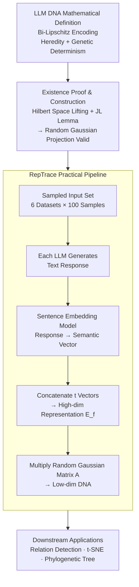

# LLM DNA: Tracing Model Evolution via Functional Representations

**Conference**: ICLR 2026 Oral  
**arXiv**: [2509.24496](https://arxiv.org/abs/2509.24496)  
**Code**: [GitHub](https://github.com/Xtra-Computing/LLM-DNA)  
**Area**: Model Compression  
**Keywords**: LLM DNA, model phylogenetic tree, functional representations, phylogenetic analysis, model provenance

## TL;DR
Starting from a biological DNA analogy, this paper mathematically defines LLM DNA as a low-dimensional bi-Lipschitz representation of model functional behavior. It proves that this representation satisfies heredity and genetic determinism properties, and designs a training-free RepTrace pipeline to extract DNA and construct phylogenetic trees for 305 LLMs.

## Background & Motivation
There are millions of LLMs on Hugging Face, derived from each other through fine-tuning, distillation, and adaptation, yet their evolutionary relationships often lack documentation. Tracing model evolution is crucial for safety auditing (backdoor propagation tracing), model governance (license compliance verification), and multi-agent system design.

**Limitations of Prior Work**:

- **Task-specific representations** (HybridLLM, RouteLLM): Trained for specific downstream tasks, lacking universality.
- **Fixed model set representations** (EmbedLLM): Requires retraining to add new models; not an intrinsic property.
- **Token/parameter-level comparison** (Nikolic et al.): Relies on identical tokenizers or architectures, failing to generalize across heterogeneous models.

**Core Problem**: Can an intrinsic, universal LLM "DNA" be defined such that functionally similar models have similar DNA, and the DNA remains stable under small perturbations like fine-tuning?

**Core Idea**: Define LLM DNA as a bi-Lipschitz mapping from the functional space to a low-dimensional space. Existence is proven using the Johnson-Lindenstrauss (JL) Lemma, and extraction is implemented via random linear projection.

## Method

### Overall Architecture
The paper seeks to answer: Can an intrinsic, low-dimensional "DNA" vector be calculated for each LLM such that functionally similar models have similar DNA, and minor modifications like fine-tuning do not cause DNA drift? The framework consists of two layers: a theoretical layer that formalizes "DNA" as a bi-Lipschitz mapping from functional space to a low-dimensional space, proving such a mapping exists via the JL Lemma and showing that "random linear projection" is a valid construction; and an implementation layer that operationalizes this as a training-free RepTrace pipeline—given a set of sampled inputs, each LLM generates text responses, which are encoded into semantic vectors by a sentence embedding model and concatenated, then projected into a low-dimensional DNA space via a random Gaussian matrix for downstream relationship detection and phylogenetic reconstruction.

### Key Designs

**1. Mathematical Definition of LLM DNA: Formulation of "Heredity" and "Genetic Determinism" via bi-Lipschitz inequalities**

For DNA to truly resemble biological DNA, it must satisfy two conditions: functionally similar models must have close DNA (genetic determinism), and minor functional changes must not cause DNA mutation (heredity). The paper encodes these into a bi-Lipschitz condition: $c_1 \cdot d_H(f_1, f_2) \leq d_\tau(\tau_{f_1}, \tau_{f_2}) \leq c_2 \cdot d_H(f_1, f_2)$, where $d_H$ is the distance in functional space and $d_\tau$ is the distance in DNA space. The lower bound $c_1$ ensures similar DNA corresponds to similar functions (genetic determinism), while the upper bound $c_2$ ensures small functional modifications result in limited DNA changes (heredity). Rather than treating "similarity" as an intuitive concept, this provides a provable semantic guarantee for DNA.

**2. Existence Proof and Construction: Hilbert Space Lifting and JL Lemma for Dimensionality Reduction**

While the definition is elegant, does such a DNA actually exist? The paper provides a constructive answer: first, represent LLM functions as vectors in a high-dimensional Hilbert space (Lemma A.4), making bi-Lipschitz equivalent to an isometric embedding problem; then, invoke the Johnson–Lindenstrauss Lemma—random linear projections can compress high-dimensional point sets into low dimensions with high probability while approximately preserving distances. This implies the DNA dimension only needs to be $L = O\left(\left[\frac{c_2+c_1}{c_2-c_1}\right]^2 \log K\right)$ ($K$ is the number of models), meaning dimension grows only logarithmically with the number of models, though a higher ratio $\frac{c_2+c_1}{c_2-c_1}$ (higher fidelity) requires larger dimensions. Random projection is chosen over learned dimensionality reduction because it is proven optimal (Larsen & Nelson, 2014), training-free, and computationally efficient.

**3. RepTrace Practical Pipeline: Operationalizing Functional Distance via Sampling and Estimation**

The functional distance $d_H$ in theory is defined over all possible inputs and is non-computable. RepTrace makes it operational in three steps. First, semantic-aware representation: instead of surface text comparison, a sentence embedding model (e.g., Qwen3-Embedding-8B) encodes responses into semantic vectors to avoid misjudging "different wording but same meaning" as functional differences. Second, random functional distance estimation: only $t$ representative prompts are sampled to approximate $d_H$ via empirical distance $\hat{d}_f$, backed by a concentration inequality $P\left(\left|\frac{1}{t}\hat{d}_f^2 - d_H^2\right| \geq \epsilon\right) \leq 2\exp\left(-\frac{2t\epsilon^2}{C_{\max}^2}\right)$, showing exponential convergence. Third, implementation: 100 samples from 6 datasets are used as inputs; responses from each model are embedded, concatenated into a high-dimensional vector, and multiplied by a random Gaussian matrix $A \sim \mathcal{N}(0, 1/\sqrt{L})$ to project the final DNA.

### Loss & Training
RepTrace requires no training. It only requires a sampled input set and a pre-computed random projection matrix, both of which are one-time operations.

## Key Experimental Results

### Main Results (Relationship Detection, 305 LLMs)

| Method | Accuracy | Precision | Recall | F1 | AUC |
|------|----------|-----------|--------|-----|-----|
| Random | 50.0 | 50.0 | 50.0 | 50.0 | 0.500 |
| Greedy | ~65 | - | - | - | - |
| PhyloLM | ~80 | - | - | ~80 | ~0.85 |
| **DNA (Ours, Qwen-8B)** | **~95** | - | - | **~95** | **0.992** |
| DNA (Ours, BGE-0.3B) | ~95 | - | - | ~95 | 0.99+ |
| DNA (Ours, MPNet-0.1B) | ~95 | - | - | ~95 | 0.99+ |

### Ablation Study

| Configuration | AUC | Description |
|------|-----|------|
| 6-dataset mix (Default) | 0.992 | Diverse inputs |
| Single dataset | Slightly Lower | Insufficient coverage |
| Qwen3-Embedding-8B | 0.992 | Default embedding model |
| BGE-large-0.3B | 0.99+ | Effective with smaller models |
| MPNet-0.1B | 0.99+ | Minimal models also viable |
| Synthetic random inputs | Still effective | High robustness |

### Key Findings
- DNA achieves a relationship detection AUC of 0.992 across 305 LLMs, significantly exceeding PhyloLM.
- t-SNE visualizations clearly show model family clustering (Qwen, Llama, etc.) and fine-tuning derivations.
- Discovered several undocumented model relationships (e.g., vicuna derived from Llama-base, orca-2 from Llama-chat).
- DNA is robust to the choice of embedding model, input data distribution, and chat template variations.
- The constructed phylogenetic tree reflects the architectural transition from encoder-decoder to decoder-only.

## Highlights & Insights
- The formal definition of LLM DNA (bi-Lipschitz + heredity + genetic determinism) provides a rigorous theoretical foundation for model analysis.
- The training-free design without model parameter access makes it applicable to closed-source models (via API calls).
- DNA is independent of a fixed model set—DNA for new models can be calculated independently without affecting existing models.
- The construction of phylogenetic trees introduces biological tools into the field of AI model management.

## Limitations & Future Work
- The tightness trade-off between DNA dimension $L$ and bi-Lipschitz constants—high fidelity requires high-dimensional DNA.
- The choice of sampled input sets may be biased toward detecting certain relationships.
- Current focus is on text generation models; multimodal models are not yet covered.
- "False positive" analysis suggests recall is higher than precision, potentially indicating unrecorded real relationships.

## Related Work & Insights
- **vs EmbedLLM**: DNA is an intrinsic attribute and does not rely on a fixed set of models.
- **vs PhyloLM**: Based on semantics rather than token distributions, allowing better generalization across different tokenizers.
- **vs Watermarking**: DNA is extracted post-hoc and does not require modifying the training process.

## Rating
- Novelty: ⭐⭐⭐⭐⭐ Rigorously formalizes biological DNA concepts for the LLM domain with elegant theory.
- Experimental Thoroughness: ⭐⭐⭐⭐⭐ Large-scale validation on 305 models with extensive ablation and robustness analysis.
- Writing Quality: ⭐⭐⭐⭐⭐ Rigorous theoretical derivation and clear experimental presentation.
- Value: ⭐⭐⭐⭐⭐ Significant implications for model governance, safety auditing, and ecosystem analysis.

<!-- RELATED:START -->

## Related Papers

- [\[ACL 2025\] Who Taught You That? Tracing Teachers in Model Distillation](../../ACL2025/model_compression/who_taught_you_that_tracing_teachers_in_model_distillation.md)
- [\[ICLR 2026\] Evolution and compression in LLMs: On the emergence of human-aligned categorization](evolution_and_compression_in_llms_on_the_emergence_of_human-aligned_categorizati.md)
- [\[ICLR 2026\] Paper Copilot: Tracking the Evolution of Peer Review in AI Conferences](paper_copilot_tracking_the_evolution_of_peer_review_in_ai_conferences.md)
- [\[ICML 2025\] Generalization Bounds via Meta-Learned Model Representations: PAC-Bayes and Sample Compression Hypernetworks](../../ICML2025/model_compression/generalization_bounds_via_meta-learned_model_representations_pac-bayes_and_sampl.md)
- [\[ICML 2026\] Event2Vec: Processing Neuromorphic Events Directly by Representations in Vector Space](../../ICML2026/model_compression/event2vec_processing_neuromorphic_events_directly_by_representations_in_vector_s.md)

<!-- RELATED:END -->
