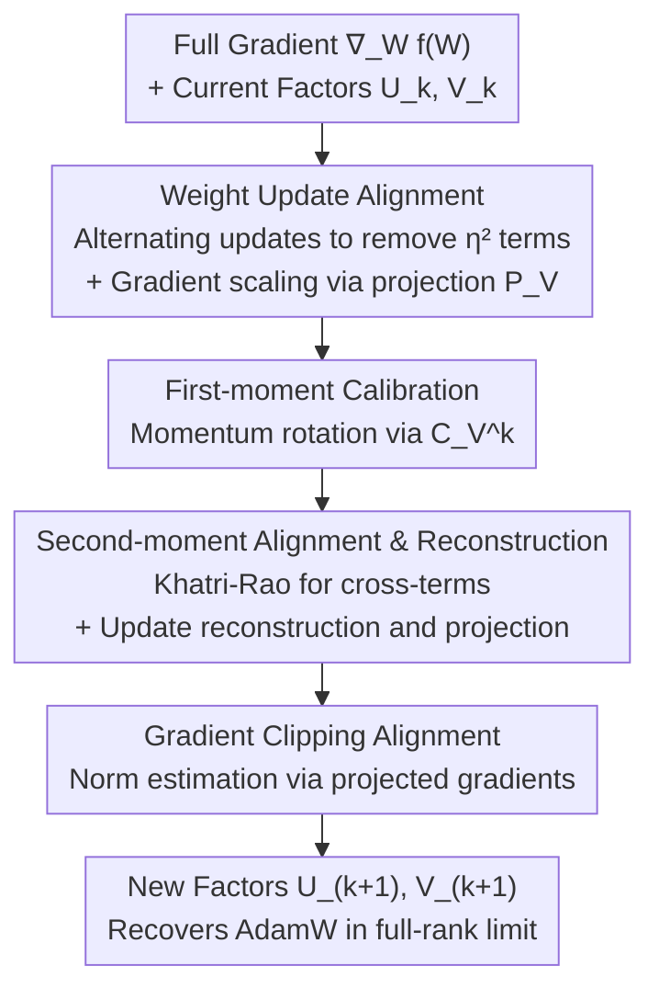

# LoFT: Low-Rank Adaptation That Behaves Like Full Fine-Tuning

**Conference**: ICLR 2026  
**arXiv**: [2505.21289](https://arxiv.org/abs/2505.21289)  
**Code**: None  
**Area**: Parameter-Efficient Fine-Tuning / Model Compression  
**Keywords**: LoRA, Low-Rank Adaptation, Full Fine-Tuning, Optimizer State Alignment, AdamW

## TL;DR

Ours proposes LoFT, a low-rank adaptation method that aligns internal optimizer dynamics (momentum and second moment) with full fine-tuning behavior. Composed of six building blocks, LoFT exactly recovers AdamW in the full-rank limit and significantly narrows the performance gap between LoRA and full fine-tuning across multiple benchmarks.

## Background & Motivation

Downstream adaptation of large-scale pre-trained models has become a standard paradigm in NLP and other fields. However, as model size grows to billions of parameters, full fine-tuning becomes computationally expensive and impractical, especially in multi-task or multi-user scenarios. Parameter-Efficient Fine-Tuning (PEFT) techniques address this challenge by training only a small subset of parameters, with LoRA (Low-Rank Adaptation) being the most popular solution.

**Limitations of Prior Work in LoRA:**

LoRA freezes original weights and injects trainable low-rank matrices $W = W_0 + UV^\top$ into selected layers, where $U \in \mathbb{R}^{m \times r}$, $V \in \mathbb{R}^{n \times r}$, and $r \ll \min\{m, n\}$. While this reduces trainable parameters without increasing inference latency, LoRA still lags behind full fine-tuning in several scenarios:

- **Persistent Performance Gap**: Empirical studies show a consistent performance gap between LoRA and full fine-tuning.
- **Slower Convergence**: The optimization dynamics of LoRA differ fundamentally from full fine-tuning.
- **Hyperparameter Sensitivity**: Setting the scaling factor $\alpha$ significantly impacts performance, leading to high tuning costs.

**Key Insight:**

Previous works (e.g., DoRA, LoRA-Pro) primarily focused on more accurate gradient approximation within the low-rank subspace. However, this paper reveals a crucial neglected factor: **optimizer state misalignment**—specifically the first moment (momentum) and second moment (variance) in AdamW. When these internal statistics are not properly aligned with low-rank constraints, adaptation effectiveness is compromised.

## Method

### Overall Architecture

LoFT aims to answer: since LoRA constrains weight updates to a low-rank subspace, what update under this constraint most closely approximates full fine-tuning? Instead of modifying the network architecture, LoFT decomposes one step of the AdamW update and examines where it deviates from full fine-tuning under low-rank parameterization. It employs six Building Blocks to correct these deviations. These blocks naturally group into four stages along the update data flow: aligning the **weight update** itself (alternating updates + gradient scaling), calibrating the **first moment (momentum)**, aligning the **second moment (variance)**, and finally aligning **gradient clipping**.

The following diagram illustrates the four alignment stages that gradients pass through to generate new low-rank factors:

### Key Designs

**1. Weight Update Alignment: Aligning the "Shape" of Updates**

This stage addresses two shape deviations outside the optimizer state. First, standard LoRA updates $U$ and $V$ simultaneously, which introduces a cross-term proportional to $\eta^2$ in the $UV^\top$ increment that does not exist in full fine-tuning. LoFT uses alternating updates—updating only $U$ in a given step—reformulating the update as $W^+ = W - \eta \nabla_W f(W) VV^\top$ to eliminate the cross-term. Second, since low-rank decomposition is not unique ($UV^\top = (cU)(V/c)^\top$), update scales can drift. LoFT uses scaled gradients $\tilde{\nabla}_U f(W) = \nabla_U f(W)(V^\top V)^{-1}$, effectively standardizing the update via a projection matrix $\mathcal{P}_V = V(V^\top V)^{-1}V^\top$ as:

$$W^+ = W - \eta \nabla_W f(W) \mathcal{P}_V$$

This ensures the update direction is always the orthogonal projection of the full gradient onto the current low-rank subspace, eliminating the need for the sensitive scaling factor $\alpha$.

**2. First-moment (Momentum) Calibration: Rotating Historical Momentum**

AdamW accumulates multiple gradient steps into momentum, but the low-rank subspace changes during training. Standard LoRA momentum $m_U^k V^\top$ mixes historical $V_i$ with the current $V_{k}$, effectively projecting past momentum onto an obsolete subspace. LoFT introduces a calibration matrix $C_V^k = (V_{k-1}^\top V_k)(V_k^\top V_k)^{-1}$ to "rotate" historical momentum into the current subspace before accumulation:

$$m_U^k = \beta_1 m_U^{k-1} C_V^k + (1-\beta_1)\tilde{\nabla}_U f(W_i)$$

The calibrated momentum is equivalent to projecting the full gradient onto the intersection of historical and current subspaces.

**3. Second-moment Alignment and Update Reconstruction: Managing Variance**

The second moment is more complex as Adam's $v_k$ involves element-wise squares of gradients. LoFT maintains an $r^2$-sized cross-term matrix $p_U^k$ and applies rotation using the Kronecker product ($\otimes$) and element-wise squares via the transposed Khatri-Rao product ($\bullet$):

$$p_U^k = \beta_2 p_U^{k-1}(C_V^k \otimes C_V^k) + (1-\beta_2)(\tilde{\nabla}_U f \bullet \tilde{\nabla}_U f)$$

The full second-moment estimate is reconstructed using $\tilde{v}_U^k = p_U^k(V_k * V_k)$, and the final parameter update is formed:

$$U_{k+1} = U_k - \eta_k \frac{m_U^k V_k / (1-\beta_1^k)}{p_U^k(V_k * V_k)/(1-\beta_2^k) + \varepsilon} V_k(V_k^\top V_k)^{-1}$$

This effectively migrates Adam's adaptive learning rate mechanism into low-rank optimization.

**4. Gradient Clipping Alignment: Aligning Norm Estimation**

For gradient clipping, using raw LoRA gradients to estimate norms leads to clipping strengths inconsistent with full fine-tuning. LoFT uses the projected effective gradient $\nabla_W f(W) \mathcal{P}_V$ to calculate the norm, ensuring clipping behavior remains consistent.

### Loss & Training

- LoFT is an optimizer-level improvement and does not change the loss function.
- Weight decay requires no special modification as alternating updates ensure $UV^\top \to (1-\lambda\eta_k)UV^\top$ remains consistent with full fine-tuning.
- **Extra Memory**: $\mathcal{O}((m+n)r)$ for first-moment and $\mathcal{O}((m+n)r^2)$ for second-moment cross-terms.
- **Computation**: Primarily $r \times r$ matrix inversions and Khatri-Rao products, $\mathcal{O}(r^3)$.

**Mechanism**: When $r = \min\{m, n\}$ and $U_k, V_k$ are full rank, LoFT-AdamW **exactly recovers** the full AdamW update. This is the first low-rank adaptation method with this property.

## Key Experimental Results

### Main Results

**Common Sense Reasoning (LLaMA Series):**

| Model | Method | BoolQ | PIQA | SIQA | HS | WG | ARC-C | ARC-E | OBQA | Avg. |
|-------|-------|-------|------|------|-----|-----|-------|-------|------|------|
| LLaMA-7B | LoRA | - | - | - | - | - | - | - | - | Baseline |
| LLaMA-7B | DoRA | - | - | - | - | - | 64.68 | - | - | Baseline+ |
| LLaMA-7B | LoFT | - | 80.96 | 78.27 | 80.50 | 76.40 | - | 80.26 | 78.40 | 74.95 |
| LLaMA2-7B | DoRA | - | 82.92 | 79.22 | 88.90 | - | - | - | - | 79.71 |
| LLaMA2-7B | LoFT | 71.80 | - | - | - | 82.72 | 69.11 | 84.43 | 81.00 | **SOTA** |

**Image Classification (ViT-Base):**
- Evaluated on medical imaging and DomainNet (highly imbalanced datasets).
- LoFT matches or exceeds full fine-tuning performance across multiple datasets.

### Ablation Study

| Configuration | Key Metric | Description |
|---------------|------------|-------------|
| LoFT (Full) | Optimal Convergence | All components working in synergy |
| w/o Alternating Updates | Significantly Worse | Second-order cross-terms hinder convergence |
| w/o State Calibration | Noticeably Worse | Misaligned momentum and variance are suboptimal |
| Only Gradient Scaling | Limited Improvement | Gradient alignment is only a partial solution |
| LoRA (Standard) | Slowest Convergence | Cumulative effect of all alignment issues |

### Key Findings

1. LoFT addresses the neglected optimizer state alignment problem rather than just gradient alignment.
2. LoFT remains robust even under extreme low-rank constraints ($r=1$).
3. LoFT automatically eliminates the need for the LoRA scaling factor $\alpha$.
4. It achieves significantly higher training quality without increasing inference costs.

## Highlights & Insights

1. **Optimizer Misalignment is a Blind Spot**: While prior LoRA variants focused on gradient approximation, this work is the first to systematically resolve momentum and second-moment misalignment.
2. **Elegant Decomposition**: The six Building Blocks provide clear problem-solution mappings with strong theoretical motivation.
3. **Provable Equivalence**: Exact recovery of AdamW at full rank provides a much stronger theoretical guarantee than previous heuristics.
4. **Elimination of $\alpha$**: Using gradient scaling naturally resolves norm ambiguity and reduces hyperparameter tuning burdens.

## Limitations & Future Work

1. **Memory Overhead**: The second-moment cross-term requires $\mathcal{O}((m+n)r^2)$ memory, which is less efficient for large $r$. Future work may explore LLM-specific optimizers like Muon.
2. **Computational Cost**: Training involves additional matrix operations (calibration, projections).
3. **Incomplete Tables**: Some experimental values are missing due to ar5iv conversion errors.
4. **Model Scale**: Experiments focused on 7B-8B models; efficacy on 70B+ models remains to be verified.

## Related Work & Insights

- **Evolution of LoRA**: LoRA → DoRA (magnitude/direction decoupling) → LoRA-Pro (gradient approximation) → LoFT (optimizer dynamics alignment).
- **Riemannian Optimization**: Similar gradient scaling results have been derived from the perspective of Riemannian geometry.
- **Insight**: The principle of optimizer state alignment may benefit any subspace-constrained optimization method.

## Rating

- **Novelty**: ⭐⭐⭐⭐⭐ — Systematically addresses the overlooked optimizer state misalignment problem.
- **Experimental Thoroughness**: ⭐⭐⭐⭐ — Broad coverage across tasks, though some data is missing.
- **Writing Quality**: ⭐⭐⭐⭐⭐ — Distinct Building Block organization and rigorous derivation.
- **Value**: ⭐⭐⭐⭐⭐ — Provides critical guidance for LoRA improvements; potential to become a new standard.

<!-- RELATED:START -->

## Related Papers

- [\[ICLR 2026\] Gradient Intrinsic Dimensionality Alignment：Narrowing The Gap Between Low-Rank Adaptation and Full Fine-Tuning](gradient_intrinsic_dimensionalityalignmentnarrowing_the_gap_between_low-rank_ad.md)
- [\[ICLR 2026\] FlexLoRA: Entropy-Guided Flexible Low-Rank Adaptation](flexlora_entropy-guided_flexible_low-rank_adaptation.md)
- [\[ICML 2026\] ScaLoRA: Optimally Scaled Low-Rank Adaptation for Efficient High-Rank Fine-Tuning](../../ICML2026/model_compression/scalora_optimally_scaled_low-rank_adaptation_for_efficient_high-rank_fine-tuning.md)
- [\[ICLR 2026\] Stable-LoRA: Stabilizing Feature Learning of Low-Rank Adaptation](stable-lora_stabilizing_feature_learning_of_low-rank_adaptation.md)
- [\[ICLR 2026\] ABBA-Adapters: Efficient and Expressive Fine-Tuning of Foundation Models](abba-adapters_efficient_and_expressive_fine-tuning_of_foundation_models.md)

<!-- RELATED:END -->
