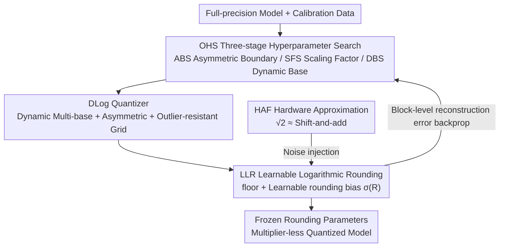

# LogART: Pushing the Limit of Efficient Logarithmic Post-Training Quantization

**Conference**: ICLR 2026  
**OpenReview**: [https://openreview.net/forum?id=V85HbymBLW](https://openreview.net/forum?id=V85HbymBLW)  
**Code**: https://github.com/logart-lab/logart  
**Area**: Model Compression  
**Keywords**: Post-training quantization, logarithmic quantization, learnable rounding, dynamic base, hardware-friendly

## TL;DR
LogART introduces "learnable rounding" into logarithmic post-training quantization (log-PTQ) for the first time. Combined with a logarithmic quantizer supporting dynamic multi-bases, asymmetry, and outlier resistance alongside efficient hyperparameter search, it pushes log-PTQ to ultra-low 3/4-bit widths. It achieves SOTA accuracy on LLMs, CNNs, and ViTs while enabling multiplier-less hardware with reduced area and power consumption.

## Background & Motivation

**Background**: Post-training quantization (PTQ) is a mainstream compression method for deploying large models, requiring only a small calibration set without retraining. Logarithmic PTQ is a significant non-linear scheme where quantization levels are uniform in the logarithmic domain and exponentially distributed in the linear domain, naturally fitting the bell-shaped/long-tailed distribution of neural network weights. Furthermore, base-2 logarithmic quantization replaces multiplications with shifts, potentially eliminating multipliers in hardware to save area and power.

**Limitations of Prior Work**: Log-PTQ performance has been hindered by three issues. First, quantization grids are **inherently symmetric** (taking absolute values before quantization), while LLM weight distributions are often significantly asymmetric. Second, the quantization range is determined by the absolute maximum, making it **extremely sensitive to outliers**, where a few extreme weights can collapse the entire grid. Third, almost all log-PTQ methods still use simple **Round-to-Nearest (RTN)**, whereas linear PTQ has proven that RTN is inferior to task-aware learnable rounding (e.g., AdaRound).

**Key Challenge**: While learnable rounding is highly effective in linear PTQ, it is **difficult to migrate to the log domain**. The logarithmic mapping is non-linear, rounding in the log domain is non-differentiable, and dynamic mixed bases are discrete. These factors combined make gradient-based optimization intractable. Consequently, log-PTQ has relied on tuning bases and scaling factors through complex, time-consuming hyperparameter searches.

**Goal**: To implement learnable rounding in the logarithmic domain while addressing symmetry and outlier sensitivity issues, all while preserving the "multiplier-less" hardware benefits of logarithmic quantization.

**Key Insight**: The authors found that the RTN operation $\lfloor\cdot\rceil$ in logarithmic quantization can be decomposed into a "floor operation $\lfloor\cdot\rfloor$ plus a learnable rounding bias." This bypasses the non-differentiability of the log domain, turning rounding decisions into optimizable variables.

**Core Idea**: Use "floor + learnable rounding bias $\sigma(R)$" to replace RTN in the log domain. This is combined with a new dynamic multi-base, asymmetric, and outlier-resistant quantizer and a three-stage hyperparameter search to optimize the grid. Hardware approximation errors are also injected into the calibration to be learned by the model.

## Method

### Overall Architecture

LogART takes a full-precision pretrained model and a small batch (32 segments) of unlabeled calibration data as input, outputting a low-precision model with frozen "optimal base configurations + learned rounding." The pipeline consists of two main components: **OHS (Optimized Hyperparameter Search)** first defines the quantization grid shape at the tensor/block level—selecting asymmetric boundaries, scaling factors, and base-2 to base-$\sqrt{2}$ ratios per channel. Once the grid is fixed, **LLR (Learnable Logarithmic Rounding)** learns element-wise whether to round each weight up or down to minimize block-level reconstruction error. Meanwhile, **HAF (Hardware Approximation Function)** injects approximation noise (e.g., $\sqrt{2} \approx$ shift-and-add) into the forward pass, allowing the model to absorb hardware errors during learning. Finally, rounding parameters are frozen into weights for multiplier-less inference.

### Key Designs

**1. OHS Three-stage Hyperparameter Search: Optimizing the Log-grid Shape**

Learnable rounding can only reduce local quantization errors; the quantizer's shape (boundaries, scaling, bases) defines the performance ceiling. LogART splits this into three stages: **ABS (Tensor-level Asymmetric Boundary Search)** calculates asymmetric offsets $l_a$ per channel using weight extremes with near-zero overhead. **SFS (Block-level Scaling Factor Search)** searches for an outlier-resistant scaling factor $s_{of}$ at the granularity of residual blocks or attention modules. **DBS (Block-level Dynamic Base Search)** assigns different base-$\sqrt{2}$ and base-2 codeword ratios ($n_1 : n_2$) to different channels. SFS and DBS are jointly optimized to minimize the Frobenius norm of block reconstruction error $\arg\min_{s_{of},n_1,n_2} \mathbb{E}[\|L(\Delta W, X)\|_F^2]$. This synergy between OHS and LLR ensures faster convergence and higher accuracy.

**2. DLog Quantizer: Addressing Symmetry, Outliers, and Rigid Bases**

This quantizer replaces fixed Log2 with three enhancements. **Dynamic Multi-base** uses base-$\sqrt{2}$ for large values (finer granularity for important weights) and base-2 for small values, using a threshold $t$ to partition weights and construct element-wise base selectors $B$, scaling factors $S$, and upper bounds $U$. This preserves precision for large values while suppressing the quantization gap near zero. The **Asymmetric Quantizer** addresses the inability to shift boundaries with a zero-point in log domains by allocating different numbers of codewords to positive and negative weights: calculating $w_h=\max(w_{max},-w_{min})$ and $w_l=\min(w_{max},-w_{min})$, then using $l_a=\lfloor d_a/2\rfloor$ to move extra codewords to the denser side. The **Outlier-resistant Quantizer** introduces a searchable $s_{of}$ so the range is no longer dictated by absolute maximums, adaptively clipping extremes: $Q_W=\mathrm{clamp}(-\log_B\frac{|W|}{s_{of}\cdot S}+\sigma(R), l_a, U)$.

**3. LLR (Learnable Logarithmic Rounding): Implementing Learnable Rounding in the Log Domain**

The core innovation of the paper. Inspired by AdaRound, LogART replaces RTN with the floor operation $\lfloor\cdot\rfloor$ plus a learnable variable $R$ passed through a sigmoid function $\sigma(R) \in [0, 1]$ to determine rounding direction. This yields a soft quantization $Q_W = \mathrm{clamp}(-\log_2 \frac{|W|}{s} + \sigma(R), 0, 2^{N-1}-1)$, bypassing non-differentiability. $R$ is learned by minimizing task-aware reconstruction error with a regularization term pushing $\sigma(R)$ toward 0 or 1: $\arg\min_R \mathbb{E}[L(\Delta W)] + \lambda\sum_{i,j}(1-|2\sigma(R_{ij})-1|^\beta)$, where the task loss uses block-level reconstruction like $\mathbb{E}[\|\Delta W X\|_F^2]=\mathrm{tr}(\Delta W\cdot\mathbb{E}[XX^\top]\cdot\Delta W^\top)$.

**4. HAF (Hardware Approximation Function): Efficient $\sqrt{2}$ Operations**

While base-$\sqrt{2}$ improves accuracy, it typically requires multipliers. HAF uses **Signed Dyadic Expansion** to approximate $\sqrt{2}$ with shift-and-add operations: $\sqrt{2} \approx \sum_{k=1}^{K} a_k \cdot \frac{1}{2^{d_k}}$ where $a_k \in \{-1, +1\}$. Crucially, HAF is injected during the **quantization forward pass of OHS and LLR**, allowing the approximation error to be absorbed during the learning process. This retains multiplier-less hardware logic with negligible accuracy loss (<0.2% for Vision, <0.2 PPL for LLM).

### Loss & Training
The framework uses the Frobenius norm of block-level reconstruction error as the objective. LLR adds a rounding regularization term to push $\sigma(R)$ toward 0/1. Optimization uses Adam with CosineAnnealingLR (0.05 to 0.015). LLMs are trained for 500 iterations, while CNNs/ViTs use 2000 iterations to ensure convergence.

## Key Experimental Results

### Main Results

On 3-bit per-channel weight quantization for LLMs (calibration via C4), LogART is the first log-PTQ method to scale effectively to 3-bit.

| Model | Metric | FP16 | GPTQ | aespa | LogART |
|------|------|------|------|-------|--------|
| OPT-125M | PPL (C4) | 26.56 | 42.88 | 31.41 | **29.98** |
| OPT-125M | Runtime | - | 19.8 s | 2.81 min | **1.25 min** |
| LLaMA2-7B | PPL (C4) | 7.26 | 11.24 | 8.51 | **8.38** |
| LLaMA3-8B | PPL (C4) | 9.45 | 13.86 | 12.59 | **12.44** |

Compared to optimization-based linear PTQ (BRECQ / AffineQuant / aespa), LogART achieves lower PPL while being 24.9× / 3.1× / 2.2× faster, with similar or lower memory usage.

On 4-bit per-channel quantization for CNNs / ViTs, log-PTQ baselines (LogNet, SLogII) are significantly outperformed:

| Model | FP16 | SLogII (Log) | AdaLog/APHQ (Linear) | LogART |
|------|------|--------------|----------------------|--------|
| ResNet18 | 71.00 | 67.52 | 70.47 (BRECQ) | **70.79** |
| MobileNetV2 | 72.62 | 31.20 | 71.52 (BRECQ) | **71.62** |
| ViT-Base | 85.10 | 83.54 | 84.77 (AdaLog) | **85.02** |
| DeiT-Tiny | 72.16 | 68.36 | 71.14 (AdaLog) | **71.62** |

LogART outperforms log baselines on MobileNetV2 by over 40% top-1 and is 3.9× to 6.3× faster than BRECQ/AdaLog.

### Ablation Study

3-bit results on OPT-125M / LLaMA2-7B demonstrating the contribution of each component:

| Configuration | OPT-125M PPL | LLaMA2-7B PPL | Description |
|------|--------------|---------------|------|
| Baseline (RTN) | 170.64 | 60.16 | Naive fixed Log2 + RTN |
| +DBS | 66.63 | 18.49 | Dynamic base significantly reduces PPL |
| +SFS | 36.10 | 6.56 | Scaling search provides largest drop |
| +ABS | 34.29 | 6.45 | Asymmetric boundary, zero overhead |
| +LLR (Full) | **31.15** | **6.14** | Learnable rounding, final SOTA |

### Key Findings
- **SFS and LLR are primary contributors**: SFS reduces LLaMA2-7B PPL from 9.74 to 6.24; LLR provides consistent refinement over RTN.
- **DBS is powerful alone**: Compared to fixed Log2, DBS can halve the PPL, indicating dynamic bases are crucial for diverse weight distributions.
- **ABS is highly cost-effective**: Zero calibration data required, with higher gains on skewed distributions like LLaMA2-7B.
- **Hardware Efficiency**: Under 28nm, LogART AE area is 53.2 µm² with 3.45 µW power, saving >80% area/power vs BRECQ and 43.2% area vs AdaLog.

## Highlights & Insights
- **The "floor + learnable bias" transformation** is the key technical contribution—it bypasses the non-differentiability of log rounding with a simple algebraic shift, enabling gradient optimization in the log domain for the first time.
- **Learning hardware approximation as noise**: Injecting HAF approximations during training rather than post-quantization allows the model to actively compensate for approximation errors, a clear example of hardware-algorithm co-design.
- **Asymmetric Log Quantizers** finally solve the zero-point problem in log grids (where spacing is non-uniform near zero) by reallocating codeword counts to positive/negative values to handle skewed LLM distributions.

## Limitations & Future Work
- Currently focuses on **weight-only quantization**; activation remains in the linear domain. Joint quantization is left for future work.
- LLR convergence on CNNs/ViTs requires 2000 iterations. While an offline cost, the production time (e.g., 1.24h for LLaMA2-7B) is higher than non-learning methods like GPTQ.
- Hardware benefits depend on specialized arithmetic units; gains on general GPUs/NPUs are yet to be fully explored beyond 28nm simulations.

## Related Work & Insights
- **vs AdaRound / BRECQ / aespa**: These refine 4-bit linear PTQ but apply only to uniform grids. LogART migrates the learnable rounding concept to the non-linear log domain.
- **vs AdaLog / SLogII / LogNet**: Previous log methods suffered from symmetric grids and RTN. LogART fixes these "three ailments" and replaces global hyperparameter search with a layered block-level approach.
- **vs GPTQ**: GPTQ is faster as it is learning-free, but LogART achieves significantly higher accuracy for a one-time offline optimization cost.

## Rating
- Novelty: ⭐⭐⭐⭐⭐ First to bring learnable rounding to log-PTQ with a complete asymmetric/outlier-resistant pipeline.
- Experimental Thoroughness: ⭐⭐⭐⭐⭐ Covers LLM/CNN/ViT across 3/4-bit with runtime, memory, and hardware metrics.
- Writing Quality: ⭐⭐⭐⭐ Method is logical and motivation is clear, though formulas are dense with some details in the appendix.
- Value: ⭐⭐⭐⭐⭐ Provides SOTA accuracy while delivering multiplier-less hardware advantages, critical for edge deployment.

<!-- RELATED:START -->

## Related Papers

- [\[ICLR 2026\] Post-Training Quantization for Video Matting](post-training_quantization_for_video_matting.md)
- [\[ICLR 2026\] Training Dynamics Impact Post-Training Quantization Robustness](training_dynamics_impact_post-training_quantization_robustness.md)
- [\[ICLR 2026\] SliderQuant: Accurate Post-Training Quantization for LLMs](sliderquant_accurate_post-training_quantization_for_llms.md)
- [\[ICLR 2026\] PTQ4ARVG: Post-Training Quantization for AutoRegressive Visual Generation Models](ptq4arvg_post-training_quantization_for_autoregressive_visual_generation_models.md)
- [\[ICLR 2026\] Quant-dLLM: Post-Training Extreme Low-Bit Quantization for Diffusion Large Language Models](quant-dllm_post-training_extreme_low-bit_quantization_for_diffusion_large_langua.md)

<!-- RELATED:END -->
