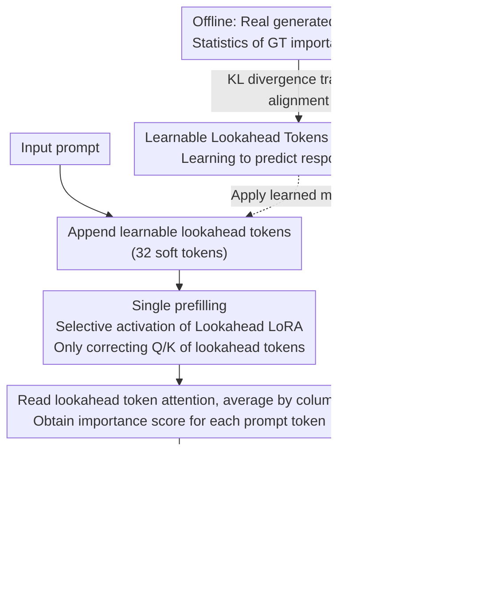

# LookaheadKV: Fast and Accurate KV Cache Eviction by Glimpsing into the Future without Generation

**Conference**: ICLR 2026  
**arXiv**: [2603.10899](https://arxiv.org/abs/2603.10899)  
**Code**: [GitHub](https://github.com/SamsungLabs/LookaheadKV)  
**Area**: Model Compression  
**Keywords**: KV cache compression, attention importance prediction, LoRA, lookahead tokens, long-context inference

## TL;DR
Proposes LookaheadKV, which utilizes learnable lookahead tokens and selectively activated LoRA modules to predict the attention importance scores of actual responses. This achieves fast and accurate KV cache eviction without draft generation, outperforming existing methods on multiple long-context benchmarks while reducing eviction overhead by up to 14.5x.

## Background & Motivation
The size of the KV cache grows linearly with sequence length, becoming a bottleneck for long-context inference. For example, processing 128K tokens with LLaMA3.1-70B requires 40GB of memory. KV cache eviction methods compress memory by retaining only the KV cache of important tokens.

Existing methods face an accuracy-overhead trade-off:

**Prompt-based methods** (SnapKV): Estimate importance using input suffixes; they have low overhead but performance drops sharply under low-budget settings.

**Draft-based methods** (LAQ, SpecKV): Generate approximate responses first to estimate importance; they are accurate but draft generation is costly.

**Key Challenge**: Utilizing future response information can significantly improve eviction quality, but generating the response itself is expensive. The **Core Idea** of LookaheadKV is to train a set of special lookahead tokens to "implicitly predict" future attention patterns, completely skipping the draft generation step.

## Method

### Overall Architecture
The core difficulty of KV cache eviction lies in "which tokens to keep": accurate judgment requires knowing which prompt tokens the future response will focus on, but generating a draft response is too costly. The **Mechanism** of LookaheadKV is to predict the "future" rather than generate it—during the prefilling stage, a small group of learnable lookahead tokens is appended to the end of the input sequence. Their attention query vectors, enhanced by specialized LoRA, directly predict the attention distribution of the actual response over the prompt tokens. During training, KL divergence is used to align these predicted scores with real response scores; during inference, the attention of lookahead tokens is read after a single prefilling pass to derive importance scores for each prompt token for eviction, resulting in zero additional overhead during the decoding stage.

### Key Designs

**1. Learnable Lookahead Tokens: Compressing "future attention" into a signal readable in a single prefilling pass**

**Design Motivation**: Draft-based methods are accurate because they generate responses and then count the attention directed at the prompt; the cost is the autoregressive generation. LookaheadKV instead appends $n_{\text{lookahead}}$ trainable soft tokens (default 32) at the end of the input and trains their query vectors to "compress" the attention patterns of real responses. During eviction, importance estimation for prompt token $j$ is obtained by averaging the attention matrix of these lookahead tokens column-wise: $\tilde{s}_j = \frac{1}{n_{\text{lookahead}}}\sum_i \mathbf{A}_{\text{LKV}_{i,j}}$. Since these lookahead tokens only participate in the prefilling stage and are discarded after scoring, the cost of draft generation is compressed into a single forward pass.

**2. Lookahead LoRA (Selective Activation): Applying LoRA only to lookahead tokens without altering original token representations**

For lookahead tokens to predict response attention, standard model weights are insufficient; specialized adaptation is required. However, if this adaptation also affects normal input tokens, it would change original model behavior and break plug-and-play compatibility. LookaheadKV solves this with a masked LoRA: queries (and keys) are calculated as $\mathbf{Q}_{\text{LKV}} = [\mathbf{X}; \mathbf{P}]\mathbf{W}_q + [\mathbf{0}; \mathbf{P}]\Delta\mathbf{W}_q$, where $\mathbf{X}$ is the normal input and $\mathbf{P}$ represents the lookahead tokens. The increment $\Delta\mathbf{W}$ is multiplied by $[\mathbf{0}; \mathbf{P}]$—only the lookahead token segment receives LoRA corrections, while the normal input segment remains entirely zeroed out and unchanged. This provides sufficient prediction power for lookahead tokens while ensuring original computations for real tokens are untouched, maintaining compatibility with FlashAttention.

**3. KL Divergence Training: Aligning predicted scores with real response scores through ranking**

With lookahead tokens and LoRA, a supervisory signal is needed to teach them which tokens the "real response" focuses on. LookaheadKV first uses the model to generate responses for training samples and collects ground truth importance scores $\hat{\mathbf{s}}_{\text{GT}}$ for each layer and head. It then aligns the lookahead module's predicted scores with the ground truth using KL divergence:

$$\mathcal{L}_{\text{LKV}} = \frac{1}{LH}\sum_l\sum_h D_{\text{KL}}(\hat{\mathbf{s}}_{\text{GT}}^{l,h} \,\|\, \hat{\mathbf{s}}_{\text{LKV}}^{l,h})$$

where $L$ and $H$ are the number of layers and heads. Using KL divergence instead of MSE is intentional: it is equivalent to a ListNet ranking loss, focusing on the relative importance ranking of tokens rather than absolute score values—this perfectly matches the eviction task, which only requires retaining top-budget tokens based on ranking.

### Loss & Training
- Training Data: 50K ChatQA2 + 20K Tulu + 7K Stack + 9K few-shot synthetic.
- Max input 16K, response length 512 (greedy decoding).
- LoRA applied to all linear layers, rank=8, $\alpha=32$.
- Extra trainable parameters < 0.5% (only 20.6M for Llama-8B).

## Key Experimental Results

### Main Results (MT-Bench, Multi-model)

| Method | LLaMA-1B@64 | LLaMA-3B@64 | LLaMA-8B@64 | Qwen-1.7B@64 |
|------|-------------|-------------|-------------|--------------|
| SnapKV | 4.70 | 6.28 | 6.80 | 5.95 |
| PyramidKV | 4.64 | 6.30 | 6.85 | 5.81 |
| StreamingLLM | 4.54 | 5.96 | 6.17 | 5.83 |
| LAQ | 5.03 | 6.48 | 7.10 | 6.19 |
| **Ours** | **5.21** | **6.87** | **7.26** | **6.70** |
| FullKV | 5.72 | 7.35 | 7.77 | 7.19 |

### Ablation Study

| Configuration | LongBench Avg | TTFT Overhead | Notes |
|------|-------------|---------|------|
| With LoRA + Lookahead Tokens | Best | <2.16% | Full LookaheadKV |
| Without LoRA, Lookahead Tokens Only | Significantly lower | <2% | LoRA contribution is significant |
| With LoRA, No Lookahead Tokens | Lower | - | Lookahead tokens are core |
| SnapKV (Baseline) | Lower | ~0% | Lightest but inaccurate |
| LAQ (Draft Generation) | Similar | 14.5x of LKV | High generation overhead |

### Key Findings
- TTFT (Time to First Token) overhead is only 2.16% at 32K context, 14.5x lower than LAQ.
- Superior performance in low-budget settings (budget=64), outperforming SnapKV by 0.46 points on LLaMA-8B.
- Consistently effective across 6 models (LLaMA 1B/3B/8B, Qwen 1.7B/4B/8B).
- Maintained advantages across multiple budgets and context lengths on LongBench and RULER.

## Highlights & Insights
- The "glimpsing without generation" concept is elegant: using implicit future representations instead of explicit draft generation.
- Selective LoRA activation is cleverly designed: ensuring inference compatibility and modularity.
- Extremely low parameter overhead (<0.5%), with negligible impact on model size.
- Implementation is compatible with FlashAttention, making it friendly for practical deployment.

## Limitations & Future Work
- Requires offline training of the lookahead module, which must be done separately for each model.
- The diversity of training data may affect eviction quality in specific domains.
- The fixed setting of 32 lookahead tokens may not be optimal for all scenarios.
- The combination with other compression methods, such as quantization, has not been explored.

## Related Work & Insights
- **vs SnapKV**: Higher accuracy with comparable overhead (both reuse prefilling computations).
- **vs LAQ/SpecKV**: Comparable or superior accuracy, but eviction overhead is reduced by 14.5x.
- **vs StreamingLLM**: Substantial improvement across all settings.

## Rating
- **Novelty**: ⭐⭐⭐⭐ Lookahead tokens as a replacement for draft generation is a clever trade-off.
- **Experimental Thoroughness**: ⭐⭐⭐⭐⭐ Comprehensive evaluation across 6 models, 4 benchmarks, multiple budgets, and varying context lengths.
- **Writing Quality**: ⭐⭐⭐⭐⭐ Clear problem statement with a tight integration of theory and experiments.
- **Value**: ⭐⭐⭐⭐⭐ Solves the core trade-off in KV cache eviction with high practicality.

<!-- RELATED:START -->

## Related Papers

- [\[ICLR 2026\] Q&C: When Quantization Meets Cache in Efficient Generation](qc_when_quantization_meets_cache_in_efficient_generation.md)
- [\[ACL 2026\] The Pitfalls of KV Cache Compression](../../ACL2026/model_compression/the_pitfalls_of_kv_cache_compression.md)
- [\[NeurIPS 2025\] Ada-KV: Optimizing KV Cache Eviction by Adaptive Budget Allocation for Efficient LLM Inference](../../NeurIPS2025/model_compression/ada-kv_optimizing_kv_cache_eviction_by_adaptive_budget_allocation_for_efficient_.md)
- [\[ACL 2025\] Accurate KV Cache Quantization with Outlier Tokens Tracing](../../ACL2025/model_compression/accurate_kv_cache_quantization_with_outlier_tokens_tracing.md)
- [\[NeurIPS 2025\] KeyDiff: Key Similarity-Based KV Cache Eviction for Long-Context LLM Inference in Resource-Constrained Environments](../../NeurIPS2025/model_compression/keydiff_key_similarity-based_kv_cache_eviction_for_long-context_llm_inference_in.md)

<!-- RELATED:END -->
