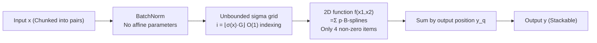

# Lookup multivariate Kolmogorov-Arnold Networks

**Conference**: ICLR 2026  
**Code**: [https://github.com/schwallergroup/lmkan](https://github.com/schwallergroup/lmkan)  
**Area**: Model Compression / Efficient Inference  
**Keywords**: Kolmogorov-Arnold Networks, Spline Look-up Tables, Efficient Inference, Linear Layer Replacement, CUDA kernel  

## TL;DR
By replacing the 1D trainable functions in KAN with 2D counterparts and utilizing B-spline look-up tables for $O(1)$ evaluation, the proposed lmKAN module can directly replace linear layers—reducing inference FLOPs by 1.6–78× at equivalent precision and achieving an order-of-magnitude speedup on H100 GPUs via optimized CUDA kernels.

## Background & Motivation
**Background**: The parameter count and computational overhead of modern deep models (MLP, Transformer, CNN, GNN) are predominantly concentrated in high-dimensional linear mappings. For a linear layer of width $N$, both parameters and operations grow at $O(N^2)$, while other layers remain $O(N)$. Consequently, the primary bottleneck in large model deployment is the inference cost of these linear layers.

**Limitations of Prior Work**: Kolmogorov-Arnold Networks (KAN) construct high-dimensional mappings using a set of trainable univariate functions. In principle, they are well-suited for spline look-up tables which offer "massive parameters but cheap evaluation"—since piecewise function retrieval is $O(1)$ and independent of parameter count. However, in practice, KAN functions rarely exceed a few dozen parameters: adding more parameters to a 1D function is equivalent to fitting extremely high-frequency components, leading to training instability and generalization issues. Furthermore, while the $O(1)$ evaluation idea is often mentioned, efficient GPU implementations are scarce. Mainstream research has shifted toward **dense** basis functions (e.g., FastKAN using Chebyshev, Fourier, or Gaussian RBF), sacrificing the $O(1)$ advantage of compact support.

**Key Challenge**: To achieve "high parameter capacity per function with near-zero incremental inference cost," 1D functions tend to waste expressivity on high frequencies and are hard to train, while efficient $O(1)$ implementations lack engineering realizations that can outperform MLPs.

**Goal**: To create a **general, plug-and-play** replacement for linear layers that achieves Pareto dominance over MLPs in both FLOPs and wall-clock time, validated on real tasks without closed-form KART representations or excessive smoothness.

**Key Insight**: **【Multivariate Functions + Look-up Tables】** By increasing the dimensionality of KAN's inner functions from 1D to 2D (or $d$-D), 2D functions can "absorb" significantly more parameters than 1D functions without overflowing into high frequencies. Simultaneously, strict $O(1)$ evaluation is achieved using second-order B-splines and unbounded sigma grids, with dedicated CUDA kernels translating theoretical efficiency into real-world speedups.

## Method

### Overall Architecture
An lmKAN layer of dimension $d$ partitions the input into groups of $d$. Each group is fed into a trainable low-dimensional function, and the outputs of several functions corresponding to the same output position are summed:
$$y_q = \sum_{p=0}^{N_{in}/d-1} f_{qp}(x_{dp}, x_{dp+1}, \dots, x_{dp+d-1})$$
where $f_{qp}$ is a trainable $d$-dimensional function. Similar to KAN, no additional activation functions are required between these layers; they can be stacked arbitrarily to replace the "linear layer + activation" combination in MLPs. The paper implements and optimizes CUDA kernels for $d=1$ and $d=2$, with 2D being the primary focus. Each 2D function is parameterized by $(G+1)^2$ coefficients using second-order B-splines, but for any given point, only 4 B-splines are non-zero, requiring only 4 multiply-accumulate operations for evaluation.

### Key Designs

**1. Multivariate Inner Functions: Absorbing parameters via dimensionality rather than frequency.** This is the core trade-off. Increasing parameters in 1D functions requires refining the grid $G$, which forces the function to represent higher frequency bands—necessary for "wild" KART inner functions but detrimental to training stability and generalization in real tasks. 2D functions can accommodate far more parameters without spilling expressivity into high frequencies: a 4D function with 10 grid points per dimension has a parameter count comparable to a 1D function with $10^4$ grid intervals. Equation $(2)$ generalizes 1D KAN to $d$-dimensional block mappings; 2D is chosen as the sweet spot, being significantly more accurate and easier to train than 1D while maintaining equivalent evaluation costs (see below). When necessary, multivariate functions can degenerate into sums of 1D functions, allowing lmKAN to revert to standard KAN where the KART theorem still applies.

**2. Unbounded Sigma Grid: Maintaining $O(1)$ indexing under training dynamics.** During training, neuron activations can drift arbitrarily, causing grids defined on bounded intervals to fail. The authors designed a sigma grid covering the entire real line: utilizing any sigmoid-like function $\sigma(x)$, grid points are defined by the intersection of $\sigma(x)$ with $G-1$ equidistant horizontal lines. This results in the finest grid near the origin, gradually coarsening toward the tails. Crucially, given $x$, the interval index can be calculated directly as $i = \lfloor \sigma(x)\,G \rfloor$, maintaining $O(1)$ complexity. A BatchNorm layer without affine parameters is placed before each lmKAN layer to keep activations within a reasonable range and balance grid occupancy.

**3. Compactly Supported 2nd-Order B-splines: Mathematically decoupling parameter count from evaluation speed.** Inner functions are based on second-order B-splines constructed on the sigma grid. Each B-spline is non-zero only across two intervals adjacent to its center; $G$ intervals utilize $G+1$ basis functions ($G-1$ internal B-splines plus two linear segments on terminal infinite intervals). 2D bases are formed via tensor products $B_{i_1 i_2}(x_1,x_2)=B_{i_1}(x_1)B_{i_2}(x_2)$, with functions defined as $f(x_1,x_2)=\sum_{i_1,i_2} p_{i_1 i_2} B_{i_1 i_2}(x_1,x_2)$. Since only 4 2D B-splines are non-zero at any point, evaluation always involves 4 terms regardless of $G$. This is the root cause for allowing parameter counts to increase by orders of magnitude while inference cost remains nearly constant. The smoothness of second-order B-splines ($C^0$ but not $C^1$) aligns with ReLU; the authors argue that the extra smoothness of higher-order splines does not justify the computational overhead.

**4. Reusing Intermediate Values to Cap FLOPs at 2× Linear Layers.** Multiple low-dimensional functions in the same column share identical independent variables. Grid indices and B-spline values only need to be calculated once per input pair and then reused. Thus, each 2D function effectively costs only 4 multiply-accumulate operations. A layer consists of $\lceil N_{in}/2\rceil N_{out}$ 2D functions, so the total number of operations for the dominant $O(N^2)$ term is $4\lceil N_{in}/2\rceil N_{out}=2N_{in}N_{out}$, **exactly 2× that of a linear layer of the same shape**. The $O(N)$ term is not an overhead but as a replacement for element-wise biases and (potentially expensive) activations that lmKAN does not require. In practice, the authors use GEMM-style shared memory tiling for the CUDA kernel: on an H100, a 16×16 tile is about 8× slower than a dense linear layer (due to less coherent memory access compared to dense GEMM), but because the parameter count is ~220× that of the baseline, **efficiency per parameter is approximately 27.5× higher**; using 8×8 tiles allows $G=40$ with an efficiency per parameter of ~88.5×.

## Key Experimental Results

### Main Results

| Task | Backbone | FLOPs Reduction (Same Acc) | H100 Measured Speedup |
|------|----------|---------------------------|-----------------------|
| Gen. High-dim Approx (Distill random MLP, R³²→R¹) | 2-layer FC | Up to **6.0×** | 1.8× |
| Methane Conformation (12D Tabular, DFT Energy) | 2-layer FC | Up to **78.0×** | **12.9×** |
| CIFAR-10 Classification | lmKAN-CNN | **1.6–2.1×** | — |
| ImageNet (81×81) Top-5 | lmKAN-CNN | **1.7×** | — |

Across all tasks, lmKAN is Pareto superior in the "Inference FLOPs vs. Accuracy" tradeoff. MLP baselines were trained with both half and full budgets to ensure tight convergence.

### Ablation Study

| Comparison | Phenomenon / Conclusion |
|------------|-------------------------|
| Grid Resolution $G$ Scan (Fixed hidden dim 256) | Accuracy vs. $G$ follows a **U-shape**, not monotonic; 2D saturates at higher parameter counts and higher accuracy |
| 2D lmKAN (Opt. $G$) vs. Larger MLP | Equivalent to an MLP **approx. 16× larger** (4× hidden dim) |
| Inference Cost vs. $G$ | FLOPs and H100 wall-clock time are **independent of $G$** (Validates $O(1)$ design) |
| 2D vs. 1D vs. FastKAN (CIFAR-10, dim 256) | 1D lmKAN/FastKAN degrade **worse than MLP** at fine grids; 2D lmKAN shows minimal degradation and significantly higher accuracy |

### Key Findings
- **Dimension holds parameters better than frequency**: 2D inner functions allow stable training under over-parameterization, whereas 1D versions (including FastKAN) fail at high grid resolutions.
- **Theoretical efficiency is practical**: Thanks to the CUDA kernel, the methane task achieves an order-of-magnitude (12.9×) real speedup on H100, rather than just impressive FLOPs figures.
- **Tabular tasks yield highest gains**: Low-dimensional dense regressions like methane see the highest benefits (78×); CNNs gain less (~1.7×) as specialized kernels for convolution are not yet implemented.
- **Smaller models for same accuracy**: In general function approximation, 2D lmKAN with optimal grids matches an MLP 4× wider and ~16× larger, suggesting it is more efficient to "pack" parameters into low-dimensional functions than to widen linear layers.

## Highlights & Insights
- **Reactivating a neglected direction**: While mainstream KAN research moves toward dense basis functions (sacrificing $O(1)$), this work adheres to compact support B-splines and look-up tables with high-performance GPU engineering, proving this path can outperform MLPs.
- **The "2D is a free lunch" insight is compelling**: For 2nd-order B-splines, both 1D and 2D evaluations cost exactly 2× a linear layer; thus, moving from 1D to 2D significantly increases expressivity and trainability without increasing inference cost.
- **Unbounded sigma grid** addresses the engineering pain point of "activation drift during training," while maintaining $O(1)$ indexing.
- Rigorous baseline handling (half/full budget dual lines) makes the "efficiency" claims credible.

## Limitations & Future Work
- **Memory sensitivity**: The LUT memory access pattern is less coherent than dense GEMM. Real speedups (~8–9.5× slower than same-shape linear layers) lag behind the 2× theoretical FLOPs advantage, requiring further kernel optimization.
- **Shared memory limits on grids**: On H100, $G\le 20$ (16×16 tile) or $\le 40$ (8×8 tile) constrains the parameter density per layer.
- **Lack of specialized convolution**: lmKAN-CNN flattens convolutions into fully connected layers during training; **no specialized CUDA kernel for convolution is yet provided**, so real speedups for CNNs were not shown.
- **Dimensionality scaling cost**: $d$-dimensional 2nd-order B-spline evaluation costs $2^d/d$ times a linear layer; complexity grows rapidly for $d\ge 3$, hence the focus on 2D.
- Results on massive/complex backbones (e.g., LLMs, Transformer blocks) remain to be verified; the paper consciously chose "setting diversity" over "ultra-large scale."

## Related Work & Insights
- **KAN Lineage**: Building on modern KANs (Liu et al., 2024), but upgrading 1D inner functions to multivariate ones and engineering the often-cited but rarely implemented "LUT $O(1)$" approach.
- **Contrast with FastKAN**: FastKAN replaced sparse B-splines with dense Gaussian RBFs for optimization convenience, sacrificing $O(1)$. This work demonstrates that the dense route is inferior to 2D compact support under over-parameterization.
- **Insights for Efficiency Research**: In a paradigm where parameter count and inference cost are typically proportional, look-up tables offer a decoupling point, suggesting linear layers are not the only efficient form for high-dimensional mappings.
- **Cross-architecture Generality**: Applying the module to both MLPs and CNNs suggests that linear mappings in GNNs/Transformers might also benefit, marking it as a promising general-purpose replacement.

## Rating
- **Novelty**: ⭐⭐⭐⭐⭐ —— The combination of "multivariate inner functions + compact support LUT + proprietary CUDA kernels" targets a clear yet neglected direction, reversing the trend toward dense bases in KANs.
- **Experimental Thoroughness**: ⭐⭐⭐⭐ —— Covers function approximation, tabular regression, and CNNs across both FLOPs and wall-clock time with rigorous baselines; however, lacks large-scale Transformer benchmarks and real-time convolution speedups.
- **Writing Quality**: ⭐⭐⭐⭐ —— Motivations, trade-offs (frequency vs. dimension), and cost analyses are clear, credible, and well-organized.
- **Value**: ⭐⭐⭐⭐ —— Its plug-and-play nature and open-source CUDA kernels provide immediate value for inference-sensitive deployment, though its potential is currently bounded by memory access patterns and model scale verification.

<!-- RELATED:START -->

## Related Papers

- [\[ICCV 2025\] Color Matching Using Hypernetwork-Based Kolmogorov-Arnold Networks (cmKAN)](../../ICCV2025/model_compression/color_matching_using_hypernetwork-based_kolmogorov-arnold_networks.md)
- [\[ICLR 2026\] Enhancing Multivariate Time Series Forecasting with Global Temporal Retrieval](enhancing_multivariate_time_series_forecasting_with_global_temporal_retrieval.md)
- [\[ICLR 2026\] Bridging Kolmogorov Complexity and Deep Learning: Asymptotically Optimal Description Length Objectives for Transformers](bridging_kolmogorov_complexity_and_deep_learning_asymptotically_optimal_descript.md)
- [\[ICLR 2026\] Adaptive Width Neural Networks](adaptive_width_neural_networks.md)
- [\[ICLR 2026\] A Recovery Guarantee for Sparse Neural Networks](a_recovery_guarantee_for_sparse_neural_networks.md)

<!-- RELATED:END -->
