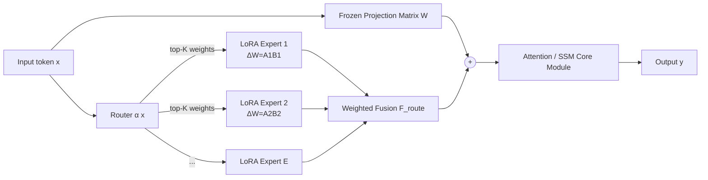

# LoRA-Mixer: Coordinate Modular LoRA Experts Through Serial Attention Routing

**Conference**: ICLR 2026  
**Code**: [https://github.com/hustcselwb/LoRA-Mixer](https://github.com/hustcselwb/LoRA-Mixer)  
**Area**: Model Compression / Parameter-Efficient Fine-Tuning (LoRA-MoE)  
**Keywords**: LoRA, Mixture-of-Experts, Parameter-Efficient Fine-Tuning, Multi-task Adaptation, Routing Specialization, Attention Projection Layer

## TL;DR
The paper "serializes" multiple independently trained LoRA experts into the input/output projection matrices of attention modules rather than replacing FFNs or using parallel branches. It incorporates a Routing Specialization Loss (RSL) that unifies load balancing and input-aware specialization via entropy regularization, outperforming LoRA-MoE SOTA on 15 multi-task benchmarks using only 48% of trainable parameters.

## Background & Motivation
**Background**: LoRA enables large model fine-tuning by training low-rank increments $\Delta W = AB$ with minimal parameter overhead. Treating multiple task-specific LoRAs as "experts" and fusion using MoE routing for sparse activation is viewed as a promising direction for multi-task adaptation, leading to works like MixLoRA, MoLE, LoRAHub, and LoRAMoE.

**Limitations of Prior Work**: Existing LoRA-MoE fusions follow two main paths: (i) replacing entire attention/FFN blocks with switch experts, which requires joint training of all experts, has high data demands, and struggles to reuse off-the-shelf LoRAs; (ii) attaching parallel LoRA branches and adding outputs back to the backbone, which bypasses native paths for attention or state transitions, resulting in shallow integration. Furthermore, standard auxiliary routing losses pursue uniform load distribution, flattening signals for input/task-related specialization.

**Key Challenge**: The fundamental difficulty in combining pre-trained LoRAs is achieving "collaborative gain" (performing better across tasks) without inflating training costs or erasing the inductive bias of individual tasks. Both switch-style and parallel-style approaches fail to balance these ends, and the "uniformity" goal of auxiliary losses directly conflicts with the "specialization" goal.

**Goal**: To create a plug-and-play, architecture-agnostic (supporting both Transformer and SSM) fusion framework that maximizes the reuse of independently trained LoRAs and learns discriminative routing with minimal data.

**Key Insight**: **[Serial Projection Layers]** Routing LoRA experts into projection matrices (attention in/out linear) rather than FFNs allows experts to act directly on the most expressive core paths. **[RSL]** Using entropy shaping to integrate global load balancing and input-aware specialization into a single objective mitigates the "uniformity vs. specialization" conflict.

## Method

### Overall Architecture
LoRA-Mixer connects a set of $E$ low-rank experts $\Delta W^{(e)}=A^{(e)}B^{(e)}$ and a router $\alpha(x)\in\mathbb{R}^E$ in series to the original model's linear projection matrix $W$. The output is $y = Wx + F_{\text{route}}\big(\{\alpha_e(x)\cdot\Delta W^{(e)}x\}_{e=1}^{E}\big)$. The result is fed into subsequent attention or state-space modules, directly affecting the core representation learning path. Expert sources are flexible: they can be frozen and reused from public repositories like LoRAHub, trained as domain-specific LoRAs, or jointly trained via hard routing. Training occurs in two stages: first, experts are stabilized via hard routing using domain labels, followed by soft training of the router. Inference uses top-K sparse fusion to control overhead.

### Key Designs
**1. Serial Projection Layer Routing: Token-level specialization on the core attention path.** Instead of replacing the entire layer with switch experts or adding parallel branches, LoRA-Mixer modifies the ubiquitous in/out linear projection matrices. This modification point is highly expressive and architecture-agnostic: since linear projection layers exist in both Transformer and SSM (e.g., selective scan in Falcon-Mamba), the mechanism is drop-in compatible with both. Expert outputs $\alpha_e(x)\cdot\Delta W^{(e)}x$ added to the backbone enter the attention/state transition operations together, allowing experts to participate directly in core representation learning rather than "post-hoc fusion," achieving fine-grained token-level specialization.

**2. Flexible Expert Acquisition and Hard Routing Joint Training: Enabling true reusability of existing LoRAs.** The framework treats each pre-trained LoRA as a pluggable "memory unit," supporting three sources: frozen combinations from public repositories, self-trained domain modules, or joint training on heterogeneous labeled data. Hard routing is used during joint training—assigning a domain ID $d$ to each sample, where all tokens of that sample are deterministically routed to expert $d$, ensuring efficient optimization without cross-contamination. A parameter preservation regularization $L_{\text{preserve}}=\beta\sum_{i\in C}\|\theta_i-\theta_i^{(0)}\|^2$ is added during soft routing training to prevent sensitive experts from deviating from their initial knowledge.

**3. Routing Specialization Loss (RSL): Welding "balance" and "specialization" into one objective via entropy.** The authors view the router as an information bottleneck. The entropy of the routing distribution characterizes how it preserves or compresses token semantic differences. Thus, load balancing (uniformity) and specialized selection (sharpness) are naturally opposed. Traditional auxiliary loss $L_{\text{aux}}=\alpha\sum_i \bar p_i\bar f_i$ only penalizes imbalance and backpropagates global gradients, leading to overly averaged expert usage. RSL subtracts an entropy regularization term:

$$L_{\text{RSL}} = \alpha\cdot\sum_{i=1}^{K}\bar p_i\bar f_i - \lambda\cdot\mathbb{E}_{x\sim D}\big[H(p(x))\big],\quad H(p(x))=-\sum_i p_i(x)\log p_i(x).$$

The key lies in the entropy gradient $\partial H/\partial p_i = -\log p_i(x)-1$, which provides a **token-level** signal $\log p_i(x)$. This allows the total gradient $\nabla_{p_i}L_{\text{RSL}}=\alpha\frac{\partial\bar p_i}{\partial p_i}\bar f_i+\lambda(\log p_i(x)+1-\mu)$ to amplify the input-aware variance of expert selection $\mathrm{Var}_x(p(x))=\mathbb{E}_x[\|p(x)-\bar p\|^2]$ under a fixed global load. While standard auxiliary losses push this variance to 0, RSL encourages high-variance, peaky distributions aligned with input semantics. The coefficient $\lambda$ acts as an interpretable knob to trade off global fairness and local specialization.

## Key Experimental Results

### Main Results
Across three backbones (Falcon-Mamba-7B / Mistral-7B / LLaMA3-8B) and seven benchmarks, LoRA-Mixer consistently exceeds LoRAHub / MoLE / MixLoRA / Single LoRA (LLaMA3-8B excerpt):

| Method (LLaMA3-8B) | Medical | CoLA | SST2 | GSM8K | ARC-E | ARC-C | HumanEval |
|---|---|---|---|---|---|---|---|
| LoRAHub | 78.11 | 79.84 | 92.77 | 59.10 | 87.13 | 80.14 | 52.83 |
| MoLE | 78.43 | 81.37 | 94.18 | 63.81 | 88.15 | 81.77 | 55.87 |
| MixLoRA | 79.87 | 80.67 | 94.22 | 64.44 | 88.70 | 82.90 | 55.49 |
| LoRA | 81.09 | 81.50 | 95.30 | 65.14 | 89.59 | 82.15 | 55.61 |
| **Ours** | **81.55** | **82.22** | **95.41** | **65.53** | **89.88** | **83.24** | **57.32** |

> Using 48% of trainable parameters, Ours exceeds routing/LoRA-MoE SOTA, with gains of +3.79% on GSM8K, +2.90% on CoLA, and +3.95% on ARC-C. It leads on all tasks for the pure SSM backbone Falcon-Mamba, verifying architecture neutrality.

### Ablation Study
**Comparison with other "Optimized Routing Losses" (using 2K training data)**: RSL significantly out-performs GMoE / DS-MoE / AESL in low-resource settings.

| Task | GMoE | DS-MoE | AESL | **RSL** |
|---|---|---|---|---|
| SST-2 | 91.38 | 92.45 | 92.64 | **95.41** |
| CoLA | 79.57 | 79.83 | 80.42 | **82.22** |
| ARC-E | 85.65 | 85.32 | 86.24 | **89.88** |
| ARC-C | 76.42 | 78.45 | 79.88 | **83.24** |
| HumanEval | 46.37 | 48.92 | 50.46 | **57.32** |

**Data Efficiency of RSL** (Average of seven tasks): The advantage of RSL is most pronounced with small datasets (+1.97 at 2K).

| Data Volume | w/ RSL | w/o RSL | Gain |
|---|---|---|---|
| 1K | 76.80 | 75.47 | +1.33 |
| 2K | 79.26 | 77.29 | +1.97 |
| 6K | 79.41 | 79.37 | -0.04 |
| 10K | 79.94 | 79.51 | +0.43 |

### Key Findings
- **Cross-Model Transfer**: LoRA-Mixer parameters trained on Mistral-7B can be transferred to LLaMA3-8B without fine-tuning and still outperform the base model on ARC-C/GSM8K, proving RSL learns robust, transferable routing.
- **Off-the-shelf LoRA Reuse**: Using 5 frozen LoRAHub experts for Flan-T5 with only 2K extra data to train the router, performance on GLUE tasks mostly exceeds a single LoRA, showing production-level plug-and-play potential.
- **Expert Load**: On 1K mixed data, expert activation rates are balanced (15%–18%), avoiding collapse. Across tasks, RSL stably allocates high weights to relevant experts (domain-aware), whereas auxiliary losses allocate weights uniformly regardless of domain.

## Highlights & Insights
- **Strategic Modification Point**: Choosing projection layers over FFNs captures the core paths of attention/state transitions and ensures compatibility with both Transformer and SSM due to the "ubiquity" of such layers.
- **Loss Conflict as Information Bottleneck**: Framing the conflict between "load balancing vs. input specialization" as an objective with an interpretable knob $\lambda$ provides a principled explanation (via token-level gradients) for why auxiliary losses erase variance.
- **True Reusability**: Hard routing plus parameter preservation allows experts to remain uncontaminated. Combined with "frozen LoRAs + low-data routing training," it lowers the threshold for multi-task adaptation.

## Limitations & Future Work
- **Limited Number of Experts**: Experiments were mostly conducted with ~6 experts. Routing stability and top-K selection for dozens or hundreds of domain experts are not fully explored.
- **Data Volume Inflection Point**: Table 9 shows that at 4K–6K samples, RSL holds little to no advantage over auxiliary losses, suggesting its benefits are concentrated in low-resource scenarios.
- **Lack of Large Backbone Validation**: Base models are limited to 7B–8B. Collaborative gains on larger models or more complex cross-domain combinations remain to be verified; generative long-context tasks were not covered.

## Related Work & Insights
- **Comparison with Switch-style (MixLoRA, Switch Transformer)**: These replace entire blocks and require joint training, making them data-hungry and hard to reuse. LoRA-Mixer’s serial projection plus frozen reuse directly addresses this.
- **Comparison with Parallel Branches (MoLE, LoRAHub)**: MoLE lacks sparse routing, and LoRAHub has no gradient optimization. LoRA-Mixer achieves deeper integration via the core path.
- **Comparison with Optimized Routing Losses (GMoE, DS-MoE)**: While these focus on balance, RSL adds token-level specialization signals via entropy regularization, leading to significant gains in low-data regimes.

## Rating
- **Novelty**: ⭐⭐⭐⭐ — The "Serial Projection + Entropy-Shaped RSL" combo is novel, elevating loss conflict to an information bottleneck perspective with a gradient-level explanation.
- **Experimental Thoroughness**: ⭐⭐⭐⭐ — Comprehensive across 15 benchmarks and three backbone types (including pure SSM). Cross-model transfer and LoRA reuse are well-validated, though stress tests for massive expert scales are missing.
- **Writing Quality**: ⭐⭐⭐⭐ — Clear motivation-to-analysis chain. Figures 1/2 provide intuitive comparisons of fusion styles.
- **Value**: ⭐⭐⭐⭐ — High practical value for modular multi-task LLMs due to plug-and-play capability, architecture neutrality, and low-data requirements.

<!-- RELATED:START -->

## Related Papers

- [\[ICLR 2026\] LD-MoLE: Learnable Dynamic Routing for Mixture of LoRA Experts](ld-mole_learnable_dynamic_routing_for_mixture_of_lora_experts.md)
- [\[ICLR 2026\] Stable-LoRA: Stabilizing Feature Learning of Low-Rank Adaptation](stable-lora_stabilizing_feature_learning_of_low-rank_adaptation.md)
- [\[CVPR 2026\] TAS-LoRA: Transformer Architecture Search with Mixture-of-LoRA Experts](../../CVPR2026/model_compression/tas-lora_transformer_architecture_search_with_mixture-of-lora_experts.md)
- [\[ICML 2025\] Make LoRA Great Again: Boosting LoRA with Adaptive Singular Values and Mixture-of-Experts Optimization Alignment](../../ICML2025/model_compression/make_lora_great_again_boosting_lora_with_adaptive_singular_values_and_mixture-of.md)
- [\[ICLR 2026\] TiTok: Transfer Token-level Knowledge via Contrastive Excess to Transplant LoRA](titok_transfer_token-level_knowledge_via_contrastive_excess_to_transplant_lora.md)

<!-- RELATED:END -->
