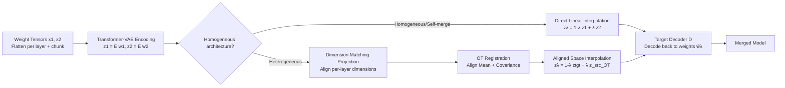

# LS-Merge: Merging Language Models in Latent Space

**Conference**: ICLR 2026  
**OpenReview**: [https://openreview.net/forum?id=VSDV0SWwOC](https://openreview.net/forum?id=VSDV0SWwOC)  
**Code**: TBD  
**Area**: Model Merging / Weight-space Learning / Model Compression  
**Keywords**: model merging, latent space, weight-space VAE, heterogeneous merging, optimal transport  

## TL;DR
LS-Merge encodes LLM weight tensors into a smooth latent space, performs interpolation in the latent space, and decodes them back into weights. This supports "single-model self-merging" and "heterogeneous merging across architectures (different widths/depths/model families)," which are either impossible or fragile in traditional weight-space merging.

## Background & Motivation
**Background**: Weight-space model merging is an efficient method for reusing pre-trained models. From simple linear interpolation (Model Soup) and spherical interpolation (SLERP) to evolutionary search (EvolMerge) and task vector arithmetic (Task Arithmetic), practice has proven that multiple model capabilities can be integrated without retraining.

**Limitations of Prior Work**: Existing methods almost always rely on two premises: (i) **at least two source models are required** for merging, making them unsuitable for "single-model enhancement" scenarios; (ii) **architectural isomorphism**, requiring layer-by-layer shape alignment. Once widths, depths, or even model families differ (e.g., Gemma vs. LLaMA), merging becomes fragile or entirely infeasible.

**Key Challenge**: To achieve heterogeneous merging, it is essential to project different weight shapes into a unified, comparable representation space. However, the weight space itself is high-dimensional, non-linear, and exhibits heavy-tailed distributions. Aligning directly on raw weights is neither realistic nor stable.

**Goal**: Construct an invertible "weight → latent code → weight" channel to allow merging operations in a fixed-dimensional, geometrically aligned latent space. This unifies isomorphic merging, single-model self-merging, and heterogeneous merging into a single framework.

**Core Idea**:
- **[Latent Space Merging]** A transformer-VAE encodes weight tensors into fixed-dimensional latent codes. Linear interpolation or "souping" is performed in the latent space before decoding back to weights. Empowered by latent space interpolation, functional consistency is maintained better than direct weight averaging.
- **[Heavy-tail-aware Encoding]** Empirical measurements show LLM weight distributions are "near-zero mean + low variance + high kurtosis heavy-tail." This violates Gaussian assumptions of prior work. Thus, the encoder must preserve rare large-magnitude outliers, using a two-stage curriculum training to prevent early VAE collapse.
- **[Heterogeneous Alignment]** Dimension matching projections align models of different depths/widths to the same per-layer latent dimension. Optimal Transport (OT) then aligns the mean and covariance of the source latent distribution to the target, eliminating geometric mismatch before interpolation.

## Method

### Overall Architecture
LS-Merge consists of three steps: **Encoding—Alignment—Decoding**. First, weight tensors of each pre-trained model are flattened per layer and chunked, then encoded into fixed-dimensional latent codes $z$ using a transformer-VAE. For isomorphic models, linear interpolation is applied directly in the latent space. For heterogeneous models, dimension matching projection and OT registration are used to align latent distributions. Finally, the target decoder transforms the interpolated latent code $z_\lambda$ back into weights. Since the pipeline operates only on latent space tensors, it is inherently architecture-agnostic.

### Key Designs

**1. Heavy-tail-aware Weight Encoding: Distribution Diagnosis before Model Selection.** The authors calculated the first four moments of self-attention (q/k/o_proj) and MLP (up/down/gate_proj) layers for Gemma-3 and LLaMA-3.2. Weights consistently exhibit near-zero mean, low variance, but extremely high kurtosis (up to $\sim$15 in early self-attention layers), indicating a heavy-tailed distribution with few large-magnitude, functionally critical outlier parameters. This refutes the Gaussian assumption and dictates that encoders must not use excessive regularization that squashes distributions into narrow Gaussians. PCA further reveals the weight matrices are low-rank. Based on the Eckart–Young theorem and manifold embedding results, a distance-preserving mapping from $\mathbb{R}^D$ to $\mathbb{R}^k$ ($k\ll D$) exists, theoretically justifying the use of a VAE encoder to approximate such compressed embeddings.

**2. Sequential Chunking + Two-stage Curriculum $\beta$-VAE: Stable Training on Heavy-tailed Weights.** Weights are flattened into $w\in\mathbb{R}^L$, zero-padded, and cut into $n=L_p/c$ non-overlapping chunks. This forms a batch $X\in\mathbb{R}^{B\times n\times c}$. Each chunk is embedded and processed by a transformer encoder using token pooling to yield $z$. The objective is the standard $\beta$-VAE loss: $$L=-\mathbb{E}_{q_\phi(z\mid w)}[\log p_\theta(w\mid z)]+\beta\,\mathrm{KL}(q_\phi(z\mid w)\|p(z))$$. To avoid early collapse, a two-stage curriculum is used: **first, train as a deterministic autoencoder (KL disabled)** to learn high-capacity latent representations; **second, enable KL to distill into compact latent codes**. Transformers are chosen over ConvNets for their superior long-range coupling across chunks and faster training at equivalent parameter counts. VAE quality is measured by downstream performance after initializing original architectures with reconstructed weights.

**3. Homogeneous/Self-merge: Interpolation in Latent Space instead of Weight Space.** For checkpoints $W_a, W_b$, encoded latents $z_a, z_b$ are linearly interpolated: $z_\lambda=(1-\lambda)z_a+\lambda z_b$. The merged model is $\hat W_\lambda=D(z_\lambda)$. **Self-merging** is a special case: a single model is encoded, and multiple latent codes are sampled from its posterior (or prior) and merged. This equates to merging multiple "co-dimensional" isomorphic models, enabling single-model enhancement without external models. Operators like Model Soup and Task Arithmetic are applied to $\{z_a, z_b\}$ before decoding. For Multi-Expert (e.g., $N$ LoRAs), this generalizes to a convex barycenter: $z_{\text{merged}}=\sum_i\lambda_i z_i$ ($\lambda_i\ge0,\sum_i\lambda_i=1$).

**4. Heterogeneous Merging: Dimension Matching + OT Registration for Manifold Alignment.** When architectures have different total chunks per layer, independent VAE encoders are used. Latent codes are projected to a fixed dimension $d$ and the source is scaled to the target capacity $r=\frac{n_t N}{n_s M}$, yielding $Z_{\text{src}}, Z_{\text{tgt}}\in\mathbb{R}^{n_t\times d}$. To resolve geometric mismatch where heterogeneous models lie on disjoint manifolds, the problem is treated as **manifold registration**. OT is used to find a mapping that pushes the source distribution toward the target. Under 2-Wasserstein distance, the Monge problem is solved: $$T^*=\arg\min_T\int\|z-T(z)\|_2^2\,d\mu_{\text{src}}(z) \quad \text{s.t. } T_\#\mu_{\text{src}}=\mu_{\text{tgt}}$$ Approximating latent distributions as Gaussians allows a closed-form affine solution: $\tilde z_{\text{src}}=\mu_t+A(z_{\text{src}}-\mu_s)$, where $A=\Sigma_s^{-1/2}(\Sigma_s^{1/2}\Sigma_t\Sigma_s^{1/2})^{1/2}\Sigma_s^{-1/2}$, aligning both mean and covariance. Post-registration, the models share a support set for interpolation: $Z_\lambda^{\text{OT}}=(1-\lambda)Z_{\text{tgt}}+\lambda\tilde Z_{\text{src}}$.

## Key Experimental Results

### Main Results

**Self-merging (Single Transformer-VAE, Compression Ratio=2, Table 2)**: Self-merging yields an average Gain of $\sim$4% over "Base" and "VAE reconstruction" baselines, with more significant gains in smaller models.

| Model | MMLU | MMLU-pro | HellaSwag | GSM8k |
|---|---|---|---|---|
| Gemma-3-4b-it (base) | 53.10 | 20.90 | 47.40 | 29.90 |
| VAE | 54.10 | 20.80 | 49.03 | 31.27 |
| **LS-Merge** | **54.20** | **21.02** | **50.10** | **32.20** |
| Gemma-3-1b-it (base) | 32.20 | 7.10 | 28.70 | 16.90 |
| VAE | 32.60 | 7.60 | 28.57 | 16.77 |
| **LS-Merge** | **35.13** | **10.30** | **31.16** | **17.50** |

**LoRA Expert Merging (Table 3, selected)**: Latent space fusion consistently outperforms all weight-space baselines.

| Method | MMLU | HellaSwag | GSM8k | NLGraph |
|---|---|---|---|---|
| Greedy Soup | 50.8 | 54.6 | 23.9 | 52.9 |
| DARE-Ties | 49.1 | 53.7 | 7.3 | 52.8 |
| **LS-Merge(lerp)** | 54.7 | 58.1 | **28.1** | 53.1 |
| **LS-Merge(soup)** | **56.0** | **60.1** | 24.2 | **56.1** |

**Cross-Architecture (Table 5, LLaMA-3.2-1B → Gemma-3-1B, λ=0.1)**: OT without interpolation degrades performance; OT + interpolation outperforms the base.

| Strategy | WinoGrande | ARC-C | HellaSwag |
|---|---|---|---|
| Base | 56.83 | 42.78 | 49.07 |
| OT only | 51.13 | 34.25 | 48.50 |
| **OT + interp.** | **57.75** | **43.34** | **50.10** |

### Ablation Study

**Layer Selection (Table 6)**: Merging only MLP gives small gains, while merging only attention degrades performance. Merging both works best, suggesting complementary functional knowledge.

**PCA vs. Non-linear VAE (Table 8)**: PCA reconstruction results in random performance ($\approx$25.5% on MMLU) across all compression ratios, indicating structural mismatch rather than capacity issues. VAE maintains 96% of base performance even at $r=4.0$.

### Key Findings
- Latent interpolation is more stable for functional consistency than weight averaging, especially in heterogeneous merging.
- In heterogeneous merging, aligning dimensions is insufficient; latent distribution alignment (OT) is mandatory. A small injection ($\lambda \approx 0.1$) is usually optimal.
- Pre-trained weights reside on a **non-linear manifold**, making VAEs a geometric necessity rather than a preference over PCA.

## Highlights & Insights
- **Weight-space learning for LLM Merging**: Extends weight-space learning from vision/small models to billion-parameter LLMs, a largely unexplored direction.
- **Diagnosis-driven Design**: Empirical analysis of heavy tails and non-linearity directly informs the design of the encoder and curriculum, creating a robust logical chain.
- **Closed-form OT Solution**: Reduces complex manifold registration to Gaussian mean/covariance alignment, making it computationally practical.
- **Unified Perspective**: Self-merging, isomorphic merging, and heterogeneous merging converge into a single set of "latent space transport + interpolation" operators.

## Limitations & Future Work
- **Compression-Generalization Tradeoff**: Posterior collapse occurs at $r \ge 2$, limiting the practical compression ratio to $\sim$1.6.
- **Gaussian Assumption in OT**: The closed-form OT solution assumes Gaussian distributions per layer; real latents may be multi-modal.
- **Scale**: Experiments are limited to 1B–13B models; stability and costs for larger models remain unverified.
- **Per-family VAE**: Each model family requires an independent VAE, leading to linear training overhead as more families are added.

## Related Work & Insights
- **Weight Averaging** (Model Soup / SLERP): These are strictly isomorphic baselines that LS-Merge aims to transcend.
- **Interference-aware Merging** (TIES / DARE / Task Arithmetic): These handle conflicts in parameter space; LS-Merge can adopt these operators within the latent space.
- **Modular Assembly**: Unlike routing experts (cBTM), LS-Merge fuses knowledge into a single parameter set without increasing inference costs.
- **Weight-space Generative Learning**: Treats weights as data (VAE/Flow/Diffusion). LS-Merge applies this specifically to LLM merging with the addition of OT for heterogeneous alignment.

## Rating
- Novelty: ⭐⭐⭐⭐ Targetting LLM cross-architecture merging via OT registration is a unique niche.
- Experimental Thoroughness: ⭐⭐⭐⭐ Covers various merging categories, though larger models (>13B) are missing.
- Writing Quality: ⭐⭐⭐⭐ Clear logic from diagnosis to design.
- Value: ⭐⭐⭐⭐ Provides an architecture-agnostic recipe for model enhancement and integration.

<!-- RELATED:START -->

## Related Papers

- [\[ICLR 2026\] MergOPT: A Merge-Aware Optimizer for Robust Model Merging](mergopt_a_merge-aware_optimizer_for_robust_model_merging.md)
- [\[ICML 2026\] SSR-Merge: Subspace Signal Routing for Training-Free LoRA Merging in Diffusion Models](../../ICML2026/model_compression/ssr-merge_subspace_signal_routing_for_training-free_lora_merging_in_diffusion_mo.md)
- [\[ACL 2026\] Enabling Agents to Communicate Entirely in Latent Space](../../ACL2026/model_compression/enabling_agents_to_communicate_entirely_in_latent_space.md)
- [\[ICLR 2026\] The Curious Case of In-Training Compression of State Space Models](the_curious_case_of_in-training_compression_of_state_space_models.md)
- [\[ICLR 2026\] Null-Space Filtering for Data-Free Continual Model Merging: Preserving Stability, Promoting Plasticity](null-space_filtering_for_data-free_continual_model_merging_preserving_stability_.md)

<!-- RELATED:END -->
