# MaskPro: Linear-Space Probabilistic Learning for Strict (N:M)-Sparsity on LLMs

**Conference**: ICLR 2026  
**OpenReview**: [https://openreview.net/forum?id=0R06BghLJX](https://openreview.net/forum?id=0R06BghLJX)  
**Code**: [https://github.com/woodenchild95/Maskpro.git](https://github.com/woodenchild95/Maskpro.git)  
**Area**: Model Compression / LLM Semi-structured Sparse Pruning  
**Keywords**: (N:M)-sparsity, semi-structured pruning, policy gradient, LLM compression, variance reduction  

## TL;DR
MaskPro reduces the logit storage for learned (N:M) semi-structured sparsity from $O\!\left(\binom{M}{N}\frac{d}{M}\right)$ used in MaskLLM to linear $O(d)$. It employs a forward-only policy gradient (enhanced with loss-residual and a moving average tracker for variance reduction) to train masks. This achieves (2:4) sparse masks approximating the performance of MaskLLM with memory costs comparable to rule-based methods and significantly lower training overhead than MaskLLM.

## Background & Motivation
- **Background**: Due to high LLM inference costs, (N:M) semi-structured sparsity (keeping N out of every M consecutive weights) is a hardware-friendly compression scheme directly accelerated by GPU sparse operators. Existing methods are divided into rule-based (e.g., SparseGPT, Wanda, GBLM, Pruner-Zero, which greedily minimize layer-wise error $\min_m\|wx-(m\odot w)x\|^2$ using calibration sets) and learning-based (e.g., MaskLLM, which optimizes $\min_m f(m\odot w)$ directly).
- **Limitations of Prior Work**: Heuristic metrics used by rule-based methods (activation $\ell_2$ norm, gradients, etc.) have a systemic gap with end-to-end loss, leading to a lower accuracy ceiling. Learning-based MaskLLM offers higher accuracy but allocates a probability for **every possible mask** in $S_{N:M}$ for each M-group. This leads to logit memory costs of $O\!\left(\binom{M}{N}\frac{d}{M}\right)$, approaching $O\!\left(\frac{2^M}{\sqrt M}d\right)$ in the worst case ($N\approx M/2$), which explodes exponentially with M. Furthermore, its training requires 520k samples, 330G VRAM, and >1200 GPU hours, costing more than fine-tuning.
- **Key Challenge**: A trade-off between being biased (rule-based) or prohibitively expensive (learning-based).
- **Goal**: Develop a **linear-memory and low-cost** learned (N:M) sparsity framework while maintaining the accuracy advantages of learning-based methods.
- **Key Insight**: **Replace storing "probabilities for every mask combination" with "one M-class categorical distribution per group + N-samples without replacement."** This reduces parameters from the combinatorial level to the linear level. Additionally, use **backpropagation-free policy gradients** for direct optimization on logits, combined with a **loss-residual + moving tracker** to address high variance and instability in the vast combinatorial space.

## Method

### Overall Architecture
MaskPro reframes (N:M) sparse mask learning as a continuous optimization problem: each M-element weight group is assigned a categorical distribution $p_i=\mathrm{softmax}(\pi_i)$. N distinct basis vectors are sampled **without replacement** to form the mask for that group. This requires only $O(d)$ logits $\pi$. During training, weights are frozen, and only $\pi$ is updated via policy gradients using forward loss. The vanilla loss is replaced with a "loss residual relative to the initial mask" combined with a moving average tracker to reduce variance. Finally, the positions with the N largest logits in each group are selected as the mask.

```mermaid
flowchart LR
    A[Frozen weights w<br/>logits π, O&#40;d&#41;] --> B[Softmax per group<br/>p_i = softmax&#40;π_i&#41;]
    B --> C[N-sample without replacement<br/>Generate N:M mask m_t]
    C --> D[Forward pass for loss<br/>f&#40;m_t⊙w, ξ&#41;]
    D --> E[Loss residual − tracker<br/>f&#40;m_t&#41;−f&#40;m_0&#41;−δ]
    E --> F[Policy gradient update π<br/>Forward-only, No backprop]
    F --> G[Update moving tracker δ]
    G --> B
```

### Key Designs

**1. Linear-Space Probability Reparameterization: Reducing memory from combinatorial to $O(d)$.** This is the root of the massive memory reduction. The authors define a probability sum operator $a\oplus b=\mathbf{1}_M-(\mathbf{1}_M-a)\odot(\mathbf{1}_M-b)$. The N:M mask set is represented as $S_{N:M}=\big\{\bigoplus_{i=1}^N a_i:\ a_i\in\{e_1,\dots,e_M\},\ a_i\ \text{are distinct}\big\}$. MaskLLM's approach of storing a probability for every $\binom{M}{N}$ combination is replaced by storing one M-dimensional categorical distribution $p_i$ per group, with masks assembled via N-samples without replacement. The objective becomes $\min_{\|p_i\|_1=1}\ \mathbb{E}_{\{a_{i,j}\}\sim p_i,\xi}\,f\!\big(\bigoplus_j a_{i,j}\odot w_i,\xi\big)$. With M parameters per group, the total is $\frac dM\cdot M=d$, and memory no longer explodes with M. Reparameterization via $p_i=\mathrm{softmax}(\pi_i)$ removes the simplex constraint and avoids expensive projections.

**2. Backpropagation-free Policy Gradient Estimation: Updating masks via forward loss only.** Mask sampling is discrete and non-differentiable. The authors use the policy gradient identity $\nabla\Phi(\pi)=\mathbb{E}\big[f(m\odot w,\xi)\,\nabla \log p(m|\pi)\big]$ to represent the gradient of logits as the expectation of "forward loss × gradient of log-probability." **The entire gradient calculation requires only forward passes**, eliminating the need for backpropagation through the large LLM and saving the massive overhead of storing activations and optimizer states required by MaskLLM. The update is $\pi_{t+1}=\pi_t-\eta\, f(m_t\odot w,\xi)\,\nabla \log p(m_t|\pi_t)$.

**3. Loss Residual + Moving Average Tracker: Suppressing policy gradient variance in combinatorial space.** Naive policy gradients struggle to learn on LLMs: the fluctuations in loss across different minibatches far exceed the fluctuations caused by changing masks. This leads to ambiguity where a "bad mask on an easy batch $\xi_{low}$ has a lower loss than a good mask on a hard batch $\xi_{high}$" (verified on LLaMA-2-7B). The fix replaces absolute loss with a **residual relative to the initial mask $m_0$**: $f(m_t\odot w,\xi)-f(m_0\odot w,\xi)$, fixing the minibatch influence. To stabilize the numerical update, a moving average tracker $\delta=\alpha\delta+(1-\alpha)\big(f(m_t)-f(m_0)\big)$ is introduced ($\alpha=0.99$):
$$\pi_{t+1}=\pi_t-\eta\big(f(m_t\odot w,\xi)-f(m_0\odot w,\xi)-\delta\big)\nabla\log p(m_t|\pi_t).$$
This centers the residual distribution around 0. Theoretically (Theorem 2), the residual+tracker estimation $g_{sr}$ is **unbiased** and exhibits lower variance than absolute loss estimators when $f(m_t\odot w,\xi)>\tfrac12 f(m_0\odot w,\xi)$.

## Key Experimental Results

### Main Results
(2:4)-sparsity, frozen weights with learned masks, zero-shot evaluation (LM-eval-harness), C4 as the calibration/training set. Results for LLaMA-2-7B:

| Method | Wiki PPL↓ | HellaS. | RACE | PIQA | WinoG. | ARC-E | ARC-C | OBQA | Memory |
|---|---|---|---|---|---|---|---|---|---|
| Dense | 8.71 | 57.15 | 39.62 | 78.07 | 68.90 | 76.35 | 43.34 | 31.40 | — |
| MaskLLM (Backprop) | 12.55 | 51.17 | 38.56 | 74.70 | 65.04 | 69.57 | 35.67 | 26.80 | 331 G |
| Magnitude | 307.39 | 45.43 | 31.48 | 70.08 | 60.93 | 61.87 | 30.20 | 21.80 | 12.82 G |
| SparseGPT | 21.07 | 43.20 | 36.56 | 70.89 | 64.56 | 64.52 | 31.48 | 24.60 | 22.20 G |
| Wanda | 23.44 | 41.32 | 35.89 | 70.46 | 62.12 | 62.79 | 30.20 | 24.20 | 21.25 G |
| Pruner-Zero | 22.09 | 41.17 | 34.64 | 70.18 | 62.35 | 61.32 | 27.05 | 22.80 | 26.87 G |
| **Ours (MaskPro)** | **17.17** | **46.18** | **37.13** | **73.07** | **65.82** | **66.12** | **32.85** | 26.20 | 35.90 G |

- Across four 7B models (Vicuna/LLaMA-2/DeepSeek/Gemma), MaskPro outperforms all rule-based methods without backprop, with an average top-2 accuracy gain of >2% and significant reductions in Wiki PPL.
- Performance approaches MaskLLM while requiring only ~36G VRAM (compared to 331G).

### Ablation Study

| Dimension | Setting | Conclusion |
|---|---|---|
| PGE Update Approach | vanilla / +residual / +residual+tracker | Vanilla fails to learn; residual shows improvement but oscillates; residual+tracker is efficient and stable. |
| Training set size | 1 to 512 samples | MaskPro converges effectively even with 1 sample. MaskLLM requires ≥1280 to beat SparseGPT and 520k to converge. |
| Training Cost | LLaMA-2-7B (2:4) | MaskPro: ~36G VRAM, few samples. MaskLLM: 330G/8×A100, 520k samples, >1200 GPU hours. |

### Key Findings
- Naive policy gradients are almost ineffective for LLM mask learning; **loss residual is the key to enabling learning**, while the tracker ensures stability.
- Extreme **data efficiency**: successful training is possible with a single sample, demonstrating high robustness to data sampling.
- VRAM requirements are in the same order of magnitude as rule-based methods, yet accuracy approaches learning-based methods, bridging the gap between "cheap but biased" and "accurate but extremely expensive."

## Highlights & Insights
- **Representation Theorem as a Lever**: Using the $\oplus$ operator to rewrite the $\binom{M}{N}$ combinations as sampling N basis vectors reduces probability parameters to linear scale—a clean combinatorial observation that drives the memory gains.
- **Backprop-free + Data Efficiency**: Forward-only, single-sample training on ~36G VRAM brings learned N:M sparsity into the reach of commodity hardware, away from 8×A100 clusters.
- **Variance Analysis with Practical Guidance**: Theorem 2 provides more than just an unbiasedness proof; it suggests that $g_{sr}$ variance is lower while $f(m_t) > \tfrac{1}{2}f(m_0)$, implying $m_0$ should be updated periodically to maintain efficiency.

## Limitations & Future Work
- **Weights are not fine-tuned**: The method freezes weights and learns only masks. A gap remains compared to MaskLLM's full-weight potential.
- **Gemma-7B Exception**: Gemma weights are inherently less sparse, leading to unstable PPL, showing reliance on the base model's sparsifiability.
- **Variance Constraint**: The variance guarantee depends on $f(m_t)>\tfrac12 f(m_0)$, requiring the replacement of $m_0$ during training.
- **Aggressive Sparsity**: Evaluation on (4:8)/(8:16) and larger models (13B/30B) is less extensive in the main text; the accuracy-cost trade-off for these settings requires further systematic evaluation.

## Related Work & Insights
- **Learned N:M Sparsity (MaskLLM, Fang et al. 2024)**: The direct inspiration; MaskPro is essentially a "linear-space + backprop-free" cost-efficient version.
- **Rule-based Pruning (SparseGPT/Wanda/GBLM/Pruner-Zero)**: These provide fast but biased baselines that MaskPro significantly exceeds with similar hardware constraints.
- **Policy Gradient & Variance Reduction**: Using the initial mask as a baseline and the moving average as a control variate borrows from classic REINFORCE techniques. The insight is that **when searching through massive discrete structures, forward policy gradients + clever baselines are often more memory-efficient than differentiable relaxations (Gumbel-Softmax)**.

## Rating
- **Novelty**: ⭐⭐⭐⭐ Using a representation theorem to linearize combinatorial mask probabilities and applying policy gradients to LLM masks is novel and self-consistent.
- **Experimental Thoroughness**: ⭐⭐⭐⭐ Covers 4 models, multiple tasks, and extensive ablations. Aggressive sparsity patterns are relegated to the appendix.
- **Writing Quality**: ⭐⭐⭐⭐ Clear chain from motivation to theory and algorithm, supported by strong visualizations (Fig. 2 bias, Fig. 3 curves).
- **Value**: ⭐⭐⭐⭐ High practical value by democratizing learned N:M sparsity from clusters to single-card setups with single-sample efficiency.

<!-- RELATED:START -->

## Related Papers

- [\[ICLR 2026\] Learning Semi-Structured Sparsity for LLMs via Shared and Context-Aware Hypernetwork](learning_semi-structured_sparsity_for_llms_via_shared_and_context-aware_hypernet.md)
- [\[ICLR 2026\] KDP: Simplifying Representation Dynamics in Kernel Space](kdp_simplifying_representation_dynamics_in_kernel_space.md)
- [\[ICLR 2026\] LSA: Layer-wise Sparsity Allocation for Large Language Model Pruning Based on Minimal Linear Reconstruction Error](lsa_layer-wise_sparsity_allocation_for_large_language_model_pruning_based_on_min.md)
- [\[ICLR 2026\] NLI: Non-uniform Linear Interpolation Approximation of Nonlinear Operations for Efficient LLMs Inference](nli_non-uniform_linear_interpolation_approximation_of_nonlinear_operations_for_e.md)
- [\[ICLR 2026\] Topology and Geometry of the Learning Space of ReLU Networks: Connectivity and Size](topology_and_geometry_of_the_learning_space_of_relu_networks_connectivity_and_si.md)

<!-- RELATED:END -->
