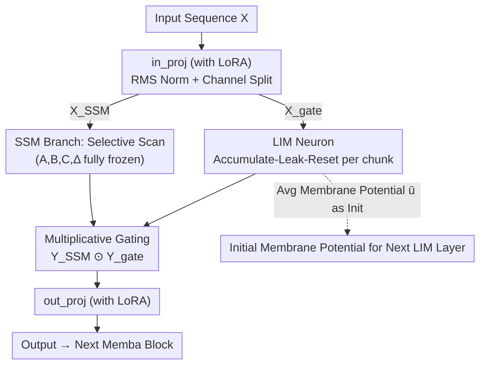

# Memba: Membrane-driven Parameter-Efficient Fine-Tuning for Mamba

**Conference**: ICLR 2026  
**arXiv**: [2506.18184](https://arxiv.org/abs/2506.18184)  
**Code**: [GitHub](https://github.com/Intelligent-Computing-Lab-Panda/Memba)  
**Area**: Model Compression  
**Keywords**: Mamba, PEFT, Membrane Potential, Leaky Integrate, State Space Models

## TL;DR
Memba is proposed as a parameter-efficient fine-tuning method inspired by biological neuron membrane potentials. By introducing Leaky Integrate Membrane (LIM) neurons into the Mamba gating branch to achieve temporal adaptation, combined with LoRA placement optimization and cross-layer membrane transmission, it outperforms existing Mamba PEFT methods on language and vision tasks with minimal parameters.

## Background & Motivation
State Space Models (SSM) / Mamba replace the attention mechanism of Transformers with linear complexity. As model scales increase, PEFT becomes essential. However, existing PEFT methods directly migrate from Transformers to Mamba, ignoring the unique temporal processing dynamics of SSMs:

**Limitations of Prior Work**:
1. Mamba's gating mechanism is a simple linear transformation + SiLU, lacking the multi-gate temporal control capabilities found in LSTM/GRU.
2. Directly fine-tuning core SSM components (A, B, C, Δ in selective scanning) leads to performance degradation (verified by existing research).
3. **Key Challenge**: How to introduce temporal adaptation without disrupting the balanced dynamics of pre-trained SSMs?

**Core Idea**: Introduce biologically inspired Leaky Integrate Membrane neurons into the Mamba gating branch (rather than the SSM branch). LIM neurons naturally provide temporal selective memory through accumulation-leak-reset dynamics of membrane potentials, without requiring additional learnable parameters.

## Method

### Overall Architecture
Ours aims to perform parameter-efficient fine-tuning for Mamba without destroying the pre-trained SSM balance dynamics. The approach modifies only three components while keeping the selective scanning (A, B, C, Δ) responsible for temporal modeling completely frozen. Specifically, the input is projected via `in_proj` and normalized, then split into an SSM branch and a gating branch. The SSM branch proceeds with frozen selective scanning as usual, while the gating branch incorporates a Leaky Integrate Membrane (LIM) neuron to grant it LSTM/GRU-like temporal selection. The two branches are merged via multiplicative gating and passed through `out_proj`. Learnable parameters are introduced only via LoRA on the `in_proj` and `out_proj` information bottlenecks. Finally, the average membrane potential accumulated in each LIM layer is passed to the next layer to ensure temporal context is preserved across depth. In this path, only the two LoRA modules modify pre-trained weights; all other membrane dynamics involve no additional learnable parameters.

### Key Designs

**1. Leaky Integrate Membrane (LIM) Neuron: Adding Temporal Selective Memory to the Gating Branch**

Mamba's gating originally consists of "linear transformation + SiLU," lacking the cross-step gating memory of LSTM/GRU. LIM segments the input sequence into $T$ equal-sized chunks processed sequentially. The membrane potential of each chunk evolves through accumulation, leakage, and reset: $\mathbf{u}[i+1]^l = r(\tau \mathbf{u}[i]^l + \mathbf{W}^l X[i])$, where the threshold function $r(x)=0$ (when $x>V_{th}$), otherwise $r(x)=x$. The leak rate $\tau\in(0,1]$ determines the decay speed of old potentials, and $V_{th}$ is the reset threshold. This dynamic naturally achieves selective information retention: features on critical paths produce significant peaks in membrane potential, while irrelevant baseline potentials leak and decline as chunks progress, replicating SSM preference for recent tokens. This mechanism introduces no extra learnable parameters.

Theorem 1 in the paper further decomposes this utility: the mean component of the membrane potential integrates temporal context through leakage dynamics, while its volatility component acts as a bounded regularization term $\mathcal{R}(\mathbf{y}_t, \bar{\mathbf{u}}_t) \leq \frac{\gamma}{2} \cdot \lambda_{\max} \cdot \epsilon^2$, smoothing the loss surface and explaining why LIM also suppresses overfitting.

**2. LoRA Placement Optimization: Parameters Only at Information Bottlenecks**

The placement of LoRA within Mamba projections is critical. Ablation results show that `in_proj` and `out_proj` are the most influential; removing them results in performance drops of 1.2% and 0.8% respectively, while removing `dt_proj` or `x_proj` has negligible impact. This is because `in/out` projections serve as information bottlenecks; tuning them efficiently alters representations. Conversely, `dt` and `x` are internal SSM parameters whose modification disrupts selective scanning balance. Thus, Memba applies LoRA only to `in_proj` + `out_proj`—using minimal parameters to outperform full fine-tuning.

**3. Cross-layer Membrane Potential Transmission: Preserving Context Across Depth**

LIM operates independently per layer, which risks losing temporal context accumulated in shallower layers. Memba addresses this by taking the average membrane state $\bar{\mathbf{u}}^l = \frac{1}{T}\sum_{i=1}^T \mathbf{u}^l[i]$ after processing all chunks in layer $l$, and using it as the initial potential for the first chunk of layer $l+1$: $\mathbf{u}^{l+1}[1] = \bar{\mathbf{u}}^l$. Using the mean instead of the final state prevents information loss from focusing solely on the sequence tail.

## Key Experimental Results

### Main Results (Commonsense Reasoning, Mamba-130M)

| Method | #Params(%) | BoolQ | PIQA | SIQA | HellaS | WinoG | ARC-e | ARC-c | OBQA | Avg |
|------|-----------|-------|------|------|--------|-------|-------|-------|------|-----|
| Full FT | 100 | 56.1 | 65.3 | 38.7 | 35.3 | 52.0 | 46.4 | 25.7 | 32.8 | 43.8 |
| SLL LoRA | 1.45 | 56.3 | 63.3 | 38.2 | 34.6 | 51.6 | 43.5 | 23.6 | 30.6 | 42.7 |
| LoRA (in_proj) | 2.23 | 53.5 | 62.9 | 38.2 | 33.8 | 53.1 | 46.4 | 23.7 | 30.8 | 42.8 |
| LoRAp (X) | 2.67 | 61.7 | 64.0 | 39.5 | 34.3 | 52.2 | 43.5 | 25.3 | 29.4 | 43.7 |
| **Memba (in+out)** | **5.20** | **58.8** | **65.8** | **40.1** | **34.7** | 51.6 | 47.7 | **24.7** | **31.2** | **44.3** |

### Ablation Study

| Configuration | Avg Acc(%) | Description |
|------|-----------|-----------|
| All projectors LoRA | 43.9 | All projection layers |
| -dt_proj | 43.9 | Minimal impact from removing dt |
| -x_proj | 43.7 | Small impact from removing x |
| -out_proj | 43.1 | Output projection is important |
| -in_proj | 42.7 | Input projection is most critical |
| Memba vs Full FT (790M) | Memba Higher | PEFT outperforms full fine-tuning |
| Memba vs Full FT (1.4B) | Memba Higher | Full fine-tuning prone to overfitting |

### Key Findings
- Memba outperforms full fine-tuning with only 5.2% parameters (consistent across 130M/790M/1.4B scales), as full fine-tuning is prone to overfitting.
- Visualization of LIM membrane potentials clearly shows peaks for key features and progressive decay across chunks.
- `in_proj` and `out_proj` are critical locations for Mamba PEFT; SSM components (`dt_proj`, `x_proj`) are unsuitable for tuning.
- Cross-layer membrane transmission improves performance by approximately 0.5%, becoming more significant in deeper networks.

## Highlights & Insights
- The biologically inspired LIM design is naturally complementary to Mamba’s SSM: SSM handles linear sequence processing, while LIM (in the gating branch) provides non-linear temporal selectivity.
- The "Don't touch SSM" design philosophy is compelling: research confirms that direct SSM fine-tuning leads to degradation.
- The chunking strategy for membrane potentials elegantly solves efficiency issues when processing long sequences token-by-token.
- Theoretical regularization analysis provides an explanation for the beneficial role of membrane potential volatility.

## Limitations & Future Work
- Chunk size and high-level $T$ are hyperparameters requiring tuning.
- Sensitivity to the LIM neuron leak factor $\tau$ and threshold $V_{th}$ warrants further attention.
- The method has not been validated on the latest Mamba-2 architecture.
- Evaluations on vision tasks are limited to VTAB-1k, lacking large-scale vision benchmarks.

## Related Work & Insights
- **vs SLL LoRA**: Memba provides better temporal processing via LIM, achieving a 1.6% higher average accuracy.
- **vs Affix-tuning**: Achieves better performance with 5.2% parameters compared to 64.6%.
- **vs Full FT**: Avoids overfitting, making PEFT superior in these scenarios.

## Rating
- Novelty: ⭐⭐⭐⭐⭐ The combination of biological membrane potentials with SSM is a novel direction.
- Experimental Thoroughness: ⭐⭐⭐⭐ Multi-scale language and vision evaluation, though missing large-scale benchmarks.
- Writing Quality: ⭐⭐⭐⭐ Clear structure with intuitive membrane potential visualizations.
- Value: ⭐⭐⭐⭐ Opens a new biologically inspired route for PEFT in the Mamba era.

<!-- RELATED:START -->

## Related Papers

- [\[ICLR 2026\] PiCa: Parameter-Efficient Fine-Tuning with Column Space Projection](pica_parameter-efficient_fine-tuning_with_column_space_projection.md)
- [\[ICLR 2026\] SumRA: Parameter Efficient Fine-Tuning with Singular Value Decomposition and Summed Orthogonal Basis](sumra_parameter_efficient_fine-tuning_with_singular_value_decomposition_and_summ.md)
- [\[ICLR 2026\] TRAC: Tensor-Train Based Across-Layer Compression for Parameter-Efficient Fine-Tuning](trac_tensor-train_based_across-layer_compression_for_parameter-efficient_fine-tu.md)
- [\[ICML 2025\] Parameter-Efficient Fine-Tuning of State Space Models](../../ICML2025/model_compression/parameter-efficient_fine-tuning_of_state_space_models.md)
- [\[ICLR 2026\] Efficient Orthogonal Fine-Tuning with Principal Subspace Adaptation](efficient_orthogonal_fine-tuning_with_principal_subspace_adaptation.md)

<!-- RELATED:END -->
