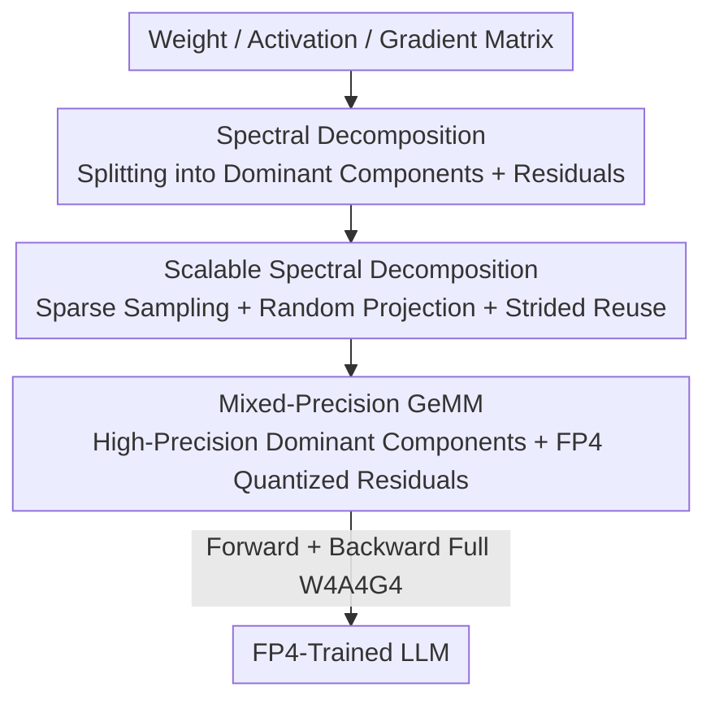

# Metis: Training LLMs with FP4 Quantization

**Conference**: ICLR 2026  
**OpenReview**: [https://openreview.net/forum?id=I2ZrCi5O84](https://openreview.net/forum?id=I2ZrCi5O84)  
**Code**: https://github.com/sii-research/Metis  
**Area**: Model Compression / Low-bit Training  
**Keywords**: FP4 Training, Spectral Domain Quantization, Anisotropy, Randomized SVD, W4A4G4

## TL;DR
Metis identifies the "anisotropy of weights/activations/gradients singular spectra" as the root cause of FP4 training failure. It proposes splitting the spectrum in the spectral domain into "a few dominant components + long-tail residuals" for separate quantization. By utilizing sparse sampling and random projection, the SVD overhead is reduced to a negligible level, enabling W4A4G4 full FP4 training on LLaMA-3 8B. The training loss is only 0.4% higher than BF16, while downstream accuracy differs by only 0.1%.

## Background & Motivation
**Background**: Numerical precision in LLM training has evolved from FP32 → BF16 → FP8. Nvidia Blackwell's NVFP4 format provides an additional 1.8× memory saving and 7× GeMM acceleration compared to FP8. Pushing training precision to FP4 is the logical next step.

**Limitations of Prior Work**: FP4 (E2M1) has only 4 bits, with exponentially narrowed dynamic range and precision. Directly applying NVFP4 block quantization (block size 16, one FP8 scaling factor per block) to train LLaMA-3 8B results in a training loss 3–4% higher than BF16 and approximately a 1% drop in downstream average accuracy, making it unusable.

**Key Challenge**: The authors discovered that the actual bottleneck is not just a general "lack of bits," but a specific structural phenomenon: **anisotropy**. Applying SVD to weights, activations, and gradients reveals that less than 3% of singular values dominate the entire spectrum (0.63% for weights, 3.15% for activations, 2.91% for gradients; consistently observed across Qwen and DeepSeek-R1 from 7B to 671B). These few large singular values stretch the matrix distribution into a long-tail distribution spanning multiple orders of magnitude. Block quantization determines scaling factors based on the "in-block maximum," systematically favoring high values and sacrificing the precision of small ones—nearly half of the small values are rounded to zero. In spectral space, this quantization bias causes significantly larger relative errors and directional perturbations for small singular components compared to large ones, leading to severe **spectral distortion**.

**Goal**: Enable all GeMMs for weights, activations, and gradients to be represented in FP4 for stable training without sacrificing accuracy.

**Core Idea**: Since the wide distribution originates from a few dominant singular components, the **spectrum should be split into narrower sub-distributions in the spectral domain for separate quantization**. The dominant subspace is preserved with high precision, while the long-tail residual is naturally narrow and quantization-friendly. The remaining challenge of "expensive repeated SVDs" is addressed via sparse random sampling and random projection.

## Method

### Overall Architecture
Metis is an FP4 training framework. The core idea is to perform a low-rank spectral decomposition for each matrix in GeMM (Weights $W$, Activations $X$, Gradients $D$), splitting it into "high-precision rank-k dominant components ($U_k S_k V_k^\top$)" + "FP4-quantized residuals." This ensures quantization only occurs on narrow distributions. This decomposition is integrated into all forward and backward GeMMs (which account for 95%+ of LLM training computation). Three techniques are used to minimize decomposition overhead: subspace estimation via sparse sampling, dimension reduction via random projection, and strided reuse of low-rank factors.

### Key Designs

**1. Spectral Domain Decomposition: Splitting Anisotropic Wide Distributions into Narrow Sub-distributions**

This directly addresses the key challenge—wide distributions are "stretched" by a few large singular values. Metis performs a rank-k approximation $M = \hat{M}_k + M_R = U_k S_k V_k^\top + M_R$ for each matrix. The dominant subspace (representing less than 3% of the distribution but dominating the high-value range) is isolated and stored in high precision. The residual $M_R$ is empirically shown to be 1–2 orders of magnitude narrower than the original matrix, making it inherently quantization-friendly. The forward GeMM is expressed as:
$$\hat{Y} = (Q_b(A_k)\Lambda_k Q_b(B_k^\top) + Q_b(X_R))(Q_b(U_k)S_k Q_b(V_k^\top) + Q_b(W_R))$$
where the quantization operator $Q_b$ is applied to all matrices except the singular values $S_k, \Lambda_k$ (which are kept in high precision). This approach is effective because each sub-distribution is much narrower than the full spectrum, reducing quantization error. Furthermore, small singular components are no longer "drowned out" by large ones, preserving directional consistency. The authors also verified that the spectrum of the residual matrix is flat—anisotropy is effectively absorbed by the low-rank branch.

**2. Scalable Spectral Decomposition: Reducing SVD Complexity from $O(lm^2)$ Using Anisotropy**

The primary hurdle for spectral domain quantization is the cost of performing full SVD at every step (especially for activations $X \in \mathbb{R}^{l\times m}$, where $l$ can reach millions). Metis leverages anisotropy itself: since only $k \ll l, m$ singular values dominate, only the dominant subspace needs estimation. The authors proved and empirically verified two "subspace-preserving" properties: **(i) Sparse Random Sampling Preservation**: Randomly sampling $l_k \ll l$ rows from the covariance $\Sigma = \frac{1}{l}X^\top X$ to compute a sample covariance. The Matrix Chernoff bound and Davis–Kahan theorem guarantee that the dominant subspace is recovered with high probability. Empirically, sampling only 1% of the sequences achieves nearly 0.9 alignment with the full-batch subspace. **(ii) Random Projection Preservation**: Dimension reduction of the hidden dimension to $k+s$ using a Gaussian test matrix $\Omega$ for sketching. Randomized SVD theory ensures that the projection error is controlled by the tail singular values, allowing accurate recovery of the dominant subspace in the reduced dimension. These two techniques reduce complexity by approximately two orders of magnitude, dropping the decomposition cost from $O(ln^2)$ to $O(l_k n k)$.

**3. Strided Temporal Reuse: Amortizing Costs by Recalculating Decomposition Every 8 Steps**

The authors observed strong **temporal stability** in the dominant spectral structure—the leading low-rank subspaces of activations and output gradients are highly aligned across adjacent training steps. Consequently, the low-rank factors from a single decomposition can be reused for several consecutive steps. In practice, the decomposition is refreshed every 8 steps, further reducing the amortized overhead. Combined, the additional per-step overhead of Metis is $O(lmk + mnk + lnk + l_k mk + l_k nk)$. Compared to the baseline $O(lmn)$, this is asymptotically negligible, allowing it to scale to modern LLMs. Custom low-rank spectral decomposition operators further reduce end-to-end overhead.

### Loss & Training
All FP4 training uses W4A4G4: weights, activations, and gradients are in E2M1 NVFP4 format. **Stochastic rounding** is enabled by default to mitigate quantization bias (orthogonal to Metis). The rank for low-rank approximation is fixed at 1.5% (sensitivity analysis shows this is sufficient), and decompositions are refreshed every 8 steps. Main experiments were conducted using BF16 to simulate NVFP4.

## Key Experimental Results

### Main Results
Trained on LLaMA-3 8B / GPT-2 using 100B tokens of the DCLM dataset. Downstream tasks include QA (ARC/RACE/BoolQ), classification (HellaSwag/PIQA), and cloze (LAMBADA).

| Model | Method | Training Loss gap vs BF16 | Downstream average gap vs BF16 |
|------|------|------|------|
| LLaMA-3 8B | NVFP4 Direct Quantization | +3~4% | -1% |
| LLaMA-3 8B | **NVFP4 + Metis** | **+0.4%** | **-0.1%** |
| GPT-2 130M | BF16 (Baseline) | — (loss 3.23) | — (avg 41.4) |
| GPT-2 130M | NVFP4 | +loss 0.09 (3.32) | -0.6 (40.8) |
| GPT-2 130M | **NVFP4 + Metis** | **Slightly lower than BF16 (3.20)** | **Slightly higher than BF16 (41.5)** |

### Ablation Study

| Configuration | Observation | Explanation |
|------|------|------|
| rank = 1.5% | Maintains performance | 1.5% is sufficient to preserve the dominant subspace. |
| Sampling Rate 1% | Subspace Alignment ≈0.9 | Sparse sampling is sufficient for accurate subspace estimation. |
| Refresh every 8 steps | No performance drop | Temporal stability supports strided reuse. |
| Residual Spectral Test | Spectrum flattens | Anisotropy is absorbed by the low-rank branch; residuals do not recur. |

### Key Findings
- **Anisotropy is the unified root cause of FP4 training failure**: Across weights from 7B to 671B models (Qwen, DeepSeek-R1), less than 3% of singular values dominate. The wide distribution is a direct consequence—this is the core observation of the paper.
- **Metis matches or even exceeds BF16**: On GPT-2, both training loss and downstream accuracy were slightly better than BF16. The authors attribute this to the separation of low-rank/residual branches reducing interference between feature subspaces.
- **Direct NVFP4 failure is more pronounced in larger models like LLaMA-3** (3–4% loss gap). The gap is smaller in small models, suggesting that the harm of anisotropy increases with scale, further highlighting Metis's value.

## Highlights & Insights
- **Grounds "low-bit training difficulty" in a measurable structural phenomenon**: Moving beyond vague claims like "FP4 range is insufficient," it identifies Anisotropy + Spectral Distortion and establishes a clear causal chain: "few large singular values widen distribution → block quantization favors large values → spectral distortion of small singular components."
- **Uses anisotropy as both the diagnosis and the cure**: The fact that only a few components dominate is the source of the problem, but it also makes the "estimation of only dominant subspaces" possible. This makes spectral domain quantization feasible at LLM scale—an elegant solution where the "illness" provides the "remedy."
- **Transferable cost reduction techniques**: The combination of sparse sampling for subspace estimation, random projection for dimension reduction, and strided reuse of low-rank factors offers a template for any method requiring repeated SVD/PCA during training.

## Limitations & Future Work
- **Main experiments rely on BF16 simulation of NVFP4**: End-to-end acceleration and numerical behavior on real FP4 hardware (Blackwell Tensor Cores) still require empirical validation.
- **Introduction of low-rank branches and decomposition operators**: While asymptotic overhead is negligible, custom operators are needed to keep constant factors low. Optimal hyperparameters like rank, sampling rate, and refresh stride may vary by model or data.
- **Validation limited to 100B tokens**: Whether the temporal stability of the dominant subspace holds over longer training runs (trillions of tokens) and whether strided reuse remains safe deserves further investigation.

## Related Work & Insights
- **vs. NVIDIA NVFP4 recipe**: Both use FP4 block quantization, but the NVFP4 recipe determines scaling factors based on block maximums, causing spectral distortion in anisotropic matrices. Metis isolates the dominant subspace first, resulting in better training loss, downstream accuracy, and lower overhead.
- **vs. FP8 Training (Micikevicius/Peng/Perez)**: FP8 range is relatively lenient, and anisotropy is tolerable. With FP4's tighter constraints, explicit handling of the spectral structure via Metis becomes necessary.
- **vs. Low-rank/Spectral Methods (e.g., GaLore series)**: Both utilize low-rank structures, but Metis aims to narrow distributions for quantization rather than saving optimizer memory. It also uses sampling+projection to amortize the cost of SVD.

## Rating
- Novelty: ⭐⭐⭐⭐⭐ Identifies anisotropy as the root cause of FP4 failure and designs spectral domain quantization accordingly.
- Experimental Thoroughness: ⭐⭐⭐⭐ Significant scale with LLaMA-3 8B/100B tokens and complete ablations, though main results are simulated without real-hardware end-to-end tests.
- Writing Quality: ⭐⭐⭐⭐⭐ Clear causal reasoning, seamlessly moving from phenomenon to analysis, method, and validation.
- Value: ⭐⭐⭐⭐⭐ If FP4 training proves viable, it will significantly reduce costs; Metis pushing the gap down to 0.4% is a critical step.

<!-- RELATED:START -->

## Related Papers

- [\[ICLR 2026\] SliderQuant: Accurate Post-Training Quantization for LLMs](sliderquant_accurate_post-training_quantization_for_llms.md)
- [\[ICLR 2026\] Towards Quantization-Aware Training for Ultra-Low-Bit Reasoning LLMs](towards_quantization-aware_training_for_ultra-low-bit_reasoning_llms.md)
- [\[ICLR 2026\] Bridging the Gap Between Promise and Performance for Microscaling FP4 Quantization](bridging_the_gap_between_promise_and_performance_for_microscaling_fp4_quantizati.md)
- [\[ICLR 2026\] Training Dynamics Impact Post-Training Quantization Robustness](training_dynamics_impact_post-training_quantization_robustness.md)
- [\[ICLR 2026\] Post-Training Quantization for Video Matting](post-training_quantization_for_video_matting.md)

<!-- RELATED:END -->
