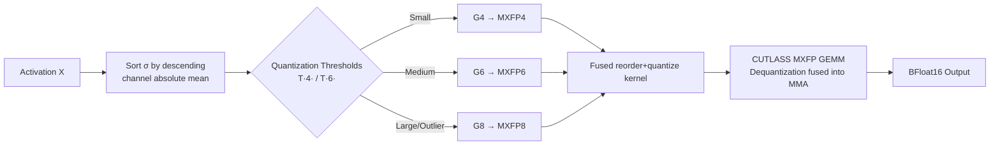

# MicroMix: Efficient Mixed-Precision Quantization with Microscaling Formats for Large Language Models

**Conference**: ICLR 2026  
**OpenReview**: [https://openreview.net/forum?id=P5OKoZdwlB](https://openreview.net/forum?id=P5OKoZdwlB)  
**Code**: [https://github.com/lwy2020/MicroMix](https://github.com/lwy2020/MicroMix)  
**Area**: Model Compression / LLM Quantization  
**Keywords**: Mixed-precision quantization, Microscaling (MX) formats, MXFP4/6/8, Blackwell FP4 Tensor Core, Hardware-algorithm co-design  

## TL;DR
MicroMix implements weight-activation quantization for LLMs based on NVIDIA Blackwell's MXFP4/MXFP6/MXFP8 microscaling formats. It adaptively assigns 4/6/8 bits to activation channels based on a "quantization error threshold" per layer. Supported by a fused CUTLASS GEMM kernel that integrates reordering, quantization, and dequantization, it achieves near FP16 accuracy at an average precision of approximately 5 bits, while providing a 2.3–3.4x speedup over FP16.

## Background & Motivation
**Background**: LLM quantization has progressed from W8A8 to W4A4. The mainstream approach follows the INT4 path (e.g., QuaRot, Atom, FlatQuant), utilizing rotation, smoothing, or mixed precision to suppress activation outliers.

**Limitations of Prior Work**: The INT4 path faces two major obstacles. First, grouped integer quantization requires dequantizing each integer group into floating-point before partial sum accumulation. Since INT8 Tensor Cores only support INT32 accumulation, dequantization must execute on the slower CUDA Cores, reducing throughput. Second, the Blackwell architecture's new FP4 Tensor Core offers 4x the throughput of FP16 and 2x the throughput of FP8/INT8, but existing INT quantization kernels are fundamentally incompatible with its data format, wasting this hardware benefit.

**Key Challenge**: To leverage FP4 Tensor Core speeds, FP-based (MX) formats must be used instead of INT. However, pure MXFP4 lacks sufficient accuracy, and post-training quantization (PTQ) for MX formats—particularly regarding the threshold for constraining outliers—remains under-researched. Existing mixed-precision methods (like Atom) apply a fixed number of high-precision channels across all layers, failing to adapt to the highly divergent activation distributions of different layers.

**Goal**: To develop a mixed-precision quantization scheme with hardware-algorithm co-design that achieves both high accuracy and speed using MX formats on Blackwell.

**Core Idea**: **Error-threshold-driven layer-wise adaptive bitwidth allocation.** An explicit quantization threshold is used to partition activation channels into three groups: "sufficient at low bitwidth," "requires medium bitwidth," and "requires high bitwidth." The optimal ratio of 4/6/8 bits is calculated per layer, channels of the same precision are reordered into contiguous blocks, and a GEMM kernel is provided to fuse reordering, quantization, and dequantization into the MMA operation.

## Method

### Overall Architecture
MicroMix partitions the activation channels of each linear layer into three groups, $G_4, G_6, G_8$, quantized to MXFP4, MXFP6, and MXFP8 respectively. Corresponding weight channels are quantized to the same bitwidths. The grouping is based on "quantization thresholds" obtained through offline calibration. The algorithmic side determines the bitwidth for each channel, while the kernel side ensures efficient computation of heterogeneous precision channels.

### Key Designs

**1. Error Threshold: Explicitly defining outlier boundaries.** This is the anchor of the work. Given a block maximum $\max(|X_i|)$, the MX block-shared scale factor is $s = 2^{\lfloor \log_2(\max(|X_i|))\rfloor - b}$, and the element-wise quantization error is $E(X_j) = \gamma \cdot s$ (where $\gamma$ is the rounding error). The design goal is to ensure the error of low-bit formats does not exceed the upper bound of INT8 error, i.e., $E(X)_{\text{MXFP}\{4,6\}} \le E(X)_{\text{INT8}}$. Solving for the maximum magnitude threshold $T(n)$ that a channel can tolerate at bitwidth $n$:

$$T(n) = \frac{2^b \cdot 2^{n-1}}{q_{\max}} \cdot E(X)_{\text{INT8}}$$

where $q_{\max}$ is the maximum representable value of the target format and $b$ is the exponent bias. The grouping rules follow: $G_4=\{X \le T(4)\}$, $G_6=\{T(4)<X\le T(6)\}$, and $G_8=\{T(6)<X\}$. Channels with larger magnitudes are promoted to higher precision, keeping MXFP4 errors within controllable bounds. This addresses the lack of clarity in prior work regarding MXFP4/6 outlier thresholds.

**2. Permutation + Layer-wise Adaptive Ratios: Regularizing low-error grouping via channel sorting.** From $E(X_j)=\gamma s$, error reduction fundamentally depends on reducing the maximum value within each block. Thus, it is ideal to cluster large values together and small values together. Channels are sorted by absolute mean $M^k_i = \frac{1}{L}\sum_i |X^k_{:,i}|$ to obtain permutation $\sigma^k$, then partitioned using the thresholds into ratios $p_4^k, p_6^k, p_8^k$. Statistics on Llama3.1-8B reveal: ratios change dynamically per layer (validating adaptive allocation), $p_4$ generally exceeds 50% (enabling FP4 dominance), and ratios are highly stable across different datasets/samplings. Due to this stability, $\{p_4^k, p_6^k, p_8^k, \sigma^k\}$ are **precomputed offline** to avoid online overhead.

**3. Fused reorder-and-quantize and MXFP GEMM Kernels: Enforcing hardware regularity for heterogeneous precision.** If mixed-precision quantization were applied directly after partitioning, it would cause irregular memory access and massive overhead. MicroMix reorders same-precision channels into contiguous blocks (similar to Atom/RPTQ) but goes further by fusing reordering and quantization into a single kernel (weight reordering is offline; activation is online). For GEMM, it utilizes CUTLASS MXFP GEMM: after loading input fragments and scale factors into Shared/Tensor Memory, **dequantization is fused directly into MMA instructions** on Tensor Cores. FP32 partial sums are accumulated into BFloat16 results. Different data types invoke corresponding GEMM kernels with zero additional dequantization overhead.

## Key Experimental Results

### Main Results
On Llama3.1-8B and Qwen2.5-32B, compared against six baselines (lm-eval):

| Model | Method | Avg.Bits | 0-shot Mean (↑) | MMLU 5-shot (↑) | WikiText2 PPL (↓) |
|------|------|---------|----------------|----------------|------------------|
| Llama3.1-8B | FP16 | 16.00 | 73.03 | 65.24 | 6.24 |
| | QuaRot | 4.12 | 68.00 | 55.23 | 6.98 |
| | Atom | 4.25 | 68.76 | 58.05 | 6.79 |
| | FlatQuant | 4.19 | 70.97 | 61.33 | 6.95 |
| | AMXFP4 | 5.00 | 66.34 | 53.79 | 7.49 |
| | **Ours** | 5.51 | **71.56** | **62.65** | **6.72** |
| Qwen2.5-32B | FP16 | 16.00 | 75.55 | 83.32 | 5.02 |
| | FlatQuant | 4.71 | 74.72 | 81.52 | 5.74 |
| | AMXFP4 | 5.00 | 73.64 | 79.96 | 5.85 |
| | **Ours** | 5.22 | **75.20** | **81.79** | **5.56** |

Ours is the only method to maintain $\ge 98\%$ of FP16 accuracy across both models in 0-shot tasks. On MMLU, it maintains $\ge 96\%$ FP16 accuracy and outperforms all competitors by $\ge 1.32$ points on Llama. Notably, QUIK and INT6 show lower accuracy despite using more bits, suggesting higher bitwidth does not always guarantee better precision.

### Ablation Study
- **MoE Models (Mixtral-8x7B-Instruct)**: Mean score 78.58 $\rightarrow$ 78.20 (only 0.38 drop), execution time 5m18s $\rightarrow$ 2m03s.
- **Mathematics (Qwen2.5-Math-7B-Instruct, Avg.Bits 5.16)**: Mean 87.2 $\rightarrow$ 83.8, with GSM8K/MATH/CMATH retaining $\ge 98.4\%$ FP16 performance.
- **Code (Qwen2.5-Coder-14B/32B)**: Accuracy comparable to or better than INT8, with $\le 1.5\%$ degradation relative to FP16.

### Key Findings
- **Efficiency**: Compared to TensorRT-FP16, the kernel achieves 2.45–2.93x speedup on RTX 5070Ti and 2.29–3.38x on RTX 5090. End-to-end Transformer speedup is 1.98–2.02x vs FP16. Decoding throughput on RTX PRO 6000 is at least 1.82x that of INT4 baselines.
- **Near-lossless**: Qwen2.5-32B (Base and Coder) achieves near-lossless performance at ~5.2 bits across 0-shot, code, and math benchmarks.
- **Zero Overhead for Fused Kernels**: Fused reorder+quantize adds negligible latency compared to standard mixed-precision quantization.

## Highlights & Insights
- **Quantifying Bitwidth Selection**: Transforming "how many bits to use" into a calculable error inequality ($E_{\text{MXFP}\{4,6\}} \le E_{\text{INT8}}$) provides a definitive criterion for bitwidth allocation rather than relying on heuristics, filling a research gap in MX format outlier thresholds.
- **Algorithm Gains from Hardware Evolution**: The authors leverage Blackwell’s FP4 Tensor Core and native microscaling support. This shifts "fine-grained grouping" from a painful accuracy-overhead trade-off to a practical solution—dequantization happens directly on Tensor Cores, a structural advantage inaccessible to the INT path.
- **Offline Stability**: The observation that $p_4/p_6/p_8$ ratios are stable across datasets allows expensive online grouping to be replaced by offline calibration, which is highly practical for engineering.

## Limitations & Future Work
- The threshold derivation uses INT8 error as an anchor, essentially treating INT8 as a proxy for acceptable accuracy. Whether this anchor holds for extreme distributions where INT8 fails is an open question.
- The method is deeply coupled with Blackwell MXFP Tensor Cores; benefits on older architectures without native MX support will be significantly diminished.
- At an average of ~5.2 bits, there is still a gap in storage and bandwidth compared to pure 4-bit schemes. Sensitivity to calibration data and robustness under online distribution shifts are not extensively discussed.

## Related Work & Insights
- **Weight-Activation Quantization Taxonomy**: From W8A8 (LLM.int8, SmoothQuant) to the W4A4 rotation/smoothing routes (QuaRot, Atom, FlatQuant), MicroMix diverges by switching to MX floating-point formats to utilize FP4 Tensor Cores.
- **Mixed-Precision Allocation**: MicroMix's layer-wise adaptive ratios directly improve upon Atom's layer-fixed high-precision channel count.
- **MX Formats and Kernels**: AMXFP4 serves as the MX baseline. The CUTLASS MXFP GEMM and channel reordering (from Atom/RPTQ) form the basis of the kernel design. The insight for future work is: **Algorithmic design should closely follow the evolution of hardware numerical formats.** When hardware natively supports block-scaled floats, old tricks designed to bypass hardware limits can be replaced by more direct solutions.

## Rating
- **Novelty**: ⭐⭐⭐⭐ — Solving error inequalities for explicit thresholds and co-designing with Blackwell MXFP kernels fills a gap in MX PTQ with clear logic.
- **Experimental Thoroughness**: ⭐⭐⭐⭐ — Covers Llama/Qwen/Mixtral across 0-shot, math, and code tasks, providing kernel and end-to-end speedups across three Blackwell GPUs.
- **Writing Quality**: ⭐⭐⭐⭐ — Clear motivation-method-experiment flow; threshold derivation and ratio statistics are well-supported.
- **Value**: ⭐⭐⭐⭐ — Provides a practical quantization scheme that fully utilizes FP4 compute in the Blackwell era; open-sourced and highly deployable.

<!-- RELATED:START -->

## Related Papers

- [\[ICLR 2026\] Is Finer Better? The Limits of Microscaling Formats in Large Language Models](is_finer_better_the_limits_of_microscaling_formats_in_large_language_models.md)
- [\[ICLR 2026\] Channel-Aware Mixed-Precision Quantization for Efficient Long-Context Inference](channel-aware_mixed-precision_quantization_for_efficient_long-context_inference.md)
- [\[ICLR 2026\] STaMP: Sequence Transformation and Mixed Precision for Low-Precision Activation Quantization](stamp_sequence_transformation_and_mixed_precision_for_low-precision_activation_q.md)
- [\[ICLR 2026\] PM-KVQ: Progressive Mixed-Precision KV Cache Quantization for Long-CoT LLMs](pm-kvq_progressive_mixed-precision_kv_cache_quantization_for_long-cot_llms.md)
- [\[ICLR 2026\] Tequila: Trapping-free Ternary Quantization for Large Language Models](tequila_trapping-free_ternary_quantization_for_large_language_models.md)

<!-- RELATED:END -->
