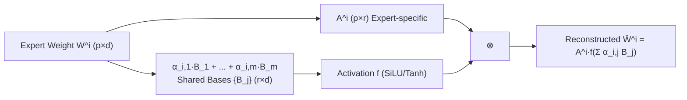

# MoBE: Mixture-of-Basis-Experts for Compressing MoE-based LLMs

**Conference**: ICLR 2026  
**OpenReview**: [https://openreview.net/forum?id=8RV6H50OSf](https://openreview.net/forum?id=8RV6H50OSf)  
**Code**: TBD  
**Area**: Model Compression / MoE Compression  
**Keywords**: Mixture-of-Experts, Model Compression, Matrix Decomposition, Basis Matrices, Reconstruction Error  

## TL;DR
MoBE decomposes the up/gate matrices of MoE experts into a rank decomposition $W=AB$, where the larger $B$ is represented as a linear combination of a **small set of shared basis matrices** across all experts in a layer. By minimizing reconstruction error alone, it compresses trillion-parameter MoEs like DeepSeek-V3 and Kimi-K2 by 24%–30% with an accuracy drop of only 1%–2%.

## Background & Motivation
**Background**: MoE architectures utilize sparse activation to scale LLMs easily to hundreds of billions or even trillions of parameters (e.g., DeepSeek-V3-0324 671B, Kimi-K2-Instruct 1T). While computationally efficient for inference, the **total parameter count** creates extreme memory and storage pressure—even 8×H100 systems struggle with efficient deployment.

**Limitations of Prior Work**: Existing MoE compression follows two paths, both with drawbacks. ① **Expert Pruning/Merging** (NAEE, STUN, MC-SMoE) directly removes or merges experts, leading to a permanent loss of specialized knowledge and significant accuracy drops. ② **Matrix Decomposition** (D2-MoE, MoLAE) uses SVD to lower the rank of expert weights. However, empirical tests show that the **effective rank of expert weight matrices often exceeds the SVD compression threshold**; forcing a reduction in rank compromises expressiveness, resulting in high reconstruction MSE and a 7%–14% relative drop in downstream accuracy.

**Key Challenge**: Reducing total parameters requires shared or low-rank weights, but a fundamental conflict exists between the low-rank assumption of SVD and the high effective rank of expert weights—aggressive compression leads to severe information loss.

**Goal**: To significantly reduce total parameters while keeping accuracy loss to a minimum (1%–2%).

**Core Idea (Shared Bases + Expert-Specific Transformation + Non-linearity)**: Instead of performing low-rank SVD on each expert individually, all experts within a layer **share a set of basis matrices** $\{B_j\}$. Each expert only learns a small specific transformation $A_i$ and a set of combination coefficients $\alpha_{i,j}$. Furthermore, non-linear activations are introduced to enhance expressiveness. The decomposition is learned by **minimizing reconstruction error via gradient descent** in a completely data-free manner.

## Method

### Overall Architecture
MoBE converts a standard MoE layer into a more parameter-efficient equivalent: the up/gate matrix $W^i\in\mathbb{R}^{p\times d}$ of each expert is decomposed into an expert-specific $A^i$ multiplied by $B^i$, which is a linear combination of shared basis matrices followed by an activation function. The down matrices remain unchanged as they store critical knowledge and are difficult to compress. The conversion is performed layer-by-layer and independently by type (gate/up), using Adam to minimize reconstruction error against the original weights without requiring calibration data.

### Key Designs

**1. Shared Basis Matrix Decomposition: Replacing "per-expert low-rank" with "layer-wide shared bases" to overcome the SVD rank bottleneck.** The standard approach decomposes each expert's $W^i$ independently as $W^i=A^iB^i$, but $B^i$ still grows linearly with the number of experts. MoBE's key innovation is reparameterizing $B^i$ for all experts as a convex combination of $m$ shared basis matrices within the same layer: $B^i=\sum_{j=1}^{m}\alpha_{i,j}B_j$, where $\alpha_{i,j}\ge 0,\ \sum_j\alpha_{i,j}=1$. The $\{B_j\in\mathbb{R}^{r\times d}\}$ are shared across the layer, while $\{\alpha_{i,j}\}$ are expert-specific. Since $m\ll n$ (e.g., 16 bases for 128 experts), the parameters of the shared $B$ are significantly amortized, and the expert-specific $A^i$ remains small. Intuitively, the shared bases capture **common information** across the layer, while $\alpha$ and $A^i$ encode **individual expert characteristics**, fitting the "high effective rank" structure better than simple rank reduction.

**2. Factorization with Non-linear Activation: Using bipolar activations to compensate for low-rank loss.** A purely linear combination is still limited by rank. MoBE applies a non-linear function $f$ after the basis combination, resulting in the final factorization $\hat{W}^i=A^if(\sum_{j=1}^{m}\alpha_{i,j}B_j)$. The paper proves in the Appendix that this is more expressive than pure SVD. The choice of activation is critical: ReLU leads to excessive sparsity in $B^i$ and high information loss that the small $A^i$ cannot compensate for, while Sigmoid's unipolarity is also suboptimal. Therefore, **bipolar** activations—such as Tanh/SiLU/GeLU which output both positive and negative values—are required. SiLU and Tanh were ultimately selected for their balance between performance and computation.

**3. Reconstruction Error-Driven Conversion + Z-score Normalization for Stable Optimization.** The conversion objective is to minimize $\min_{A^i,B_j,\alpha_{i,j}}\sum_{i=1}^{n}\lVert W^i-A^if(\sum_j\alpha_{i,j}B_j)\rVert^2$ layer by layer. In practice, Adam (learning rate 0.07, up to 50k epochs, patience 2000 early stopping) is much more stable than Alternating Optimization (AO). Given the wide range of expert weight values, MoBE applies Z-score normalization $W_Z^i=(W^i-\mu_W)/\sigma_W$ to all expert weights in a layer before learning the bases. A notable advantage is **zero extra inference overhead**: $\sigma_W$ can be folded into $A^i$ ($\sigma_W A^i$), and since $\mu_W$ is empirically small enough to be ignored (Table 2), even the bias term can be omitted.

**4. Parameter Complexity Analysis and MoBE† Activation Compensation.** Total parameters for a MoBE layer are $ndp+2npr+2mrd$ (down + transformation $A$ + bases $B$). The ratio to standard MoE ($3ndp$) is $\gamma=\frac{1}{3}+\frac{2r}{3d}+\frac{2mr}{3np}$. Since $r\le p<\frac{1}{2}d$ and $m\ll n$, $\gamma<1$ is guaranteed, providing compression. However, **activation parameters may increase** (due to $A$ introducing an additional $2kpr$). To compensate, the authors proposed a variant **MoBE†**: during inference, the number of active experts is reduced from $k=8$ to $k'=6$. This trade-off recovers compute efficiency, and empirically, MoBE† shows a smaller total accuracy loss (0.5%) than MoBE (1.4%).

## Key Experimental Results

### Main Results
Comparison with D2-MoE and MoLAE across 6 open-source MoEs on 15 benchmarks (Average score: Avg):

| Model | Method | Compression Rate | Avg |
|------|------|--------|-----|
| Ling-Lite-Chat | MoE (Orig) | 0% | 59.7 |
|  | D2-MoE | 14% | 53.1 |
|  | MoLAE | 12% | 55.3 |
|  | **MoBE** | 16% | **58.6** |
| Qwen3-30B-A3B-2507 | MoE (Orig) | 0% | 78.6 |
|  | D2-MoE | 24% | 66.4 |
|  | MoLAE | 24% | 67.5 |
|  | **MoBE** | 24% | **75.8** |
| DeepSeek-V3-0324 (671B) | MoE (Orig) | 0% | 79.3 |
|  | MoLAE | 30% | 73.1 |
|  | **MoBE** | 30% | **78.0** |
| Qwen3-235B-A22B-2507 | MoE (Orig) | 0% | 81.5 |
|  | MoLAE | 24% | 73.2 |
|  | **MoBE** | 24% | **80.9** |
| Kimi-K2-Instruct (1T) | MoE (Orig) | 0% | 82.4 |
|  | MoLAE | 24% | 76.6 |
|  | **MoBE** | 24% | **81.1** |

MoBE's advantage is more pronounced in larger models, leading baselines by 4%–8% in accuracy. For trillion-parameter models, compressing 24%–30% results in only a 1%–2% drop (relative drop of ~2%). D2-MoE could not run on the largest models due to backpropagation overhead on 8×H100.

### Ablation Study

| Ablation Dimension | Setting | Conclusion |
|----------|------|------|
| Activation Function | none / Tanh / GeLU / SiLU / Sigmoid / ReLU | ReLU's MSE is an order of magnitude higher; Sigmoid is worse than no activation; Tanh/GeLU/SiLU are optimal (SiLU & Tanh chosen). |
| Z-score Normalization | w/ vs w/o | Normalized layers show significantly lower MSE and more stable optimization. |
| Active Experts | MoBE (k=8) vs MoBE† (k'=6) | MoBE† accuracy loss (0.5%) < MoBE (1.4%), and it compensates for the increase in active parameters. |

### Key Findings
- In terms of reconstruction error, MoBE's layer-wise MSE on Qwen3-30B-A3B is over 50% lower than MoLAE/D2-MoE, directly explaining its downstream accuracy advantage.
- Compressing total parameters is harder than compressing activation parameters: MoBE (total) loses 1.4% while MoBE† (activation) only loses 0.5%. As model sparsity increases and total parameters reach 1T, compressing **total parameters** becomes more practically valuable.

## Highlights & Insights
- **Shared Bases + Non-linearity** is a precise counter-strategy to the SVD low-rank assumption: by using "layer-wide sharing + expert convex combination + bipolar activation," it bypasses the fundamental obstacle that "expert weights have a higher effective rank than the SVD threshold."
- **Completely Data-free**: Relying solely on reconstructing the original weights, it requires no calibration set (unlike D2-MoE), ensuring better generalization and reproducibility.
- **Zero Overhead Normalization**: Folding $\sigma_W$ into $A$ and ignoring $\mu_W$ makes the implementation virtually free in engineering terms.
- **Verifiable Scalability**: Successfully demonstrated on 671B / 1T flagship models while retaining ~98% performance, rather than just validating on toy scales.

## Limitations & Future Work
- There is still a minor accuracy loss; the authors suggest using **Whole-Network Knowledge Distillation (KD)** between the teacher and compressed model to close the gap, though this requires modifying existing training frameworks for large models.
- MoBE's factorization requires multiple calls to fused-MoE kernels, which is inefficient. A dedicated **mega-kernel** is needed to fully realize the architecture's advantages.
- Optimization stability for models with high expert counts (e.g., Kimi-K2 with 384 experts) remains a challenge, requiring experts to be split into smaller groups (e.g., 64 bases per group).

## Related Work & Insights
- **Expert Pruning/Merging** (NAEE, STUN, DEK, MC-SMoE): Deletes entire experts; simple but loses knowledge and drops accuracy significantly.
- **Matrix Decomposition** (D2-MoE, MoLAE, Sub-MoE, MoNE): D2-MoE extracts shared weights and performs SVD on residual deltas (requires calibration data); MoLAE groups experts and uses SVD to represent them as specific transformations × group-shared latent matrices. MoBE's fundamental difference is the use of **shared bases + non-linearity** instead of pure low-rank SVD.
- **Insight**: When the low-rank assumption fails due to high effective rank, the paradigm of "shared basis set + per-element convex combination + lightweight non-linearity" is a more elegant compression framework than "hard rank reduction." This can be transferred to attention weights, LoRA merging, and cross-layer parameter sharing.

## Rating
- Novelty: ⭐⭐⭐⭐ The combination of shared basis matrices, convex combinations, and bipolar activation is a substantial improvement over the SVD route, supported by clear motivation from effective rank analysis.
- Experimental Thoroughness: ⭐⭐⭐⭐⭐ Covers 6 open-source MoEs (including 671B/1T flagships), 15 benchmarks, and three sets of ablations (activation, normalization, active experts), providing double verification via reconstruction error and downstream accuracy.
- Writing Quality: ⭐⭐⭐⭐ Clear logical flow from motivation to method to complexity analysis and experiments. The parameter complexity derivation is particularly solid.
- Value: ⭐⭐⭐⭐⭐ Compressing trillion-parameter MoEs by 24%–30% with only 1%–2% loss in a data-free manner is directly applicable to real-world deployment.

<!-- RELATED:START -->

## Related Papers

- [\[ICLR 2026\] Unveiling Super Experts in Mixture-of-Experts Large Language Models](unveiling_super_experts_in_mixture-of-experts_large_language_models.md)
- [\[ICML 2026\] DAG-MoE: From Simple Mixture to Structural Aggregation in Mixture-of-Experts](../../ICML2026/model_compression/dag-moe_from_simple_mixture_to_structural_aggregation_in_mixture-of-experts.md)
- [\[ICLR 2026\] LD-MoLE: Learnable Dynamic Routing for Mixture of LoRA Experts](ld-mole_learnable_dynamic_routing_for_mixture_of_lora_experts.md)
- [\[ICLR 2026\] Coupling Experts and Routers in Mixture-of-Experts via an Auxiliary Loss](coupling_experts_and_routers_in_mixture-of-experts_via_an_auxiliary_loss.md)
- [\[ICLR 2026\] Efficient Quantization of Mixture-of-Experts with Theoretical Generalization Guarantees](efficient_quantization_of_mixture-of-experts_with_theoretical_generalization_gua.md)

<!-- RELATED:END -->
