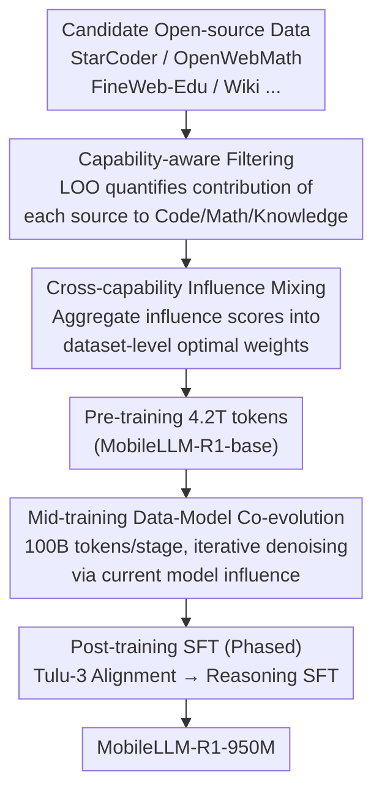

# MobileLLM-R1: Exploring the Limits of Sub-Billion Language Model Reasoners with Open Training Recipes

**Conference**: ICLR 2026  
**arXiv**: [2509.24945](https://arxiv.org/abs/2509.24945)  
**Code**: [GitHub](https://github.com/facebookresearch/MobileLLM-R1)  
**Area**: Model Compression  
**Keywords**: Small Language Model Reasoning, Data Filtering, Influence Score, Data Mixing, On-device Deployment

## TL;DR
Through meticulous data filtering and adaptive mixing strategies, the sub-billion parameter reasoning model MobileLLM-R1-950M was pre-trained using only 4.2T tokens (11.7% of Qwen3). It matches or exceeds Qwen3-0.6B on reasoning benchmarks such as AIME while fully open-sourcing data sources and training recipes.

## Background & Motivation
Reasoning capabilities in large models (the o1 paradigm) are transforming the AI field, but large models remain impractical for on-device deployment—long CoT reasoning further aggravates memory pressure on the KV cache. Two popular assumptions are: (1) reasoning capabilities only emerge in sufficiently large models; (2) reasoning requires massive amounts of training data. Assumption 1 has been challenged by sub-billion models like Qwen3-0.6B, yet Assumption 2 remains largely unquestioned.

**Core Problem**: Given strict capacity constraints, what is the most effective recipe for endowing small models with strong reasoning capabilities?

**Key Challenge**: Small models are extremely sensitive to noise; data noise easily overwhelms limited capacity. Neurons must encode more overlapping knowledge, increasing the risk of interference. Therefore, data quality and filtering are far more critical than for large models.

**Core Idea**: Identify beneficial data sources through capability-aware leave-one-out (LOO) analysis, perform cross-capability adaptive data mixing using influence scores, and iteratively optimize via data-model co-evolution during the mid-training phase.

## Method

### Overall Architecture
MobileLLM-R1 addresses how to extract maximum reasoning capability under sub-billion parameter constraints. The solution focuses on three factors: identifying data sources, determining mixing ratios, and deciding when to update data during training—all governed by quantified influence scores. The pipeline comprises three stages: pre-training with 4.2T tokens using influence-calculated mixing ratios; mid-training with 100B tokens per stage to iteratively calibrate data and model while removing mastered samples; and post-training via instruction alignment and reasoning SFT. The central theme is **selecting data based on the model's reaction to it, rather than manual heuristics or downstream benchmarks**. The following diagram illustrates this flow from top to bottom.

### Key Designs

**1. Capability-aware Data Filtering: Quantifying contributions via leave-one-out**

Small models have limited capacity; noise data can overwhelm the representation space. The authors use a leave-one-out approach to determine which data sources are truly beneficial. By excluding one data source at a time and retraining, they observe the change in Negative Log-Likelihood (NLL) on probe sets for Code, Math, and Knowledge. Influence is formalized as $\Delta\mathcal{L}(\mathcal{D}_j, \mathcal{D}^P) = \mathbb{E}[\ell(z;\hat{\theta}_{-j}) - \ell(z;\hat{\theta})]$. This analysis refutes common heuristics: FineWeb-Edu acts as a cross-domain "glue" whose removal degrades all capabilities; StarCoder's contribution to math exceeds OpenWebMath's contribution to code, indicating strong positive transfer from code to reasoning; meanwhile, Wikipedia provides negligible help for code and math.

**2. Cross-capability Influence Data Mixing: Replacing heuristics with optimal weights**

The authors replace uniform sampling with the AutoMixer framework to approximate sample-level influence scores: $\mathcal{I}(x_i, x_{\text{test}}; \theta) \approx -\nabla\mathcal{L}(x_{\text{test}})^\top H^{-1} \nabla\mathcal{L}(x_i)$. Contributions across different capabilities and stages are aggregated into a "joint influence" and converted into dataset-level sampling weights $w_g = \frac{\rho_g}{\sum \rho_{g'}}$. The resulting mixing ratio is the optimal solution dictated by the data itself, which consistently outperforms uniform sampling on unseen benchmarks.

**3. Mid-training Data-Model Co-evolution: Iterative denoising**

Fixed mixing ratios are not optimal throughout training; as model capabilities grow, beneficial samples may become redundant. During mid-training, the model and data co-evolve: influence scores are recalculated for each sample using the current model, retaining only those with positive influence $\mathcal{D}_t = \{x_i : I(x_i; \theta_t) > 0\}$ and updating dataset weights. This "iterative denoising" continues until most sample influences approach zero, typically converging in two stages.

### Loss & Training
Pre-training employs the standard next-token prediction objective. Post-training is split into two phases: instruction alignment via Tulu-3-SFT, followed by reasoning SFT using OpenMathReasoning, OpenCodeReasoning, and OpenScienceReasoning. Empirical results show that training these stages separately is significantly better than joint training.

## Key Experimental Results

### Main Results

| Model | Parameters | Tokens | MATH | GSM8K | AIME | LCBv6 |
|-------|------------|--------|------|-------|------|-------|
| OLMo-2-1.48B | 1.48B | 4T+ | ~20 | ~50 | 0.6 | 11.4 |
| SmolLM-2-1.7B | 1.7B | 11T | ~15 | ~40 | 0.3 | 7.7 |
| Qwen3-0.6B | 0.6B | 36T | ~55 | ~65 | ~10 | ~12 |
| **MobileLLM-R1-950M** | 0.95B | 4.2T | **57.8** | **68.5** | **15.5** | **13.7** |
| MobileLLM-R1-360M | 0.36B | - | 19.2 | 23.8 | - | 4.0 |
| MobileLLM-R1-140M | 0.14B | - | 4.8 | 3.7 | - | 1.1 |

### Ablation Study

| Configuration | MATH | GSM8K | LCBv6 | Description |
|---------------|------|-------|-------|-------------|
| Math SFT only (M) | 57.4 | 68.2 | 0.0 | Loss of code capability |
| Code SFT only (C) | 16.2 | 31.0 | 12.0 | Loss of math capability |
| M+C+S (Phased) | 57.8 | 68.5 | 13.7 | Best balance |
| M+C+S (Joint) | 56.2 | 53.1 | 14.9 | Sharp drop in GSM8K |
| W/o Tulu-3 stage | 56.2 | 68.2 | 13.1 | Alignment helps |
| Original mid-training data | Lower | Lower | - | Performance dip observed |
| Filtered mid-training data | Higher | Stable | - | Removing noise is effective |

### Key Findings
- Competitive reasoning performance is achieved using only 11.7% of Qwen3's tokens, proving data quality is far more important than quantity.
- A score of 15.5 on AIME compared to OLMo's 0.6 and SmolLM's 0.3 highlights the criticality of pre-training data filtering for small models.
- StarCoder's contribution to math is greater than OpenWebMath's contribution to code, confirming strong positive transfer from code to reasoning.
- Data-model co-evolution in mid-training converges after two stages, with the influence distribution shifting toward zero.

## Highlights & Insights
- The concept of "benchmark-free, self-evolving data optimization" is novel—optimizing data mixing without relying on downstream benchmarks.
- LOO analysis reveals cross-domain influences (e.g., code → math) that serve as a guide for data selection.
- The convergence of data-model co-evolution is mathematically intuitive: the influence distribution gradually compresses to zero, indicating data information has been fully utilized.
- Fully opens training recipes and data sources, ensuring high reproducibility.

## Limitations & Future Work
- LOO analysis requires training separate models for each data source, which is computationally expensive.
- Influence score calculation depends on AutoMixer's Hessian approximation, which may introduce errors.
- Models smaller than 360M still exhibit weak reasoning, suggesting a lower bound for scaling.
- Post-training stages reuse existing SFT datasets without applying equivalent influence-based filtering.

## Related Work & Insights
- **vs Qwen3-0.6B**: Achieves comparable performance with 11.7% of the tokens, demonstrating immense potential for data efficiency.
- **vs OLMo-2**: Over 5x higher MATH accuracy, with the core difference being pre-training data quality.
- **vs SmolLM-2**: Over 2x higher MATH accuracy with fewer parameters.

## Rating
- Novelty: ⭐⭐⭐⭐ Innovative influence-driven data mixing and co-evolution.
- Experimental Thoroughness: ⭐⭐⭐⭐⭐ Detailed LOO analysis, phase ablation, and cross-model comparisons.
- Writing Quality: ⭐⭐⭐⭐⭐ Clear methodology, excellent visualizations, and deep insights.
- Value: ⭐⭐⭐⭐⭐ Extremely high reference value for small model training; fully open-source.

<!-- RELATED:START -->

## Related Papers

- [\[ICLR 2026\] Is Finer Better? The Limits of Microscaling Formats in Large Language Models](is_finer_better_the_limits_of_microscaling_formats_in_large_language_models.md)
- [\[ICML 2026\] Decouple Searching from Training: Scaling Data Mixing via Model Merging for Large Language Model Pre-training](../../ICML2026/model_compression/decouple_searching_from_training_scaling_data_mixing_via_model_merging_for_large.md)
- [\[ICLR 2026\] PASER: Post-Training Data Selection for Efficient Pruned Large Language Model Recovery](paser_post-training_data_selection_for_efficient_pruned_large_language_model_rec.md)
- [\[ICML 2026\] NanoQuant: Efficient Sub-1-Bit Quantization of Large Language Models](../../ICML2026/model_compression/nanoquant_efficient_sub-1-bit_quantization_of_large_language_models.md)
- [\[ICLR 2026\] LipNeXt: Scaling up Lipschitz-based Certified Robustness to Billion-parameter Models](lipnext_scaling_up_lipschitz-based_certified_robustness_to_billion-parameter_mod.md)

<!-- RELATED:END -->
