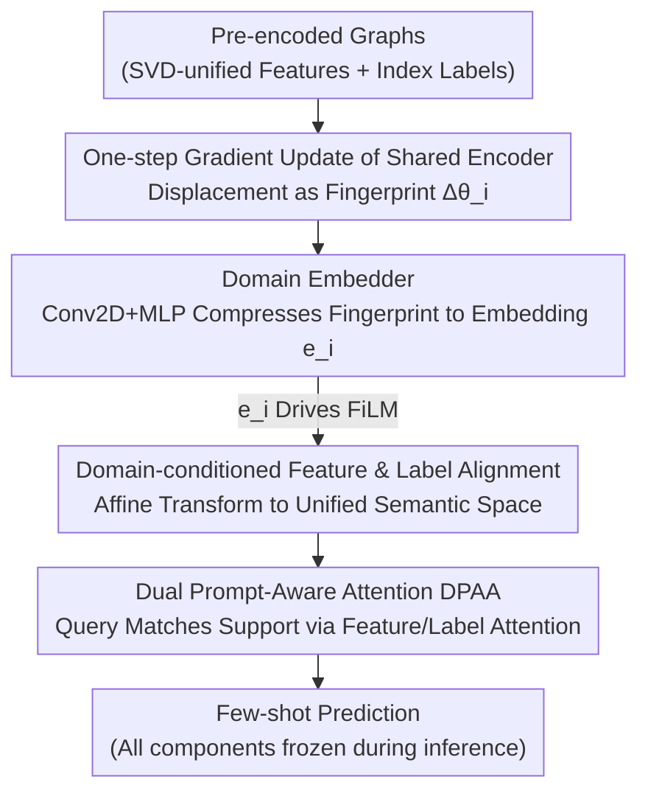

# Modality-free Graph In-context Alignment

**Conference**: ICLR 2026  
**arXiv**: [2603.13434](https://arxiv.org/abs/2603.13434)  
**Code**: [GitHub](https://github.com/JhuoW/MF-GIA)  
**Area**: Model Compression  
**Keywords**: Graph Foundation Models, In-context Learning, Cross-domain Alignment, Gradient Fingerprints, Meta-learning

## TL;DR
The authors propose MF-GIA, the first graph in-context learning framework that simultaneously satisfies tuning-free inference, cross-domain alignment, and modality-free requirements. By capturing domain features via gradient fingerprints and aligning features and labels through FiLM-conditioned transformations, MF-GIA achieves SOTA performance on few-shot tasks across multiple graph domains.

## Background & Motivation
For Graph Foundation Models (GFMs) to achieve universality similar to LLMs, they require true In-Context Learning (ICL) capabilities—adapting to new tasks using only a few examples without updating parameters. True graph ICL must satisfy three conditions:

**Tuning-free Inference**: Fully frozen parameters during inference, requiring no fine-tuning or learnable prompt engineering.

**Cross-domain Alignment**: A single model processing different types of graphs within a unified semantic space.

**Modality-free**: No requirement for raw data, capable of handling pre-encoded graphs (as real-world graph data is often pre-encoded by domain-specific methods).

Existing methods (e.g., UniGraph, OFA, GOFA) achieve alignment through Text-Attributed Graphs (TAGs) but require access to raw data—infeasible in privacy-sensitive scenarios—and text conversion introduces information loss. Prodigy and GPF lack cross-domain alignment.

**Core Idea**: Utilizing gradient fingerprints as domain descriptors—the displacement from a one-step gradient update reflects how graph features, labels, and topology affect the shared encoder, thereby capturing domain characteristics. Lightweight FiLM transformations based on these fingerprints can align features and labels across different domains without knowledge of the original data modality.

## Method

### Overall Architecture
MF-GIA aims to solve "true graph in-context learning": enabling a frozen graph model to adapt to new graph domains using only a few examples without requiring access to raw data. The process is decomposed into three sequential steps: first, calculating a domain embedding $e_i$ for each graph using the "fingerprint" from a one-step gradient update to characterize the domain; second, using $e_i$ to condition a set of FiLM transformations that map pre-encoded features and index labels into a unified semantic space; third, employing episodic pre-training with Dual Prompt-Aware Attention (DPAA) to let the model learn to "perform matching predictions for a query given a support set." During inference, all three components are frozen; injecting a support set triggers alignment and produces predictions without any fine-tuning or learnable prompts.

### Key Designs

**1. Domain Embedder: Unsupervised Characterization of Graph Domains via Gradient Fingerprints**

The prerequisite for cross-domain alignment is identifying "which domain the current graph belongs to," yet domain labels or modality metadata are often unavailable. MF-GIA lets the data and model speak for themselves: starting from a shared initialization $\theta_0$, a single-step gradient update is performed for each graph $G_i$. The displacement $\Delta\theta_i = \theta_i - \theta_0$ serves as the "fingerprint"—the distance and direction of this update inherently reflect how the graph's features, labels, and topology interact with the shared encoder. A learnable embedder (Conv2D + MLP) then compresses the high-dimensional fingerprint into a low-dimensional domain embedding $e_i = f_{\phi_{\text{de}}}(\Delta\theta_i)$. This design is supported by Theorem 3.1:

$$\|e_i - e_j\|_2 \leq \tilde{C} \cdot \mathcal{W}_2(\mathcal{D}_i, \mathcal{D}_j)$$

This implies the distance between two domain embeddings is bounded by the Wasserstein distance of their corresponding domain distributions. Consequently, graph domains with similar distributions naturally acquire similar embeddings, while distant ones are pushed apart—providing the foundation for "sharing similar transformations across similar domains" in cross-domain alignment.

**2. Domain-conditioned Feature and Label Alignment: Driving FiLM with $e_i$ to Unify Heterogeneous Domains**

Using the domain embedding, two sets of lightweight FiLM transformations are conditioned. On the feature side, pre-encoded features $h_{i,w}$ are affinely transformed into a unified space: $z_{i,w} = \gamma_i^{\text{feat}} \odot h_{i,w} + \beta_i^{\text{feat}}$, where the scale and shift $(\gamma_i^{\text{feat}}, \beta_i^{\text{feat}}) = f_{\phi_{\text{feat}}}(e_i)$ are generated entirely from the domain embedding. Similar $e_i$ values produce similar FiLM parameters, causing features to fall into adjacent subspaces. On the label side, the framework addresses the risk of identical label IDs representing different concepts across domains. A shared label base $\mathbf{E}^{\text{label}} \in \mathbb{R}^{L_{\max} \times d}$ is maintained and projected into the semantics of each domain via domain-conditioned FiLM: $u_{i,l} = \gamma_i^{\text{label}} \odot \mathbf{E}_l^{\text{label}} + \beta_i^{\text{label}}$. The alignment relies solely on scaling and shifting, making it lightweight and domain-specific while remaining modality-free as it never touches raw data.

**3. Dual Prompt-Aware Attention (DPAA): Few-shot Prediction via the ICL Paradigm**

Following alignment, information must be transferred from the support set to the query while adhering to ICL principles—prompts do not interact with each other, and the query only extracts task information through the prompts. DPAA implements this via two layers of single-query attention: on the feature side, the query attends to support features to obtain a prompt-conditioned representation $z_{i,q}^{\text{out}}$; on the label side, this representation attends to label prototypes to obtain a predictive representation $u_{i,q}^{\text{out}}$. The final score is given by the inner product between this representation and the prompt label representations $s = u^{\text{out}}(\mathbf{U}^{\text{pmt}})^\top$. By using "single-query" attention where the query only looks at the prompt and prompts do not share information, the inductive bias of ICL is hard-coded into the architecture rather than implicitly learned.

### Loss & Training
The model uses an episodic cross-entropy loss: $\mathcal{L}_{\text{episode}} = -\frac{1}{mT}\sum_c\sum_t \log \frac{\exp(s[c]/\tau)}{\sum_j \exp(s[j]/\tau)}$, aggregated across episodes sampled from all pre-training graphs. The domain embedder is pre-trained separately and then frozen using a distance-preserving loss $\mathcal{L}_{\text{de}} = \sum_{i,j}(\|\Delta\theta_i - \Delta\theta_j\|_F - \|e_i - e_j\|_2)^2$.

## Key Experimental Results

### Main Results (Few-shot Node Classification, 5-shot)

| Method | Cora-7way | Products-47way | Computers-10way | Physics-5way | BlogCatalog-6way |
|------|-----------|----------------|-----------------|-------------|-----------------|
| GCN | 42.55 | 8.77 | 41.09 | 77.15 | 52.16 |
| GraphSAGE | 42.40 | 9.42 | 40.58 | 77.36 | 58.03 |
| Prodigy | ~55 | ~12 | ~50 | ~80 | ~55 |
| **MF-GIA (Ours)** | **Best** | **Best** | **Best** | **Best** | **Best** |

### Ablation Study

| Configuration | Average Performance | Description |
|------|---------|------|
| Full MF-GIA | Best | All modules working together |
| w/o Domain Embedder | Lower | Loss of cross-domain adaptation |
| w/o Feature Alignment | Significantly Lower | Inter-domain feature misalignment |
| w/o Label Alignment | Lower | Label semantic inconsistency |
| w/o DPAA (Standard Head) | Lower | Loss of prompt reasoning capability |
| w/o Graph-aware Prototype| Slightly Lower | Neighborhood info is beneficial |

### Key Findings
- MF-GIA is the first method to satisfy all three ICL conditions simultaneously, reaching SOTA on all benchmarks.
- Gradient fingerprints effectively capture domain characteristics: embeddings for related domains (e.g., two citation networks) naturally cluster together.
- The framework enables zero-shot transfer to completely unseen new domains, where label alignment is critical.
- Seamless transfer from node classification to edge classification tasks demonstrates the framework's versatility.

## Highlights & Insights
- The use of gradient fingerprints as domain descriptors is ingenious—it extracts domain information solely from data-model interaction without requiring external priors.
- FiLM-conditioned transformations are simple yet efficient, achieving domain adaptation through basic scaling and shifting.
- DPAA strictly follows the ICL paradigm, providing an excellent design example for prompt learning in the graph domain.
- Modality-neutrality allows the method to be applied in privacy-sensitive scenarios using only pre-encoded data.

## Limitations & Future Work
- One-step gradient fingerprints might be sensitive to the initialization $\theta_0$.
- SVD preprocessing to unify feature dimensions may cause information loss.
- The diversity of pre-training domains directly impacts generalization capability.
- Gradient computation efficiency on large-scale graphs requires further attention.

## Related Work & Insights
- **vs UniGraph/OFA**: Does not require converting raw data to TEXT; strictly modality-free.
- **vs Prodigy**: Adds cross-domain alignment capabilities, resulting in stronger generalization.
- **vs GPF**: Includes cross-domain alignment, better handling heterogeneous domains.

## Rating
- Novelty: ⭐⭐⭐⭐⭐ Pioneering combination of gradient fingerprints and modality-free ICL with sound theoretical grounding.
- Experimental Thoroughness: ⭐⭐⭐⭐ Comprehensive multi-domain evaluation, though lacking tests on ultra-large-scale graphs.
- Writing Quality: ⭐⭐⭐⭐⭐ Close integration of theory and practice with a consistent notation system.
- Value: ⭐⭐⭐⭐ Drives Graph Foundation Models toward true universal ICL.

<!-- RELATED:START -->

## Related Papers

- [\[ICLR 2026\] Gradient Intrinsic Dimensionality Alignment：Narrowing The Gap Between Low-Rank Adaptation and Full Fine-Tuning](gradient_intrinsic_dimensionalityalignmentnarrowing_the_gap_between_low-rank_ad.md)
- [\[ICLR 2026\] ODESteer: A Unified ODE-Based Steering Framework for LLM Alignment](odesteer_a_unified_ode-based_steering_framework_for_llm_alignment.md)
- [\[ICLR 2026\] GAPrune: Gradient-Alignment Pruning for Domain-Aware Embeddings](gaprune_gradient-alignment_pruning_for_domain-aware_embeddings.md)
- [\[ECCV 2024\] SpaceJAM: a Lightweight and Regularization-free Method for Fast Joint Alignment of Images](../../ECCV2024/model_compression/spacejam_a_lightweight_and_regularization-free_method_for_fast_joint_alignment_o.md)
- [\[ICML 2026\] Selective Coupling of Decoupled Informative Regions: Masked Attention Alignment for Data-Free Quantization of Vision Transformers](../../ICML2026/model_compression/selective_coupling_of_decoupled_informative_regions_masked_attention_alignment_f.md)

<!-- RELATED:END -->
