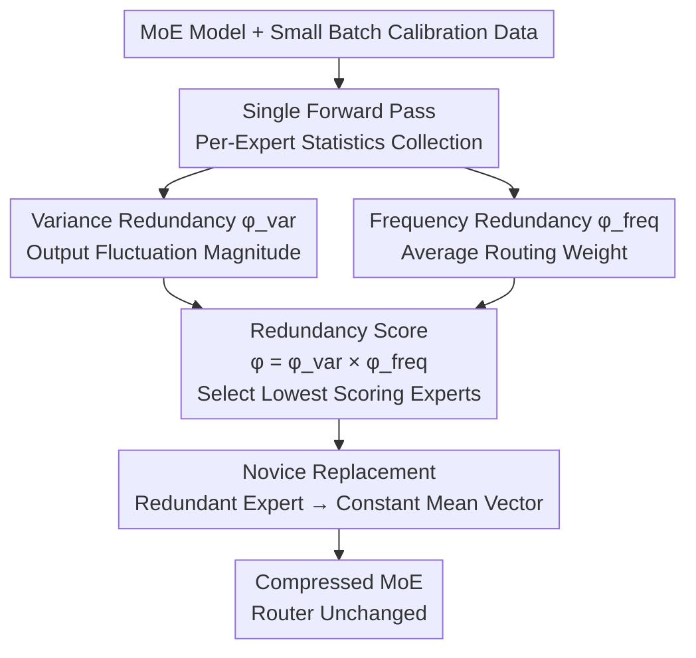

# MoNE: Replacing Redundant Experts with Lightweight Novices for Structured Pruning of MoE

**Conference**: ICLR 2026  
**arXiv**: [2507.00390](https://arxiv.org/abs/2507.00390)  
**Code**: [GitHub](https://github.com/zxgx/mode-pd)  
**Area**: Model Compression  
**Keywords**: MoE Pruning, Expert Redundancy, Novice Replacement, Structured Compression, Access Frequency

## TL;DR
This paper proposes MoNE (Mixture-of-Novices-and-Experts), which identifies redundant experts by jointly evaluating expert access frequency and output variance. These experts are replaced with their output mean (a "novice" constant vector). MoNE achieves more effective and robust compression across five MoE models compared to existing pruning methods, with an average accuracy drop of only 0.14 at a 25% pruning rate.

## Background & Motivation
MoE architectures expand model capacity through sparse activation, but deployment requires keeping all experts in memory, leading to significant overhead—for example, maintaining all 64 experts (including inactive ones) on the GPU. Structured pruning can directly reduce the number of experts to lower memory costs.

Existing methods suffer from three-dimensional instability:

**Cross-Architecture Instability**: Layer pruning (Angular) and channel pruning (FLAP) do not account for the sparse computation characteristics of MoE.

**Cross-Calibration Data Instability**: Significant performance fluctuations occur depending on the source of the calibration data.

**Cross-Sample Size Instability**: Performance varies notably between 100, 500, and 1000 samples.

**Core Problem**: Existing expert pruning relies primarily on access frequency, which does not fully characterize redundancy. An expert with low frequency but highly variable output may carry critical discriminative information; conversely, an expert with moderate frequency but extremely stable output can be replaced by a constant.

**Core Idea**: Redundancy = Low Frequency × Low Variance. Redundant experts are replaced with their output mean ("novice") rather than being simply deleted, minimizing output discrepancy.

## Method

### Overall Architecture
MoNE addresses the high cost of keeping dozens of experts in VRAM during MoE deployment by identifying which experts can be safely removed. It evaluates redundancy by multiplying "frequency" and "output variance." The workflow requires only one forward pass: statistics on the average routing score (frequency) and output variance are collected for each expert using a small batch of calibration data. Then, "variance redundancy" and "frequency redundancy" are calculated and multiplied to obtain the final redundancy score, identifying the lowest-scoring experts. Finally, instead of deleting them, these redundant experts are replaced with their output mean on the calibration set—a constant vector termed a "novice." The router remains unchanged; replaced experts may still be selected but will output the same constant regardless of the input.

### Key Designs

**1. Variance Redundancy $\phi^{var}$: Judging if an expert "can be replaced by a constant"**

Relying solely on frequency may lead to errors: an expert that is rarely selected but produces highly varied outputs carries critical information and should be preserved. MoNE quantifies the stability of each expert's output. For expert $E_i$, it calculates the L2 norm of the unbiased variance estimate of its output when selected:

$$\phi_i^{var} = \left\|\sqrt{\frac{\sum(E_i(\mathbf{x}) - \overline{E_i})^2 \cdot \mathbb{I}(E_i \in \mathcal{S}_k)}{\sum\mathbb{I} - 1}}\right\|_2$$

Where $\mathcal{S}_k$ is the set of top-k experts the token is actually routed to, and $\mathbb{I}(\cdot)$ is the indicator function. The intuition is straightforward: high-variance expert outputs change significantly with the input, so approximating them with a constant loses substantial information. Low-variance expert outputs are stable, and replacing them with a mean introduces minimal bias.

**2. Frequency Redundancy $\phi^{freq}$: Judging the router's "dependency" on an expert**

Frequency remains useful but is calculated more precisely by looking at the routing weight when selected:

$$\phi_i^{freq} = \frac{\sum G_i(\mathbf{x}) \cdot \mathbb{I}(E_i \in \mathcal{S}_k)}{\sum \mathbb{I}(E_i \in \mathcal{S}_k)}$$

$G_i(\mathbf{x})$ is the gating score for expert $i$. A low average routing score indicates the router does not "value" the expert highly even when selected. However, the paper emphasizes that frequency alone is insufficient: some high-frequency experts have stable outputs and might be mistakenly kept if only frequency is considered.

**3. Novice Replacement: Substituting redundant experts with a constant vector**

The final redundancy score is $\phi = \phi^{var} \cdot \phi^{freq}$. Experts with the lowest scores are marked as redundant. The key in MoNE is the pruning method: instead of removing experts, they are replaced by their output mean $N_i = \overline{E_i}$ over the calibration set, called a "novice." This mean is the closed-form optimal solution for minimizing the L2 output discrepancy when approximating a set of outputs with a constant. The cost of a novice is near zero: $N_i$ does not participate in input-dependent computation and only requires storing a $d$-dimensional vector, effectively replacing an entire MLP expert with a constant while preserving its "average behavior."

### Loss & Training
MoNE is a training-free post-processing method that does not update any weights. Pruning is completed via a single forward pass on the calibration set to collect frequency and variance statistics.

## Key Experimental Results

### Main Results (25% Pruning, OLMoE-7B, 100 Samples Zyda2)

| Method | Arc-c | Arc-e | BoolQ | COPA | MMLU | OBQA | PIQA | RTE | WinoG | Avg |
|------|-------|-------|-------|------|------|------|------|-----|-------|-----|
| Original Model | 49.23 | 76.89 | 70.09 | 85.0 | 53.54 | 44.4 | 79.76 | 71.84 | 68.90 | 66.63 |
| Angular (Layer) | 32.76 | 61.91 | 61.71 | 74.0 | 23.13 | 37.6 | 71.65 | 53.07 | 55.09 | 52.33 |
| FLAP (Channel) | 40.53 | 67.55 | 62.69 | 78.0 | 41.16 | 37.8 | 74.81 | 61.37 | 60.93 | 58.32 |
| MC-SMoE (Merge) | 35.67 | 54.92 | 63.49 | 73.0 | 29.04 | 30.6 | 67.19 | 55.23 | 65.75 | 52.77 |
| RS (Frequency) | 25.85 | 43.01 | 59.08 | 74.0 | 29.63 | 36.2 | 66.16 | 56.68 | 59.98 | 50.07 |
| **Ours (MoNE)** | **42.32** | **64.81** | **67.19** | **85.0** | **40.13** | **40.8** | **78.07** | **64.62** | **66.46** | **61.04** |

### Robustness Experiments

| Dimension | Existing Methods | Ours (MoNE) | Description |
|------|---------|------|------|
| Cross-Arch (5 Models) | High Fluctuation | Consistently Superior | OLMoE/Moonlight/DS-V2/Qwen2-57B/Qwen3-30B |
| Zyda2 vs C4 | Significant Diff | Small Diff | Calibration Data Robustness |
| 100/500/1000 Samples | High Fluctuation | Stable | Sample Size Robustness |
| Qwen2-57B-A14B@25% | Large Baseline Drop | Only 0.14 Drop | Advantage more pronounced on large models |

### Key Findings
- MoNE shows only a 0.14 accuracy drop on Qwen2-57B at 25% pruning, outperforming baselines by up to 2.72.
- Frequency and variance information are complementary: three categories of experts (high-freq/high-var, high-var only, high-freq only) are consistent across tasks.
- RS (Frequency only) performs the worst, validating the insufficiency of a single metric.
- Novice replacement (constant vector) is superior to complete deletion: it preserves knowledge estimation and reduces activated parameters for some tokens.

## Highlights & Insights
- The "Novice" replacement concept is simple yet effective—using one vector to replace an entire MLP achieves near-zero computational/memory overhead.
- The design of the frequency × variance redundancy metric is convincing and shows strong consistency across tasks.
- The training-free, weight-update-free nature makes it highly convenient for practical deployment.
- The robustness analysis across three dimensions is a highlight, addressing gaps in current method evaluations.

## Limitations & Future Work
- Evaluated only on zero-shot benchmarks; complex tasks (code, math, reasoning) may require additional fine-tuning.
- Novices are fixed constants; they might introduce larger biases for experts that are highly data-dependent.
- Performance degradation remains significant at high pruning rates (e.g., 50%).
- Layer-wise adaptive novices (e.g., low-rank novices) have not been explored.

## Related Work & Insights
- **vs MC-SMoE**: Novice replacement is simpler and more effective than expert merging.
- **vs RS**: Adding the variance dimension leads to comprehensive superiority over frequency-only metrics.
- **vs Angular/FLAP**: MoE-specific pruning is more suitable than general structured pruning.

## Rating
- Novelty: ⭐⭐⭐⭐ The "Novice" replacement concept is novel, and the dual-metric redundancy measure is insightful.
- Experimental Thoroughness: ⭐⭐⭐⭐⭐ Comprehensive robustness analysis across 5 models, 2 calibration sources, and 3 sample sizes.
- Writing Quality: ⭐⭐⭐⭐ Clear motivation, though notation is somewhat heavy.
- Value: ⭐⭐⭐⭐⭐ Highly practical for MoE deployment; simple and efficient.

<!-- RELATED:START -->

## Related Papers

- [\[ICLR 2026\] REAP the Experts: Why Pruning Prevails for One-Shot MoE Compression](reap_the_experts_why_pruning_prevails_for_one-shot_moe_compression.md)
- [\[ACL 2025\] STUN: Structured-Then-Unstructured Pruning for Scalable MoE Pruning](../../ACL2025/model_compression/stun_moe_pruning.md)
- [\[ICLR 2026\] MoBE: Mixture-of-Basis-Experts for Compressing MoE-based LLMs](mobe_mixture-of-basis-experts_for_compressing_moe-based_llms.md)
- [\[ICLR 2026\] TD-MoE: Tensor Decomposition for MoE Models](td-moe_tensor_decomposition_for_moe_models.md)
- [\[ICLR 2026\] RCPU: Rotation-Constrained Error Compensation for Structured Pruning of Large Language Models](rcpu_rotation-constrained_error_compensation_for_structured_pruning_of_large_lan.md)

<!-- RELATED:END -->
