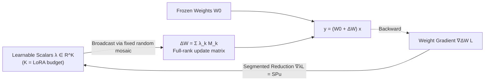

# MoSA: Mosaic Shared Adaptation of Large Language Models

**Conference**: ICLR 2026  
**OpenReview**: [https://openreview.net/forum?id=jg8JIKBAlb](https://openreview.net/forum?id=jg8JIKBAlb)  
**Code**: [https://github.com/XiequnWang/MoSA-ICLR26](https://github.com/XiequnWang/MoSA-ICLR26)  
**Area**: Parameter-Efficient Fine-Tuning / Model Compression  
**Keywords**: PEFT, LoRA alternative, parameter sharing, full-rank update, random grouping, mosaic  

## TL;DR
MoSA replaces LoRA's low-rank decomposition with mosaic-style parameter sharing, where the weight matrix is randomly partitioned into small blocks with each sharing a learnable scalar. This achieves full-rank, element-wise weight updates under an identical parameter budget, while custom backward kernels ensure zero inference overhead and efficient training.

## Background & Motivation
- **Background**: Parameter-Efficient Fine-Tuning (PEFT) has become the mainstream for adapting large language models. Historically, LoRA decomposes the weight update $\Delta W$ into two low-rank matrices $BA$, based on the assumption that "useful updates are intrinsically low-rank." This has led to variants like DoRA, AdaLoRA, and QLoRA.
- **Limitations of Prior Work**: The low-rank assumption acts as a **structural bottleneck**, forcing updates into a low-dimensional subspace and making it difficult to express complex, high-rank patterns required for difficult tasks. Recent high-rank methods like HiRA break the low-rank constraint via Hadamard products but still rely on priors from the original weights $W_0$, trapping updates within weight-dependent subspaces.
- **Key Challenge**: Is it possible to maintain parameter efficiency while remaining **unconstrained by low-rank structures and existing weight distributions**?
- **Goal**: Construct full-rank updates that influence every weight element under a parameter budget strictly equal to that of LoRA.
- **Core Idea**: **Random non-local parameter sharing**. All weight matrix indices are randomly partitioned into $K$ disjoint groups (tesserae), each controlled by a single learnable scalar that is broadcast back to its respective positions. Random grouping disrupts short-range correlations in the weight matrix, acting as a natural **regularizer** to suppress co-adaptation, thereby generating expressive full-rank updates within a LoRA-scale budget.

## Method

### Overall Architecture
For each target linear layer $W_0 \in \mathbb{R}^{h \times d}$, MoSA randomly partitions all $N=hd$ weight indices into $K$ disjoint groups of equal size, each bound to a learnable scalar $\lambda_k$. During the forward pass, these scalars are broadcast to their group positions to form the update matrix $\Delta W$, which is added to $W_0$ for computation like a standard linear layer. After training, it can be merged losslessly into the base model with zero inference overhead. The backward pass bypasses standard autograd, using a custom "segmented reduction" kernel to aggregate gradients for each group in a single pass.

### Key Designs

**1. Mosaic Shared Parameterization: Replacing low-rank decomposition with scalar broadcasting via random grouping.** LoRA defines updates as $\Delta W_{\text{LoRA}} = BA$, locked within a subspace of rank $\le r$. MoSA instead defines a set of fixed binary masks $M_k \in \{0, 1\}^{h \times d}$ (where 1 indicates inclusion in the $k$-th group). The update is constructed via scalar broadcasting:

$$\Delta W_{\text{MoSA}} = \sum_{k=1}^{K} \lambda_k M_k, \quad (M_k)_{ij} = \mathbb{1}[(i, j) \in I_k]$$

Since the $K$ groups are disjoint and cover all indices, each weight $W_{ij}$ is modulated by exactly one $\lambda_k$. This allows MoSA to influence every element of the weight matrix while using only $K$ parameters. By setting $K = r(d + h)$, the parameter count is **strictly equal per module** to a rank-$r$ LoRA. Furthermore, $K$ can be any integer, providing a finer budget granularity than LoRA's matrix-shape-dependent ranks.

**2. Balanced Random Tessellation (BRT): Proving "equal-sized grouping" is optimal.** Grouping is not arbitrary. Mapping scalar updates back to the weight space, the effective increment is $\delta W_{\text{mosa}} = -\eta \sum_k m_k \bar g_k M_k$, where $m_k = |I_k|$ is the group size and $\bar g_k$ is the average gradient within the group. This introduces an **implicit learning rate scaling** $m_k$ based on group size: larger groups receive more aggressive updates, disrupting uniform optimization. The authors prove **Theorem 1**: assuming i.i.d. gradient elements, the expected squared error between MoSA and unconstrained updates is a **Schur-convex function** of the group size vector $m = (m_1, \dots, m_K)$. By Karamata's inequality, the error is minimized when sizes are as equal as possible, i.e., $m_k \in \{\lfloor N/K \rfloor, \lceil N/K \rceil\}$. BRT implements this by shuffling all indices and dividing them into $K$ equal continuous blocks—ensuring balance and breaking local spatial correlations to maximize training stability.

**3. Segmented Reduction Backward Kernel: Gradient aggregation as a single-pass linear projection.** Via the chain rule, the scalar gradient is the Frobenius inner product of the weight gradient and the mask: $\frac{\partial L}{\partial \lambda_k} = \langle \nabla_{\Delta W} L, M_k \rangle_F = \sum_{(i,j) \in I_k} (\nabla_{\Delta W} L)_{ij}$. Naive implementation is slow due to atomic operations. The authors formalize this as a fixed linear projection in vector space: let $u = \mathrm{vec}(\nabla_{\Delta W} L)$, use a fixed permutation matrix $P$ to bring indices of the same group into continuous segments, and use a segmented matrix $S$ (block-diagonal ones) for summation:

$$\nabla_\lambda L = SPu$$

The $SP$ operation is fused into a single segmented reduction kernel. It only requires caching permutation indices rather than full adapter matrices, significantly reducing memory overhead. It is bandwidth-bound and robust to group skews.

**4. Structural Sharing: Reusing random partitions for layers of the same shape.** In modern Transformers, many layers share the same $h \times d$ dimensions. MoSA assigns the **same** random partition to all weights of identical shape, decoupling extra memory overhead from network depth.

## Key Experimental Results

Setup: Llama-2-7B / Llama-3-8B; adapting $W_Q, W_K, W_V$ and FFN $W_{up}, W_{down}$; compared against LoRA/DoRA/MoRA/HiRA with **strictly equal budget** at $r=32$.

### Main Results

| Task | Model | LoRA | DoRA | HiRA (Strongest Baseline) | **MoSA** | Gain |
|------|------|------|------|------|------|------|
| Commonsense Reasoning (Avg of 8) | Llama-3-8B | 80.79 | 85.20 | 86.72 | **87.63** | +0.91 |
| Commonsense Reasoning (Avg of 8) | Llama-2-7B | 77.61 | 79.69 | 81.42 | **83.83** | +2.41 |
| ConvAI2 Dialogue (Avg) | Llama-3-8B | 46.59 | 46.62 | 47.80 | **50.14** | +2.34 |
| ConvAI2 Dialogue (Avg) | Llama-2-7B | 46.17 | 46.00 | 47.28 | **49.92** | +2.64 |
| GSM8K (MetaMathQA Train, OOD) | Llama-3-8B | 65.89 | 66.12 | 70.81 | **78.00** | +7.19 |

The massive +7.19% lead in OOD (Out-of-Distribution) mathematical reasoning is notable, suggesting MoSA learns transferable reasoning structures rather than template memorization.

### Ablation Study

| Dimension | Conclusion |
|------|------|
| **Adapted Modules** (Llama-3-8B) | FFN+QKV is optimal (87.63); FFN alone (87.35) is close; V > Q > K (modifying the "content" flow in values is more effective than routing in query/key). |
| **Grouping Strategy** | BRT (Balanced Random) 87.63 > Row-Stripe 87.05 > Col-Stripe 86.65 ≫ Skewed 74.36, validating both non-local randomness and balance. |
| **Budget Scaling** | At LoRA $r=1$ equivalent budget (0.022% params), MoSA reaches 86.81, surpassing the LoRA $r=32$ baseline (80.79) with 1/32 the parameters. |
| **Backward Speed** ($h=d=4096$) | Segmented kernel is consistently faster than autograd: ~9500× at $K=1$, 125× at $K=32$, and maintains 8–9× speed even at large $K$. |

### Key Findings
- The regularization effect from non-local random sharing is the primary source of performance: breaking short-range correlations is more effective than low-rank constraints. Column-striped sharing (Col-Stripe) performs worst as it locks all outgoing edges of a feature, reducing cross-row diversity.
- As task difficulty or distribution shift increases, MoSA's advantage over low-rank methods grows (e.g., +7.19% on GSM8K OOD).
- Accuracy rises sharply at extremely low budgets, proving that full-rank expressivity is particularly cost-effective in resource-constrained scenarios.

## Highlights & Insights
- **Fundamental Shift in PEFT Assumption**: MoSA shifts the question from "Is the update low-rank?" to "Can every weight be modulated by a lightweight shared scalar?", bypassing the constraints of low-rank structures and weight-dependent priors.
- **Theoretical-Systemic-Experimental Trinity**: Schur-convexity proves the optimality of BRT, the custom segmented reduction kernel enables practical efficiency, and experiments across three task categories provide comprehensive validation.
- **Arbitrary Budget Granularity**: $K$ can be any integer, allowing precise budget tuning between the discrete ranks of LoRA.
- **Classic Technique, New Context**: Reapplies the "HashedNets" concept from model compression to the **fine-tuning update $\Delta W$** rather than compressing the original $W_0$.

## Limitations & Future Work
- Theoretical analysis relies on the simplified assumption of i.i.d. gradient elements; in practice, gradients have strong structural correlations, making BRT optimality an approximation.
- While random grouping acts as a regularizer, it sacrifices interpretability—it is difficult to map specific scalars to semantic functions, and there is inherent sensitivity to the random seed (not explored in depth).
- Experiments focus on Llama-2/3 language tasks; vision, multimodal, or larger scale (70B+) models are not yet covered, nor is the memory benefit of integration with quantization (e.g., QLoRA style).
- It remains an open question whether scalar sharing might underperform low-rank methods in tasks requiring fine-grained directional control.

## Related Work & Insights
- **Low-Rank Methods**: LoRA / DoRA / AdaLoRA / QLoRA—MoSA's direct counterparts, challenging their underlying low-rank assumptions.
- **High-Rank Methods**: MoRA (maximizing rank in square matrices), HiRA (Hadamard product)—similarly target high-rank updates, but MoSA’s mechanism (random scalar sharing vs. original weight dependency) is fundamentally different.
- **Additive Methods**: Adapter / Prompt Tuning / Prefix Tuning—MoSA requires no architectural changes and is mergeable.
- **Hashed Sharing**: HashedNets—the conceptual ancestor of MoSA, now applied to fine-tuning updates.
- **Insight**: Parameter efficiency in PEFT does not exclusively require low-rank pathways; **sharing + randomization** represents a potent and previously overlooked orthogonal dimension.

## Rating
- **Novelty**: ⭐⭐⭐⭐⭐ — Reconstructing the fundamental assumption of PEFT by replacing low-rank decomposition with random mosaic sharing is a clear and unique mechanism.
- **Experimental Thoroughness**: ⭐⭐⭐⭐ — Comprehensive across three task types, two models, strictly identical budgets, and robust ablation/speed analysis; lacks verification on larger models or multimodal data.
- **Writing Quality**: ⭐⭐⭐⭐⭐ — Logical flow from motivation to theory, system design, and experiments; Schur-convexity and kernel design are well-articulated.
- **Value**: ⭐⭐⭐⭐ — Zero inference cost, arbitrary budget granularity, and significant leads in OOD tasks make this a highly competitive alternative to LoRA.

<!-- RELATED:START -->

## Related Papers

- [\[ACL 2026\] TLoRA: Task-aware Low Rank Adaptation of Large Language Models](../../ACL2026/model_compression/tlora_task-aware_low_rank_adaptation_of_large_language_models.md)
- [\[ICLR 2026\] QWHA: Quantization-Aware Walsh-Hadamard Adaptation for Parameter-Efficient Fine-Tuning on Large Language Models](qwha_quantization-aware_walsh-hadamard_adaptation_for_parameter-efficient_fine-t.md)
- [\[ICLR 2026\] Distillation of Large Language Models via Concrete Score Matching](distillation_of_large_language_models_via_concrete_score_matching.md)
- [\[ICLR 2026\] Knowledge Fusion of Large Language Models Via Modular Skillpacks](knowledge_fusion_of_large_language_models_via_modular_skillpacks.md)
- [\[ICLR 2026\] Entropy-Based Block Pruning for Efficient Large Language Models](entropy-based_block_pruning_for_efficient_large_language_models.md)

<!-- RELATED:END -->
