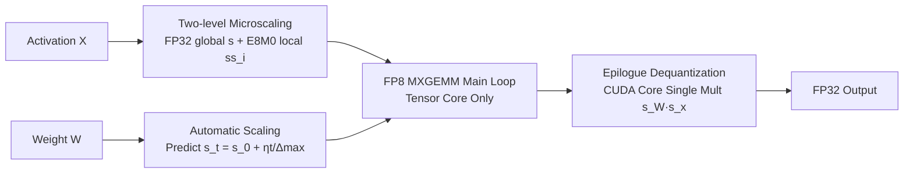

# MOSS: Efficient and Accurate FP8 LLM Training with Microscaling and Automatic Scaling

**Conference**: ICLR 2026  
**OpenReview**: [https://openreview.net/forum?id=uvgJM9RQ6T](https://openreview.net/forum?id=uvgJM9RQ6T)  
**Code**: To be confirmed  
**Area**: Model Compression / FP8 Low-precision Training  
**Keywords**: FP8 Training, Microscaling, MXFP8, Automatic Scaling, Quantization, LLM Pre-training  

## TL;DR
MOSS employs "two-level microscaling" to quantize sensitive activations and "automatic scaling" to predict weight scaling factors. This allows FP8 training of 7B models to match BF16 accuracy while increasing throughput to 1.34×.

## Background & Motivation
**Background**: FP8 is the next-generation low-precision training format following BF16, theoretically offering 2× compute power, 50% memory savings, and 50% reduction in communication overhead. To maintain training stability amidst FP8's narrow dynamic range and low resolution, mainstream frameworks (COAT, DeepSeek-V3) adopt "mixed-granularity quantization"—per-group (fine-grained) quantization for sensitive activations and per-tensor/block (coarse-grained) quantization for weights.

**Limitations of Prior Work**: While this scheme provides sufficient precision, it erodes the speed advantages of FP8. First, **per-group scaling factors are inserted along the inner dimension K of the GEMM**, forcing dequantization to occur within the GEMM main loop using slow CUDA Cores. On the H100, the peak throughput of FP32 CUDA Cores is only 1.6% of FP8 Tensor Cores; the cost of dequantizing a partial sum is roughly equivalent to 60 Tensor Core MACs, crippling the main loop (e.g., COAT's per-group takes 3.91ms vs. TE's per-tensor taking 0.75ms in Fig. 1). Second, weight-side scaling generally relies on **just-in-time (JIT) online scaling**, which requires reading FP32 tensors from HBM at every step to perform max-reduction for the absolute maximum value, then writing back. This repeated I/O cancels out FP8 benefits.

**Key Challenge**: Per-group quantization is accurate but slows the main loop via CUDA Core dequantization; per-tensor quantization is fast but non-robust to activation outliers; JIT scaling is precise but its memory overhead for max-reduction explodes with tensor size. **Choosing between precision and hardware efficiency is a zero-sum game**.

**Goal**: Design a training framework that matches BF16 precision while fully saturating FP8 compute capacity.

**Core Idea**: (1) **Two-level Microscaling**—quantize activations using one high-precision FP32 global scale + a set of compact power-of-two (E8M0) local microscales. This moves expensive FP32 scaling to a coarse grain and inexpensive E8M0 scaling to a fine grain, effectively pushing dequantization from the main loop to the epilogue. (2) **Automatic Scaling**—leverage the property that "weight updates are bounded by learning rate" in Adam-like optimizers to predict the evolution of weight scaling factors in advance, completely eliminating runtime max-reduction.

## Method

### Overall Architecture
MOSS addresses both ends of the FP8 GEMM: the activation side ensures precision via two-level microscaling, while the weight side saves overhead via automatic scaling. Together, they delay dequantization from the GEMM main loop (CUDA Core) to the epilogue, allowing the main loop to run entirely on Tensor Cores.

### Key Designs

**1. Two-level Microscaling: Moving expensive FP32 scaling to coarse-grain and inexpensive E8M0 scaling to fine-grain.** MOSS hierarchically slices a global block of size $k_1$ (~10K) into several sub-blocks of size $k_2=32$. In the first stage, a floating-point scale $s_i = \max(|X_i|)/\Delta^{\text{FP8}}_{\max}$ is calculated for each sub-block (where $\Delta_{\max}=448$ for E4M3). In the second stage, this set of $s_i$ is decomposed into an FP32 global component $s=\max(|s_i|)$ and a set of E8M0 microscales $ss_i = \lceil s_i/s \rceil_{\text{E8M0}} = 2^{\lceil \log_2(s_i/s)\rceil}$. Dividing by $s$ pushes values into the fractional domain, facilitating E8M0 rounding. Dequantization becomes $DQ_{X_i} = Q_{X_i}\cdot s \cdot ss_i$. Critically, E8M0 is merely an 8-bit exponent with negligible storage and compute costs, while the FP32 global scale only needs to be computed once at a coarse granularity. This provides fine-grained precision without the FP32 dequantization burden in the main loop. The paper further provides an SNR theoretical proof (Theorem 1): $\text{SNR}_{\text{per-tensor}} < \text{SNR}_{\text{per-group}} < \text{SNR}_{\text{MOSS}}$, as smaller sub-blocks provide tighter upper bounds on maximum magnitude.

**2. GEMM Kernel Reordering: Moving dequantization from main loop to epilogue.** In conjunction with two-level scaling, MOSS redesigns the GEMM kernel. Weights undergo per-tensor FP32 quantization and are assigned an "artificial" E8M0 secondary scale of 1. Consequently, the multiply-accumulate $Q_y = Q_w \times (Q_x * ss_x)$ can be efficiently executed at a fine grain on Tensor Cores, with all K iterations of the main loop remaining on Tensor Cores. After obtaining the FP32 partial sum, a one-time dequantization is performed in the epilogue using the weight's FP32 scale $s_W$ and the activation's first-level global scale $s_x$ (CUDA Core). Compared to COAT, which buries dequantization inside every K iteration (Fig. 3a), MOSS's main loop (Fig. 3b) is significantly cleaner, which is why it approaches per-tensor speeds while maintaining per-group precision.

**3. Automatic Scaling: Predicting weight scaling via optimizer properties to eliminate max-reduction.** On the weight side, MOSS no longer computes max at every step. Instead, it utilizes the "bounded update" property of Adam/AdamW. The paper proves (Theorem 2) that the effective single-step update satisfies $|\Delta_t| = \eta \cdot |m_t/\sqrt{v_t}| \cdot (1-\beta_1^t)/\sqrt{1-\beta_2^t}$. By Jensen's inequality, $|m_t/\sqrt{v_t}|\le 1$, meaning $|\Delta_t|$ is roughly bounded by the learning rate $\eta$. Since $\eta$ is known a priori, the maximum magnitude of weights has a predictable upper bound $\max(|W_t|) \le \max(|W_0|) + \eta t$. The scaling factor can be directly extrapolated as $s_t = \dfrac{\max(|W_0|)+\eta t}{\Delta^{\text{FP8}}_{\max}} = s_0 + \dfrac{\eta t}{\Delta^{\text{FP8}}_{\max}}$. Only one max-reduction is required at initialization, followed by recursive formula application. To prevent drift, MOSS performs a real rescale correction at a fixed interval (500 in experiments). Table 1 shows this mechanism has a constant overhead of 0.02ms across any tensor size, whereas JIT scaling takes 0.54ms for an $11008\times16384$ tensor (Fig. 4 also shows the automatic scaling trajectory remains slightly above JIT, ensuring no overflow).

## Key Experimental Results

### Main Results: OLMo-7B Pre-training (Dolma Corpus, 22B tokens, 8×H800)

| Model | Throughput (tokens/s) | WikiText-103 PPL | C4 PPL | Pile PPL |
|------|------|------|------|------|
| BF16 | 33,805 | 39.59 | 30.59 | 25.18 |
| COAT | 40,416 (+19.6%) | 40.62 | 30.89 | 26.05 |
| **MOSS** | **45,374 (+34.2%)** | 40.96 | **30.63** | **25.08** |

MOSS increases speed by 34.2% over BF16 and 12% over the state-of-the-art COAT. PPL remains largely on par with BF16 (C4/Pile even slightly better).

### LLaMA-2-7B Finetuning (MAmmoTH Data)

| Model | Throughput (samples/s) | Math | GSM8K | NumGLUE |
|------|------|------|------|------|
| BF16 | 168.2 | 52.3 | 65.2 | 58.7 |
| **MOSS** | **241.8 (+43.8%)** | 52.8 | 64.7 | 59.4 |

On larger model Qwen-3-14B / 32B finetuning (Table 4), MOSS matches BF16 across 5 benchmarks including MATH500/AIME24/MMLU-Redux, with no scale drift observed in long-range reasoning tasks.

### Ablation Study

**GEMM Kernel Speed (H800, unit: ms, Table 6)**: MOSS averages 0.77ms, approaching TE's 0.84ms and significantly outperforming COAT's 3.73ms. It is slightly slower than DeepGEMM's 0.54ms (which uses Hopper-specific optimizations, whereas MOSS is not hardware-specialized and more generalizable).

**Quantization Fidelity SNR (dB, Table 7)**:

| Layer Type | Per-Tensor (Late) | Per-Group (Late) | MOSS (Late) |
|------|------|------|------|
| Attention Output | 26.7 | 33.2 | **36.1** |
| FFN Intermediate | 24.1 | 30.7 | **35.3** |
| LayerNorm Input | 29.5 | 35.1 | **38.0** |
| Geometric Mean | 26.6 | 32.9 | **36.0** |

MOSS is 3.0–3.4 dB higher than per-group and 9.2–9.4 dB higher than per-tensor, empirically validating Theorem 1.

**Memory and Communication (8×H200, Table 5)**: Peak activation memory is 23.5GB (vs. 42.3GB for BF16, a 1.8× saving). AllReduce communication volume drops to 2.74GB/step, with compute-communication overlap exceeding 83%.

### Key Findings
- Placing dequantization in the epilogue rather than the main loop is the decisive factor for FP8 GEMM reaching per-tensor speeds.
- Two-level microscaling provides tighter magnitude upper bounds with finer sub-blocks, resulting in higher SNR than per-group—precision and efficiency are no longer zero-sum.
- Automatic scaling transforms weight scaling from "per-step max-reduction" to "initialization + formula extrapolation," reducing overhead to a constant.

## Highlights & Insights
- **Identifying the CUDA Core dequantization as the efficiency bottleneck** and using "hierarchical scaling + kernel reordering" to remove it from the main loop is a clear and quantifiable approach (the 60× MAC cost analysis is very persuasive).
- **Trading runtime overhead for optimizer theory**: Automatic scaling essentially replaces "measurement" with "prediction," using Adam's bounded update property for lossless extrapolation. This is a elegant case of applying training dynamics knowledge to system optimization.
- **Independence from Blackwell native MX support**: The researchers wrote their own MXFP8 GEMM kernel in Triton on Hopper, demonstrating strong practicality and low barriers to reproduction.
- Theoretical (Theorem 1/2) and experimental (Table 7 SNR, Fig. 4 scaling trajectory) evidence are well-aligned, forming a closed loop of argumentation.

## Limitations & Future Work
- **GEMM remains slower than DeepGEMM**: As MOSS does not implement Hopper-specific optimizations, its single kernel is roughly 40% slower than DeepSeek's DeepGEMM. True gains on Blackwell hardware with native MX support remain to be verified.
- **Automatic scaling relies on Adam-like bounded update assumptions**: Theorem 2 provides loose bounds for worst-case scenarios with extreme gradient sparsity. Robustness against non-Adam optimizers or abnormal spikes is not fully discussed. The interval length is also a hyperparameter to be tuned (precision vs. overhead trade-off).
- **Limited scale and task coverage**: Core conclusions are based on 7B pre-training and 7–32B finetuning. Validation on larger scales (100B+), MoE architectures, and long-context scenarios is still needed.
- Evidence for the stability of E8M0 rounding error accumulation over very long training runs (beyond the 35K steps shown) is relatively brief.

## Related Work & Insights
- **FP8 Training Genealogy**: Transformer Engine (FP8 GEMM + high-precision master weights) → FP8-LM (quantizing gradients/first moments to FP8) → COAT / DeepSeek-V3 (per-group activation + per-tensor weight mixed granularity). MOSS builds upon mixed granularity, specifically targeting its "dequantization-bottlenecked main loop" weakness.
- **Microscaling Formats**: MXFP8 (OCP standard, E8M0 shared 32-value blocks) provides the format basis for this work. MOSS's innovation lies in the "two-level" stack—global FP32 + local E8M0—rather than single-layer MX.
- **Insights**: (1) System optimization must target the actual hardware bottleneck (here, CUDA Core throughput); scaling granularity design should serve the kernel data flow. (2) Mathematical properties of training (optimizer bounded updates) can be directly converted into system-side predictive capabilities, eliminating expensive online measurements—this "using algorithmic priors for runtime overhead reduction" approach can be generalized to other dynamic quantization scenarios.

## Rating
- **Novelty**: ⭐⭐⭐⭐ The combination of two-level microscaling (FP32 global + E8M0 local) and automatic scaling based on optimizer bounded updates specifically addresses real FP8 training pain points, backed by SNR/update bound theory.
- **Experimental Thoroughness**: ⭐⭐⭐⭐ Covers 7B pre-training, 7–32B finetuning, GEMM kernel benchmarks, SNR fidelity, and memory/communication metrics. Compares against multiple baselines (BF16, COAT, TE, DeepGEMM), though lacks 100B+ scale and native MX hardware validation.
- **Writing Quality**: ⭐⭐⭐⭐ Precise problem positioning. Intuitive diagrams (GEMM data flow comparisons, scaling trajectories) and natural integration of theory and experiments.
- **Value**: ⭐⭐⭐⭐ Directly applicable for reducing LLM training costs by boosting FP8 training throughput to 1.34× without precision loss or reliance on the latest specialized hardware.

<!-- RELATED:START -->

## Related Papers

- [\[ICLR 2026\] HiFo-Prompt: Prompting with Hindsight and Foresight for LLM-based Automatic Heuristic Design](hifo-prompt_prompting_with_hindsight_and_foresight_for_llm-based_automatic_heuri.md)
- [\[ICLR 2026\] SliderQuant: Accurate Post-Training Quantization for LLMs](sliderquant_accurate_post-training_quantization_for_llms.md)
- [\[ICLR 2026\] MicroMix: Efficient Mixed-Precision Quantization with Microscaling Formats for Large Language Models](micromix_efficient_mixed-precision_quantization_with_microscaling_formats_for_la.md)
- [\[CVPR 2026\] TWEO: Transformers Without Extreme Outliers Enables FP8 Training And Quantization For Dummies](../../CVPR2026/model_compression/tweo_transformers_without_extreme_outliers_enables_fp8_training_and_quantization.md)
- [\[ICML 2026\] RaBiT: Residual-Aware Binarization Training for Accurate and Efficient LLMs](../../ICML2026/model_compression/rabit_residual-aware_binarization_training_for_accurate_and_efficient_llms.md)

<!-- RELATED:END -->
