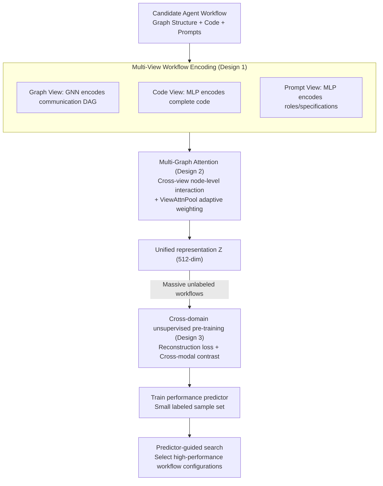

# Multi-View Encoders for Performance Prediction in LLM-Based Agentic Workflows

**Conference**: ICLR 2026  
**arXiv**: [2505.19764](https://arxiv.org/abs/2505.19764)  
**Code**: [GitHub](https://github.com/deepauto-ai/agentic-predictor)  
**Area**: Model Compression  
**Keywords**: Performance Prediction, Multi-View Encoding, Agent Workflows, Graph Neural Networks, Unsupervised Pre-training

## TL;DR

This paper proposes Agentic Predictor, a multi-view workflow encoding framework that predicts the performance of LLM Agent workflows by jointly modeling graph structure, code semantics, and prompt information, significantly reducing expensive trial-and-error evaluations.

## Background & Motivation

LLM Agent systems have developed rapidly in recent years, but optimizing their workflow configurations faces enormous search space challenges. Existing automated design methods (e.g., ADAS, AFlow) rely on a large number of LLM API calls for evaluation, which is computationally expensive. This paper proposes using a **performance predictor** as a substitute for full execution evaluation, analogous to predictor methods in Neural Architecture Search (NAS).

There are two Key Challenges:

**Workflow Heterogeneity**: Different workflows vary greatly in communication structures, prompting strategies, and tool invocation patterns, making it difficult to model them using a single unified model.

**Scarcity of Labeled Data**: Obtaining performance labels through full execution is costly, leading to insufficient data for supervised learning.

## Method

### Overall Architecture

The Core Idea of Agentic Predictor is to first compress an Agent workflow into a unified low-dimensional representation and then use a lightweight predictor to judge the quality of the workflow directly from this representation, thereby skipping expensive real execution. The entire pipeline consists of three stages: first, a multi-view encoder merges three types of heterogeneous information—the workflow's graph structure, code, and prompts—into a unified vector $\mathbf{Z}$ via multi-graph attention interactions. Second, cross-domain unsupervised pre-training is performed on a large volume of unlabeled workflows to enable the encoder to learn general representations. Finally, the predictor is trained using only a small number of samples with performance labels and is used to guide the workflow search. The first two components represent the primary Novelty (multi-view encoding + multi-graph attention + cross-domain pre-training), while the predictor and search function as downstream scaffolds reusing NAS concepts.

### Key Designs

**1. Multi-View Workflow Encoding: Characterizing heterogeneous workflows from three complementary perspectives**

A single perspective is insufficient to describe an Agent workflow—viewing only the communication graph loses specific logic, while only reading the code makes it difficult to model the dependency structure between Agents. This paper encodes from three views simultaneously: the graph view $\mathcal{G}$ models the workflow as a DAG, using a GNN to encode communication dependencies between Agents; the code view $\mathcal{C}$ uses an MLP to encode the complete workflow code, capturing logical structures and tool invocation patterns; the prompt view $\mathcal{P}$ uses an MLP to encode role descriptions and behavioral specifications within system prompts. After obtaining representations for each view, they are fused into a unified vector $\mathbf{Z} = \text{MLP}([\mathbf{Z}_\mathcal{G}, \mathbf{Z}_\mathcal{C}, \mathbf{Z}_\mathcal{P}])$ via an aggregation layer. Specifically, text is encoded into 384 dimensions by all-MiniLM-L6-v2, and code is encoded into 768 dimensions by CodeRankEmbed, followed by a unified mapping to a 512-dimensional space to align the three heterogeneous signals.

**2. Multi-Graph Attention Mechanism: Enabling node-level information exchange across views**

Simply concatenating representations from the three views does not allow them to perceive each other, whereas code snippets, prompt texts, and operator nodes in a workflow are inherently highly coupled. This paper further decomposes the workflow into three graphs: the prompt graph $\mathcal{G}_\text{prompt}$, the code graph $\mathcal{G}_\text{code}$, and the operator graph $\mathcal{G}_\text{operator}$. Information exchange is performed at the node level through cross-view self-attention, allowing an operator node to directly attend to its relevant code and prompts. During fusion, ViewAttnPool is used to adaptively learn the weight of each view's importance, allowing the model to dynamically decide whether to trust structure, code, or semantics more based on workflow characteristics, rather than using a fixed ratio for the three.

**3. Cross-Domain Unsupervised Pre-training: Learning general representations on unlabeled workflows to mitigate label scarcity**

Performance labels can only be obtained through full execution, which is high-cost and low-volume; direct supervised learning is prone to overfitting. This paper first pre-trains the encoder on a large volume of unlabeled workflows. The Goal consists of two parts: one is a reconstruction loss, requiring the encoder to reconstruct the three views from the latent representation: $\mathcal{L}_{rec} = \frac{1}{M}\sum_{i=1}^{M}\|\mathcal{G}_i - \hat{\mathcal{G}}_i\|^2 + \|\mathcal{C}_i - \hat{\mathcal{C}}_i\|^2 + \|\mathcal{P}_i - \hat{\mathcal{P}}_i\|^2$; the second is a cross-modal contrastive loss, applying InfoNCE between three pairs of views $(\mathcal{G}, \mathcal{C})$, $(\mathcal{G}, \mathcal{P})$, and $(\mathcal{C}, \mathcal{P})$ to pull different views of the same workflow closer in the representation space while pushing different workflows apart. The entire pre-training process does not involve any performance labels, fundamentally avoiding label leakage, and the learned general representations provide significant Gains in downstream low-label scenarios.

### Loss & Training

The total loss during the pre-training phase is the sum of reconstruction and contrastive losses: $\mathcal{L}_{enc} = \mathcal{L}_{rec} + \mathcal{L}_{con}$. In the predictor stage, the encoder representations are frozen and reused. The predictor selects objectives based on the task: cross-entropy loss for binary classification (whether the workflow succeeds) and MSE loss for performance regression.

## Key Experimental Results

### Main Results

| Area | Metric | Agentic Predictor | Prev. SOTA | Gain |
|------|------|-------------------|----------|------|
| Code Generation (GD) | Accuracy | 85.33% | 85.24% (Graph Trans.) | +0.09% |
| Code Generation (AF) | Accuracy | 85.62% | 84.71% (Graph Trans.) | +0.91% |
| Math (GD) | Accuracy | 66.20% | 64.84% (GAT) | +1.36% |
| Math (AF) | Accuracy | 79.56% | 76.44% (GAT) | +3.12% |
| Average | Accuracy | **79.97%** | 78.36% (GAT) | +2.05% |
| Average | Utility | **76.33%** | 73.54% (Dir-GNN) | +3.79% |

### Ablation Study

| Configuration | Average Accuracy | Average Utility | Description |
|------|-------------|-------------|------|
| Code + Graph + Text (Full) | **84.38%** | **81.88%** | Full model |
| w/o Code | Lower | Lower | Code view is vital for logic understanding |
| w/o Graph | Lower | Lower | Graph structure is vital for interaction modeling |
| w/o Text | Lower | Lower | Prompt semantics are indispensable |

### Key Findings

- The three-view encoding exhibits strong complementarity; removing any single view leads to a performance drop.
- Cross-domain unsupervised pre-training is particularly effective when labels are scarce (the pre-trained Agentic Predictor+ shows larger gains in low-label scenarios).
- The Method is search-agnostic and can be combined with any search strategy.

## Highlights & Insights

- Migrating the performance prediction concept from NAS to the field of Agent workflow optimization is a novel direction.
- Multi-view encoding fully utilizes the heterogeneous information (structure, code, semantics) of Agent workflows.
- The cross-domain pre-training strategy effectively mitigates label scarcity, demonstrating the potential of self-supervised learning in new domains.

## Limitations & Future Work

- Validated only on FLORA-Bench, which has limited dataset coverage.
- The generalization capability of the predictor across workflow changes requires further verification.
- Larger-scale Agent systems and more complex multimodal workflows have not yet been explored.
- The code and prompt encoders use fixed pre-trained models and lack end-to-end fine-tuning.

## Related Work & Insights

- Comparison with FLORA-Bench: This paper introduces multi-view encoding and unsupervised pre-training rather than a single graph view.
- Comparison with MAS-GPT: This paper uses a lightweight predictor instead of LLM fine-tuning to generate workflows.
- Concepts from NAS predictors (such as CAP, FlowerFormer) can be directly migrated to the Agent domain.

## Rating

- Novelty: ⭐⭐⭐⭐ Introducing performance prediction into Agent workflow design is a new direction.
- Experimental Thoroughness: ⭐⭐⭐ Only one benchmark is used, but ablation studies are detailed.
- Writing Quality: ⭐⭐⭐⭐ Problem definitions are clear, and the framework description is complete.
- Value: ⭐⭐⭐⭐ Practically significant for reducing the development costs of Agent systems.

<!-- RELATED:START -->

## Related Papers

- [\[ICLR 2026\] Incentivizing Agentic Reasoning in LLM Judges via Tool-Integrated Reinforcement Learning](incentivizing_agentic_reasoning_in_llm_judges_via_tool-integrated_reinforcement_.md)
- [\[CVPR 2026\] Cross-View Distillation and Adaptive Masking for Incomplete Multi-View Multi-Label Classification](../../CVPR2026/model_compression/cross-view_distillation_and_adaptive_masking_for_incomplete_multi-view_multi-lab.md)
- [\[ICLR 2026\] Parallel Token Prediction for Language Models](parallel_token_prediction_for_language_models.md)
- [\[ICLR 2026\] GmNet: Revisiting Gating Mechanisms From A Frequency View](gmnet_revisiting_gating_mechanisms_from_a_frequency_view.md)
- [\[ICLR 2026\] Towards Reliable Benchmarking: A Contamination Free, Controllable Evaluation Framework for Multi-step LLM Function Calling](towards_reliable_benchmarking_a_contamination_free_controllable_evaluation_frame.md)

<!-- RELATED:END -->
