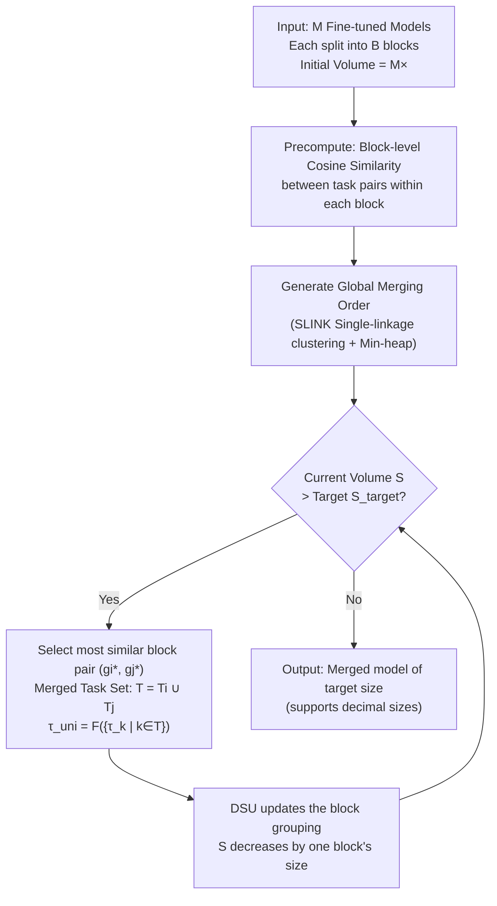

# Navigating the Accuracy-Size Trade-Off with Flexible Model Merging

**Conference**: ICLR 2026  
**OpenReview**: [https://openreview.net/forum?id=awyJs71tE7](https://openreview.net/forum?id=awyJs71tE7)  
**Code**: [https://github.com/sacs-epfl/flexmerge](https://github.com/sacs-epfl/flexmerge)  
**Area**: Model Merging / Model Compression / Multi-task Learning  
**Keywords**: Model Merging, Data-free Merging, Accuracy-Size Trade-off, Task Vectors, Block-level Greedy Merging  

## TL;DR
This paper proposes FLEXMERGE, a data-free model merging framework that decomposes each fine-tuned model into sequential blocks and greedily merges them in pairs based on block-level cosine similarity. This approach generates models of any size (including decimals) between "1× single merged model" and "M× retaining all models," providing the first systematic characterization of the "accuracy-size" trade-off curve for different merging algorithms.

## Background & Motivation
**Background**: The pretrain-then-finetune paradigm has produced a vast number of single-task fine-tuned models. Merging them into a single multi-task model (model merging) enables multi-task capabilities without requiring training data. A series of data-free methods like TA, TIES, PCB, TSV-M, EMR-MERGING, and CONSENSUS have emerged.

**Limitations of Prior Work**: Merging into a **single** model often fails to perfectly resolve parameter interference between tasks, leading to a significant accuracy gap compared to single-task fine-tuned models. This gap widens as more tasks are merged. Conversely, the other extreme—retaining independent models for each task—achieves maximum accuracy but incurs M× storage and deployment overhead.

**Key Challenge**: Accuracy and size form a continuous trade-off spectrum: one end (1×) is most space-efficient but lacks accuracy, while the other (M×) achieves full accuracy but is highly inefficient. However, existing research **almost exclusively compares algorithms at the 1× point**, leaving the rest of the spectrum unexplored. Existing work like CHANNEL MERGING attempts >1× merging but relies on K-Means clustering with a fixed K per layer, **producing only integer sizes** and lacking flexibility.

**Goal**: To answer two questions: (RQ1) How can merged models of arbitrary sizes be generated in a data-free manner? (RQ2) What are the trade-off patterns of different data-free algorithms across the entire accuracy-size spectrum?

**Core Idea**: **Move beyond the "single model" mindset**—view models as sequences of sequential blocks. Starting **bottom-up** from "retaining all models," the method greedily merges the most similar pair of blocks at each step, gradually reducing the volume until the target size is reached. This allows for arbitrary (including decimal) sizes and enables any existing data-free algorithm to be integrated as a "block-level merging subroutine."

## Method

### Overall Architecture
FLEXMERGE decomposes each task's fine-tuned model into $B$ sequential blocks (e.g., Transformer blocks, groups of layers, or single layers). It works **bottom-up**: starting with all $M$ tasks and their block-level task vectors $\tau_k^b = \theta_k^b - \theta_{pre}^b$. It iteratively selects the **pair of blocks with the highest global similarity** to merge. Each merge reduces the deployment volume by one block's size until the target volume $S_{target}$ is met. The specific merging algorithm $F$ (TA / TIES / TSV-M / CONSENSUS / EMR…) is plug-and-playable. The entire process requires no data or hyperparameter tuning.

### Key Designs

**1. Block-level greedy pairwise merging: Turning "accuracy-size" into a continuous knob.** Traditional methods fuse entire task vectors at once into $\tau_{uni} = F(\{\tau_1,\dots,\tau_M\})$, offering only the "full merge" option. FLEXMERGE operates at the **block** granularity: each block $b$ maintains a set of tuples $G_b = \{(\{k\}, \tau_k^b)\}$, tracking task coverage and corresponding block vectors. Each iteration merges the most similar pair $(g_{i^*}, g_{j^*})$ globally, unions the task sets $T_{uni} = T_{i^*} \cup T_{j^*}$, and computes the new block vector using $\tau_{uni}^b = F(\{\tau_k^b \mid k \in T_{uni}\})$. Since each step reduces volume by exactly "one block," the spectrum is finely grained, hitting **decimal sizes** like 1.75× or 2.25×—this is the key flexibility advantage over CHANNEL MERGING (integer only).

**2. Minimum cosine similarity as the merging criterion**: The similarity between two groups $g_i, g_j$ is defined as the **lowest cosine similarity between any two original block vectors** in their respective task sets:
$$\text{SIMILARITY}(g_i, g_j) = \min_{k_1 \in T_i^b,\, k_2 \in T_j^b} \text{cosine\_sim}(\tau_{k_1}^b, \tau_{k_2}^b).$$
Each step merges the pair with the "maximum of these minimum similarities" (consistent with single-linkage clustering). Ablations on max / min / average / direct vector comparison showed that **min is most stable**, ensuring segments are only merged when even the "least similar pair" is sufficiently similar, avoiding high-interference merges. While full task vector similarities are often low, **block-level** similarities are generally higher, providing effective guidance.

**3. Plug-and-play block-level merging subroutines, unifying storage formats**: $F$ can be any data-free algorithm, but storage requirements vary. FLEXMERGE unifies them: TA/TIES/Avg/PCB/TSV-M only store merged block parameters $\theta_{uni}^b = \theta_{pre}^b + \tau_{uni}^b$; CONSENSUS additionally stores pre-trained blocks, unified vectors, and per-task binary masks, reconstructing $\hat\theta_k^b = \theta_{pre}^b + \tau_{uni}^b \circ m_k^b$ at inference (its minimum size is naturally >1×, roughly 3× for 30 tasks); EMR-MERGING adds per-task scalars $\gamma_k^b$ (negligible storage). This unification allows benchmarking the entire trade-off curve across all algorithms within one framework.

**4. Efficient engineering implementation: Seconds-level merging and zero inference overhead.** Similarities are precomputed once with $O(1)$ lookup. The **SLINK algorithm** ($O(M^2)$/block) generates the merge sequence per block, which is merged into a global sequence via a **min-heap** ($O(BM\log B)$). A **Disjoint Set Union (DSU)** ($O(M\alpha(M))$ per block, $\alpha<5$) tracks task groups. Total complexity is dominated by similarity precomputation $O(BM^2 d_{max})$, where $d_{max}$ is the block dimension (much smaller than the full model dimension). Consequently, all deployment sizes for 30 tasks can be generated in ~20 seconds. At inference, >1× model tensors are **loaded into GPU once, with per-task views referencing shared memory**, ensuring larger sizes do not increase inference time.

## Key Experimental Results

### Main Results (Representative subset, Average Accuracy)

| Setting | Model | Algorithm | 1× / Min Size | Scaled Up | Gain |
|------|------|------|------|------|------|
| 8 Vision Tasks | ViT-B/32 | FlexMerge+TA | 67.5% (1×) | >80% (2×) | **+13.5%** |
| 8 Vision Tasks | ViT-B/32 | FlexMerge+TA | — | Close to Fine-tuned (~6×) | Full accuracy at 6× |
| 30 Vision Tasks | ViT-B/32 | FlexMerge+Cons. | 76% (~3×) | 84.5% (~6×) | **+8.5%** |
| 30 Vision Tasks | ViT-B/32 | FlexMerge+Cons. | — | Close to Fine-tuned (~23.5×) | Before 30x limit |
| 11 PEFT Tasks | T0-3B / (IA)³ | FlexMerge+TA | 59% (1×) | 66.2% (3×) | **+7.2%** |
| 7 FFT Tasks | T5-Large | FlexMerge+TA | <66% (1×) | 75% (2×) | **>+9%** |

### Ablation Study (ViT-B/32, 8 Tasks)

| Dimension | Candidates | Conclusion |
|------|------|------|
| Similarity Function | min / max / avg / uni | **min is optimal**; others are competitive |
| Merge Order | Left→Right / Right→Left / greedy | **greedy is optimal**; Right→Left is worst (merging specialized final layers first hurts) |
| Block Selection | random / cosine | **cosine is stable**; random is competitive but weaker across algorithms |
| Efficiency | Merge Time | All sizes for 30 tasks in **~20 seconds** |

### Key Findings
- **Small size increases lead to rapid accuracy gains**: Increasing the size from 1× to 2× yields as much as 13.5% accuracy gain, followed by gradual improvement, reaching fine-tuned accuracy **well before the maximum size** (approx. 6× for 8 tasks, 23.5× for 30 tasks). Even when forced to store "all" models, FLEXMERGE can reduce volume by ~25% with almost no performance loss.
- **Algorithm rankings change with size**: Simpler methods can overtake complex ones as size increases—vanilla averaging surpasses TIES at 3.25×, and TA equals PCB at 3×. On PEFT, PCB surpasses EMR/CONSENSUS at 4.5×. This occurs because **increased capacity inherently mitigates parameter interference**, diminishing the marginal returns of explicit de-interference mechanisms like TIES's TRIM or PCB's competition balancing. Gaps between algorithms narrow to 3–4% at larger sizes.
- **Superior to CHANNEL MERGING**: FLEXMERGE+TA outperforms CHANNEL MERGING+TA across all integer sizes while offering additional decimal support.

## Highlights & Insights
- **Accuracy-size as a continuous knob**: This design dimension has been largely ignored in model merging. The paper argues that benchmarking across the >1× range, rather than just at 1×, should be the new standard for merging algorithms.
- **Cross-algorithm comparability**: By using a unified greedy skeleton, the study clarifies the trade-off curves of various algorithms on the same axes for the first time, revealing the counter-intuitive "ranking inconsistency" phenomenon.
- **Data-free, fast, and zero inference overhead**: These features align with real-world deployment (where data may be unavailable). The engineering implementation (SLINK + Min-heap + DSU + Tensor views) makes the method truly practical.
- **Universal applicability**: Its effectiveness is validated across modalities (Vision: CLIP ViT-B/32, ViT-L/14; NLP: T5, T0-3B), fine-tuning types (FFT and PEFT), and scaling up to 30 tasks.

## Limitations & Future Work
- **Minimum size of mask-based algorithms**: Since CONSENSUS/EMR must store pre-trained weights and masks, their spectrum baseline is higher (e.g., ~3× for 30 tasks), making them not perfectly comparable to pure parameter-based methods at the low end.
- **Greedy local optima**: Single-linkage greedy merging based on minimum cosine similarity does not guarantee globally optimal task grouping. More complex grouping strategies for complex task structures remain to be explored.
- **Block-based storage statistics**: Storage requirements per block vary by algorithm; comparisons should be interpreted within specific algorithmic context.
- **Exclusion of data-dependent methods**: Data-dependent algorithms like SURGERY, ADAMERGING, and TWIN-MERGING were not explored; their potential relative gains in the >1× spectrum remain an open question.

## Related Work & Insights
- **Task Arithmetic and Data-free Merging**: TA (Task Vector Arithmetic), TIES (Redundancy removal + sign conflict resolution), PCB (Parameter competition balancing), DARE (Random drop + rescale), TSV-M (SVD singular vector orthogonalization), and mask-based methods (EMR-MERGING and CONSENSUS)—FLEXMERGE treats these as plug-and-play block-level subroutines.
- **CHANNEL MERGING as a predecessor**: It used K-Means with fixed K per layer, limited to integer sizes. FLEXMERGE surpasses it by using greedy pairwise merging to break this limitation.
- **Data-dependent methods** (FISHER, REGMEAN, ADAMERGING, SURGERY, TWIN-MERGING, WEMOE) serve as a baseline, highlighting the practical significance of the "data-free" constraint.
- **Insight**: For any compression vs. performance trade-off, first investigate the "middle ground." Expanding discrete extremes into a continuous spectrum often reveals "sweet spots" with high performance-per-cost ratios; evaluation should span the whole spectrum rather than single points.

## Rating
- **Novelty**: ⭐⭐⭐⭐⭐ — First systematic characterization of the accuracy-size trade-off in merging, proposing a unified framework for arbitrary sizes and revealing the size-dependent algorithm ranking phenomenon.
- **Experimental Thoroughness**: ⭐⭐⭐⭐⭐ — Covers Vision and NLP, FFT and PEFT, up to 30 tasks, 8 algorithms, comparison with CHANNEL MERGING, and extensive ablation/efficiency analysis.
- **Writing Quality**: ⭐⭐⭐⭐ — Clear motivation, intuitive visualizations, and rigorous analysis. Some details on block-level storage and algorithm specifics are dense and require the appendix.
- **Value**: ⭐⭐⭐⭐⭐ — Directly addresses the core deployment conflict between space and accuracy. The method is data-free, efficient at inference, and reshapes the evaluation paradigm for model merging.

<!-- RELATED:START -->

## Related Papers

- [\[ICLR 2026\] MergOPT: A Merge-Aware Optimizer for Robust Model Merging](mergopt_a_merge-aware_optimizer_for_robust_model_merging.md)
- [\[ICLR 2026\] AdaRank: Adaptive Rank Pruning for Enhanced Model Merging](adarank_adaptive_rank_pruning_for_enhanced_model_merging.md)
- [\[NeurIPS 2025\] When Worse is Better: Navigating the Compression-Generation Trade-off in Visual Tokenization](../../NeurIPS2025/model_compression/when_worse_is_better_navigating_the_compression-generation_tradeoff_in_visual_to.md)
- [\[ICLR 2026\] Expert Merging: Model Merging with Unsupervised Expert Alignment and Importance-Guided Layer Chunking](expert_merging_model_merging_with_unsupervised_expert_alignment_and_importance-g.md)
- [\[ICLR 2026\] DTO-KD: Dynamic Trade-off Optimization for Effective Knowledge Distillation](dto-kd_dynamic_trade-off_optimization_for_effective_knowledge_distillation.md)

<!-- RELATED:END -->
