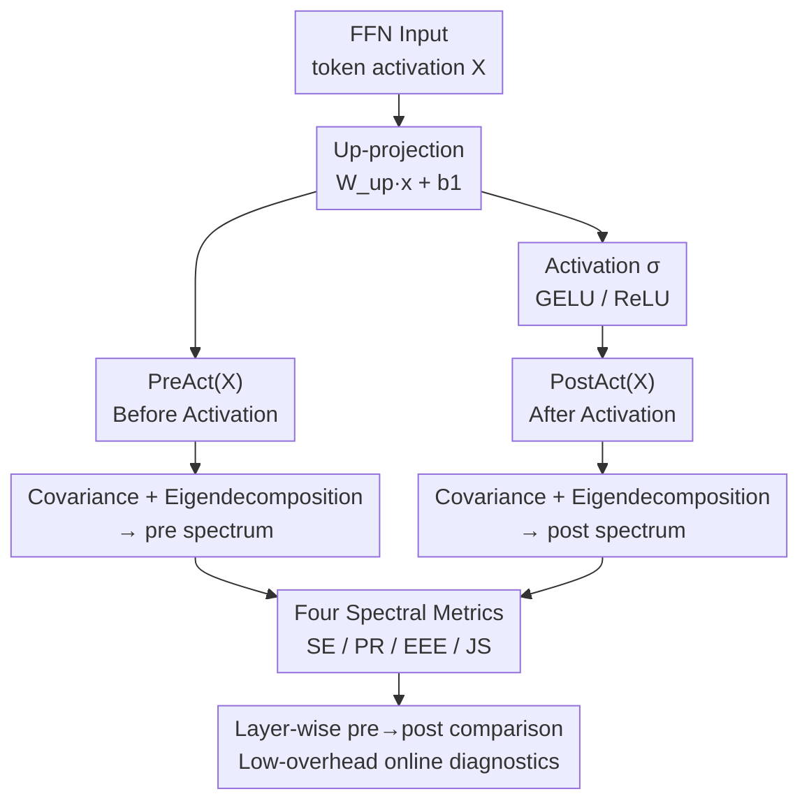

# NerVE: Nonlinear Eigenspectrum Dynamics in LLM Feed-Forward Networks

**Conference**: ICLR 2026  
**arXiv**: [2603.06922](https://arxiv.org/abs/2603.06922)  
**Code**: [Project Homepage](https://nerve-eigenspectrum.github.io/)  
**Area**: Model Compression / FFN Analysis  
**Keywords**: FFN analysis, Eigenspectrum Dynamics, Variance Reinjection, Optimizer Geometry, Spectral Diagnostics

## TL;DR

Proposes NerVE, a lightweight eigenspectrum analysis framework. Through four complementary indicators (Spectral Entropy, Participation Ratio, Early Eigenvalue Enrichment, and JS Divergence), it systematically reveals how nonlinearities in LLM FFNs reinject variance, reshape the eigenspectrum, and how architecture and optimizer choices imprint unique spectral signatures.

## Background & Motivation

In Transformers, Feed-Forward Networks (FFNs) account for the majority of parameters and computation, yet their internal dynamics are severely understudied compared to attention mechanisms. Existing work primarily focuses on attention map visualization and mechanism analysis, leaving how FFNs organize and propagate information in high-dimensional latent spaces an open question.

Key Challenge:
- FFN transformations unfold in high-dimensional spaces and cannot be directly visualized like attention maps.
- Lack of systematic and efficient tools to characterize how nonlinear activations in FFNs reshape latent representations.
- Prior works (Kobayashi et al., 2024; Balestriero et al., 2024) study FFNs from the perspective of attention maps and piecewise affine partitions, respectively, but fail to reveal how nonlinearities redistribute variance.

Key Insight: **The nonlinear activation of an FFN does not simply scale values but actively reinjects variance into underutilized feature directions**, fundamentally controlling the utilization of latent dimensions.

## Method

### Overall Architecture

NerVE observes the nonlinearity of each FFN layer as a "variance redistribution" event: it takes $\text{PreAct}(X) = W_{up}x + b_1$ after the up-projection but before activation, and $\text{PostAct}(X) = \sigma(W_{up}x + b_1)$ after activation but before down-projection (for Gated FFNs, $\text{PreAct}(X)=W_{gate}x$ and $\text{PostAct}(X)=\sigma(W_{gate}x)\odot(W_{up}x)$). Covariance matrices are estimated and eigen-decomposed for both, yielding pre- and post-activation eigenspectra. Four complementary spectral indicators are defined to compare pre $\rightarrow$ post changes per layer, characterizing exactly what the nonlinearity does to the latent representation. The entire process is layer-independent, relies only on forward activations, and can run online within the training loop.

### Key Designs

**1. Spectral Entropy (SE): Characterizing variance spreading via spectral uniformity**

The top eigenvalues alone cannot determine variance utilization, as the long tail may hide many squashed directions. SE treats normalized eigenvalues $\hat{\lambda}_i$ as a probability distribution and calculates the Shannon entropy $SE = -\sum_{i=1}^{D} \hat{\lambda}_i \log \hat{\lambda}_i$, equivalent to von Neumann entropy in quantum information. Higher SE indicates variance is spread more uniformly across directions; lower SE indicates concentration in a few modes. Since entropy is sensitive to changes in middle-to-tail eigenvalues, it detects "slightly awakened" secondary directions, crucial for determining if nonlinearities fill dead zones in latent space.

**2. Participation Ratio (PR): Directly reading the number of active dimensions**

SE provides an abstract entropy value; researchers also require an "effective dimension" reading. PR is defined as $PR = \frac{(\sum_i \lambda_i)^2}{\sum_i \lambda_i^2}$, ranging in $[1, D]$. $PR \approx 1$ indicates high anisotropy (collapse to a line), while $PR \approx D$ indicates uniform spread. Complementary to SE, PR is dominated by squared terms and is more sensitive to top eigenvalues. Thus, they cover different spectral regions—ReLU’s PR gain of 20$\times$-300$\times$ in NormFree models is captured by this metric.

**3. Early Eigenvalue Enrichment (EEE): Quantifying "top-heavy" spectra**

SE and PR are scalar summaries that lose the shape of cumulative variance climb. EEE measures the integral deviation of the cumulative spectrum $\tilde{S}_k$ relative to a uniform baseline $k/D$: $EEE = \frac{2}{D} \sum_{k=1}^{D} (\tilde{S}_k - \frac{k}{D})$. $EEE \approx 1$ implies extreme concentration in the first few directions, while $EEE \approx 0$ is close to uniform. It distinguishes two spectra with similar PR but different climb rates, showing if the nonlinearity "steeply concentrates" or "smoothly spreads" variance.

**4. Jensen-Shannon Divergence (JS): The metric spanning pre and post spectra**

The first three indicators describe single spectra but do not quantify the magnitude of change caused by the nonlinearity. JS treats the normalized pre and post spectra as distributions $P_{pre}, P_{post}$, using the midpoint $M=\tfrac{1}{2}(P_{pre}+P_{post})$ to calculate $JS(P_{pre} \| P_{post}) = \frac{1}{2} D_{KL}(P_{pre} \| M) + \frac{1}{2} D_{KL}(P_{post} \| M)$. This quantifies the distribution shift magnitude. A JS near 0 indicates "spectral inertia"—where the nonlinearity barely changes the spectrum (as seen in early layers of NormFree+GELU)—while a high JS marks layers where the nonlinearity actively reshapes the representation. Together, the four metrics provide coverage, complementary sensitivity, boundedness, and scale invariance.

### Loss & Training

NerVE is an analysis framework rather than a training method. Its low overhead comes from layer-wise streaming: covariance matrices are discarded after calculation. Peak VRAM is only $2 \times 36\text{MB}$ (for $3072 \times 3072$ matrices), adding approximately 1% to training time when recorded every 1000 steps, making it suitable as an online diagnostic. Validations cover several configurations: GPT-2 (125M) on CodeParrot (2.1B tokens); LLaMA variants (71M–1.3B) on C4; GPT-2 (350M, 160M) on FineWeb for optimizer comparison; and MLP-Mixer (B/16) on CIFAR-100 for cross-architecture verification.

## Key Experimental Results

### Main Results

Perplexity of GPT-2 baseline models under different configurations:

| Config | GELU | ReLU | NormFree GELU | NormFree ReLU | NormFree LReLU | WNorm | SNorm | HNorm |
|------|------|------|---------------|---------------|----------------|-------|-------|-------|
| PPL↓ | 2.714 | 2.774 | 3.223 | 2.988 | 3.081 | 3.041 | 3.000 | 3.122 |

Optimizer comparison (GPT-2 350M, FineWeb):

| Optimizer | PPL (512 ctx) | PPL (1024 ctx) |
|--------|---------------|----------------|
| AdamW | 33.24 | 39.26 |
| Dion | 27.68 | 33.60 |
| Muon | **25.68** | **30.95** |

### Ablation Study

| Config | Key Metric | Description |
|------|---------|------|
| Pre vs Post SE/PR | Post > Pre (Consistent) | Nonlinearity reinjects variance, expanding effective dimensionality |
| GELU vs ReLU | GELU Post-PR is higher | Smoother nonlinearities explore broader subspaces |
| NormFree + GELU | EEE_post ≈ 1, JS ≈ 0 (Early layers) | Spectral inertia—the nonlinearity becomes ineffective |
| NormFree + ReLU | PR gain 20×-300× | ReLU aggressively compensates, breaking spectral inertia |
| PreLN vs PostLN | PreLN PR/D highest and stable | PreLN provides the best "width return on investment" |
| RoPE vs NoPE | RoPE mid-deep PR is higher | RoPE prevents spectral collapse in deeper layers |

### Key Findings

1. **Variance reinjection is the core function of FFN nonlinearities**: Post-activation consistently shows higher SE and PR, and lower EEE—nonlinearities reinject variance into underutilized directions, "awakening" dead zones in latent space.
2. **Optimizers dictate the role of FFN nonlinearities—Repair vs. Refine**:
    - **AdamW**: Leads to pre-activation spectral collapse $\rightarrow$ FFN nonlinearity is forced into "repair mode" (large PR gain but low final Post-PR).
    - **Muon**: Maintains a healthy pre-activation spectrum $\rightarrow$ FFN nonlinearity only needs to "refine" (small PR gain but high final Post-PR), resulting in lower perplexity.
3. **Spectral signatures predict generalization**: Pearson correlation $|r| \geq 0.97$ between NerVE metrics (pre-activation) and validation loss, making it a viable online diagnostic tool.
4. **ReLU partially replaces LayerNorm in NormFree models**: Through aggressive variance reinjection (20$\times$-300$\times$ PR gain), ReLU recovers ~50% of the perplexity gap.
5. **Muon concentrates representation capacity in middle FFN layers**: The highest Post-PR appears in middle layers—perplexity rankings follow the Post-PR trends of middle layers.

## Highlights & Insights

- **New Perspective**: Understands FFNs via eigenspectrum dynamics, revealing the previously unrecognized core function of "variance reinjection."
- **Practical Diagnostic Tool**: NerVE monitors training online with minimal overhead (~1%) without requiring additional forward passes.
- **Cross-architecture Generalization**: Findings hold across GPT-2, LLaMA, and MLP-Mixer, suggesting a universal property of deep feed-forward networks.
- **Optimizer as Inductive Bias**: Different optimizers imprint distinct geometric signatures on FFN spectra, providing new diagnostic criteria for optimizer selection.
- **Sophisticated Metric Design**: The four metrics are sensitive to different spectral regions, preventing misinterpretation from any single scalar.

## Limitations & Future Work

1. **Layer Independence**: Does not explicitly quantify cross-layer spectral relationships, failing to capture inter-layer spectral coherence.
2. **Token Aggregation**: Mixes all token positions, ignoring position-specific spectral structures (Appendix J shows significant position dependence in LayerNorm models).
3. **Lack of Direct Causality**: NerVE metrics correlate highly with generalization but do not establish a causal link to downstream task quality.
4. **Scale Costs**: For large FFN dimensions ($D > 10K$), full-batch covariance and eigendecomposition may become expensive (though 10% token sampling retains pre-activation diagnostic power).
5. **Attention-FFN Interaction**: How FFN spectra are influenced by upstream attention layers remains unanalyzed.

## Related Work & Insights

- **RankMe** (Garrido et al., 2023) and **Diff-eRank** (Wei et al., 2024): Use spectral entropy to predict downstream performance.
- **Bao et al. (2024)**: Relation between QK weight matrix spectral concentration and attention localization.
- **Poole et al. (2016)**: Order-to-chaos phase transitions caused by nonlinearities in random networks.
- **Kobayashi et al. (2024)**: Studying FFNs from the perspective of attention maps.
- **Pascanu et al. (2025)**: Optimizers qualitatively change solutions—NerVE provides concrete spectral evidence.
- **Insight**: FFN nonlinearities are core regulators of information flow, not "auxiliary roles"; optimizer geometry is deeply coupled with the network's internal representation geometry.

## Rating
- Novelty: ⭐⭐⭐⭐⭐ (A fresh FFN eigenspectrum analysis framework; variance reinjection is a highly novel insight)
- Experimental Thoroughness: ⭐⭐⭐⭐⭐ (Extremely comprehensive: architectures × optimizers × normalization × activation × multi-scale)
- Writing Quality: ⭐⭐⭐⭐ (Content-rich, albeit long with extensive appendices)
- Value: ⭐⭐⭐⭐⭐ (Provides substantial diagnostic tools and theoretical insights for LLM architecture and optimizer design)

<!-- RELATED:START -->

## Related Papers

- [\[ICLR 2026\] Adaptive Nonlinear Compression for Large Foundation Models](adaptive_nonlinear_compression_for_large_foundation_models.md)
- [\[NeurIPS 2025\] Fin3R: Fine-tuning Feed-forward 3D Reconstruction Models via Monocular Knowledge Distillation](../../NeurIPS2025/model_compression/fin3r_fine-tuning_feed-forward_3d_reconstruction_models_via_monocular_knowledge_.md)
- [\[ICLR 2026\] KDP: Simplifying Representation Dynamics in Kernel Space](kdp_simplifying_representation_dynamics_in_kernel_space.md)
- [\[ICML 2025\] Eigenspectrum Analysis of Neural Networks without Aspect Ratio Bias](../../ICML2025/model_compression/eigenspectrum_analysis_of_neural_networks_without_aspect_ratio_bias.md)
- [\[ICLR 2026\] Training Dynamics Impact Post-Training Quantization Robustness](training_dynamics_impact_post-training_quantization_robustness.md)

<!-- RELATED:END -->
