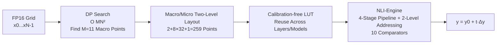

# NLI: Non-uniform Linear Interpolation Approximation of Nonlinear Operations for Efficient LLMs Inference

**Conference**: ICLR 2026  
**OpenReview**: [https://openreview.net/forum?id=SuJdcjOjgP](https://openreview.net/forum?id=SuJdcjOjgP)  
**Code**: To be open-sourced (Paper promises release of DP table search and inference code after publication)  
**Area**: Model Compression / Efficient Inference / HW-SW Co-design  
**Keywords**: Nonlinear operation approximation, Lookup Table (LUT), Dynamic Programming, FP16, NPU, HW-SW Co-design  

## TL;DR
The selection of piecewise interpolation points for nonlinear functions on an FP16 grid is modeled as a dynamic programming problem to obtain globally optimal, calibration-free non-uniform piecewise linear interpolation tables. Coupled with a two-level addressing hardware circuit, this allows nonlinear operators like SiLU, Softmax, and RMSNorm to achieve near-zero accuracy loss in LLMs while being 4 times more hardware-efficient than the SOTA.

## Background & Motivation
**Background**: LLM inference acceleration has primarily focused on linear layers—quantization methods like SmoothQuant and OSTQuant compress matrix multiplications to W8A8/W4A8, and hardware like H100 Tensor Cores or Gemmini natively support INT8 linear operations. However, nonlinear layers (SiLU, Softmax, RMSNorm) still rely on FP32 floating-point transcendental functions (exp, square root, reciprocal).

**Limitations of Prior Work**: This fragmentation is significantly magnified by hardware—on the H100 SXM5, FP16 linear throughput is 1024 times that of the Special Function Unit (SFU). Even in Attention scenarios with a head dimension of 128, the linear compute demand is only 256 times that of the nonlinear compute, making nonlinear units a bottleneck. Existing approximation schemes have critical drawbacks: (1) Operator-specific circuit-level optimizations (e.g., I-BERT, Softermax) are accurate but lack universality and fail when migrated to LLMs; (2) NN-LUT uses Linear-ReLU-Linear networks to fit piecewise linear parameters $(k, b, d)$, but it strongly depends on the range of calibration data—it was only verified on $(-5, 5)$, whereas SiLU inputs in seven mainstream LLMs often exceed $\pm100$, causing cumulative errors that lead to model collapse (e.g., Wikitext-2 PPL spikes to $7\times10^4$).

**Key Challenge**: It is difficult to simultaneously satisfy universality, calibration-free operation, and hardware-friendliness. Curvature-driven methods (allocating point density by second derivatives) require closed-form derivatives and ignore numerical precision terms; calibration-based methods tie accuracy to specific data distributions; and uniform sampling wastes budget on functions with highly non-uniform curvature.

**Goal**: Given a fixed budget of interpolation points and a nonlinear operator $f$, find a point layout on the FP16 grid that minimizes the global error observed by the hardware without relying on any calibration data, while being directly implementable in simplified hardware circuits.

**Core Idea**: **[Point Selection = Dynamic Programming]** Reformulate the selection of $M$ interpolation points from $N$ FP16 candidate points as an additive error minimization problem with optimal substructure, solved in $O(MN^2)$ time using the Bellman Principle of Optimality. **[HW-SW Co-designed Two-Level Addressing]** Constrain the point layout into a "2+8×32+1" macro/micro two-level structure, reducing LUT addressing logic to 10 comparators instead of 259.

## Method

### Overall Architecture
NLI consists of a software component (NLI-Algorithm) and a hardware component (NLI-Engine). On the software side, the entire legal FP16 domain is discretized into an ordered grid $X=\{x_0<\cdots<x_{N-1}\}$. Dynamic programming is used offline to search for $M$ optimal interpolation points, generating a lookup table that depends only on $f$ and numerical settings, independent of data distribution. On the hardware side, a four-stage pipelined universal nonlinear compute unit implements this table efficiently using two-level address translation. A key constraint is HW-SW alignment: DP only optimizes 10 macro-interval endpoints (M=11), and each of the 8 middle macro-intervals is uniformly divided into 32 segments, totaling 259 interpolation points. This preserves accuracy while simplifying hardware addressing.

### Key Designs

**1. Dynamic Programming Point Search: Decomposing approximation error into additive segment costs to find the global optimum via optimal substructure.** This is the algorithmic foundation. The authors define two DP tables $D\in\mathbb{R}^{M\times N}$ and $P\in\mathbb{Z}^{M\times N}$: $D[L,k]$ represents the minimum error on the prefix $\{x_0,\dots,x_k\}$ when $x_k$ is chosen as the $L$-th interpolation point, and $P[L,k]$ records the predecessor to allow backtracking. Within each interval $[x_i, x_k]$, the function is approximated by a line $P_{i,k}(x)$ passing through $(x_i, f(x_i))$ and $(x_k, f(x_k))$. The segment cost is defined as the **average relative error**: $\mathrm{Err}(i\to k)=\frac{1}{k-i+1}\sum_{j=i}^{k}\frac{|f(x_j)-P_{i,k}(x_j)|}{\max\{|f(x_j)|,\tau\}}$, where the denominator floor $\tau=2^{-14}$ corresponds to the smallest normal number in FP16—this prevents relative error distortion near zero. Since the total error is the sum of segment costs, the problem possesses optimal substructure, leading to the transition: $D[L,k]=\min_{i}\{D[L-1,i]+\mathrm{Err}(i\to k)+\text{last\_error}(L,k)\}$. The final cost is $\mathrm{Cost}^*=\min_k D[M-1,k]$, and the sequence is recovered via $P$. The essence of this DP is that it is **entirely calibration-free**, allowing a single table to be reused across models.

**2. Macro/Micro Two-Level Layout: Using structural constraints to reduce DP search space and achieve hardware friendliness.** Directly performing DP on 259 non-uniform points would increase search time by ~26x (~10 mins vs. ~5 hours) and require many comparators in the hardware. The authors adopt a "2+8×32+1" structure: the two boundary macro-intervals handle clamping, while the 8 middle macro-intervals are each subdivided into 32 micro-bins. Thus, DP only needs to optimize 10 macro-endpoints (M=11). Ablation studies show this constraint maintains accuracy (comparable to 259-point pure DP on MMLU/GSM8k) while drastically reducing search time from 17,000s to 610s.

**3. Two-Level Address Translation + Four-Stage Pipelined NLI-Engine: Reducing 259 comparators to 10.** Traditional linear LUTs require 259 parallel comparisons to locate an input, which is hardware-intensive. The NLI-Engine utilizes the macro/micro structure: **Stage 1** uses 10 comparators to locate the macro-interval $I$ and calculates alignment offset $\Delta x=x-\text{left}[I]$; **Stage 2** uses a pre-stored scale factor $\text{mul}[I]$ to calculate $u=\Delta x\cdot\text{mul}[I]$, then computes the micro-index $a=\lfloor u\rfloor$, coefficient $t=u-a$, and global address $g=\text{base}[I]+a$; **Stage 3** reads neighbors $y_0, y_1$ from dual-port SRAM to calculate slope $\Delta y$; **Stage 4** uses an FMA to compute $y=y_0+t\cdot\Delta y$ and rounds to FP16. This reduces comparators from 259 to 10 and LUT storage to 269 entries, significantly cutting area and power.

## Key Experimental Results

### Main Results (NLI Accuracy, 7 LLMs)

| Model | Method | MMLU↑ | GSM8k↑ | HumanEval↑ | Zero-shot Avg↑ | Wikitext-2 PPL↓ |
|------|------|-------|--------|-----------|---------------|----------------|
| Llama3-8B | FP32 | 62.16 | 50.19 | 35.37 | 68.11 | 6.14 |
| | NN-LUT | 60.01 | 49.42 | 34.15 | 65.93 | 8.28 |
| | **NLI** | 62.14 | 50.49 | 35.37 | 68.24 | 6.14 |
| Qwen2.5-7B | FP32 | 70.56 | 44.28 | 40.24 | 67.48 | 7.46 |
| | NN-LUT | 25.51 | 0 | 0 | 30.13 | 28194 |
| | **NLI** | 70.67 | 43.97 | 39.63 | 67.63 | 7.46 |
| Qwen2.5-32B | NN-LUT | 25.51 | 0 | 0 | 30.70 | 70360 |
| | **NLI** | 81.68 | 70.07 | 55.88 | 70.67 | 5.32 |

Key Insight: On Qwen models, NN-LUT **completely collapses** due to SiLU inputs falling outside the training range (GSM8k/HumanEval drop to zero), while NLI remains nearly identical to FP32 across all 7 models.

### Ablation Study (on Qwen2.5-7B)

| Ablation | Configuration | Points | MMLU | GSM8k | Search Time |
|------|------|-------|------|-------|---------|
| FP32 Baseline | – | – | 70.56 | 44.28 | – |
| Two-level NLI | 2+8×32+1 | 259 | 70.67 | 43.97 | 610s |
| Macro only (DP) | M=11 | 11 | 21.14 | 0 | – |
| Pure 259-DP | No constraints | 259 | 70.65 | 44.08 | 17000s |
| Uniform 259 | Uniform | 259 | 45.91 | 18.13 | – |
| Curvature 259 | By Curvature | 259 | 65.74 | 32.58 | – |

### Hardware Comparison (SMIC 28nm, 1GHz)

| Method | Area (µm²) | Power (mW) | Throughput | Efficiency | Comparators |
|------|-----------|----------|------|------|-------|
| NN-LUT | 23238 | 46 | 1G | 0.94 | 256 |
| RI-LUT | 23647 | 48 | 1G | 0.88 | 256 |
| **NLI** | **7787** | **34** | 1G | **3.78** | **10** |

### Key Findings
- **Calibration dependency is fatal for NN-LUT**: With 259 points, Uniform sampling drops to 45.91 MMLU and Curvature to 65.74, while DP maintains 70.65. This proves that "globally optimal layout" rather than "number of points" is the key to accuracy.
- **Two-level constraint is essentially free**: Pure 259-DP and two-level NLI are comparable in accuracy, but the former is 28x slower to search and hardware-unfriendly.
- **Hardware area reduced by 68-69%, efficiency increased by ~4.1x**: This stems from reducing comparators from 256 to 10 and LUT entries from 512 to 269.
- **Generalization beyond LLM**: No significant accuracy drop when replacing nonlinear operators in ViTs or CNNs.

## Highlights & Insights
- **Elegant Problem Reformulation**: Shifting from empirical point placement to a DP-based global optimization under the Bellman principle is a transition from "heuristic" to "provably optimal."
- **Focus on Numerical Precision**: Using relative error with an FP16 lower bound $\tau=2^{-14}$ demonstrates deep understanding of numerical stability at the hardware level.
- **HW-SW Co-design Loop**: The macro/micro layout is a "win-win-win" constraint that benefits DP search speed, accuracy, and hardware addressing logic simultaneously.
- **The Power of Calibration-free**: Reusing tables across layers and models eliminates the operational burden of data collection and model-specific tuning, which is ideal for edge deployment.

## Limitations & Future Work
- **Offline DP Overhead**: Although the 11-point version takes ~10 minutes, generating a new table is required for each new operator or numerical precision; online updates are not discussed.
- **Synthetic Hardware Metrics**: Results are based on SMIC 28nm synthesis from Design Compiler, lacking validation from actual silicon tape-out (PPA and timing closure).
- **Hard-coded Hyperparameters**: The choice of 10 macro and 32 micro bins is empirical. Their optimality for more pathology-prone functions remains to be tested.
- **Code Availability**: Comparisons with NN-LUT rely on the authors' own implementation, introducing some uncertainty.
- **Inference Only**: The method is designed for inference; the impact of NLI on gradients during training is not explored.

## Related Work & Insights
- **Linear Layer Quantization** (SmoothQuant, OSTQuant): Complements NLI by targeting linear bottlenecks while NLI handles the nonlinear ones.
- **Specialized Operator Approximation** (I-BERT, Softermax): Often limited to specific operators (like GELU) or models (like BERT); NLI provides a universal approach resistant to large outliers.
- **General LUT Methods** (NN-LUT, RI-LUT): NLI directly addresses their issues regarding calibration range collapse and hardware efficiency.
- **Insight**: Explicitly encoding hardware constraints into the objective function of an approximation algorithm is a high-level paradigm for co-design.

## Rating
- **Novelty**: ⭐⭐⭐⭐ — Solid reformulation of point selection as provably optimal DP with HW-SW co-design; while LUTs themselves are not new, the combination is a clear advancement.
- **Experimental Thoroughness**: ⭐⭐⭐⭐ — Comprehensive coverage across 7 LLMs, ViT/CNN generalization, multiple ablations, and 28nm synthesis. Minor deduction for lack of tape-out and open-source code.
- **Writing Quality**: ⭐⭐⭐⭐ — Motivated well by the collapse of prior works; clear descriptions of DP and hardware stages.
- **Value**: ⭐⭐⭐⭐ — Addresses the underestimated nonlinear bottleneck in edge LLM deployment with attractive gains in hardware efficiency and deployment flexibility.

<!-- RELATED:START -->

## Related Papers

- [\[ICLR 2026\] GlowQ: Group-Shared Low-Rank Approximation for Quantized LLMs](glowq_group-shared_low-rank_approximation_for_quantized_llms.md)
- [\[ICLR 2026\] Draft-based Approximate Inference for LLMs](draft-based_approximate_inference_for_llms.md)
- [\[ICLR 2026\] MaskPro: Linear-Space Probabilistic Learning for Strict (N:M)-Sparsity on LLMs](maskpro_linear-space_probabilistic_learning_for_strict_nm-sparsity_on_llms.md)
- [\[ICLR 2026\] GradPruner: Gradient-guided Layer Pruning Enabling Efficient Fine-Tuning and Inference for LLMs](gradpruner_gradient-guided_layer_pruning_enabling_efficient_fine-tuning_and_infe.md)
- [\[ICLR 2026\] Adaptive Nonlinear Compression for Large Foundation Models](adaptive_nonlinear_compression_for_large_foundation_models.md)

<!-- RELATED:END -->
