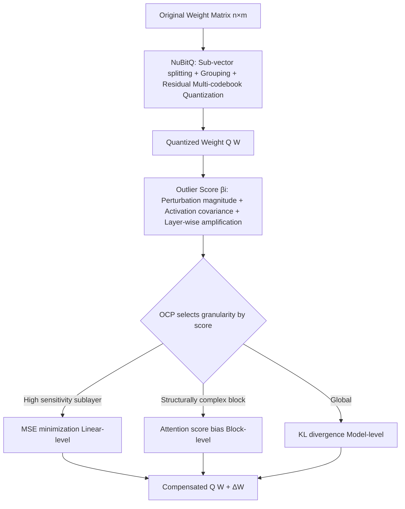

# No Outlier Channels but with Outlier Blocks

**Conference**: ICLR 2026  
**OpenReview**: [https://openreview.net/forum?id=qVQVVZMRVT](https://openreview.net/forum?id=qVQVVZMRVT)  
**Code**: [https://github.com/maoshanwen/NuBitQ-OCP](https://github.com/maoshanwen/NuBitQ-OCP)  
**Area**: Model Compression / LLM Quantization  
**Keywords**: Non-uniform quantization, Vector quantization, Outlier compensation, Arbitrary bit-width, LLM compression, Codebook  

## TL;DR
This paper points out that outliers in non-uniform quantization are no longer concentrated in "outlier channels" as in uniform quantization, but appear scattered as "outlier blocks." Accordingly, it proposes NuBitQ, a flexible arbitrary bit-width quantization framework, with an external Hessian-free and fine-tuning-free Outlier Compensation Plug-in (OCP). It achieves near-lossless 4-bit quantization and significantly outperforms existing non-uniform quantization methods at 2-bit.

## Background & Motivation
**Background**: LLM deployment is limited by massive memory and computational requirements, with quantization being a core compression technique. Uniform quantization divides the numerical range at equal intervals and uses per-channel scale/zero-points but is extremely sensitive to outliers (rare large magnitudes), causing errors to concentrate in high-variance channels. Consequently, methods like LLM.int8, AWQ, and FlatQuant employ outlier isolation, sensitivity-based channel precision enhancement, or affine transformations for "outlier channel" compensation. Non-uniform quantization (AQLM, VPTQ, GPTVQ, QuIP#, etc.) uses clustered codebooks to fit the actual weight distribution, offering smaller global errors and enabling lower bit-widths.

**Limitations of Prior Work**: Non-uniform quantization introduces two overlooked issues. First, SOTA methods rely on fixed codebooks, augmented codebooks, or residual fitting to reduce total error but ignore "sensitivity differences"—not all errors are equally harmful. BCQ and GPTVQ attempt to solve this using layer-wise fine-tuning or Hessian-guided clustering, but the overhead of Hessian calculation and fine-tuning is high, making them difficult to scale to massive models. Second, and more critically: **the manifestation of outliers changes under non-uniform quantization**. Clipping in uniform quantization creates significant "outlier channels," whereas non-uniform quantization errors are smaller and more dispersed, rendering traditional magnitude-based (first-order) per-channel outlier detection completely ineffective.

**Key Challenge**: Existing outlier compensation strategies are all designed for "outlier channels," but non-uniform quantization has no outlier channels—its harmful outliers exist in the form of "local blocks" and are input-dependent. **Core Idea**: First, use a set of theoretical metrics to quantify the "real impact of outliers within each Transformer block on model output," and then perform multi-granularity hierarchical compensation, bypassing Hessian calculations and fine-tuning entirely.

## Method

### Overall Architecture
The method consists of two parts: **NuBitQ** is responsible for the flexible non-uniform quantization backbone (arbitrary bits, layer-wise customized multi-codebook vector quantization), and **OCP (Outlier Compensation Plug-in)** is a plug-and-play compensation module driven by an "outlier score," performing hierarchical compensation at three granularities: linear, Transformer-block, and full-model. OCP can be attached to NuBitQ or other methods like AQLM/VPTQ/GPTVQ.

### Key Designs
**1. NuBitQ: Flexible Multi-codebook Quantization for Arbitrary Bits—Turning "Compression-Accuracy" into Searchable Knobs.** Given an $n\times m$ weight matrix, it is first split into $\frac{n\times m}{d}$ sub-vectors of dimension $d$, then uniformly divided into $g$ groups, each with a learnable scaling factor $q$. A codebook with $c$ centroids is built for each group (using beam search of width $b$ during k-means to improve clustering quality). Residual quantization is introduced: using $r$ serial codebooks, where the first encodes the original sub-vector and each subsequent one encodes the residual from the previous step. Thus, each sub-vector is approximated by $r$ index sequences. The compression rate can be analytically written as $R \approx \frac{r\times \log_2 c}{32\times d}$ (codebook storage is negligible for large weights). By grid-searching $r, c, d$, one can freely adjust between high precision and ultra-low bits, enabling "arbitrary bit-width and layer-wise differentiation."

**2. Discovery of Outlier Blocks and Outlier Score: Quantifying "Harmful Outliers" as a Computable Scalar via Jacobian Propagation.** The authors conducted 2-bit block-wise quantization experiments on LLaMA3-8B and found that quantization sensitivity varies greatly between blocks (e.g., quantizing block 1 alone causes the largest PPL spike). Further refinement to sublinear layers and specific input samples proved that outliers are "not isolated channels but local blocks, and are input-dependent." Thus, the outlier impact of the $i$-th block is defined starting from the weight perturbation $\Delta W_{i,j}=W^\star_{i,j}-Q(W_{i,j})$, using the Jacobian to describe its propagation to the output $\Delta Y_L = J_{i\to L}\sum_{j=1}^{7}J_{i,j}(\Delta W_{i,j})$, and approximating the expected Frobenius norm of the output perturbation as $I_i := \mathbb{E}\|\Delta Y_L\|_F^2 \approx \sum_{j}\mathbb{E}[(\Delta W_{i,j})^\top M_{i,j}(\Delta W_{i,j})]$. Borrowing from Hessian trace approximation, it is decomposed into three interpretable factors—perturbation magnitude $\|\Delta W_{i,j}\|_F^2$, the trace of the input activation covariance $\mathrm{tr}(C_{i,j})$ (sensitivity to perturbation), and the product of subsequent layer weight norms $\prod_{k=i+1}^{L}\|W_k\|_F^2$ (layer-wise amplification). Logarithms are used to integrate scale differences, yielding the block-level outlier score:

$$\beta_i = \sum_{j=1}^{7}\left(\log\|\Delta W_{i,j}\|_F^2 + \log \mathrm{tr}(C_{i,j}) + \sum_{k=i+1}^{L}\log\|W_k\|_F^2\right)$$

This combines "weight perturbation + activation statistics + cross-layer propagation" into a single scalar without requiring actual Hessian computations.

**3. Multi-granularity Hierarchical Compensation: Choosing Compensation Intensity by Outlier Score for Cost-Effectiveness.** OCP maintains an outlier codebook pool and selects entries using a sliding window, corresponding to three compensation targets. Each optimizes only the compensation term $\Delta W$ to make $Q(W)+\Delta W$ closer to the original weights. The finest **Linear-level MSE minimization** aligns outputs directly: $\Delta W^\star_{i,j}=\arg\min_{\Delta W_{i,j}}\mathbb{E}_{x}\|x W^\star_{i,j}-x Q^\star\|_F^2$, fine-tuned with activation statistics, suitable for sublayers with prominent outlier scores; **Block-level Attention Bias minimization** $\theta^\star_i=\arg\min_{\theta_i}\|A^\star_i-A_i(\theta_i)\|_F^2$ preserves self-attention capability, suitable for structurally complex layers with stable perturbations; the coarsest **Model-level KL Divergence minimization** $\theta^\star=\arg\min_\theta \mathbb{E}_{x_{\le t}}D_{KL}(p^\star\|p)$ directly increases the probability of generating correct tokens, ensuring global semantic consistency. The key insight is that "improvement comes from the optimization objective itself rather than specific compensation means"; thus, all three are superior to traditional quantization and can be allocated based on score and resource budget.

## Key Experimental Results
Evaluation follows the LLMCBench protocol on LLaMA3, Qwen3, and Gemma2 series (8B~70B), comparing against AQLM(A), VPTQ(V), and GPTVQ(G). Metrics include WikiText2/PTB perplexity and accuracy on tasks like MMLU, QNLI, MNLI, AdvGLUE, and TruthfulQA.

### Main Results (WikiText2 PPL ↓, Selected)

| #Bits | Method | Llama3-8B | Qwen3-8B | Gemma2-9B | Llama3-70B |
|---|---|---|---|---|---|
| 16 | FP16 | 5.57 | 8.58 | 10.69 | 2.53 |
| 4 | AQLM | 6.04 | 8.91 | 10.91 | 2.85 |
| 4 | GPTVQ | 5.81 | 8.86 | 10.70 | 2.63 |
| 4 | **NuBitQ** | **5.79** | **8.81** | **10.68** | **2.59** |
| 3 | **NuBitQ+OCP** | **5.66** | **8.87** | **10.80** | **2.98** |
| 2 | AQLM | 7.28 | 10.15 | 12.27 | 5.52 |
| 2 | VPTQ | 9.19 | 1.65e6 | 3.27e6 | 6.19 |
| 2 | **NuBitQ+OCP** | **6.42** | **9.35** | **11.45** | **4.99** |

At 4-bit, NuBitQ achieves the lowest PPL without OCP, approaching FP16 as model size increases. At 2-bit, NuBitQ+OCP leads by a large margin; VPTQ collapses to million-level PPL on Qwen3/Gemma2 due to lack of Hessian data.

### Task Accuracy and Plug-and-play (LLaMA3-8B)

| Method | #Bits | MMLU Avg ↑ | QNLI ↑ |
|---|---|---|---|
| FP16 | 16 | 62.18 | 40.95 |
| NuBitQ | 4 | 60.88 | 42.05 |
| NuBitQ+OCP | 3 | **62.07** | 40.79 |
| NuBitQ+OCP | 2 | 56.77 | **49.60** |
| VPTQ vs VPTQ+OCP | 2 | 43.69 → 45.53 | 34.54 → 36.78 |

MMLU for 3-bit NuBitQ+OCP is nearly identical to FP16 (62.07 vs 62.18), with some metrics even exceeding FP16. Attaching OCP to VPTQ/AQLM/GPTVQ generally further reduces PPL and improves accuracy, with particularly significant gains for VPTQ when its own optimizations are disabled.

### Ablation Study (LLaMA3-8B)

| Compensation Strategy | Time(s) | Mem | ΔPPL ↑ |
|---|---|---|---|
| Random | 7.43 | 1.00% | 1.00× |
| Linear | 51.65 | 1.00% | 5.27× |
| Transformer | 15.53 | 0.29% | 2.26× |
| Model | 8.33 | 0.14% | 2.12× |

### Key Findings
- Outliers are a "block-level" rather than a "channel-level" phenomenon and depend on input samples—this is the fundamental difference between non-uniform and uniform quantization.
- Linear-level compensation is the most effective (5.27× $\Delta$PPL) but also the costliest; Transformer/Model levels offer significant gains with extremely low memory usage, forming a "cost-effectiveness ladder."
- The hyperparameter $r$ has the most significant impact on PPL with an optimal range, while smaller $d$ is generally better—providing a basis for layer-wise differential configuration.
- OCP gains are most pronounced for smaller models (7B/13B) and lower bit-widths (2-bit).

## Highlights & Insights
- **Paradigm Correction**: The title is the thesis—"No outlier channels, but with outlier blocks." Falsifying the community's default assumption that "outlier = channel" in the context of non-uniform quantization is a clear and verifiable insight.
- **Hessian-free / Fine-tuning-free**: The outlier score uses a Jacobian + Frobenius norm approximation to replace the Hessian trace, and OCP only optimizes the compensation term, offering significantly better scalability than second-order methods like GPTVQ/BCQ.
- **Decoupled Design**: NuBitQ (quantization backbone) and OCP (compensation plugin) are orthogonal. OCP can provide "free" gains to competing methods, possessing high practical value.
- **Arbitrary Bit-width**: Uses grid search over $r, c, d, g$ to make the compression-accuracy trade-off continuously adjustable rather than using a fixed codebook.

## Limitations & Future Work
- The outlier score formula involves multiple approximation steps (Jacobian simplification, Frobenius norm substitution, log integration), and its alignment with real output impact is primarily validated empirically; theoretical tightness needs strengthening.
- Linear-level compensation is effective but time-consuming (51.65s); automatic scheduling strategies for the three granularities (threshold selection) remain somewhat heuristic for large-scale deployment.
- Experiments focus on LLaMA/Qwen/Gemma text models (7B~70B); MoE, multimodal models, and actual hardware inference speedups (at the kernel level) are not fully explored.
- The grid search for NuBitQ's $r, c, d, g$ incurs tuning costs, and the degree of automation for layer-wise optimal configuration is limited.

## Related Work & Insights
- **Non-uniform Quantization**: QuIP# (spherical sub-Gaussian + fixed codebook), VPTQ (channel-independent second-order optimization), AQLM (additive quantization + layer-wise fine-tuning), GPTVQ (dimension elevation + MSE/Hessian). Ours differs by being Hessian-free + adaptive codebook + explicit outlier block compensation.
- **Outlier Processing**: From LLM.int8/SmoothQuant (first-order magnitude/smoothing) to GPTQ/Rotation/Affine (second-order Hessian), all target "outlier channels." Ours builds on observations by Gong et al. regarding how quantization methods determine outlier forms, focusing on "outlier block" compensation in non-uniform quantization.
- **Insights**: The approach of multiplying "perturbation magnitude × input sensitivity × layer-wise amplification" for the outlier score could be transferred to pruning importance estimation, mixed-precision bit allocation, and KV-cache quantization where "ranking by real impact" is required.

## Rating
- **Novelty**: ⭐⭐⭐⭐ — The perspective shift from "outlier channels to outlier blocks" is clear and empirically supported. The outlier score and multi-granularity compensation designs are systematic, though components (VQ, residual codebooks, Jacobian approximation) are largely recombinations of existing ideas.
- **Experimental Thoroughness**: ⭐⭐⭐⭐ — Covers 6 models across 3 series, 4/3/2-bit, multiple tasks, and validates OCP's plug-and-play gains on competitors; lacks hardware measurements for inference speed/throughput.
- **Writing Quality**: ⭐⭐⭐⭐ — The title hits the mark; the narrative progression in Figure 3 from "block → sublinear → sample" is clear, and the formulas connect well with the motivation; some approximation steps are brief.
- **Value**: ⭐⭐⭐⭐ — Hessian-free/fine-tuning-free + plug-and-play compensation is highly practical for low-bit LLM compression. The lead at 2-bit and OCP's universality are strong selling points.

<!-- RELATED:START -->

## Related Papers

- [\[ICLR 2026\] CodeQuant: Unified Clustering and Quantization for Enhanced Outlier Smoothing in Low-Precision Mixture-of-Experts](codequant_unified_clustering_and_quantization_for_enhanced_outlier_smoothing_in_.md)
- [\[ICML 2026\] OSAQ: Outlier Self-Absorption for Accurate Low-bit LLM Quantization](../../ICML2026/model_compression/osaq_outlier_self-absorption_for_accurate_low-bit_llm_quantization.md)
- [\[ACL 2025\] Accurate KV Cache Quantization with Outlier Tokens Tracing](../../ACL2025/model_compression/accurate_kv_cache_quantization_with_outlier_tokens_tracing.md)
- [\[ICLR 2026\] QVLA: Not All Channels Are Equal in Vision-Language-Action Model's Quantization](qvla_not_all_channels_are_equal_in_vision-language-action_models_quantization.md)
- [\[ACL 2025\] Outlier-Safe Pre-Training for Robust 4-Bit Quantization of Large Language Models](../../ACL2025/model_compression/outlier-safe_pre-training_for_robust_4-bit_quantization_of_large_language_models.md)

<!-- RELATED:END -->
