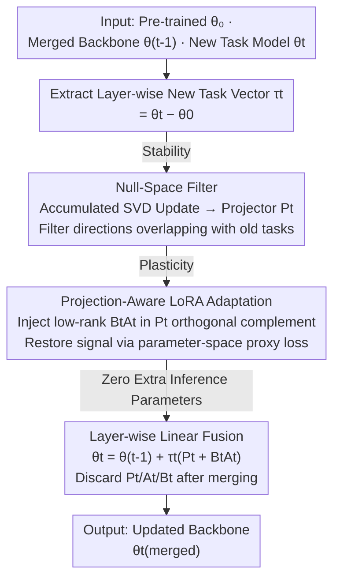

# Null-Space Filtering for Data-Free Continual Model Merging: Preserving Stability, Promoting Plasticity

**Conference**: ICLR 2026  
**arXiv**: [2509.21413](https://arxiv.org/abs/2509.21413)  
**Code**: [GitHub](https://github.com/zihuanqiu/NUFILT)  
**Area**: Model Compression  
**Keywords**: Model Merging, Continual Learning, Null-Space Projection, Stability-Plasticity, Data-Free

## TL;DR

Ours proposes the NUFILT framework, which leverages the geometric property that "task vectors approximately align with representation subspaces." By using null-space filtering to suppress interference to old tasks and projection-aware LoRA to restore plasticity for new tasks, NUFILT achieves continual model merging without any data access. It outperforms OPCM by 4-8% across vision, NLP, and multimodal benchmarks, approaching the upper bound of independent fine-tuning.

## Background & Motivation

**Background**: Data-Free Continual Model Merging (DFCMM) is a prominent direction in model reuse. The scenario involves multiple tasks independently fine-tuned into several models, which need to be **gradually merged** into a universal backbone **without accessing any original task data** due to privacy and storage constraints. The entire merging process must operate solely in the parameter space.

**Limitations of Prior Work**: The core contradiction in DFCMM is the balance between stability and plasticity—merging new tasks must not destroy knowledge of existing tasks (stability) while faithfully absorbing new task capabilities (plasticity). Existing methods have flaws: (1) Simple arithmetic operations like Weight Averaging and Task Arithmetic lead to parameter interference and signal cancellation, resulting in poor stability; (2) Orthogonal projection methods like OPCM force task vectors into orthogonal subspaces, which excessively curtails new task signals and sacrifices plasticity when tasks are naturally correlated (e.g., EuroSAT and RESISC45 are both remote sensing classification); (3) Adaptive strategies like AdaMerging and WEMOE require auxiliary data to adjust fusion coefficients, violating the data-free constraint.

**Key Challenge**: The root problem is that stability and plasticity are inherently **data-level** concepts (interference is evaluated on old task data, and adaptation on new task data), but DFCMM prohibits data access. Finding an effective proxy for data-level objectives in the **parameter space** remains an open problem.

**Key Insight**: The authors observe a key geometric property: **the principal direction of a task vector approximately aligns with the representation subspace of that task's data**. Intuitively, parameter changes from fine-tuning primarily occur along directions driven by task data. This suggests that the SVD subspace of task vectors can serve as a data-free proxy for the data representation subspace, transforming data-level losses into projection operations in the parameter space.

**Core Idea**: Since task vectors approximately align with data subspaces, null-space projection is used to ensure old task features remain undisturbed (stability), while projection-aware LoRA injects new task signals into the subspace that does not interfere with old tasks (plasticity). Both are linearly fused to ensure no additional inference overhead.

## Method

### Overall Architecture

NUFILT takes a pre-trained model $\theta_0$, a merged backbone $\theta_{t-1}^{\text{merged}}$, and a new task model $\theta_t$ as input, and outputs the updated backbone $\theta_t^{\text{merged}}$. The process is executed layer-wise through three stages: **Filtering** → **Adapting** → **Fusing**. The filtering stage constructs a null-space projector to remove components in the new task vector that overlap with old tasks; the adaptation stage uses a lightweight LoRA module under projector constraints to restore the overly filtered new task signal; the fusion stage linearly merges the projector, task vector, and LoRA parameters into the backbone. These stages correspond to stability (preserving the old) → plasticity (supplementing the new) → zero-overhead deployment.

### Key Designs

**1. Null-Space Filter: Filtering out components overlapping with old tasks to ensure stability**

Directly adding new tasks causes interference and destroys old knowledge. NUFILT calculates the accumulated update from the pre-trained model to the currently merged model $\tilde{\tau}_{\leq t-1}^{(l)} = \theta_{t-1}^{\text{merged},(l)} - \theta_0^{(l)}$, performs SVD to obtain the top-$r_p$ right singular vectors $\hat{V}_{\leq t-1}^{(l)}$, and constructs the null-space projection matrix $P_t^{(l)} = I - \hat{V}_{\leq t-1}^{(l)} \hat{V}_{\leq t-1}^{(l)\top}$. This projector nullifies components falling within the old task subspace—for any $x^{(l)} \in \text{span}(\hat{V}_{\leq t-1}^{(l)})$, $P_t^{(l)} x^{(l)} = 0$. Consequently, intermediate representations of old tasks remain unaffected after merging. Unlike OPCM's orthogonal projection, NUFILT projects onto the **accumulated update** rather than individual task vectors, more accurately characterizing the parameter space occupied by old tasks.

**2. Projection-Aware LoRA: Injecting signals in the filtered subspace to restore plasticity**

While filtering ensures stability, it sacrifices plasticity. NUFILT extends the projector to $P_t^{(l)} + B_t^{(l)} A_t^{(l)}$, where $A_t^{(l)} \in \mathbb{R}^{r_l \times d_i}$ and $B_t^{(l)} \in \mathbb{R}^{d_o \times r_l}$ are low-rank matrices. The LoRA degrees of freedom allow $\tau_t^{(l)} B_t^{(l)} A_t^{(l)}$ to introduce new directions in the orthogonal complement of the old task subspace. The optimization objective is a pure parameter-space proxy loss:

$$\mathcal{L}(A_t, B_t) = \|\mathcal{T} - (M + \tau_t^{(l)} B_t^{(l)} A_t^{(l)}) \hat{V}\|_F^2$$

where $\mathcal{T}$ concatenates target projections for old and new tasks, and $M$ represents the filtered base parameters. This loss maintains consistency for the old task subspace $\hat{V}_{\leq t-1}$ (stability) while tracking the original model's behavior for the new task subspace $\hat{V}_t$ (plasticity). Theorem 1 ensures that the parameter-space projection terms act as an effective upper bound for data-level loss.

**3. Layer-Wise Linear Fusion: Merging parameters for zero inference overhead**

The final update formula is $\theta_t^{\text{merged},(l)} = \theta_{t-1}^{\text{merged},(l)} + \tau_t^{(l)}(P_t^{(l)} + B_t^{(l)} A_t^{(l)})$. Since $\tau_t^{(l)}$, $P_t^{(l)}$, and $B_t^{(l)} A_t^{(l)}$ are linear operations, their product can be computed as a single matrix and added to the weights. After merging, $P$, $A$, and $B$ are discarded, maintaining the same parameter count and inference cost as a single model. This is a core advantage over methods like WEMOE, which require additional expert modules during inference.

### Loss & Training

**Mechanism**: Theorem 1 establishes the alignment between task vectors and representation subspaces. Defining subspace affinity $\mathcal{A}(V_d^{(l)}, \hat{V}^{(l)}) = \frac{1}{r_d}\|\hat{V}^\top V_d\|_F^2 \in [0,1]$, experiments show that affinity for matched task pairs is significantly higher than for non-matched pairs across 8 datasets and ViT-B/16 layers, confirming the alignment hypothesis.

**Data-Free Upper Bound**: Corollary 1 transforms the data-level stability/plasticity loss bound into parameter-space projection terms. When the subspace misalignment $\zeta$ is small, $\|\Delta \tau \cdot X^\top\|_F^2$ is controlled by a constant multiple of $\|{\Delta \tau} \cdot \hat{V}\|_F^2$, providing the theoretical basis for proxy losses.

**Training Configuration**: Uniform hyperparameters are used without task-specific tuning. Null-space rank $r_p=128$, LoRA rank $r_l=64$, and task projection rank $r_v=8$. Each task requires only 50 Adam optimization steps (LR $10^{-3}$), with a total solving time of ~18 seconds per task.

## Key Experimental Results

### Main Results (Vision Tasks, Mean of 10 Random Task Orders)

| Method | Extra Param/Data | ViT-B/32 ACC (8 tasks) | ViT-B/32 ACC (20 tasks) | ViT-L/14 ACC (8 tasks) | ViT-L/14 ACC (20 tasks) |
|------|:---:|:---:|:---:|:---:|:---:|
| Pre-Trained | - | 48.1 | 55.6 | 64.9 | 65.6 |
| Individual Fine-Tuned | - | 90.4 | 89.8 | 94.3 | 93.5 |
| Weight Averaging | ✗/✗ | 66.3 | 61.1 | 80.0 | 71.1 |
| Task Arithmetic | ✗/✗ | 67.5 | 60.0 | 82.1 | 70.3 |
| OPCM | ✗/✗ | 75.5 | 65.7 | 87.0 | 76.0 |
| WUDI-Merging | ✗/✗ | 74.7 | 63.7 | 87.5 | 78.1 |
| Iso-C | ✗/✗ | 71.7 | 67.6 | 86.9 | 80.9 |
| **Ours (NUFILT)** | **✗/✗** | **83.6** | **71.0** | **91.6** | **84.7** |

NUFILT reaches 83.6% ACC on ViT-B/32 (8 tasks), 8.1% higher than OPCM. On ViT-L/14, it trails Individual Fine-Tuning by only 2.7% (91.6% vs 94.3%). BWT for ViT-L/14 (8 tasks) is -1.1% (vs -2.6% for OPCM), indicating less forgetting. For NLP (Flan-T5 on GLUE), NUFILT achieves 83.7% ACC. Multimodal results (LLaVA-1.5-7B) show a 2.9% Gain over OPCM.

### Ablation Study (ViT-B/32)

| Configuration | Null-space/LoRA | ACC 8-tasks | ACC 20-tasks | BWT 8-tasks | BWT 20-tasks |
|------|:---:|:---:|:---:|:---:|:---:|
| Naive Merging (Direct $\tau_t$) | ✗/✗ | 62.1 | 34.3 | -18.5 | -24.7 |
| Null-space only | ✓/✗ | 80.0 | 67.0 | -1.7 | -6.2 |
| LoRA only (no Null-space) | ✗/✓ | 75.8 | 51.7 | -10.2 | -20.6 |
| **Ours (NUFILT Full)** | **✓/✓** | **83.6** | **71.0** | **-2.7** | **-8.9** |

### Key Findings

- **High Complementarity**: Null-space projection alone provides excellent stability (BWT -1.7%) but limited plasticity (ACC 80.0%). LoRA alone provides decent plasticity but severe forgetting (BWT -10.2%). Combining them improves ACC by 3.6% with minimal BWT impact.
- **Hyperparameter Insensitivity**: ACC varies <2% for $r_p \in [64, 256]$. Performance saturates as $r_l$ increases from 16 to 128.
- **Linear Scalability**: The advantage over OPCM remains consistent as tasks grow from 8 to 20, suggesting slow degradation of null-space projection.

## Highlights & Insights

- **Subspace Alignment Discovery**: This geometric property provides a new theoretical perspective: task vectors are not just parameter differences; they encode the representation structure of the task.
- **Divide-and-Conquer Strategy**: By decoupling stability (via projection) and plasticity (via LoRA), NUFILT avoids the difficulty of optimizing for two conflicting goals simultaneously.
- **Linear Fusion**: All auxiliary structures are absorbed during merging, ensuring deployment is identical to a single model, which is crucial for large-scale application.

## Limitations & Future Work

- **SVD Computational Cost**: Performing SVD at each layer for every task may be expensive for LLMs. Incremental or randomized SVD could be used for acceleration.
- **Task Order Sensitivity**: Although the mean performance is high, the standard deviation increases with the number of tasks.
- **Alignment Assumptions**: When cross-modal tasks are mixed (e.g., Vision vs. Language), the alignment between task vectors and subspaces may weaken.
- **Cumulative Errors**: As tasks increase, the available null-space dimensions shrink, leading to accelerated plasticity decline over very long task sequences.

## Related Work & Insights

- **vs OPCM**: OPCM uses a "hard orthogonal" strategy by projecting into the complement of prior task vectors. Ours projects onto the null-space of **accumulated updates** and adds LoRA to recover components removed by projection.
- **vs WUDI-Merging**: WUDI relies on task vector statistics to adjust weights. NUFILT provides explicit theoretical guarantees (Theorem 1) and significantly better BWT (-2.7% vs -17.0%).

## Rating

- Novelty: ⭐⭐⭐⭐ 
- Experimental Thoroughness: ⭐⭐⭐⭐⭐ 
- Writing Quality: ⭐⭐⭐⭐ 
- Value: ⭐⭐⭐⭐ 

<!-- RELATED:START -->

## Related Papers

- [\[NeurIPS 2025\] Mingle: Mixture of Null-Space Gated Low-Rank Experts for Test-Time Continual Model Merging](../../NeurIPS2025/model_compression/mingle_mixture_of_null-space_gated_low-rank_experts_for_test-time_continual_mode.md)
- [\[NeurIPS 2025\] Weight Weaving: Parameter Pooling for Data-Free Model Merging](../../NeurIPS2025/model_compression/weight_weaving_parameter_pooling_for_data-free_model_merging.md)
- [\[ICML 2025\] Rethinking the Stability-Plasticity Trade-off in Continual Learning from an Architectural Perspective](../../ICML2025/model_compression/rethinking_the_stability-plasticity_trade-off_in_continual_learning_from_an_arch.md)
- [\[ICLR 2026\] LS-Merge: Merging Language Models in Latent Space](ls-merge_merging_language_models_in_latent_space.md)
- [\[ICLR 2026\] MergOPT: A Merge-Aware Optimizer for Robust Model Merging](mergopt_a_merge-aware_optimizer_for_robust_model_merging.md)

<!-- RELATED:END -->
