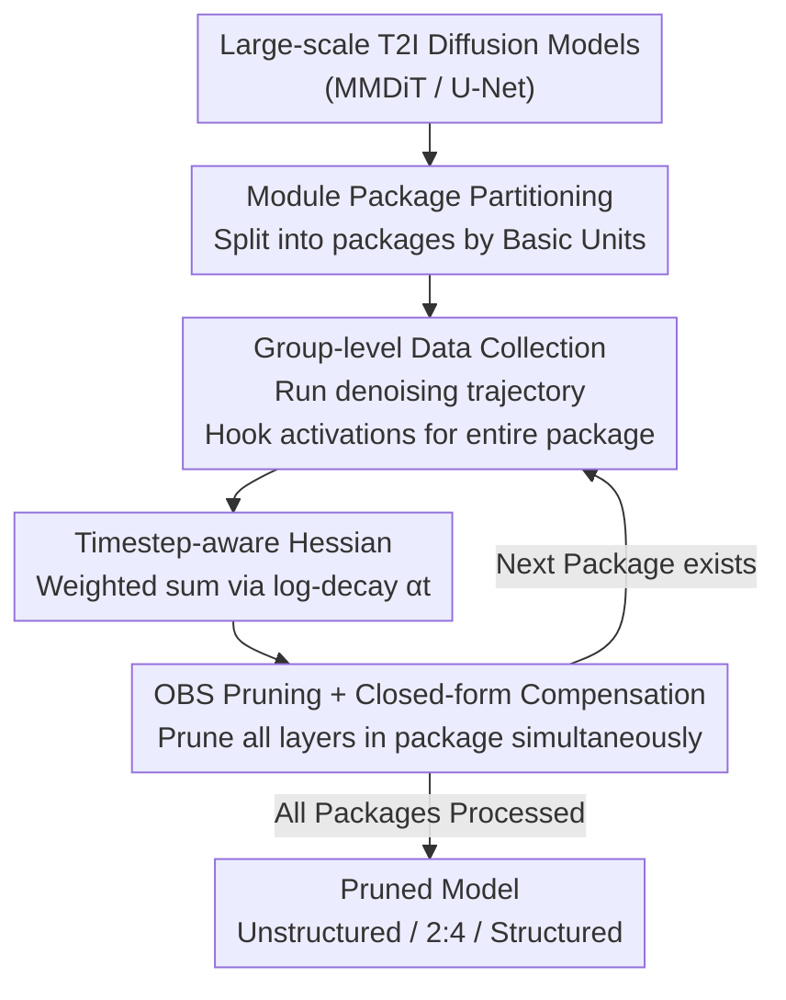

# OBS-Diff: Accurate Pruning For Diffusion Models in One-Shot

**Conference**: ICLR 2026  
**OpenReview**: [https://openreview.net/forum?id=eYdPMpW5os](https://openreview.net/forum?id=eYdPMpW5os)  
**Code**: https://github.com/Alrightlone/OBS-Diff  
**Area**: Model Compression / Diffusion Models  
**Keywords**: One-shot Pruning, Optimal Brain Surgeon, Timestep-aware Hessian, Text-to-Image Diffusion Models, Training-free Compression

## TL;DR
OBS-Diff resurrects and adapts the classic Optimal Brain Surgeon (OBS) pruning for large-scale text-to-image diffusion models. Through a "Timestep-aware Hessian," it makes pruning criteria more sensitive to early denoising steps. By using "Module Packages," it amortizes expensive layer-wise calibration. Without requiring any training or fine-tuning, it supports unstructured, N:M semi-structured, and structured granularities, significantly outperforming baselines like Wanda and DSnoT at high sparsities (50%–70%).

## Background & Motivation
**Background**: Large-scale text-to-image diffusion models (SD3, SD3.5-Large 8B, Flux.1-dev 12B) achieve stunning results but carry billions of parameters, making inference and VRAM costs prohibitively high. Efficiency can be improved via two paths: reducing denoising steps/distillation for faster sampling, or model compression (quantization and pruning). This work focuses on pruning.

**Limitations of Prior Work**: Existing diffusion model pruning methods (Diff-Pruning, BK-SDM, LD-Pruner, EcoDiff, etc.) suffer from two main issues. First is a **lack of generality**; most are tailored for U-Net and are difficult to migrate to new architectures like MMDiT (Multimodal Diffusion Transformer). Second is the **high pruning cost**, either depending on gradient information or requiring expensive post-pruning fine-tuning (EcoDiff even requires training a mask with extensive hyperparameter tuning). Furthermore, unstructured/semi-structured pruning remains largely unexplored for large-scale T2I diffusion models.

**Key Challenge**: While mature one-shot training-free pruning methods exist in the LLM domain (SparseGPT, Wanda), they **cannot be directly applied to diffusion models**. The root cause lies in the **iterative nature** of diffusion—the same set of parameters is reused across $T$ denoising timesteps, whereas layer-wise pruning in LLMs targets a single forward pass. Simple application discards the critical information that "parameter importance varies across timesteps," and layer-wise calibration would require running the entire multi-step denoising trajectory for every layer, leading to explosive costs.

**Goal**: To develop a **universal, training-free, one-shot** pruning framework capable of handling various architectures (U-Net / MMDiT), supporting multiple sparsity granularities (unstructured / N:M / structured), and keeping calibration costs acceptable.

**Key Insight**: Re-examine from the perspective of "error accumulation"—pruning errors introduced in the early stages of the denoising trajectory (small $t$) propagate and amplify throughout all subsequent steps. Thus, pruning criteria must prioritize protecting early steps. Simultaneously, expensive layer-wise calibration is replaced with "group-wise batch" calibration.

**Core Idea**: Resurrect OBS second-order pruning, modify its Hessian into a "weighted sum across timesteps" (with higher weights for earlier steps), and use "Module Packages" to amortize the cost of multiple denoising trajectory calibrations.

## Method

### Overall Architecture
OBS-Diff is a one-shot, training-free, layer-wise post-training pruning framework. It first partitions target modules (linear layers of MHA and FFN within MMDiT blocks) into several **Module Packages** and processes them sequentially. For each package, a complete denoising trajectory is run using a few text prompts; forward hooks concurrently collect activations for all modules in the package across all timesteps. These are used to construct a **Timestep-aware Hessian**. Under the guidance of this Hessian, **OBS** simultaneously prunes redundant weights and applies closed-form compensation to the remaining weights for all layers in the package before moving to the next. Network states are updated sequentially between packages but remain static during intra-package collection, preserving the accuracy of sequential calibration at a coarser "group level" while reducing trajectory runs from "once per layer" to "once per package."

### Key Designs

**1. Timestep-aware Hessian: Focusing Pruning Criteria on Error-Prone Early Steps**

Standard layer-wise pruning objectives $\arg\min_{\hat{W}_l}\lVert W_l X_l - \hat{W}_l X_l\rVert_2^2$ are suitable for single forward passes but insufficient for iterative diffusion models. Pruning errors affect the denoising trajectory unevenly; errors in early steps (small $t$) propagate backward and compound across all subsequent steps, causing the most damage to the final image. OBS-Diff rewrites the objective as a **timestep-weighted reconstruction error**: $\arg\min_{\hat{W}_l}\mathbb{E}_{t\sim[1,T]}\big[\alpha_t\lVert W_l X_{l,t}-\hat{W}_l X_{l,t}\rVert_2^2\big]$, where the weight $\alpha_t$ follows a logarithmic decay schedule:

$$\alpha_t=\alpha_{\min}+\frac{\alpha_{\max}-\alpha_{\min}}{\ln(T)}\ln(T-t+1),\quad t\in\{1,\dots,T\},$$

Ensuring $\alpha_1>\alpha_2>\cdots>\alpha_T>0$, where early steps receive the highest weight with smooth attenuation. Accordingly, second-order information becomes a weighted sum across all timesteps $H_l=2\sum_{t=1}^{T}\alpha_t\,\mathbb{E}[X_{l,t}X_{l,t}^{\top}]$, termed the "Timestep-aware Hessian." OBS saliency scores derived from its inverse matrix are thus more sensitive to weights critical for the "early formation stage," making pruning results more faithful to the original model. Ablations (Table 6) show that log-decay significantly outperforms uniform, linear, or log-increase weighting, validating the "heavy-early" hypothesis.

**2. Module Packages: Amortizing Calibration Costs via Group-wise Profiling**

Sequential layer-wise calibration (like SparseGPT) is disastrous for diffusion models—every layer would require a full multi-step denoising run. OBS-Diff processes layers in batches using **Module Packages**. A **Basic Unit** (a set of layers with independent, parallelizable inputs, e.g., Q/K/V projections) is defined, and one or more Basic Units form a **Module Package**. Each package is calibrated and pruned together. Processing involves **group-level data collection** for each package—running a single denoising trajectory on the calibration set and using forward hooks for concurrent input statistics for all modules in the package. Each layer is then pruned simultaneously using its respective Timestep-aware Hessian. Crucially, **network states are updated sequentially between packages but remain static during intra-package collection**. This maintains the core properties of sequential calibration at a coarser granularity while drastically compressing the number of trajectory runs. The trade-off is higher VRAM usage for storing multiple Hessians; however, experiments (Table 7) show pruning accuracy is insensitive to package count (ImageReward only fluctuates between 0.8429–0.8569 for 1, 4, 10, or 20 packages). This makes the package count a flexible "time-for-VRAM" knob: 1 package is fastest (572 s) but uses 30.67 GB, while 20 packages are most memory-efficient (22.08 GB) but slower (2595 s).

**3. Multi-granularity Extension: Unified OBS Saliency for Unstructured, Semi-structured, and Structured Pruning**

OBS-Diff uses single-weight OBS saliency $L_q=\frac{w_q^2}{2[H^{-1}]_{qq}}$ and closed-form compensation $\delta w=-\frac{w_q}{[H^{-1}]_{qq}}H^{-1}_{:,q}$ as a unified foundation. For **semi-structured (2:4)**, the 2 weights with the lowest OBS saliency in every 4 are pruned. For **structured** pruning, single-weight saliency is aggregated by column to determine the importance of entire neurons or attention heads. For instance, FFN neurons use $L_q=\frac{\sum W_{:,q}^2}{2[H^{-1}]_{qq}}$, and MHA heads use $L_j=\sum_{k=1}^{d}\frac{\sum (W^j)_{:,k}^2}{(H^{j\,-1})_{k,k}}$, pruning those with the lowest scores. A specific challenge is **joint attention in MMDiT**, where shared heads process concatenated multimodal inputs but diverge into modality-specific output projections (text/vision), resulting in **two sets of importance rankings**. OBS-Diff uses **Reciprocal Rank Fusion (RRF)** to merge these into a single decision list $S^{\text{RRF}}_j=\frac{1}{k+\text{rank}_A(j)}+\frac{1}{k+\text{rank}_B(j)}$ (where $k$ is a stabilization term, e.g., 60), then updates the entire output projection using the full Hessian. This unified saliency + RRF allows OBS-Diff to handle both MMDiT and U-Net across all three granularities.

### Loss & Training
The entire process is **training-free and fine-tuning-free**. Pruning is completed within the closed-form OBS framework. Calibration only requires running a few text prompts from GCC3M to collect activations, involving no backpropagation or gradients. Pruning SD3-Medium (2B) takes less than 15 minutes on a single RTX 4090.

## Key Experimental Results

### Main Results
Evaluations cover SD v2.1-base (866M), SD3-Medium (2B), SD3.5-Large (8B), Flux.1-dev (12B), and SDXL. Metrics include FID↓, CLIP↑, and ImageReward↑ (MS-COCO 2014 val set, 5K prompts).

Unstructured pruning shows the most prominent advantage at high sparsities:

| Model | Sparsity | Method | FID ↓ | CLIP ↑ | ImageReward ↑ |
|------|--------|------|-------|--------|----------------|
| SD3-Medium | Dense | — | 36.14 | 0.3162 | 0.9029 |
| SD3-Medium | 50% | Wanda | 43.98 | 0.3000 | -0.1076 |
| SD3-Medium | 50% | **Ours** | **27.20** | **0.3167** | **0.6468** |
| SD3-Medium | 60% | Wanda | 170.33 | 0.2352 | -2.0641 |
| SD3-Medium | 60% | **Ours** | **28.49** | **0.3099** | **0.1213** |
| SD3.5-Large | 60% | Wanda | 48.80 | 0.2859 | -0.6402 |
| SD3.5-Large | 60% | **Ours** | **29.15** | **0.3119** | **0.3984** |

Structured pruning also dominates (SD3.5-Large, Table 4): at 15% sparsity, L1-norm FID collapses from 31.59 to 158.89, and EcoDiff performs worse (230.97), while OBS-Diff stays at 32.64. At 30% sparsity, where L1-norm/EcoDiff fail completely (327/346), OBS-Diff maintains 34.51. For SDXL (U-Net) at 30% sparsity, OBS-Diff FID is 29.75 vs. EcoDiff 101.96, proving cross-architecture universality.

### Ablation Study

| Configuration | ImageReward ↑ | Description |
|------|----------------|------|
| Uniform | 0.6355 | No timestep differentiation |
| Linear increase | 0.6174 | Heavy late steps (worst) |
| Log increase | 0.6244 | Heavy late steps |
| Linear decrease | 0.6384 | Heavy early steps |
| **Log decrease** | **0.6438** | Heavy early steps (selected) |

| Packages | VRAM (GB) ↓ | Time (s) ↓ | ImageReward ↑ |
|------|-------------|-----------|----------------|
| 1 | 30.67 | 572.20 | 0.8569 |
| 4 | 24.05 | 896.52 | 0.8442 |
| 10 | 22.75 | 1539.37 | 0.8429 |
| 20 | 22.08 | 2594.95 | 0.8564 |

### Key Findings
- **Timestep weighting direction is critical**: All "decreasing" strategies (prioritizing early steps) outperform "increasing" or uniform strategies, validating the core hypothesis of error accumulation; log-decay is optimal.
- **Module packages are pure Time-VRAM knobs**: Accuracy is nearly invariant to the number of packages (0.8429–0.8569), allowing users to trade time for memory.
- **Higher sparsity, greater advantage**: Baselines generally collapse at 50%–70% sparsity (yielding severe artifacts), while OBS-Diff remains coherent and high-quality, particularly in semantic metrics.
- **FID is unreliable here**: Pruned models sometimes have lower FID than dense models (e.g., Magnitude at 40%), but visual quality is not better. Authors warn against over-reliance on FID.
- **Efficiency Gains**: Testing with a single MMDiT block shows 1.31× speedup for 30% structured pruning and 1.23× for 2:4 semi-structured pruning.

## Highlights & Insights
- **Translating "Error Accumulation" into a Hessian Weight**: The insight that early denoising steps compound errors is implemented elegantly—multiplying the Hessian sum by a log-decay $\alpha_t$. This requires no change to the closed-form OBS solution and zero training, yet significantly boosts fidelity. This "old algorithm + time-aware weight" approach is transferable to other post-training compression tasks like quantization or low-rank decomposition.
- **Module Packages Decouple Accuracy from Cost**: By using "intra-package static, inter-package sequential" states, the framework preserves the accuracy of sequential calibration while amortizing trajectory costs. The fact that accuracy is insensitive to package count enables pruning 2B models on consumer cards like the 4090 in 15 minutes.
- **RRF Resolving Joint Attention Conflicts**: Merging dual-modality importance scores for shared attention heads via Reciprocal Rank Fusion is a clean engineering solution for any scenario where a component is scored by multiple views.

## Limitations & Future Work
- **VRAM scales with package count**: Storing multiple Hessians requires significant memory (30 GB for 1 package); for ultra-large models, the "time-for-VRAM" knob may be strained at both ends.
- **Modest Speedups**: Structured 30% only yields 1.31×; the primary value is "quality preservation at high sparsity" rather than extreme acceleration. Ends-to-end gains when combined with sampling step compression are not deeply explored.
- **Prompt Distribution Dependence**: Calibration relies on text prompts from GCC3M; robustness to out-of-distribution prompts and sensitivity to calibration set size deserve more systematic evaluation.
- **Empirical Decay Schedule**: The shape of $\alpha_t$ and parameters $\alpha_{\min}/\alpha_{\max}$ are empirically set; whether they are optimal for all samplers/steps or could be learned adaptively remains an open question.

## Related Work & Insights
- **vs Wanda / DSnoT**: Both are one-shot training-free LLM pruning methods. This work adapts them to diffusion models via "Module Packages" as baselines. OBS-Diff wins using full second-order OBS + Timestep-aware Hessian versus Wanda's activation norm approximation.
- **vs SparseGPT**: Part of the OBS lineage for layer-wise post-training pruning. SparseGPT targets single forward passes; applying it directly to diffusion would be prohibitively expensive and ignore timestep variance. OBS-Diff's adaptations (timestep weighting + module packages) bridge these gaps.
- **vs EcoDiff / Diff-Pruning**: These require training masks/gradients and fine-tuning. EcoDiff furthermore requires extensive tuning. OBS-Diff is entirely training-free and universal across MMDiT and U-Net.

## Rating
- Novelty: ⭐⭐⭐⭐⭐ Systematically resurrects OBS for large T2I models and addresses iterative denoising via Timestep-aware Hessians.
- Experimental Thoroughness: ⭐⭐⭐⭐⭐ Covers five models (866M–12B), three granularities, and both U-Net and MMDiT architectures, including extensive ablations.
- Writing Quality: ⭐⭐⭐⭐ Clear link between motivation (error accumulation) and implementation; Figure 2 is intuitive; structured extension formulas are somewhat dense.
- Value: ⭐⭐⭐⭐⭐ Training-free, runs in 15 minutes on consumer hardware, and preserves quality at high sparsity—highly practical for diffusion model deployment.

<!-- RELATED:START -->

## Related Papers

- [\[ICLR 2026\] REAP the Experts: Why Pruning Prevails for One-Shot MoE Compression](reap_the_experts_why_pruning_prevails_for_one-shot_moe_compression.md)
- [\[ICLR 2026\] Gradient-Aligned Calibration for Post-Training Quantization of Diffusion Models](gradient-aligned_calibration_for_post-training_quantization_of_diffusion_models.md)
- [\[ICML 2025\] SlimLLM: Accurate Structured Pruning for Large Language Models](../../ICML2025/model_compression/slimllm_accurate_structured_pruning_for_large_language_models.md)
- [\[CVPR 2026\] BinaryAttention: One-Bit QK-Attention for Vision and Diffusion Transformers](../../CVPR2026/model_compression/binaryattention_one-bit_qk-attention_for_vision_and_diffusion_transformers.md)
- [\[ICLR 2026\] SliderQuant: Accurate Post-Training Quantization for LLMs](sliderquant_accurate_post-training_quantization_for_llms.md)

<!-- RELATED:END -->
