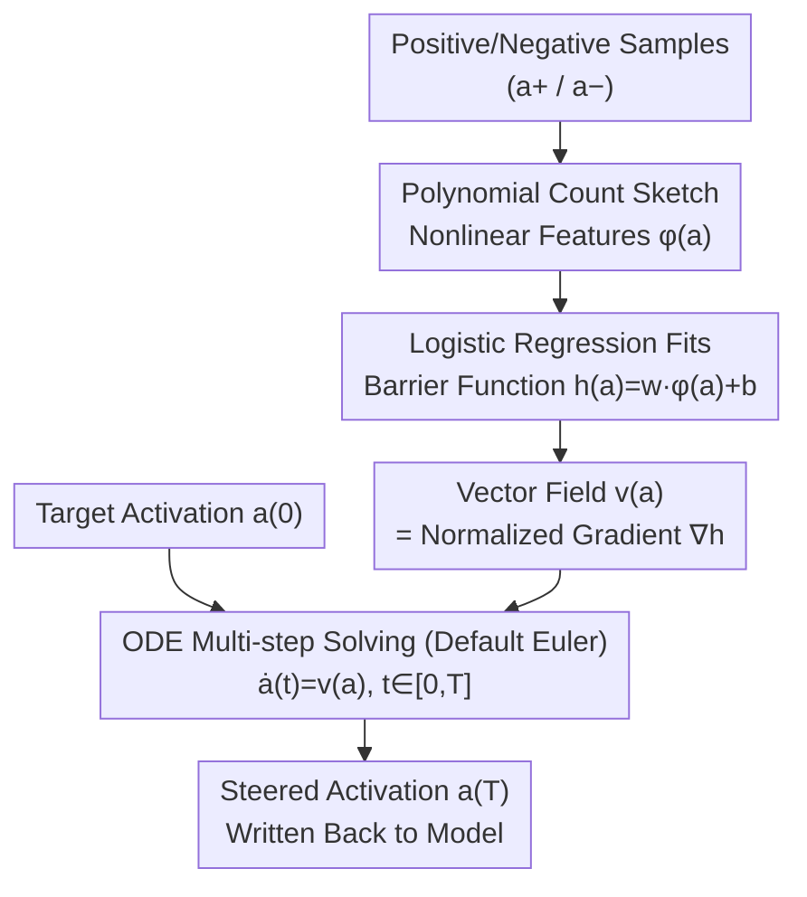

# ODESteer: A Unified ODE-Based Steering Framework for LLM Alignment

**Conference**: ICLR 2026  
**arXiv**: [2602.17560](https://arxiv.org/abs/2602.17560)  
**Code**: [Project Page](https://odesteer.github.io)  
**Area**: Model Compression  
**Keywords**: Activation Steering, ODE, Barrier Function, Control Theory, Inference-time Alignment

## TL;DR

This paper proposes a unified theoretical framework for activation steering based on Ordinary Differential Equations (ODEs), interpreting traditional activation addition as Euler discretization of an ODE and equating steering direction identification to defining a barrier function. Based on this, the ODESteer method is designed to achieve fine-grained steering through multi-step adaptive ODE solving, yielding improvements of 5.7% on TruthfulQA, 2.5% on UltraFeedback, and 2.4% on RealToxicityPrompts.

## Background & Motivation

**Background**: Activation Steering (or Representation Engineering) is a lightweight method for inference-time LLM alignment. It guides model behavior (e.g., enhancing helpfulness or truthfulness) by directly modifying internal activations without altering model weights or retraining. Representative methods include RepE, CAA (Contrastive Activation Addition), and ITI (Inference-Time Intervention).

**Limitations of Prior Work**:
1. **Lack of a Unified Theoretical Framework**: Existing methods are divided into "Input-Reading" (extracting activation differences between positive and negative samples) and "Output-Optimization" (maximizing a scoring function). These categories rely on completely different principles, making systematic comparison and deep understanding difficult.
2. **Reliance on Single-Step Steering**: Most existing methods employ a single-step addition $\tilde{a} = a + T \cdot v(a)$. Such coarse-grained modifications struggle to capture the fine patterns of complex activation distributions.
3. **Insufficient Expressivity of Linear Steering**: CAA uses mean differences and ITI uses linear probes, both resulting in a fixed vector that fails to adaptively adjust.

**Key Challenge**: Inference-time alignment requires fine-grained, adaptive activation control, yet existing approaches suffer from either weak theoretical foundations or limited expressivity—how can multi-step adaptive steering be achieved within a unified theoretical framework?

**Goal**: Starting from a key observation—traditional activation addition $\tilde{a} = a + T \cdot v(a)$ is precisely the first-order Euler discretization of the ODE $\dot{a}(t) = v(a(t))$. Based on this, identifying the steering direction is equivalent to designing the vector field of an ODE, which in turn is equivalent to defining a Barrier Function in control theory.

## Method

### Overall Architecture

ODESteer reimagines activation steering as solving an Initial Value Problem (IVP) for an ODE: an activation $a$ evolves from its initial value to time $T$ along a vector field $\dot{a}(t)=v(a(t))$, where the integration time $t$ represents the steering strength. In this view, "identifying the steering direction" is equivalent to "defining a barrier function $h(a)$"—ensuring the vector field always moves along the ascent of $h$, pushing activations toward the desired region. The implementation consists of two stages: **offline**, where a nonlinear barrier function is fitted using positive and negative activations; and **online**, where its normalized gradient is used as the vector field to perform multi-step numerical ODE solving for each target activation, advancing from $a(0)$ to $a(T)$ before writing back to the model. The figure below illustrates the offline learning + online solving pipeline of ODESteer.

### Key Designs

**1. Interpreting Activation Addition as Euler Discretization: Exposing Single-Step Approximation Errors**

Almost all existing methods use single-step addition $\tilde{a}=a+T\cdot v(a)$. This work points out that this is exactly the first-order Euler discretization of the ODE $\dot{a}(t)=v(a(t))$: expanding $a(T)=a(0)+\dot{a}(0)\cdot T=a(0)+T\cdot v(a(0))$ recovers activation addition. This suggests that traditional practices are essentially **single large jumps** along an ideal trajectory, where the first-order approximation introduces $\mathcal{O}(T^2)$ error. When activation distributions are complex or trajectories are curved, the single-step endpoint significantly deviates from the true desired location. By decomposing the evolution into multiple small adjustments and re-evaluating the direction at each step, discretization errors can be suppressed, providing the theoretical basis for ODESteer's multi-step solver.

**2. Unifying "Input-Reading" and "Output-Optimization" via Barrier Functions: A Common Language for Direction Identification**

Drawing from Barrier Functions in control theory, a desired region is defined as $\mathcal{C}=\{a\mid h(a)\geq 0\}$. As long as the vector field satisfies $\nabla_a h(a)^\top v(a)>0$, activations will asymptotically enter and remain within $\mathcal{C}$—much like a co-pilot in an autonomous vehicle constantly correcting the car back to a safe path. In this language, two seemingly different paradigms implicitly select $h$: input-reading methods (e.g., CAA, ITI) use the log-density ratio of positive/negative activations $h(a)=\log\frac{p_+(a)}{p_-(a)}$ (CAA assumes a Gaussian mean difference, ITI uses a logistic regression probe); output-optimization methods (e.g., RE-Control) use a scoring function minus a threshold $h(a)=s(a)-\varepsilon$. This unification demonstrates that by selecting a more expressive $h$, better steering directions can be derived within the same framework.

| Category | Representative Method | Implicit Barrier Function |
|:---|:---|:---|
| Input-Reading (Mean Diff) | CAA/RepE | Log-density ratio (Gaussian) |
| Input-Reading (Probe) | ITI | Log-density ratio (Logistic) |
| Output-Optimization | RE-Control | Score function minus threshold |

**3. ODESteer: Nonlinear Barrier Function + Numerical Solver Feedback Control**

Since direction identification reduces to choosing a barrier function, ODESteer defines it as nonlinear: $h(a)=w^\top\phi(a)+b$, where $\phi:\mathbb{R}^d\to\mathbb{R}^D$ is a Polynomial Count Sketch feature mapping. Activations are normalized to the unit $\ell_2$ norm before mapping to ensure numerical stability. $w$ and $b$ are learned via logistic regression on the random polynomial features of positive/negative activations without training a neural network. The corresponding vector field is taken as the normalized gradient of the barrier function $\dot{a}(t)=\frac{J_\phi(a(t))^\top w}{\|J_\phi(a(t))^\top w\|}$ (where $J_\phi$ is the Jacobian of the feature map; normalization prevents excessive steps in high-gradient regions). Finally, a standard numerical solver advances from $a(0)$ to $\tilde{a}=a(T)=\text{ODESolve}(v(\cdot),a,[0,T])$. The simple Euler method is used by default. This steering differs from prior work in three ways: the vector field depends on the current activation and recomputes directions dynamically (closed-loop feedback vs. fixed-vector open-loop control); multi-step adjustments reduce discretization error; and the implementation relies only on logistic regression and Polynomial Count Sketch, maintaining low computational overhead without strong distributional assumptions.

## Key Experimental Results

### Main Results: Comprehensive Evaluation Across Three Models and Three Tasks

Evaluations were conducted on Falcon-7B, Mistral-7B, and LLaMA3.1-8B for Helpfulness (UltraFeedback), Truthfulness (TruthfulQA), and Detoxification (RealToxicityPrompts):

| Method | UltraFeedback Win% ↑ | TruthfulQA T×I% ↑ | Toxicity ↓ |
|:---|:---:|:---:|:---:|
| Original (Falcon-7B) | 50.0 | 29.0 | 0.257 |
| CAA | 52.8 | 35.0 | 0.244 |
| ITI | 50.5 | 34.7 | 0.243 |
| Linear-AcT | 50.7 | 35.1 | 0.248 |
| RE-Control | 51.4 | 31.7 | 0.219 |
| **ODESteer** | **56.3** | **42.2** | **0.188** |
| Original (Mistral-7B) | 50.0 | 39.3 | 0.215 |
| CAA | 53.4 | 45.9 | 0.190 |
| HPR | 52.3 | 50.4 | 0.127 |
| Linear-AcT | 54.6 | 46.0 | 0.189 |
| **ODESteer** | **56.1** | **59.9** | **0.109** |

**Key Findings**:
- ODESteer achieves SOTA or second-best results across all model/task combinations.
- The largest gain occurs on TruthfulQA with Mistral-7B: from 39.3% to 59.9% (+20.6%), significantly outperforming all baselines.
- For detoxification, Mistral-7B's Toxicity dropped from 0.215 to 0.109, a 49% reduction.

### Ablation Study: Component Contribution Analysis

| Configuration | TruthfulQA T×I% | UltraFeedback Win% |
|:---|:---:|:---:|
| Linear Features + Single-step | 35.1 | 50.7 |
| Nonlinear Features + Single-step | 37.8 | 52.1 |
| Linear Features + Multi-step | 36.5 | 51.9 |
| **Nonlinear Features + Multi-step (Ours)** | **42.2** | **56.3** |

The ablation study confirms the complementarity of the two core designs:
- Nonlinear features (Polynomial Count Sketch) provide a +2.7% boost on TruthfulQA.
- Multi-step ODE solving adds +1.4%.
- Their combination yields a super-linear gain (+7.1% vs. the additive sum of +4.1%).

## Highlights & Insights

### Pros

1. **Significant Theoretical Contribution**: Establishes a rigorous link between activation steering and ODEs/control theory, providing a unified mathematical foundation for the field.
2. **Elegant and Simple**: The core implementation depends only on logistic regression and polynomial features, resulting in extremely low computational overhead.
3. **Thorough Experimentation**: Covers 3 models across 3 tasks with detailed ablations validating each design choice.

### Limitations of Prior Work

1. Multi-step ODE solving introduces additional inference latency; the paper does not provide a detailed analysis of the latency-performance trade-off.
2. The barrier function requires manually collected contrastive datasets for positive and negative samples; data quality directly impacts steering effectiveness.
3. Selection of nonlinear feature dimensions and polynomial degrees requires hyperparameter tuning, for which the paper only provides empirical guidance.

### Rating

⭐⭐⭐⭐

**Reason for Recommendation**: ODESteer elevates activation steering from an "empirical trick" to a "theoretical framework." The unified perspective of ODEs and barrier functions not only explains existing methods but also naturally derives the superior ODESteer approach. The tight integration of theory and experiments provides significant guidance for inference-time alignment research.

<!-- RELATED:START -->

## Related Papers

- [\[ACL 2026\] Why Steering Works: Toward a Unified View of Language Model Parameter Dynamics](../../ACL2026/model_compression/why_steering_works_toward_a_unified_view_of_language_model_parameter_dynamics.md)
- [\[ICLR 2026\] Alignment-Enhanced Integration of Connectivity and Spectral Sparsity in Dynamic Sparse Training of LLM](alignment-enhanced_integration_of_connectivity_and_spectral_sparsity_in_dynamic_.md)
- [\[ICLR 2026\] Steering MoE LLMs via Expert (De)Activation](steering_moe_llms_via_expert_deactivation.md)
- [\[CVPR 2026\] A Unified Framework for Knowledge Transfer in Bidirectional Model Scaling](../../CVPR2026/model_compression/a_unified_framework_for_knowledge_transfer_in_bidirectional_model_scaling.md)
- [\[NeurIPS 2025\] Loquetier: A Virtualized Multi-LoRA Framework for Unified LLM Fine-tuning and Serving](../../NeurIPS2025/model_compression/loquetier_a_virtualized_multi-lora_framework_for_unified_llm_fine-tuning_and_ser.md)

<!-- RELATED:END -->
