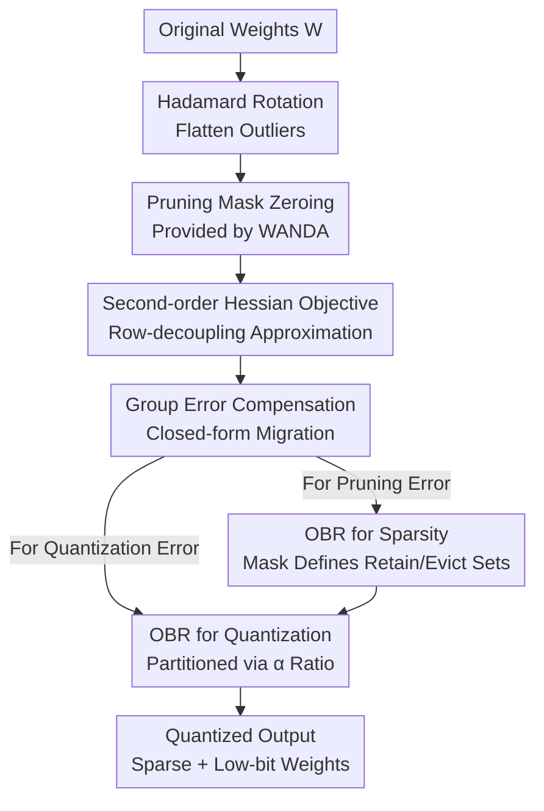

# Optimal Brain Restoration for Joint Quantization and Sparsification of LLMs

**Conference**: ICLR 2026  
**OpenReview**: [https://openreview.net/forum?id=VQIvBpL5ag](https://openreview.net/forum?id=VQIvBpL5ag)  
**Code**: https://github.com/csguoh/OBR  
**Area**: Model Compression  
**Keywords**: LLM Compression, Joint Quantization and Pruning, Second-order Hessian, Error Compensation, Training-free

## TL;DR
This paper proposes OBR (Optimal Brain Restoration), a training-free framework that utilizes a closed-form solution for group error compensation based on second-order Hessian information. It reconciles the conflicting weight distribution requirements of pruning and quantization, achieving the first W4A4KV4 + 50% sparse LLM. On Llama2-7B, it incurs only a 1.4 perplexity drop compared to the FP16 dense baseline while delivering up to 4.72× speedup and 6.4× memory compression.

## Background & Motivation

**Background**: LLM compression primarily follows two trajectories. The quantization route (e.g., QuaRot, SpinQuant, FlatQuant) uses Hadamard rotations to "flatten" weight distributions and suppress outliers, enabling W4A4KV4 (4-bit weight-activation-KV) inference. The pruning route (e.g., WANDA, SparseGPT) maintains accuracy under 50% unstructured or 2:4 semi-structured sparsity using activation statistics. Both routes are approaching their respective limits.

**Limitations of Prior Work**: Improvements via single-method compression are increasingly difficult. QuaRot's perplexity explodes below 4-bit (Llama2-7B W3A4KV4 reaches 132.97), and pruning similarly fails as sparsity ratios increase. The authors observe an opportunity: W4A4KV4 quantized Llama2-7B naturally exhibits approximately 14.28% sparsity. Furthermore, since Ampere/Hopper architectures natively support INT4-sparse GEMM kernels, joint "quantization + sparsity" compression is hardware-feasible.

**Key Challenge**: Quantization and pruning have **fundamentally opposing** requirements for weight distributions. Quantization prefers compact numerical ranges to minimize quantization error (hence the use of Hadamard rotations to smooth distributions), while pruning requires large variance in weight magnitudes to expose natural sparsity patterns. Directly forcing zeros on rotated, smoothed weights leads to unacceptable accuracy collapse (e.g., QuaRot+WANDA perplexity reaches thousands).

**Goal**: To allow pruning and quantization to coexist on the same set of weights without any retraining, pushing joint compression to the aggressive level of W4A4KV4 + 50% sparsity.

**Key Insight**: Instead of modifying pruning criteria or quantizers, an **optimal compensation** step is inserted between "pruning completion" and "quantization execution." This step minimizes the impact of compression-induced perturbations on the downstream loss. This revives the second-order Hessian approach of the classic Optimal Brain Damage (OBD) / OBQ and adapts it into a unified framework serving both pruning and quantization.

**Core Idea**: Using a Hessian-based "group error compensation" closed-form solution, information from elements destroyed by compression (the eviction set) is migrated to elements robust to compression (the retain set). This reconciles the conflict between quantization and sparsity—hence the name Optimal Brain **Restoration**.

## Method

### Overall Architecture

OBR follows a "pruning followed by quantization" sequence (identified as the optimal order in prior work). The pipeline can be expressed as: $\hat{W} = \mathrm{quant}(\mathrm{prune}(\mathrm{rotate}(W)) + \Delta W_{\mathrm{OBR}})$. Specifically, original weights are first smoothed via Hadamard rotation, then zeroed using a pruning mask (defaulting to WANDA). Afterward, **OBR compensation** $\Delta W_{\mathrm{OBR}}$ is inserted to repair perturbations before final quantization produces weights that are both sparse and low-bit.

The "restoration" in OBR is implemented in two steps: the first compensates for pruning errors (moving information from pruned to unpruned elements), and the second compensates for upcoming quantization errors. Both steps utilize the same "group error compensation" engine, differing only in how they partition the "destroyed set" and the "robust set." The entire process is a closed-form solution, training-free, and requires only 128 calibration samples to estimate the Hessian.

### Key Designs

**1. Second-order Hessian Objective & Row-decoupling: Transforming perturbation impact into a solvable sub-problem**

The optimization objective originates from the OBD/OBQ framework: minimize the impact of weight perturbation $\Delta W$ on the downstream loss $\mathbb{E}[\Delta L]$. Using a Taylor expansion of $L(X, W+\Delta W)$, assuming the model is at a local minimum ($\nabla_W L \approx 0$), and ignoring higher-order terms, the objective simplifies to the second-order term: $\Delta L \approx \frac{1}{2}\mathrm{vec}(\Delta W) H_{\mathrm{full}} \mathrm{vec}(\Delta W)^\top$.

Since the full Hessian $H_{\mathrm{full}}$ is $O((C_{out}C_{in})^2)$, it is computationally prohibitive. The authors use a Kronecker approximation $H_{\mathrm{full}} \approx G \otimes H$, where $H \triangleq 2XX^\top$ is the empirical Fisher matrix of the inputs. Crucially, **$G$ is approximated as an identity matrix $I$**, decoupling correlations between output channels. This decomposes the problem into $C_{out}$ independent sub-problems: $\min \frac{1}{2}\sum_{i=1}^{C_{out}} \mathbb{E}[\Delta w_i H \Delta w_i^\top]$. This allows each weight row to be solved independently and provides a clear physical meaning: large values in $H$ indicate indices where even minor weight changes significantly affect the task.

**2. Group Error Compensation: Using Hessian as a "bridge" to move errors from sensitive to robust groups**

This is the core engine of OBR. For each row $\Delta w$, elements are partitioned into two disjoint index sets: the **Retain set $R$** (robust to compression, e.g., unpruned elements) and the **Eviction set $E$** (sensitive to compression). The core idea is that rather than letting the compression error $e_E$ on $E$ damage the model, it is **transferred** to the robust set $R$.

By rearranging the perturbation vector as $[\Delta w_R, e_E]$, the sub-problem becomes a quadratic form for the partitioned Hessian $J = \frac{1}{2}[\Delta w_R\ e_E] \begin{bmatrix} H_{RR} & H_{RE} \\ H_{ER} & H_{EE}\end{bmatrix}[\Delta w_R\ e_E]^\top$. Setting the partial derivative with respect to $\Delta w_R$ to zero yields the closed-form solution:

$$\Delta w_R^\star = -H_{RR}^{-1} H_{RE} e_E.$$

The beauty of this solution is that the error on $E$ is theoretically zeroed out, while the total error is minimized by migrating it to $R$. The Hessian acts as a "bridge": $e_E$ is projected from the $E$ space via $H_{RE}$ and then mapped to the $R$ space via $H_{RR}^{-1}$.

**3. Two instances for Sparsity and Quantization: Same closed-form solution, different groupings**

The general solution is applied to two specific scenarios:

- **OBR for Sparsity**: Retain/Eviction sets are determined by the pruning mask—unpruned slots are $R_1$, pruned slots are $E_1$. Pruning error is defined as the pruned elements themselves $e_{E_1}^{\mathrm{prune}} = w_{E_1}$, yielding $\Delta w_{R_1}^{\mathrm{prune}} = -H_{R_1R_1}^{-1} H_{R_1E_1} w_{E_1}$, added back to unpruned elements.
- **OBR for Quantization**: Since quantization lacks a natural mask, the authors utilize the fact that rotated unpruned elements are similar. The **top $\alpha$ proportion** of elements in $R_1$ are treated as the eviction set $E_2$, and the remaining $1-\alpha$ as the retain set $R_2$. The quantization error $e_{E_2}^{\mathrm{quant}}$ is then migrated to $R_2$.

Because OBR treats the pruning mask and quantizer as "given inputs," it is agnostic to specific algorithms (WANDA/SparseGPT/Magnitude) and quantizers (RTN/GPTQ). In implementation, it uses 2:4 semi-structured sparsity + INT4 quantization with a custom INT4-sparse GEMM kernel via CUTLASS.

### Loss & Training
The method is entirely training-free with no gradient updates. It requires 128 WikiText2 samples (sequence length 2048) as a calibration set to estimate the Hessian $H$. The default quantization grouping ratio is $\alpha = 50\%$.

## Key Experimental Results

### Main Results

W4A4KV4 + 50% sparsity: WikiText2 Perplexity (↓) and Zero-shot Average Accuracy (↑) compared to quantization-only and naive joint baselines:

| Model | Method | Config | Wiki2↓ | 0-shot Avg↑ |
|------|------|------|--------|-------------|
| Llama2-7B | FP16 Dense | 16-16-16 | 5.47 | 70.47 |
| Llama2-7B | QuaRot (Quant-only) | W3A4KV4 | 132.97 | 38.01 |
| Llama2-7B | QuaRot+WANDA | W4A4KV4 50% | 5868.24 | 35.98 |
| Llama2-7B | SparseGPT+GPTQ | W4A4KV4 50% | 12.94 | 51.57 |
| Llama2-7B | **OBR RTN** | W4A4KV4 50% | **9.23** | **56.49** |
| Llama2-7B | **OBR GPTQ** | W4A4KV4 50% | **8.40** | — |
| Llama2-70B | FP16 Dense | 16-16-16 | 3.32 | 77.76 |
| Llama2-70B | **OBR GPTQ** | W4A4KV4 50% | **4.69** | 72.61 |

Even with naive RTN quantization, OBR outperforms SparseGPT+GPTQ (improving PPL by 3.71 on Llama2-7B). Llama2-70B compressed to W4A4KV4+50% differs from FP16 by only 1.37 PPL. On an A100 (4096 seq length), the INT4+2:4 sparse GEMM is 5.9× faster than FP16-dense and 1.4× faster than INT4-dense, achieving 4.72× speedup and 6.4× memory compression relative to FP16.

### Ablation Study

| Dimension | Config | Wiki2↓ | 0-shot↑ | Insight |
|----------|------|--------|---------|------|
| Ratio α (7B) | α=75% | 9.96 | 53.56 | Too few retain elements for compensation, quality drops |
| Ratio α (7B) | α=50% | 9.23 | 56.49 | Default trade-off |
| Ratio α (7B) | α=25% | 9.07 | 57.06 | Potentially better, but 50% is safer |
| Ratio α (7B) | α=20% | 8.89 | 56.79 | Insufficient compensation elements, accuracy falls |
| Pruning Mask | Magnitude \|W\| | 8.92 | 56.51 | Works even with naive magnitude pruning |
| Pruning Mask | WANDA (Default) | 8.40 | 53.45 | Default setting |

### Key Findings
- **Compensation is the key performance source**: Without compensation (direct QuaRot+WANDA), PPL explodes to thousands; OBR restores it to single digits, proving that "reconciling conflicts" is essential for joint compression.
- **Robustness to pruning masks**: Thanks to error compensation, even magnitude pruning yields satisfactory results, showing OBR is truly plug-and-play.
- **α Sensitivity**: Transferring to too few elements (α=75%) or from too few elements (α=20%) degrades performance; 50% is a stable empirical choice.
- **Scalability**: For 2:4 sparsity, OBR RTN improves PPL by 18.8 and accuracy by 5.86% over SparseGPT+GPTQ, showing higher gains in difficult configurations.

## Highlights & Insights
- **Modeling opposing needs as "error migration"**: Quantization requires compact distributions while pruning requires variance; OBR resolves this by "moving" information via Hessian closed-form solutions rather than changing the compression criteria.
- **Unified framework**: A single closed-form solution $\Delta w_R^\star = -H_{RR}^{-1}H_{RE}e_E$ handles both pruning (mask-based grouping) and quantization (α-based grouping).
- **Geometric Interpretation**: Hessian acts as a projection ($H_{RE}$) followed by a mapping ($H_{RR}^{-1}$), providing a clear narrative for error propagation across groups.

## Limitations & Future Work
- **Reliance on rotation-induced smoothness**: The partitioning strategy for quantization assumes Hadamard rotations flatten the distribution. This might fail for distributions that remain non-smooth.
- **Sub-optimal rotation matrices**: The paper reuses rotation matrices trained for quantization only (e.g., SpinQuant). Learning rotation matrices specifically for the "low-bit + sparse" joint scenario could offer more room for improvement.
- **Successive approximations**: Assumptions such as gradient $\approx 0$, $G \approx I$, and row-decoupling may accumulate errors under extreme compression. Sensitive models like Llama3-70B still require 16-bit KV caches.

## Related Work & Insights
- **vs QuaRot / SpinQuant / FlatQuant**: These focus on 4-bit quantization via Hadamard rotation but fail below 4-bit. OBR pushes the limit to W4A4KV4+50% by introducing sparsity and compensating for the resulting conflicts.
- **vs WANDA / SparseGPT**: These provide sparsity masks. OBR treats these masks as input and adds a layer of error restoration, compatible with both joint quantization and pure pruning enhancement.
- **vs JSQ**: JSQ uses simulated annealing for W8A8+50%; OBR is training-free, uses closed-form solutions, and reaches W4A4KV4.

## Rating
- Novelty: ⭐⭐⭐⭐⭐ First to unify Hessian error compensation for joint quantization and sparsity; first W4A4KV4+50% training-free LLM.
- Experimental Thoroughness: ⭐⭐⭐⭐⭐ Covers multiple model scales (Llama2/3, Qwen2.5), bit-widths, and sparsity patterns, including measured GEMM speedup.
- Writing Quality: ⭐⭐⭐⭐ Clear derivations and diagrams, though some approximation assumptions could be further discussed.
- Value: ⭐⭐⭐⭐⭐ Plug-and-play, hardware-deployable, providing a strong baseline for sparse low-bit LLMs.

<!-- RELATED:START -->

## Related Papers

- [\[ICLR 2026\] Compute-Optimal Quantization-Aware Training](compute-optimal_quantization-aware_training.md)
- [\[ICLR 2026\] TurboQuant: Online Vector Quantization with Near-Optimal Distortion Rate](turboquant_online_vector_quantization_with_near-optimal_distortion_rate.md)
- [\[ICLR 2026\] Dataset Distillation as Pushforward Optimal Quantization](dataset_distillation_as_pushforward_optimal_quantization.md)
- [\[ICLR 2026\] Metis: Training LLMs with FP4 Quantization](metis_training_llms_with_fp4_quantization.md)
- [\[ICLR 2026\] SliderQuant: Accurate Post-Training Quantization for LLMs](sliderquant_accurate_post-training_quantization_for_llms.md)

<!-- RELATED:END -->
