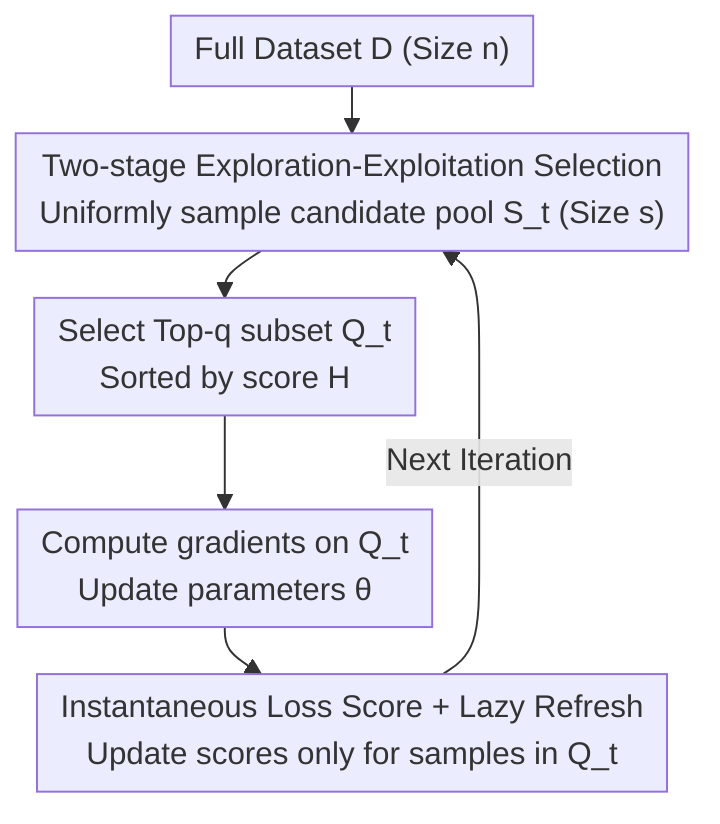

# OrderDP: A Theoretically Guaranteed Lossless Dynamic Data Pruning Framework

**Conference**: ICLR 2026  
**OpenReview**: [https://openreview.net/forum?id=e77QyyRQPz](https://openreview.net/forum?id=e77QyyRQPz)  
**Code**: https://github.com/shengze-xu/OrderDP  
**Area**: Model Compression / Data Pruning / Efficient Training  
**Keywords**: Dynamic Data Pruning, Unbiased Gradient, Surrogate Loss, Order Statistics, Convergence and Generalization

## TL;DR
OrderDP reformulates dynamic data pruning as a straightforward two-stage process: uniformly sampling a candidate pool followed by training on the Top-q samples with the highest losses. It proves that this mechanism unbiasedly minimizes a surrogate loss defined by weighted order statistics. This provides the first theoretical guarantee for convergence and generalization in dynamic pruning, achieving near-lossless performance with over 40% training cost savings on CIFAR/ImageNet.

## Background & Motivation

**Background**: As scaling laws increase dataset sizes, Data Pruning (DP) has become a primary method for cost reduction by discarding unimportant samples based on "informativeness scores." Methods are categorized into two types: static pruning, which scores samples once before training (e.g., Influence Functions, Coresets), and dynamic pruning, which updates scores based on the real-time model state/gradients. Dynamic pruning better tracks training dynamics and retains the most useful samples at each stage.

**Limitations of Prior Work**: Dynamic pruning introduces two often overlooked issues. Comparing full training with the representative dynamic method InfoBatch on CIFAR-100 at a 70% pruning ratio, the authors provide three key observations: ① Gradient norm is a reliable proxy for model performance (the Pearson correlation between test accuracy and gradient norm under full training is as high as $-0.93$); ② Dynamic pruning is unstable, showing heavy fluctuations in test accuracy and high noise in rolling standard deviations; ③ Gradient estimation remains biased. InfoBatch imposes large scaling factors that cause significant shifts in the overall gradient norm scale, breaking the linear relationship between accuracy and norm.

**Key Challenge**: Existing dynamic methods (e.g., InfoBatch) aim for unbiasedness by "rescaling biased gradients based on expected loss." However, during training on specific datasets, the gap between empirical loss and expected loss causes deviations in both gradient scale and direction. Aggressive pruning requires larger scaling factors, often necessitating stabilization techniques like annealing. Essentially, the guarantees for "near-lossless" performance and the analysis of bias have remained unclear.

**Goal**: Design a dynamic pruning method that is simultaneously **stable, unbiased, and near-lossless**, while answering three theoretical questions: What ensures near-lossless performance? How should bias be analyzed? Can pruning be pushed to extreme ratios?

**Key Insight**: Drawing from stochastic optimization based on order statistics, the authors explicitly incorporate the "selection" operation into the optimization objective. Bias is no longer an artifact to be repaired post-hoc but is fully characterized by a well-defined surrogate loss.

**Core Idea**: Each round begins with **uniform sampling** from the full dataset to create a candidate pool (to maintain diversity), followed by selecting the **Top-q** samples with the highest losses from that pool (to maintain informativeness). This seemingly heuristic two-stage operation is equivalent to performing unbiased gradient descent on a surrogate loss $L_q$ composed of weighted order statistics $\gamma_j$. Consequently, convergence rates and generalization errors can be proven as they are for standard SGD.

## Method

### Overall Architecture

OrderDP (Ordered Data Pruning) embeds dynamic sampling directly into the standard SGD loop without changing the network architecture or adding auxiliary approximations. Each iteration consists of four steps: **uniformly sampling** a candidate pool $S_t$ (size $s$, termed exploration) from the full dataset $D$ (size $n$); selecting a **Top-q** subset $Q_t$ (termed exploitation) based on scores; calculating sub-gradients and updating parameters only on $Q_t$; and refreshing the scores only for the selected samples while others reuse old values. Since the retention ratio is strictly determined by $s$ and $q$, OrderDP enforces an **exact** pruning ratio of $1-(q/s)\cdot(s/|D|)=1-q/n$, providing predictable acceleration. Default settings use an exploration ratio $s/|D|=0.5$ and exploitation ratio $q/s=0.6$, training on only 30% of the data per round.

The elegance of the process lies in its theoretical interpretation rather than complexity: the "uniform sampling + Top-q" approach ensures gradient estimation is unbiased relative to a surrogate loss $L_q$, allowing stability and lossless performance to be rigorously derived.

### Key Designs

**1. Exploration-Exploitation Two-stage Selection: Diversity via Uniform Sampling, Informativeness via Top-q**

Existing dynamic methods either rely purely on score ranking (losing diversity and requiring full dataset sorting) or complex bandit exploration (e.g., UCB requiring $O(\log n)$ time or InfoBatch requiring $O(n)$ storage). OrderDP decouples selection: first, a candidate pool $S_t$ is **uniformly** sampled ($|S_t|=s$), ensuring every sample has a non-zero probability of being selected and removing the dependency on sorting the full dataset. Second, the $Q_t \in \arg\max_{Q \subseteq S_t, |Q|=q} \sum_{i \in Q} H_t(\theta_t, z_i)$ subset is selected within the pool, concentrating computation on the most useful samples. This yields two benefits: the pruning ratio $1-q/n$ is precisely adjustable via $s$ and $q$, supporting **any** ratio (unlike InfoBatch, which is limited by its mechanism); and sorting is performed only on the pool of size $s$, reducing complexity per sample to $O(\log q)$ (and $O(1)$ when $q=1$).

**2. Instantaneous Loss Score and Lazy Refresh: Current Loss as Importance, Selective Updates**

Each sample $z_i$ is associated with a non-negative score $H_i(\theta) = L_i(\theta, z_i)$, using the **instantaneous loss** as a proxy for importance—higher loss implies the sample should be retained. A "lazy" update rule is applied: only samples $i \in Q_t$ have their scores refreshed with the latest loss, while others retain old values:
$$H_{t+1}(\theta_{t+1}, z_i) = \begin{cases} L_i(\theta_{t+1}, z_i), & i \in Q_t \\ H_t(\theta_t, z_i), & i \notin Q_t \end{cases}$$
This avoids recomputing losses for the full dataset, keeping the maintenance cost proportional to the number of trained samples.

**3. Surrogate Loss and Unbiased Gradients: Translating "Top-q Selection" into an Objective**

This is the core theoretical contribution. Training only on Top-q samples naturally biases the gradient relative to the empirical loss $L(\theta) = \frac{1}{n} \sum_i L_i(\theta)$. OrderDP identifies a surrogate loss weighted by order statistics:
$$L_q(\theta) := \frac{1}{q} \sum_{j=1}^n \gamma_j \, L_{(j)}(\theta), \quad \gamma_j = \sum_{l=\max\{1, s-n+j\}}^{\min\{q, j\}} \frac{\binom{j-1}{l-1}\binom{n-j}{s-l}}{\binom{n}{s}}$$
where $L_{(j)}$ is the $j$-th largest per-sample loss. **Theorem 1** proves that the sub-gradient $\tilde g_t$ generated by OrderDP satisfies $\mathbb{E}[\tilde g_t] \in \partial L_q(\theta_t)$. While biased relative to $L$, it is **unbiased** relative to $L_q$. Characterizing pruning as unbiased minimization of $L_q$ ensures the pruning ratio is controllable, requires zero extra per-round overhead for weights $\gamma_j$, and results in lower variance gradients, **eliminating the need for annealing**. Proposition 2 shows that as $j, n \to \infty$ with $j/n=z$, $n\gamma_j \to \gamma(z)$, where $\{\gamma_j/q\}$ forms a valid non-uniform distribution.

**4. Convergence and Generalization Guarantees: Provable Error Bounds**

Due to unbiasedness, OrderDP follows standard mini-batch SGD analysis. **Theorem 3**: If $L_i$ is convex and $G$-Lipschitz, $\min_{0 \le t \le T} \mathbb{E}[L_q(\theta_t) - L_q(\theta^*)]$ converges at $O(1/\sqrt{T})$, matching standard SGD. **Theorem 4** (Generalization Bound) quantifies the approximation of $L_q$ to the expected risk $L(\theta^*)$: the gap decomposes into a **bias term** $\sqrt{2}C_s B\sqrt{\frac{n-s}{s(n-1)}-Q_n(\theta_t; s, q)}$ and an **optimization term** that vanishes as $T \to \infty$. This explains why gentler pruning is more "lossless" while aggressive pruning increases bias, as controlled by computable terms $C_s$ and $Q_n$.

### Loss & Training
The objective is the surrogate loss $L_q(\theta)$, implemented via standard workflows: OneCycle scheduler (cosine annealing) + SGD (momentum 0.9, weight decay $5 \times 10^{-4}$). Data augmentations include normalization, random cropping, and horizontal flipping. Backbones used are ResNet-18/50. Default exploration ratio is 0.5 and exploitation ratio is 0.6.

## Key Experimental Results

### Main Results

Dynamic pruning comparison on CIFAR-10/100 (ResNet-18). Accuracy at 30/50/70% pruning ratios (gain/loss relative to full training in parentheses):

| Method | CIFAR-10 @50% | CIFAR-10 @70% | CIFAR-100 @50% | CIFAR-100 @70% |
| :--- | :--- | :--- | :--- | :--- |
| Dynamic Random | 94.5 (↓1.1) | 93.0 (↓2.6) | 75.3 (↓2.9) | 72.8 (↓5.4) |
| UCB | 94.7 (↓0.9) | 93.9 (↓1.7) | 75.3 (↓2.9) | 73.2 (↓5.0) |
| InfoBatch | 95.0 (↓0.6) | 94.5 (↓1.1) | 77.7 (↓0.5) | 75.9 (↓2.3) |
| **OrderDP (Ours)** | **95.3 (↓0.2)** | **95.0 (↓0.6)** | **77.9 (↓0.3)** | **76.7 (↓1.5)** |
| Full Training | 95.6 | 95.6 | 78.2 | 78.2 |

Efficiency and accuracy on ImageNet-1K (ResNet-50, 40% pruning, 90 epochs, 2×L40):

| Metric | UCB | InfoBatch | **OrderDP (Ours)** | Full Training |
| :--- | :--- | :--- | :--- | :--- |
| Acc (%) | 75.4 | 75.6 | **76.4** | 76.4 |
| Time (h) | 21.1 | 21.6 | 21.5 | 35.2 |
| Total Node-Hours | 42.2 | 43.2 | **43.0** | 70.4 |

Ours maintains full training accuracy (76.4) at 40% pruning, saving ~39% of total compute. At 60% pruning, the drop is only 0.4%.

### Ablation Study

Varying exploration/exploitation decomposition while fixing the effective pruning ratio $(q/s)\cdot(s/|D|)$:

| Configuration | Phenomenon | Explanation |
| :--- | :--- | :--- |
| Variable $s/|D|, q/s$ | Accuracy remains nearly constant | Validates precise control of pruning ratio |
| Fixed ratio decomposition | Stable training time | Computational cost depends only on the total pruning ratio |
| $q=s$ | Degenerates to standard SGD | Bias term vanishes, $L_q = L$ |
| Increase ratio to ~70% | Time drops sharply, accuracy fades slowly | CIFAR-10 >95%, CIFAR-100 >76% at half compute |

### Key Findings
- **Gradient Norm is a Reliable Proxy**: Accuracy and gradient norm are linearly correlated ($R=-0.93$) in full training, providing a benchmark for diagnosing dynamic pruning instability.
- **Unbiasedness Eliminates Annealing Necessity**: Unlike InfoBatch which requires large scaling and annealing, Ours is naturally unbiased relative to $L_q$, offering lower variance and inherent stability.
- **Robust Across Architectures**: Lossless pruning achieved at 29.8% / 22.1% / 30.8% for ResNet-50 / Swin-T / ViT-B (MAE). The maximum lossless ratio is consistently 4–6% higher than InfoBatch.

## Highlights & Insights
- **Translating Heuristics to Provable Objectives**: The most significant contribution is showing that the discrete $\arg\max$ operation of Top-q selection can be exactly equated to a continuous surrogate loss $L_q$ via order statistics weights $\{\gamma_j\}$.
- **Minimalist yet Superior**: The method utilizes "Uniform Sampling + Top-q + Lazy Refresh" without bandits, scaling, or annealing. It reduces sorting complexity from $O(\log n)$/$O(n)$ to $O(\log q)$.
- **Transferable Framework**: The paradigm of using order statistics to explicitly define subset selection in the objective can be transferred to importance sampling, curriculum learning, and RLHF data selection.

## Limitations & Future Work
- **Theory Grounded in Convex/Lipschitz Assumptions**: Theorems 3 and 4 rely on convexity and $G$-Lipschitz continuity. Deep networks are non-convex, so the theory serves as a "principled approximation."
- **Increasing Bias at Extreme Ratios**: Theorem 4 notes that as pruning ratio increases, the bias from the uniform distribution grows, meaning "lossless" performance is primarily maintained at moderate ratios.
- **Scope Limitation**: Experiments are focused on image classification. Generalization to detection, segmentation, or LLM pre-training remains to be verified.
- **Instantaneous Loss Proxy**: High loss does not always equal "usefulness"; in noisy datasets, Top-q selection might consistently pick outlier/noisy samples.

## Related Work & Insights
- **vs. InfoBatch**: InfoBatch rescales gradients to approximate unbiasedness, requiring annealing and having fixed retention limits. OrderDP is inherently unbiased towards $L_q$, requires no annealing, and supports continuous pruning ratios.
- **vs. Bandit-based Pruning (UCB / ϵ-greedy)**: These methods estimate importance through exploration-exploitation but carry $O(\log n)$ time or storage overhead and lack theoretical bounds. OrderDP achieves the same goals with lower overhead and provable convergence.
- **vs. Static Pruning (Forgetting / GraNd / EL2N)**: Static methods cannot track training dynamics and typically lose 5–10% accuracy at 70% pruning on CIFAR-100; OrderDP loses only 1.5%.

## Rating
- Novelty: ⭐⭐⭐⭐⭐ Analytically characterizes dynamic pruning bias through surrogate loss; first theoretical convergence + generalization guarantee.
- Experimental Thoroughness: ⭐⭐⭐⭐ Solid results across CIFAR/ImageNet and multiple architectures, though limited to classification.
- Writing Quality: ⭐⭐⭐⭐ Clear chain from motivation to theory and experiment.
- Value: ⭐⭐⭐⭐⭐ Plug-and-play, saves 40%+ compute with near-zero loss; balances theory and utility.

<!-- RELATED:START -->

## Related Papers

- [\[ICLR 2026\] Inconsistency Biases in Dynamic Data Pruning](inconsistency_biases_in_dynamic_data_pruning.md)
- [\[CVPR 2026\] Batch Loss Score for Dynamic Data Pruning](../../CVPR2026/model_compression/batch_loss_score_for_dynamic_data_pruning.md)
- [\[ICCV 2025\] Partial Forward Blocking: A Novel Data Pruning Paradigm for Lossless Training Acceleration](../../ICCV2025/model_compression/partial_forward_blocking_a_novel_data_pruning_paradigm_for_lossless_training_acc.md)
- [\[ICLR 2026\] To Compress or Not? Pushing the Frontier of Lossless GenAI Model Weights Compression with Exponent Concentration](to_compress_or_not_pushing_the_frontier_of_lossless_genai_model_weights_compress.md)
- [\[ICLR 2026\] Towards Lossless Memory-efficient Training of Spiking Neural Networks via Gradient Checkpointing and Spike Compression](towards_lossless_memory-efficient_training_of_spiking_neural_networks_via_gradie.md)

<!-- RELATED:END -->
## Related Papers

- [\[ICLR 2026\] Inconsistency Biases in Dynamic Data Pruning](inconsistency_biases_in_dynamic_data_pruning.md)
- [\[CVPR 2026\] Batch Loss Score for Dynamic Data Pruning](../../CVPR2026/model_compression/batch_loss_score_for_dynamic_data_pruning.md)
- [\[ICCV 2025\] Partial Forward Blocking: A Novel Data Pruning Paradigm for Lossless Training Acceleration](../../ICCV2025/model_compression/partial_forward_blocking_a_novel_data_pruning_paradigm_for_lossless_training_acc.md)
- [\[ICLR 2026\] To Compress or Not? Pushing the Frontier of Lossless GenAI Model Weights Compression with Exponent Concentration](to_compress_or_not_pushing_the_frontier_of_lossless_genai_model_weights_compress.md)
- [\[ICLR 2026\] Towards Lossless Memory-efficient Training of Spiking Neural Networks via Gradient Checkpointing and Spike Compression](towards_lossless_memory-efficient_training_of_spiking_neural_networks_via_gradie.md)

<!-- RELATED:END -->
