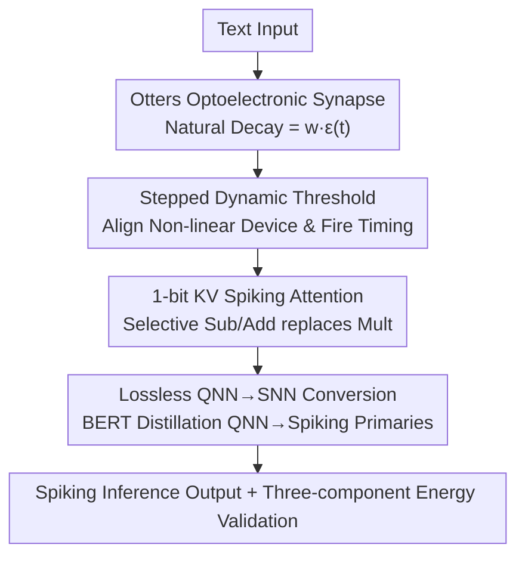

# Otters: An Energy-Efficient Spiking Transformer via Optical Time-to-First-Spike Encoding

**Conference**: ICLR 2026  
**OpenReview**: [https://openreview.net/forum?id=oK0ISeb5Dw](https://openreview.net/forum?id=oK0ISeb5Dw)  
**Code**: https://github.com/zhangluyan9/ICLR26Otters  
**Area**: Model Compression / Spiking Neural Networks / Energy Efficiency Optimization  
**Keywords**: Spiking Transformer, TTFS Encoding, Photoelectronic Synapse, QNN-to-SNN, Hardware-Software Co-design

## TL;DR
This paper reinterprets the "natural signal decay" of optoelectronic devices—originally considered a physical defect—as the temporal decay function required for Time-to-First-Spike (TTFS) encoding. By combining a stepped dynamic threshold and a lossless QNN-to-SNN conversion algorithm, the authors develop a 1-bit KV Spiking Transformer. It achieves SOTA performance among SNNs across seven GLUE tasks while improving energy efficiency by 1.77x compared to the previous best spiking language models.

## Background & Motivation

**Background**: While Large Language Models exhibit powerful capabilities, their high energy consumption hinders deployment on edge devices. Spiking Neural Networks (SNNs) are considered promising for low-power applications due to their sparse, event-driven nature and the use of addition instead of multiplication. However, SNN energy efficiency depends heavily on high-quality encoding. Traditional rate coding represents information using the number of spikes within a time window, requiring repeated weight access and data movement, which often offsets the benefits of sparsity. In contrast, **Time-to-First-Spike (TTFS)** encoding encodes information into the "precise arrival time of a single spike." Each neuron fires at most once per inference cycle, maximizing sparsity and offering optimal theoretical energy efficiency.

**Limitations of Prior Work**: The theoretical energy efficiency of TTFS comes with a hidden cost. It relies on the principle that "earlier spikes represent larger values." In implementation, the raw arrival time of a spike must be converted into a value via a decay function (e.g., $\epsilon(t)=e^{-t}$ or $T-t$), which is then multiplied by the synaptic weight to obtain $w\cdot\epsilon(t)$. Calculating this decay function consumes energy, and the multiplication reintroduced the very operation SNNs originally sought to avoid—negating the energy saved by sparsity.

**Key Challenge**: How can the extreme sparsity of TTFS be leveraged without paying the digital computation price of "calculating decay functions + multiplication"?

**Key Insight**: The authors observe that $w\cdot\epsilon(t)$ is essentially a quantity that decays predictably over time. Rather than optimizing this calculation in the digital domain, it is better to identify a physical process that naturally simulates this decay. Optoelectronic synapses possess this property: their optical signals naturally decay over time (this "volatility" was previously treated as a defect to be suppressed in memory devices). Furthermore, fJ-level energy consumption and resistance to electromagnetic interference make them highly attractive.

**Core Idea**: This work reinterprets the "natural decay bug" of optoelectronic devices as the physical implementation of the decay function required for TTFS. By using the analog output of the device to represent the fused result of "weight $\times$ temporal decay," expensive digital operations are eliminated. A QNN-to-SNN conversion is then used to bypass the training difficulties of SNNs, enabling the hardware to be used within a Transformer architecture.

## Method

### Overall Architecture

Otters represents a hardware-software co-design. On the hardware side, the authors customized an Indium Oxide (In₂O₃) thin-film transistor optoelectronic synapse, allowing its current to decay naturally and non-linearly. This decay curve directly serves as the TTFS temporal decay function. To align the **non-linear** physical decay of the device with the **linear** values required for encoding, a stepped decreasing dynamic threshold was designed so that neurons fire only at specific pre-calculated moments. On the software side, a Quantized Neural Network (QNN) is first trained via knowledge distillation (compressing weights and KV projections to 1-bit), followed by a mathematically guaranteed lossless QNN-to-SNN conversion to transfer parameters into the Otters spiking network. Multiplication in $Q\cdot K^\top$ within self-attention is eliminated using 1-bit KV and selective addition/subtraction. Finally, an energy model covering computation, data movement, and analog components is used to verify efficiency.

The following diagram illustrates the pipeline from training to inference:

### Key Designs

**1. Otters Optoelectronic Synapse: Turning Device Decay "Bugs" into Physical TTFS Calculation**

Addressing the pain point that TTFS must explicitly compute $\epsilon(t)$ and multiply it by weights, the authors customized an In₂O₃ thin-film transistor. Under constant light intensity, it provides a deterministic non-linear decay curve fitted by $O(t)=I_0\cdot e^{-(t/\tau)^\beta}+I_{\text{offset}}$ (using differential evolution to minimize residual sum of squares: $I_0=110.989, \tau=1.3425, \beta=0.495, I_{\text{offset}}=-109.989$). The decay of device current over time naturally constitutes the temporal component of the post-synaptic potential (PSP). An ADC with a scaling factor $\gamma^l_{ij}$ maps the analog signal to a digital PSP:

$$\epsilon'(t)=\gamma^l_{ij}\cdot O(t)$$

The membrane potential accumulates based on incoming spikes: $V^l_j(t)=V^l_j(t-1)+\sum_{i:\,s^{l-1}_i(t)=1}\epsilon'(t)$. Crucially, the analog output of the device **is itself** the product of "weight $\times$ temporal decay." Storage and computation are collapsed into a single physical step, entirely eliminating the digital "compute $\epsilon(t)$ + multiply $w$" overhead.

**2. Stepped Dynamic Threshold: Aligning Non-linear Devices with Linear Encoding**

Device non-linearity introduces a contradiction: for lossless QNN-to-SNN conversion, the values encoded by spike times must be **uniformly spaced**—a spike at physical time $t_k$ should represent the quantized value $(T-k)/T$. However, the non-linear decay of $O(t)$ means the physical times $t_k$ where the output matches these target values are **non-uniformly** distributed.

The solution is not a complex non-uniform clock, but a standard uniform physical clock combined with a **stepped decreasing threshold** $\theta^l(t)$. This threshold only changes values at specific pre-calculated time points $\{t_k\}$ derived from the physical decay function. The firing condition is met only at these discrete intervals:

$$t^l_{\text{spike},j}=\min\{t_k\mid V^l_j\ge\theta^l(t_k)\}$$

Thus, the output spike time $t_k$ reliably encodes the target quantized value $(T-k)/T$. Information propagates losslessly as the output spikes of one layer serve as correctly timed inputs for the next. This is paired with Dynamic Firing Thresholds (DFT) scheduled per layer to maintain causal correctness.

**3. 1-bit KV Spiking Attention: Eliminating Multiplication in $Q\cdot K^\top$**

A major obstacle for Spiking Transformers is the matrix multiplication in self-attention. While rate-coded SNNs can treat matrices as binary spike trains to convert multiplication to addition, this is incompatible with TTFS as TTFS decoded values are non-binary. The authors quantize Key and Value projections to 1-bit $\{+1, -1\}$. Consequently, the dot product with a TTFS-encoded Query requires only selective addition or subtraction based on the K/V signs. This eliminates the multiplication bottleneck while retaining the high sparsity of TTFS. A dataflow inspired by the Canon architecture is used, where binary K/V are preloaded into PE local storage, and the TTFS-encoded Query is broadcast, maximizing spatio-temporal sparsity.

**4. QNN-to-SNN Lossless Conversion: Bypassing Training to Load Parameters**

Direct SNN training is difficult due to gradient issues with sparse spikes. The authors employ QNN-to-SNN conversion: training a quantized network first, then mapping weights to an equivalent Otters SNN. Proposition 1 provides the exact equivalence conditions: setting simulation steps $T=2^n-1$; mapping physical fire times $t_k$ such that $O(t_k)=(T-k)/T$; synaptic scaling $\gamma^l_{ij}=w^l_{ij}\cdot\alpha^{l-1}\cdot T$; and using the stepped threshold function $\theta^l(t)=\alpha^l\cdot(T-k)$ for $t_k\le t<t_{k+1}$.

### Loss & Training

The training involves two stages: first, training a QNN with 1-bit weights and 1-bit KV via knowledge distillation with BERT$_\text{base}$ as the teacher; second, performing lossless conversion to the Otters SNN according to Proposition 1. The simulation window is set to $T=15$ (4-bit equivalent).

To handle unavoidable chip variation, the authors propose **Hardware-Aware Training (HAT)**: injecting zero-mean Gaussian noise into QNN activations during training (scaled by parameter magnitude). HAT1 and HAT2 inject 10% and 20% noise, respectively, making the model robust to perturbations in physical parameters like $O(t)$, $\tau$, and $\beta$.

## Key Experimental Results

### Main Results

Across seven GLUE tasks, Otters (13.4M) achieves SOTA among SNN models with an average accuracy of 83.22%. This is 3.42% higher than 1-bit Sorbet and 2.98% higher than SpikeLM, despite being the only model to quantize KV to 1-bit.

| Model | Size | SST-2 | RTE | QQP | Avg |
|------|------|-------|-----|-----|------|
| BERT$_\text{base}$ (Teacher) | 418M | 93.3 | 72.6 | 91.3 | 87.31 |
| SpikingBERT | 50M | 88.2 | 66.1 | 86.8 | 80.83 |
| SpikeLM | * | 86.5 | 65.3 | 87.9 | 80.51 |
| 1-bit Sorbet | 13.4M | 90.4 | 60.3 | 86.5 | 79.80 |
| **Otters (Ours)** | 13.4M | **91.28** | **68.95** | **87.67** | **83.22** |

Regarding energy efficiency (SST-2, per attention block per inference), Otters-1bitkv consumes only 4.06 mJ. This represents a 41.36× reduction compared to full-precision BERT$_\text{base}$, 2.72× vs. 1-bit QNN BERT, 3.04× vs. Sorbet, and 1.77× vs. SpikingLM. Energy statistics include computation, data movement, and analog components based on 22nm process metrics.

| Model | FC (mJ) | QKV (mJ) | Total (mJ) | Gain↑ |
|------|---------|----------|-----------|---------|
| Full BERT | 50.35 | 8.41 | 167.92 | 1.00× |
| Sorbet | 3.39 | 1.08 | 12.34 | 13.61× |
| SpikingLM | 2.09 | 0.46 | 7.20 | 23.32× |
| **Otters (1bit kv)** | **1.14** | **0.33** | **4.06** | **41.36×** |

### Ablation Study

| Configuration | Total Energy (mJ) | SST-2 Accuracy | Note |
|------|------------|-------------|------|
| Otters-4bitkv | 4.49 | 91.51 | KV uses 4-bit |
| Otters-1bitkv | 4.06 | 91.28 | KV uses 1-bit |

Reducing KV from 4-bit to 1-bit reduces total energy by 10% (4.49→4.06 mJ) with only a 0.23% drop in accuracy, representing a highly favorable trade-off.

Regarding noise robustness (SST-2), the base Otters model is stable within a 5% deviation of $O(t)$ output but degrades rapidly thereafter. HAT significantly improves resistance: HAT2 remains stable at 80.8% accuracy under 20% noise, while HAT1 provides an 11.5% gain over the base model at 12% noise.

### Key Findings
- The largest energy consumer is FC (linear projection). Otters reduces FC energy from 50.35 mJ to 1.14 mJ, which is the primary driver of efficiency.
- 1-bit KV quantization provides "nearly free" energy gains, resulting in 10% energy reduction for only 0.23% accuracy loss.
- HAT trades minor peak accuracy for significant robustness, with noise levels adjustable based on hardware tolerance.

## Highlights & Insights
- **Inverting "Device Defects":** The volatility of optoelectronic synapses, traditionally suppressed, is utilized as a computational primitive for TTFS. Collapsing storage and computation into one physical step is a masterstroke of physical-algorithmic isomorphism.
- **Non-linear Alignment:** Rather than using expensive non-uniform clocks, the non-linearity is "absorbed" into a stepped dynamic threshold. This is engineeringly clean and mathematically guaranteed via Proposition 1.
- **Honest Energy Assessment:** Unlike works that only count operations, this study uses 22nm process metrics to include computation, data movement, and memory access, lending credibility to the 1.77–3.04× efficiency gains.

## Limitations & Future Work
- **Dependency on Custom Devices:** The energy advantage relies on the In₂O₃ optoelectronic synapse. Consistency across large-scale integrated arrays remains a challenge that HAT only partially mitigates.
- **Analytical Energy Model:** Results are based on an energy model rather than end-to-end silicon measurement; real-chip ADC and routing overheads may vary.
- **Task Scope:** Testing was limited to GLUE comprehension tasks (BERT-scale 13.4M). Generative models or longer sequences were not explored.
- **Long-term Stability:** Over time, device aging might lead to $O(t)$ drifting from the fit, potentially causing encoding errors.

## Related Work & Insights
- **vs. Traditional TTFS-SNN**: Unlike works that explicitly calculate decay functions in the digital domain, this work uses physical decay to eliminate those steps and associated multiplications.
- **vs. Spiking Language Models (Sorbet/SpikingLM)**: While those also use low-bit Spiking Transformers, Otters introduces optoelectronic TTFS and 1-bit KV attention to achieve higher accuracy (83.22% avg) and better energy efficiency.
- **vs. Rate-coded SNNs**: Otters moves away from multi-spike rate coding to single-spike TTFS, pushing sparsity to its limit.

## Rating
- **Novelty**: ⭐⭐⭐⭐⭐ Inverting device volatility for TTFS computation + non-linear alignment with mathematical proof.
- **Experimental Thoroughness**: ⭐⭐⭐⭐ Covers GLUE, 22nm energy analysis, and noise robustness, though lacks end-to-end silicon validation for large-scale tasks.
- **Writing Quality**: ⭐⭐⭐⭐ Clear logic from motivation to solution; complete formulas and propositions.
- **Value**: ⭐⭐⭐⭐⭐ Establishes a new paradigm of using physical device properties as computational primitives for energy-efficient SNNs.

<!-- RELATED:START -->

## Related Papers

- [\[ICLR 2026\] TP-Spikformer: Token Pruned Spiking Transformer](tp-spikformer_token_pruned_spiking_transformer.md)
- [\[ICLR 2026\] Towards Lossless Memory-efficient Training of Spiking Neural Networks via Gradient Checkpointing and Spike Compression](towards_lossless_memory-efficient_training_of_spiking_neural_networks_via_gradie.md)
- [\[ICLR 2026\] Biologically Plausible Learning via Bidirectional Spike-Based Distillation](biologically_plausible_learning_via_bidirectional_spike-based_distillation.md)
- [\[ICLR 2026\] Enhancing Multivariate Time Series Forecasting with Global Temporal Retrieval](enhancing_multivariate_time_series_forecasting_with_global_temporal_retrieval.md)
- [\[ICML 2026\] Towards Resource-Efficient LLMs: End-to-End Energy Accounting of Distillation Pipelines](../../ICML2026/model_compression/towards_resource-efficient_llms_end-to-end_energy_accounting_of_distillation_pip.md)

<!-- RELATED:END -->
