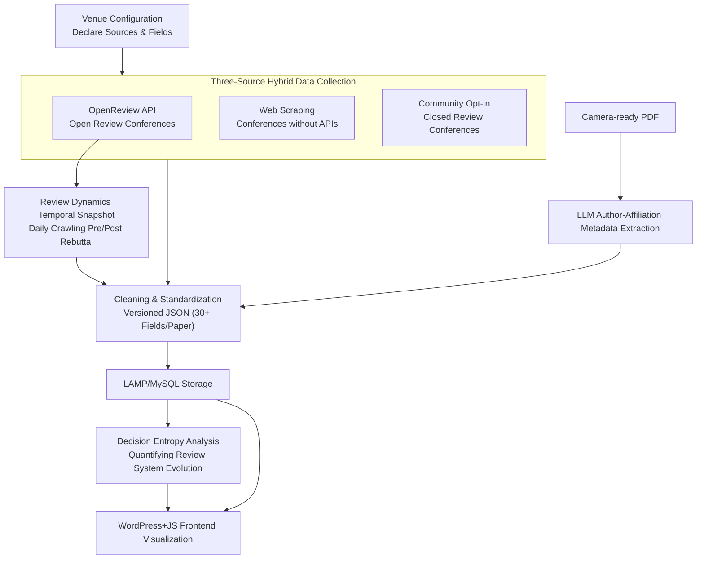

# Paper Copilot: Tracking the Evolution of Peer Review in AI Conferences

**Conference**: ICLR 2026  
**arXiv**: [2510.13201](https://arxiv.org/abs/2510.13201)  
**Code**: [Project Page](https://papercopilot.com)  
**Area**: Scientometrics / Review Analysis  
**Keywords**: Peer Review, Rating Dynamics, Decision Entropy, Conference Statistics, Dataset, LLM Metadata Extraction

## TL;DR

The authors build Paper Copilot—a persistent digital archive and analysis platform for peer reviews across dozens of AI/ML conferences. By collecting review data via a hybrid strategy of OpenReview API, web scraping, and community contributions, the platform archives real-time rating snapshots (including dynamics before and after rebuttals). It reveals a structural shift in ICLR 2025 where decision entropy decreased anomalously, indicating a transition from probabilistic tiering to deterministic score-driven decisions. Additionally, it supports talent trajectory tracking through LLM-driven author-affiliation metadata extraction.

## Background & Motivation

**Background**: Submissions to top-tier AI/ML conferences now exceed 10,000 annually (ICLR 2025 reached 11,672), placing unprecedented pressure on peer review. While some conferences (ICLR/NeurIPS) use OpenReview, many others (CVPR/AAAI/ICCV) remain closed. Review dimensions have also expanded from single scores to multi-dimensional assessments like soundness, correctness, novelty, and contribution.

**Limitations of Prior Work**: (1) Review data is heavily fragmented across social platforms like Twitter, Reddit, and Zhihu; (2) OpenReview overwrites previous versions, resulting in the irrecoverable loss of rating history during rebuttals; (3) There is a lack of unified data sources and tools for cross-conference longitudinal analysis; (4) Authors lack statistical references during the brief 1-2 week rebuttal period to judge score standing and rebuttal value.

**Key Challenge**: While the review process is central to research transparency, existing infrastructure cannot support systematic tracking of review dynamics or longitudinal analysis.

**Goal**: To build a unified platform for collecting, archiving, and analyzing review data, supporting cross-conference longitudinal studies and real-time tracking of rating dynamics.

**Key Insight**: A three-source hybrid data strategy maximizes coverage, while real-time temporal snapshots preserve otherwise lost historical data.

**Core Idea**: Transform scattered and fleeting AI conference review information into persistent, structured, and analyzable digital archives, establishing a "metascience infrastructure" for the review process.

## Method

### Overall Architecture

The core problem Paper Copilot addresses is that AI conference review information is fragmented across OpenReview, social media, and private exchanges, often overwritten and lost over time. The system operationalizes this through a pipeline: "configure a venue → collect multi-source data → clean into structured archives → store and visualize." The venue configuration layer declares sources and fields for each conference. Data collection pipelines use a multi-source assigner, worker pools, and parallel bots. Raw reviews are cleaned and standardized into versioned JSON datasets (30+ fields per paper), stored in a LAMP/MySQL backend, and visualized via a WordPress + custom JS frontend. Temporal snapshots and decision entropy analysis are the two unique components, while LLM-driven metadata extraction bridges the gap in structured conference mapping. Adding a new conference only requires a minimal configuration file.

### Key Designs

**1. Three-Source Hybrid Data Collection Pipeline: Maximizing Coverage via Heterogeneous Sources**

No single source covers all conferences. The pipeline uses three parallel tracks: the OpenReview API scripts pull ratings, confidence, and comments for open conferences like ICLR/NeurIPS, saving timestamped snapshots to track changes; web scraping targets conferences without APIs (e.g., CVPR/AAAI) to extract accepted papers and metadata; and community opt-in contributions target closed review conferences. The latter has accumulated 6,584 valid records, with approximately 60% of authors agreeing to share anonymized ratings.

**2. Review Dynamics Temporal Snapshot Archiving: Preserving the Review "Process"**

OpenReview only preserves the final version of each review. How scores change and how consensus forms during rebuttal is lost once overwritten. Paper Copilot crawls daily snapshots for ICLR 2024/2025, recording all rating dimensions (rating, confidence, soundness, contribution, presentation) for every reviewer at every time point. This creates a unique public archive of complete review sequences, visualizing score evolution trajectories.

**3. LLM-driven Author-Affiliation Metadata Extraction: Mapping Missing Linked Structures**

Most conferences do not provide structured author-affiliation mappings. Paper Copilot uses the GLM series to extract structured tuples $(a_i, \mathcal{A}_i, e_i)$ (name, affiliations, email) from camera-ready PDFs. To evaluate quality, a mismatch indicator $\mathbf{1}(x,y) = 1$ if $|x| \neq |y|$ checks structural consistency, and the Success Rate is defined as:

$$\text{Success Rate} = 1 - \frac{1}{|\mathcal{D}|} \sum_{i} \left(\delta_{\text{aff}}^i \lor \delta_{\text{email}}^i \lor \delta_{\text{parse}}^i\right)$$

A failure is counted if any error occurs in affiliation, email, or parsing. glm-4-plus achieved an 86.82% success rate across ~70K papers, significantly outperforming smaller variants.

**4. Decision Entropy Analysis Framework: Quantifying Community Observations**

The authors introduce decision entropy to quantify AC decision certainty. For year $t$ and score bracket $b$:

$$H_{t,b} = -\sum_{s \in \{\text{Reject, Poster, ...}\}} p_{t,b,s} \log p_{t,b,s}$$

The overall annual decision entropy is $\bar{H}_t = \sum_b w_{t,b} H_{t,b}$. Historically, $\bar{H}_t$ grows logarithmically with submission volume ($\bar{H}_t \approx a \log X_t + b$). However, 2025 showed a strong negative residual, suggesting that ACs relied more heavily on average scores for deterministic tiering than in previous years.

## Key Experimental Results

### Evolution Analysis of ICLR 2017-2025 Reviews

| Metric | Finding | Quantitative Evidence |
|------|------|----------|
| Submission Growth | 490 → 11,672 (24x) | AC count increased from 31 to 823 |
| Decision Entropy Trend | Logarithmic growth with volume | $\bar{H}_t \approx a\log X_t + b$ |
| 2025 Structural Change | Anomalous drop in decision entropy | $\text{resid}_{2025}$ shows strong negative deviation |
| Rebuttal Score Changes | 54.8% papers changed overall rating | Soundness etc. changed only ~10-13% |
| Consensus Evolution | Disagreement peaks then converges | Oral converges fastest; Reject remains high |
| Boundary Asymmetry | Low variance aids acceptance above mean | High variance aids acceptance below mean |

### Community Transparency Survey (1,860 responses from 4 conferences)

| Conference | Responses | Consent to Anonymized Disclosure | Ratio |
|------|:------:|:------:|:------:|
| CVPR 2025 | 357 | 191 | 53.5% |
| ICML 2025 | 1,034 | 628 | 60.7% |
| ICCV 2025 | 254 | 151 | 59.4% |
| ACL 2025 | 215 | 145 | 67.4% |
| **Total** | **1,860** | **1,115** | **59.9%** |

### LLM Metadata Extraction Accuracy

| Model | $\delta_{\text{aff}}$ | $\delta_{\text{email}}$ | $\delta_{\text{parse}}$ | Success Rate |
|------|:------:|:------:|:------:|:------:|
| glm-4-plus | 5.01% | 4.94% | 0.81% | **86.82%** |
| glm-4-air | 49.98% | 17.11% | 0.51% | 44.73% |
| glm-4-flash | 76.39% | 43.27% | 0.62% | 18.52% |
| glm-3-turbo | 76.07% | 32.34% | 1.34% | 20.90% |

### Key Findings

- **Structural Turning Point in 2025**: Despite the highest submission volume, decision entropy dropped—ACs relied more on average scores, shifting from probabilistic tiering to near-deterministic mapping.
- **Dual Role of Rebuttal**: Rebuttals amplify score changes for borderline papers while driving consensus for strong papers.
- **Spotlight-Oral Convergence**: Average rating separation between tiers is increasing, with Spotlight scores moving closer to Oral scores annually.
- **Divergent Dimension Changes**: The overall rating is the most frequently changed dimension during rebuttal, while dimensions like soundness change far less often.

## Highlights & Insights

- **Unique Temporal Archive**: By archiving snapshots in real-time, Paper Copilot preserves the only complete record of review dynamics that OpenReview otherwise overwrites.
- **Decision Entropy Framework**: The use of ordered-logit models and decision entropy provides a robust quantitative lens for metascience analysis, elevating community intuition into verifiable conclusions.
- **Ethical Integrity**: The authors provide comprehensive discussions on data compliance, privacy protection, re-identification risks, and dual-use prevention, adhering to research ethics best practices.

## Limitations & Future Work

- Closed review conferences rely on voluntary community submissions, which may introduce self-selection bias.
- The non-zero error rate in LLM-based affiliation extraction may affect the reliability of institution-level rankings.
- Author trajectory analysis carries dual-use risks, particularly regarding high-stakes evaluations like recruitment.
- As a live platform, exact reproducibility of a specific state at a single point in time is challenging.

## Related Work & Insights

- **vs PeerRead (Kang et al., 2018)**: PeerRead contains 14.7K papers but is limited to specific venues and static snapshots, lacking longitudinal dynamic tracking.
- **vs MOPRD (Lin et al., 2023)**: MOPRD covers multiple disciplines but lacks the rebuttal dynamics and rating sequences specific to AI conferences.
- **vs CSRankings**: CSRankings focuses on institutional rankings but updates slowly and lacks review data entirely.

## Rating

- Novelty: ⭐⭐⭐⭐ Unique three-source strategy and temporal archiving; novel decision entropy framework.
- Experimental Thoroughness: ⭐⭐⭐⭐ Extensive longitudinal analysis of ICLR 2017-2025 with robust quantification.
- Writing Quality: ⭐⭐⭐⭐ Clear system description and thorough ethical discussion.
- Value: ⭐⭐⭐⭐⭐ Infrastructure-level contribution to the AI community; the combination of dataset and platform is highly valuable.

<!-- RELATED:START -->

## Related Papers

- [\[ICLR 2026\] Evolution and compression in LLMs: On the emergence of human-aligned categorization](evolution_and_compression_in_llms_on_the_emergence_of_human-aligned_categorizati.md)
- [\[ICLR 2026\] LLM DNA: Tracing Model Evolution via Functional Representations](llm_dna_tracing_model_evolution_via_functional_representations.md)
- [\[ICLR 2026\] Textual Equilibrium Propagation for Deep Compound AI Systems](textual_equilibrium_propagation_for_deep_compound_ai_systems.md)
- [\[ACL 2026\] When Reviews Disagree: Fine-Grained Contradiction Analysis in Scientific Peer Reviews](../../ACL2026/model_compression/when_reviews_disagree_fine-grained_contradiction_analysis_in_scientific_peer_rev.md)
- [\[AAAI 2026\] Group Orthogonal Low-Rank Adaptation for RGB-T Tracking](../../AAAI2026/model_compression/group_orthogonal_low-rank_adaptation_for_rgb-t_tracking.md)

<!-- RELATED:END -->
