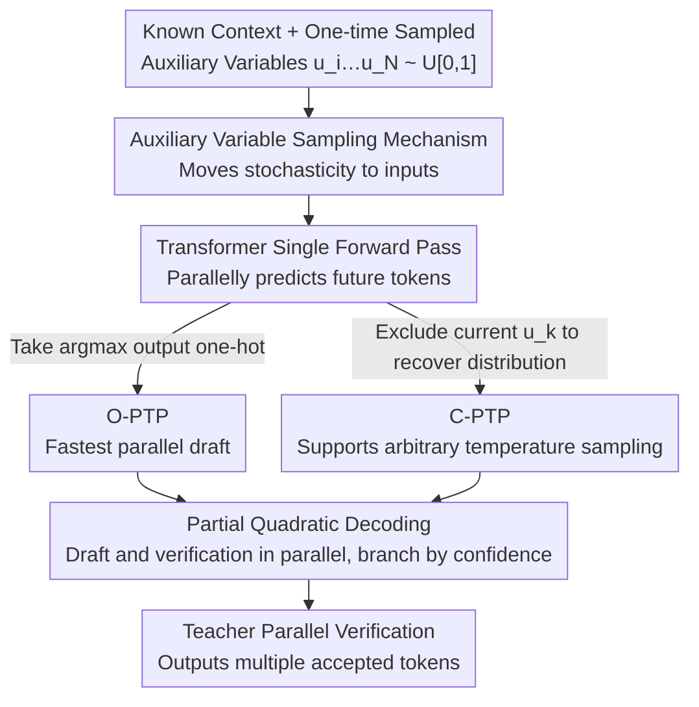

# Parallel Token Prediction for Language Models

**Conference**: ICLR 2026  
**arXiv**: [2512.21323](https://arxiv.org/abs/2512.21323)  
**Code**: [GitHub](https://github.com/mandt-lab/ptp)  
**Area**: Model Compression  
**Keywords**: Parallel Decoding, Speculative Decoding, Auxiliary Variables, Autoregressive Models, Inference Acceleration

## TL;DR

Ours proposes Parallel Token Prediction (PTP), which moves sampling stochasticity from post-processing to model inputs (auxiliary variables), making future tokens deterministic functions and enabling the joint prediction of multiple tokens in a single forward pass.

## Background & Motivation

The sequential generation process of autoregressive Transformers is the primary bottleneck for inference latency, as each token prediction requires one forward pass. Limitations of prior work include:
- **Speculative Decoding**: Uses a small model for drafting then verification, but the drafter remains sequential.
- **Independent Multiple Token Prediction**: Assumes conditional independence between tokens, leading to semantic inconsistencies (e.g., generating "def numpy").
- **Discrete Diffusion**: Requires multiple iterations and maintains irreducible sequential components.

Key Insight of PTP: By taking the random variables $u_i \sim \mathcal{U}[0,1]$ used for sampling as model inputs, each token $t_i$ becomes a deterministic function of $u_i$ and the preceding context, allowing the model to predict all future tokens in parallel.

## Method

### Overall Architecture

PTP addresses the latency bottleneck where autoregressive decoding produces only one token per forward pass. The core idea is to shift the "sampling stochasticity" from the output side to the input side: while predicting future tokens, the model reads an additional set of one-time sampled auxiliary random variables $u_i,\ldots,u_N$. Consequently, tokens that originally required step-by-step sampling become deterministic functions of the "context + these random variables," which can be jointly produced in one forward pass. Two variants are implemented: O-PTP directly outputs one-hot results with minimal latency, suitable as a draft model for speculative decoding; C-PTP recovers the full conditional distribution and supports arbitrary sampling temperatures. Both can be obtained via distilling a teacher or training from scratch. Since real Transformer capacity is finite and the number of tokens accurately parallelized in one pass is limited, Partial Quadratic Decoding is employed to allow the teacher to verify and correct drafts in parallel, delivering speedup without quality loss.

### Key Designs

**1. Auxiliary Variable Sampling Mechanism: Converting Stochasticity into Input Information**

Standard sampling is written as $t_i = \text{Pick}(u_i, P_i)$, where $u_i \sim \mathcal{U}[0,1]$ maps to a token via an inverse CDF. Conventional methods calculate the distribution $P_i$ first and then use $u_i$ to sample, forcing tokens to be serial. The key observation of PTP is: once $u_i$ is fixed, token $t_i$ is deterministic, and the information carried by $u_i$ is equivalent to $t_i$. Generalizing this yields Theorem 1: $t_k = f_P(t_{<i}; u_i, \ldots, u_k)$, meaning any future token can be expressed as a deterministic function of the known context and a sequence of auxiliary variables. Thus, by feeding $u_i,\ldots,u_N$ to the model at once, all future positions no longer wait for each other and can be solved in parallel.

**2. O-PTP: Trading One-hot Prediction for Fastest Parallel Decoding**

O-PTP allows the model to receive all auxiliary variables simultaneously and directly output one-hot results $t_k = \arg\max P(t_k \mid t_{<i}; u_i, \ldots, u_k)$ for each position. Because the auxiliary variables already "decide" which token to choose for the model, the output degenerates into a deterministic choice, bypassing the sampling step from a distribution. This is the lowest-latency form. The trade-off is that it only provides the final tokens without exposing the underlying distribution, making it naturally suited as a draft model for speculative decoding—predicting a sequence of candidates in one pass for the teacher to verify in parallel.

**3. C-PTP: Hiding One Variable to Recover Full Distribution**

When downstream tasks require temperature sampling instead of just taking the most likely token, O-PTP's one-hot output is insufficient. C-PTP intentionally omits $u_k$ when predicting the $k$-th token, providing only up to $u_{k-1}$. Theorem 2 proves that $P(t_k \mid t_{<i}, u_i, \ldots, u_{k-1}) = P(t_k \mid t_{<k})$, meaning the missing random variable exactly "spreads" the deterministic output back into the true conditional distribution. Thus, C-PTP maintains parallelism while providing full probabilities for sampling, supporting either training from scratch or distillation in an inverse-autoregressive manner.

**4. Partial Quadratic Decoding: Allocating Compute to Likely Branches by Confidence**

In speculative decoding, the number of accepted draft tokens is unknown a priori; naive approaches either waste compute or continue along the wrong branch. This design parallelizes drafting with verification and reserves branches for every possible number of accepted tokens. It uses the model's own confidence to estimate the probability of each branch: $P(\#\text{correct}=m \mid t) \approx (1-c_{i+m})\prod_{k=i}^{i+m-1} c_k$ (where $c_k$ is the confidence at position $k$). Subsequently, it greedily prioritizes allocating limited continuation tokens to high-probability branches, ensuring most computation falls on paths likely to be accepted, reducing ineffective forward passes.

### Loss & Training

During distillation, it is necessary to reverse the auxiliary variables from the teacher's distribution for each token, falling within the interval $u_k \in [F_{k,t_k-1}, F_{k,t_k})$ (where $F$ is the cumulative distribution). The objective for both variants is negative log-likelihood, differing only in whether $u_k$ is included in the condition: O-PTP uses $\mathcal{L}(\theta; t, i) = -\sum_{k=i}^N \log P_\theta(t_k \mid t_{<i}, u_i, \ldots, u_k)$, while C-PTP removes the current position's variable, $\mathcal{L}(\theta; t, i) = -\sum_{k=i}^N \log P_\theta(t_k \mid t_{<i}, u_i, \ldots, u_{k-1})$. Auxiliary variables are encoded via $\text{embed}(u) = W \cdot \text{binary}(u) + b$, specifically by expanding the float32 into a 32-bit binary vector before linearly mapping it into the embedding space.

## Key Experimental Results

### Main Results (SpecBench - Vicuna-7B Distillation)

| Method | MTC | TL | SUM | QA | Math | RAG | Avg. #accepted |
|------|-----|-----|-----|-----|------|-----|---------------|
| O-PTP | 2.77 | - | - | - | - | - | **4.2** |
| Autoregressive Baseline | - | - | - | - | - | - | ~2.0 |
| Independent Prediction | - | - | - | - | - | - | ~3.5 |

| Metric | Ours (O-PTP) | Description |
|------|------------|------|
| Wall-clock Speedup | **2.4×** | Compared to standard autoregressive decoding |
| Tokens per Step | **4.2** | Speculative decoding steps |

### Ablation Study

| Configuration | #accepted ↑ | Description |
|------|-----------|------|
| O-PTP (with aux variables) | **7.0 ± 0.1** | Coordination between tokens |
| Independent Prediction (no aux) | 6.2 ± 0.1 | Independent tokens, inconsistent pairs |
| C-PTP Training from Scratch | PPL 19.88 | Close to Autoregressive baseline (19.81) |

### Key Findings

- PTP draft models predict multiple tokens per call, shifting the optimal model size toward larger models (or even direct fine-tuning of the teacher).
- Auxiliary variables enable coordination between tokens, significantly reducing incompatible token pairs (e.g., "def numpy" drops to <1%).
- C-PTP trained from scratch achieves perplexity comparable to autoregressive models, verifying its theoretical expressive power.

## Highlights & Insights

- Strong theoretical contribution: Theorem 1/2 provides a rigorous probabilistic proof for the feasibility of parallel sampling.
- Transferred the concept of Inverse Autoregressive Flow from Normalizing Flows to discrete sequence generation, representing a cross-domain innovation.
- The auxiliary variable mechanism naturally resolves the inconsistency issues found in independent prediction methods.
- Partial Quadratic Decoding utilizes confidence for resource allocation, demonstrating high practicality.

## Limitations & Future Work

- Actual speedup is bounded by model capacity—limited Transformer capacity restricts the number of tokens accurately predicted in one pass.
- Requires a teacher model to recover auxiliary variables, leading to high distillation costs.
- Binary encoding of auxiliary variables may not be the optimal representation method.
- Effectiveness on larger scale models (70B+) and longer contexts remains unverified.

## Related Work & Insights

- Difference from Medusa/EAGLE: PTP achieves token coordination via auxiliary variables rather than independent multi-head prediction.
- Connection to Normalizing Flows: PTP is essentially a discrete version of Inverse Autoregressive Flow (IAF).
- Can be combined with efficient training techniques like GaLore or FlashAttention.

## Rating

- Novelty: ⭐⭐⭐⭐⭐ The auxiliary variable parallel sampling framework is a brand new theoretical contribution.
- Experimental Thoroughness: ⭐⭐⭐⭐ Multi-task verification, though lacks experiments on massive models.
- Writing Quality: ⭐⭐⭐⭐⭐ Rigorous theorem proofs and clear illustrations.
- Value: ⭐⭐⭐⭐⭐ Opens a new design space for parallel token generation.

<!-- RELATED:START -->

## Related Papers

- [\[ICLR 2026\] Multi-View Encoders for Performance Prediction in LLM-Based Agentic Workflows](multi-view_encoders_for_performance_prediction_in_llm-based_agentic_workflows.md)
- [\[ICLR 2026\] LS-Merge: Merging Language Models in Latent Space](ls-merge_merging_language_models_in_latent_space.md)
- [\[ICLR 2026\] BeyondBench: Contamination-Resistant Evaluation of Reasoning in Language Models](beyondbench_contamination-resistant_evaluation_of_reasoning_in_language_models.md)
- [\[ICLR 2026\] Distillation of Large Language Models via Concrete Score Matching](distillation_of_large_language_models_via_concrete_score_matching.md)
- [\[ICLR 2026\] Knowledge Fusion of Large Language Models Via Modular Skillpacks](knowledge_fusion_of_large_language_models_via_modular_skillpacks.md)

<!-- RELATED:END -->
