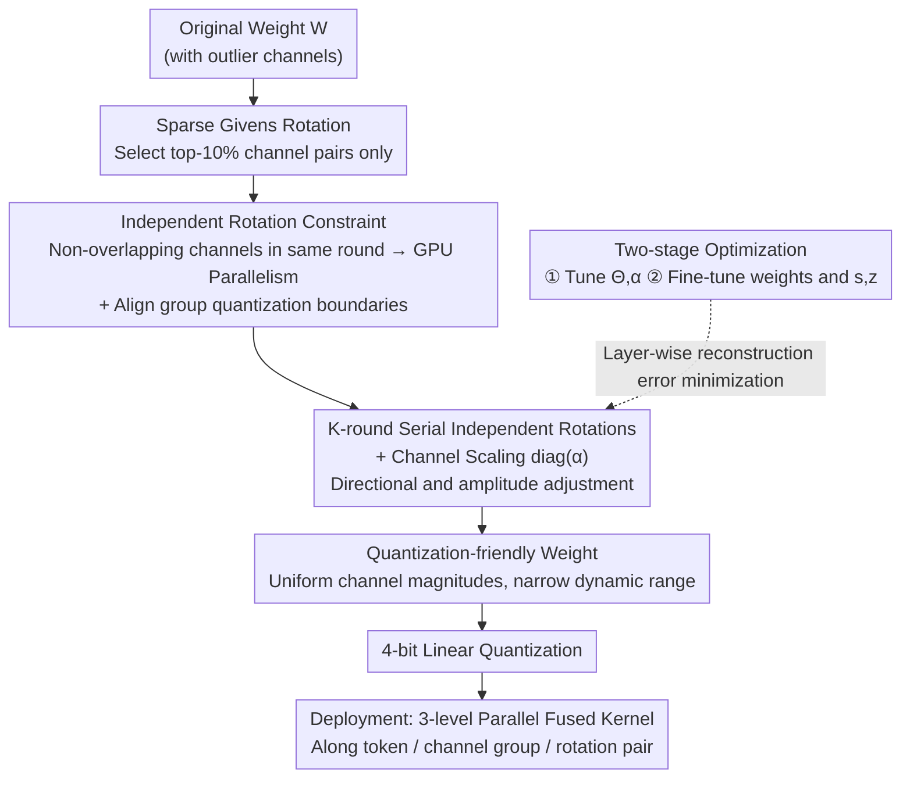

# ParoQuant: Pairwise Rotation Quantization for Efficient Reasoning LLM Inference

**Conference**: ICLR 2026  
**arXiv**: [2511.10645](https://arxiv.org/abs/2511.10645)  
**Code**: [Project Page](https://paroquant.z-lab.ai)  
**Area**: Model Compression  
**Keywords**: Post-training quantization, Givens rotation, Reasoning LLM, Quantization efficiency, Algorithm-system co-design

## TL;DR

Ours proposes ParoQuant, which eliminates weight outliers through a combination of hardware-efficient, optimizable independent Givens rotations and channel scaling, achieving high-precision, low-overhead 4-bit weight quantization on reasoning LLMs.

## Background & Motivation

LLM quantization faces a trade-off between accuracy and efficiency:
- **AWQ**: Fast but suffers significant accuracy loss (e.g., Qwen3-4B drops 2.8% on MMLU-Pro); the long-chain-of-thought in reasoning LLMs causes quantization errors to accumulate progressively.
- **QTIP**: High accuracy but approximately 30% slower than AWQ because the Hadamard transform introduces significant overhead.
- Reasoning models generate tens of thousands of tokens, necessitating higher requirements for quantization accuracy and efficiency.

Key observation:

**Rotations effectively suppress outliers**, but full rotation matrices are computationally expensive.

**Sparsely parameterized rotations are equally effective**—retaining only the top-10% of channel pairs can match the performance of full rotations.

## Method

### Overall Architecture

ParoQuant addresses the challenge of outliers in 4-bit weight quantization: a few large-magnitude channels in weights expand the dynamic range of an entire group, forcing coarser quantization steps and larger errors. As reasoning LLMs generate thousands of tokens, these errors accumulate along the chain of thought. Its core is a learnable transform called Scaled Pairwise Rotation: it first uses a series of lightweight pairwise (Givens) rotations to "flatten" outliers into adjacent channels, then uses a set of channel scaling factors to align the average magnitudes across channels, narrowing the dynamic range within each quantization group. Finally, 4-bit quantization is applied. The entire transform consists of sparse Givens rotations and a diagonal scaling matrix, which can be optimized layer-by-layer to minimize quantization reconstruction error and executed online within a highly parallel GPU kernel, approaching vector quantization in accuracy while remaining close to AWQ in speed.

### Key Designs

**1. Sparse Givens Rotation: Replacing Full Rotation Matrices with Limited Channel Pairs**

The most direct way to suppress outliers is to multiply weights by an orthogonal rotation matrix. However, an arbitrary $n\times n$ orthogonal matrix can be decomposed into at most $\tfrac{1}{2}n(n-1)$ Givens rotations (rotations within a plane spanned by two coordinate axes), equivalent to rotating all channel pairs sequentially. This $O(n^2)$ computational complexity is the root cause of the slowness in QTIP/QuaRot. ParoQuant instead uses a set of sparse plane rotations: it selects only a small subset of channel pairs $\mathcal{P} = \{(i_1,j_1), \ldots, (i_m,j_m)\}$ and performs a rotation by angle $\theta_k$ on the 2D plane for each pair $(i,j)$, i.e., $\mathbf{W}^{(k)}[i,:] = \cos\theta_k \cdot \mathbf{W}^{(k-1)}[i,:] - \sin\theta_k \cdot \mathbf{W}^{(k-1)}[j,:]$. This can be computed in-place with a few vectorized multiply-accumulate operations without full matrix multiplication. The authors hypothesize that rotations between outlier and normal channels are most effective for outlier suppression, verifying through experiments that optimizing only the top-10% channel pairs with the largest magnitude differences yields results nearly matching a full rotation matrix, indicating significant redundancy in the orthogonal transformation for this task.

**2. Independent Rotation: Natural Parallelism and Group Quantization Compatibility**

If a set of Givens rotations shares channels across pairs, dependencies are created—rotations become non-commutative and order-dependent, forcing serial execution and reducing GPU utilization. ParoQuant imposes a constraint (independent pairs): in a single round, each channel belongs to at most one rotation pair ($P_k \cap P_l = \emptyset$). Consequently, all rotations within a round are independent and can be computed in parallel. Furthermore, this partition naturally aligns with group quantization boundaries—running an independent rotation set within each quantization group prevents rotations from disrupting magnitude distributions across group boundaries, maintaining the accuracy benefits of grouping while allowing per-group customized channel pairs to further enhance parallelism. The gain in engineering efficiency from this constraint is compensated for by the next design choice.

**3. Serial Multi-round Independent Rotations with Channel Scaling: Restoring Expressive Power**

A single round of independent rotation provides only $n/2$ adjustable angles, which is merely $\tfrac{1}{n-1}$ of the parameter count of a full orthogonal matrix. This significantly compressed fitting capacity is insufficient to handle complex outlier distributions. ParoQuant stacks $K$ rounds of independent rotations ($K=8$ by default), with each round selecting unique channel pairs (randomly selected and deduplicated) and optimizing its own angles. This multi-round composition results in an equivalent sparse orthogonal transform with sufficient expressive power. Beyond rotation, a diagonal scaling matrix $\text{diag}(\boldsymbol{\alpha})$ is applied to directly balance the average magnitudes of channels, addressing pure scale differences that rotation cannot handle. The final transform is expressed as:

$$T_{\mathcal{P},\Theta,\boldsymbol{\alpha}}(\mathbf{W}) = \left(\prod_{t=1}^K R(\mathcal{P}_t, \Theta_t)\right) \cdot \text{diag}(\boldsymbol{\alpha}) \cdot \mathbf{W}$$

Rotations handle "direction" while scaling handles "amplitude," making weights more amenable to 4-bit quantization. Multi-round rotations can be fused into a single kernel and loaded into memory once, adding negligible overhead during inference.

### Loss & Training

The optimization objective is the layer-wise quantization reconstruction error $\mathcal{L}(Q) = \|Q(D)(\mathbf{X'}) - D(\mathbf{X})\|$, ensuring the quantized layer's output closely matches the original. Training consists of two stages: first, weights are frozen while rotation angles $\Theta$ and scaling factors $\boldsymbol{\alpha}$ are optimized; second, a QAT-like approach fine-tunes the weights and quantization parameters (step size $s$, zero point $z$). Each layer is optimized with AdamW for 10 epochs. Calibration data is uniformly sampled from WikiText2, C4, and RedPajama datasets to avoid overfitting to a single distribution. On the inference side, this transformation is implemented as a three-level parallel GPU kernel—parallelized across tokens, channel groups, and rotation pairs—fusing multiple independent rotations into a single kernel call, which enables end-to-end acceleration comparable to AWQ.

## Key Experimental Results

### Main Results (Perplexity - W4G128 Quantization)

| Model | Method | WikiText2 PPL | C4 PPL | Inference Speedup |
|------|------|-------------|--------|---------|
| LLaMA-3-8B | FP16 | 5.54 | 7.10 | 1.0× |
| | AWQ | 5.92 | 7.42 | **2.4×** |
| | QTIP | 5.69 | 7.22 | 1.7× |
| | **ParoQuant** | **5.68** | **7.17** | **2.2×** |
| Qwen3-4B | AWQ | 7.36 | 7.89 | 2.4× |
| | QTIP | 7.09 | 7.68 | 1.7× |
| | **ParoQuant** | **7.03** | **7.63** | 2.2× |

### Inference Task Accuracy (DeepSeek-R1-distilled LLaMA-3.1-8B)

| Method | MMLU-Pro | GPQA Diamond | AIME-24 | AIME-25 | Average |
|------|---------|-------------|---------|---------|------|
| FP16 | 52.4 | 43.9 | 56.7 | 40.0 | 48.3 |
| AWQ | 49.3 | 40.4 | 46.7 | 26.7 | 40.8 |
| **ParoQuant** | **52.5** | **41.4** | **53.3** | **36.7** | **46.0** |

### Key Findings

- ParoQuant achieves an average 2.4% accuracy improvement over AWQ on reasoning tasks with less than 10% additional overhead.
- Accuracy matches QTIP (Prev. SOTA in vector quantization) while being approximately 25% faster.
- Performance gains are particularly significant on the Qwen3 series (1.7B-14B), where small model quantization is more challenging.

## Highlights & Insights

- **Algorithm-system co-design**: The constraint of independent rotations ensures a viable optimization space while being naturally suited for GPU parallelism.
- **Incise Analysis**: The observation that only 10% of channel pairs can match full rotation performance reveals the redundancy inherent in orthogonal transforms for outlier suppression.
- **Focus on Reasoning LLMs**: Provides a thorough analysis of quantization error accumulation issues within long-chain-of-thought processes.
- **Online Rotation Kernel**: Utilizes shared memory and registers to fuse multiple independent rotations into a single kernel call.

## Limitations & Future Work

- Currently primarily validated on 4-bit linear quantization; 2-3 bit scenarios remain unexplored.
- The channel pair selection strategy for independent rotations (random + deduplication) may not be optimal.
- The number of rounds $K=8$ is empirical; different models may require different $K$ values.
- The lack of an open-source release may currently limit community adoption.

## Related Work & Insights

- **Difference from QuaRot/SpinQuant**: ParoQuant utilizes optimizable independent Givens rotations instead of fixed Hadamard transforms.
- **Difference from AWQ**: Enhances outlier suppression capabilities by adding rotation transforms on top of channel scaling.
- **Insight**: In the era of reasoning LLMs, quantization methods must strike a new balance between accuracy and efficiency.

## Rating

- **Novelty**: ⭐⭐⭐⭐ The design of independent Givens rotations is both novel and practical.
- **Experimental Thoroughness**: ⭐⭐⭐⭐⭐ Comprehensive validation across multiple models, tasks, and metrics.
- **Writing Quality**: ⭐⭐⭐⭐ Motivations are clearly analyzed, though the density of formulas is high.
- **Value**: ⭐⭐⭐⭐⭐ A practical solution for reasoning LLM quantization.

<!-- RELATED:START -->

## Related Papers

- [\[ICML 2026\] ReSpinQuant: Efficient Layer-Wise LLM Quantization via Subspace Residual Rotation Approximation](../../ICML2026/model_compression/respinquant_efficient_layer-wise_llm_quantization_via_subspace_residual_rotation.md)
- [\[ICLR 2026\] Towards Quantization-Aware Training for Ultra-Low-Bit Reasoning LLMs](towards_quantization-aware_training_for_ultra-low-bit_reasoning_llms.md)
- [\[ICLR 2026\] Rethinking Residual Errors in Compensation-based LLM Quantization](rethinking_residual_errors_in_compensation-based_llm_quantization.md)
- [\[ICLR 2026\] Efficient Reasoning with Balanced Thinking](efficient_reasoning_with_balanced_thinking.md)
- [\[ICLR 2026\] SERQ: Saliency-Aware Low-Rank Error Reconstruction for LLM Quantization](serq_saliency-aware_low-rank_error_reconstruction_for_llm_quantization.md)

<!-- RELATED:END -->
