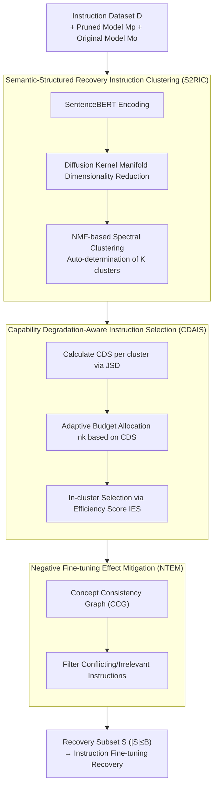

# PASER: Post-Training Data Selection for Efficient Pruned Large Language Model Recovery

**Conference**: ICLR 2026  
**arXiv**: [2502.12594](https://arxiv.org/abs/2502.12594)  
**Code**: Available  
**Area**: Model Compression / LLM Efficiency  
**Keywords**: LLM Pruning, Data Selection, Post-Training Recovery, Manifold Learning, Capability Degradation-Awareness

## TL;DR
This paper proposes PASER, a post-training data selection method for recovering pruned LLMs. By utilizing manifold learning and spectral clustering to identify capability-related instruction sets and adaptively allocating data budgets based on capability degradation, PASER significantly outperforms full-data recovery using only 4%-20% of the original data.

## Background & Motivation

**Background**: Model pruning is an effective means for LLM compression, but it inevitably leads to capability degradation. The mainstream approach for post-training recovery involves using instruction fine-tuning data (e.g., Alpaca). Conventional methods directly train on the full dataset, which is computationally expensive and not necessarily optimal.

**Limitations of Prior Work**:
   - Pruning affects different capabilities **unevenly** (e.g., math capability might degrade severely while language modeling remains largely intact), yet existing methods ignore this non-uniformity.
   - Full-data recovery entails high computational costs (e.g., LaMini contains 2.58 million entries) and may introduce irrelevant or conflicting instructions, leading to **negative fine-tuning effects**.
   - Random subset selection yields unstable results and is highly sensitive to data composition.
   - Existing data selection methods (e.g., IFD, Nuggets) are designed for general instruction quality and lack specificity for pruning recovery scenarios.

**Key Challenge**: There is a need to efficiently recover multiple capabilities using a small amount of data, but different capabilities require different volumes and types of data support, and some data may even yield negative effects.

**Goal**:
   - Identify instruction data groupings corresponding to different LLM capabilities.
   - Adaptively allocate data budgets based on the degree of degradation.
   - Prioritize samples within each group with the highest benefit-to-computational-cost ratio.
   - Filter out conflicting or irrelevant data that may introduce negative effects.

**Key Insight**: Assuming that geometric structures in semantic space correspond to different LLM capabilities, these structures can be discovered via manifold learning. Subsequently, the difference in output distributions (JSD) between the original and pruned models can quantify the degree of degradation.

**Core Idea**: Replace "blind full-data training" with "capability-aware data selection" to make pruned LLM recovery more precise, efficient, and robust.

## Method

### Overall Architecture
PASER addresses the following problem: given a pruned LLM, which and how many instructions should be selected from a large dataset for recovery training to save computation while avoiding "performance collapse." The process is divided into a three-stage pipeline: First, instructions are clustered into $K$ groups based on the capability they target; second, data budgets are adaptively allocated based on capability degradation, and cost-effective samples are selected; finally, conflicting instructions that might interfere with the main dataset are filtered. Formally, given a pruned model $M_p$, an original model $M_o$, and an instruction dataset $D$, the three steps are Semantic-Structured Recovery Instruction Clustering (S2RIC), Capability Degradation-Aware Instruction Selection (CDAIS), and Negative Fine-tuning Effect Mitigation (NTEM), outputting a recovery subset $S \subset D$ satisfying $|S| \leq B$.

### Key Designs

**1. Semantic-Structured Recovery Instruction Clustering (S2RIC): Grouping instructions by capability**

Since pruning damages capabilities unevenly, the first step is to identify which capability each instruction targets. S2RIC assumes that instructions for the same capability form identifiable topological structures in semantic space. Each instruction is first encoded into an embedding using SentenceBERT, followed by manifold learning via Diffusion Kernels. Diffusion Kernels are chosen over PCA/t-SNE because they better preserve non-linear manifold geometry. Subsequently, NMF-based spectral clustering discovers natural groupings. The cluster count $K$ is determined automatically by minimizing the NMF approximation error, avoiding hyperparameter arbitrariness.

**2. Capability Degradation-Aware Instruction Selection (CDAIS): Allocating more data to severely degraded capabilities**

After grouping, budgets must be allocated. The degree of damage is quantified using the Capability Degradation Score (CDS): within each cluster $c_k$, the average Jensen-Shannon Divergence (JSD) between the original and pruned models' output distributions is calculated. JSD is used instead of loss difference or accuracy because it captures the complete change in output distribution. Budgets are assigned proportionally to degradation; severely degraded capabilities receive more data:

$$n_k = \left\lfloor B \cdot \frac{\text{CDS}(c_k)}{\sum_j \text{CDS}(c_j)} \right\rfloor$$

Within clusters, samples are selected based on the Individual Efficiency Score (IES), which balances benefit and computational cost:

$$\text{IES}(x,y) = \frac{\text{JSD}_{avg}}{\log \text{ComputationalCost}(x,y)}$$

The numerator represents the degradation signal, and the denominator applies a logarithm to computational cost. This prevents long, high-potential samples from being dismissed entirely due to high costs.

**3. Negative Fine-tuning Effect Mitigation (NTEM): Filtering conflicting instructions**

Full-data recovery can cause model collapse because datasets often contain contradictory instructions. NTEM models these conflicts at the concept level: it constructs a Concept Consistency Graph (CCG) where vertices are concepts extracted from instructions and edges represent non-conflicting co-occurrences. A new sample is accepted only if its concepts are consistent with the existing CCG. Robustness is enhanced via semantic normalization, soft de-weighting of low-confidence judgments, and optional NLI-based re-ranking.

### Loss & Training
- Standard instruction fine-tuning is performed on the selected subset $S$; the method does not modify the training objective itself.
- The time complexity of the selection process is $O(N\log N + NC^2)$, where $C$ is the number of concepts. In practice, $C \ll N$, simplifying to approximately $O(N\log N)$.

## Key Experimental Results

### Main Results (LLaMA2-7B + LLM-Pruner 25% Pruning + Alpaca Data)

| Recovery Method | WikiText2↓ | BoolQ | PIQA | HellaSwag | WinoGrande | ARC-e | ARC-c | OBQA | Avg |
|----------|-----------|-------|------|-----------|------------|-------|-------|------|------|
| No Recovery | 20.34 | 61.87 | 76.61 | 65.86 | 60.22 | 63.13 | 37.37 | 39.40 | 57.78 |
| Full Data | 736.42 | 37.83 | 53.21 | 26.42 | 49.57 | 25.29 | 28.16 | 29.00 | 35.64 |
| Random | 93.77 | 57.61 | 64.37 | 45.39 | 55.87 | 43.78 | 31.94 | 34.90 | 47.69 |
| Nuggets | 20.02 | 63.62 | 77.43 | 67.36 | 61.08 | 63.77 | 37.64 | 39.90 | 58.69 |
| **PASER** | **16.40** | **67.25** | 77.29 | **68.98** | **66.97** | **67.84** | **39.54** | 39.80 | **61.10** |

Note: **Full-data recovery causes model collapse** (PPL 20→736), whereas PASER uses 20% of data to reach a PPL of 16.40 (better than the pruned model's baseline) and achieves an average accuracy of 61.10 (close to the unpruned 62.91).

### Ablation Study

| Configuration | Key Findings |
|------|---------|
| SliceGPT 25% + PASER | PPL 44.53→12.24, Avg 54.27→64.31, **Exceeding unpruned model** |
| Wanda 2:4 Semi + PASER | Avg 54.39→62.02, approaching full-parameter levels |
| SparseGPT 50% + PASER | Avg 59.93→61.62, stable improvement |
| LaMini 2.58M + PASER | Only 4% data required to match or exceed full-data training |
| w/o S2RIC (Uniform budget) | Performance drops 2-4%, validating capability-aware allocation |
| w/o NTEM (No filtering) | Performance drops 1-3%, validating conflict mitigation value |

### Key Findings
- **Full-data recovery can be harmful**: Under the LLM-Pruner + Alpaca setting, full recovery caused model collapse (PPL > 700), highlighting the danger of blind training.
- **4%-20% selected data > 100% full data**: PASER outperforms full-data training across all pruning schemes with significant data reduction.
- **SliceGPT + PASER exceeds unpruned models**: Pruning followed by precise recovery can potentially surpass the original model's performance.
- **Cross-scale/architecture generalization**: Proven effective across LLaMA2-7B/13B/70B, LLaMA3-8B, and Baichuan2-7B/13B.

## Highlights & Insights
- **Core Insight of "Degradation-Aware" Selection**: Not all data is useful for recovery; the key is matching data to specific capability deficits. JSD is more robust than simple loss differences as it captures full distributional shifts.
- **Engineering Insight of "Selective Few > Blind All"**: The finding that full Alpaca training can explode PPL is valuable, indicating that general instruction data contains numerous samples harmful to pruned models.
- **Elegant CCG Design**: By modeling conflicts at the concept level rather than the sample level, the approach remains computationally efficient and supports incremental updates, making it suitable for large-scale selection.

## Limitations & Future Work
- Calculating JSD requires simultaneous access to both original and pruned models; if the original model is very large (e.g., LLaMA-70B), JSD computation is non-trivial.
- Concept extraction relies on simple rules, which may not capture complex semantic conflicts.
- Validation is primarily on English LLMs; applicability to multilingual scenarios is unknown.
- **Future Directions**: Could a lightweight proxy model estimate JSD instead of the original? Can this be extended to post-quantization recovery?

## Related Work & Insights
- **vs Nuggets (Li et al., 2024)**: A general data selection method. While it was the strongest baseline in PASER experiments (Avg 58.69), it remained significantly weaker than PASER (61.10) as it ignores the distribution of capability degradation.
- **vs IFD (Li et al., 2024)**: Score-based selection using trainable LLMs. It underperforms in structured pruning scenarios compared to Nuggets and PASER.
- **vs LLM-Pruner (Ma et al., 2023)**: A structured pruning pioneer that recommends full Alpaca recovery—PASER demonstrates that this can be counterproductive.

## Rating
- Novelty: ⭐⭐⭐⭐ The capability degradation-aware selection perspective is novel, with a complete technical pipeline (manifold learning + JSD).
- Experimental Thoroughness: ⭐⭐⭐⭐⭐ Extremely comprehensive, covering 4 pruning schemes, 7 LLMs, 2 dataset scales, and multiple baselines.
- Writing Quality: ⭐⭐⭐⭐ Detailed methodological description with public code.
- Value: ⭐⭐⭐⭐⭐ Directly informs the practical workflow of LLM pruning and recovery; the "less is more" finding holds significant practical value.

<!-- RELATED:START -->

## Related Papers

- [\[ICLR 2026\] Quant-dLLM: Post-Training Extreme Low-Bit Quantization for Diffusion Large Language Models](quant-dllm_post-training_extreme_low-bit_quantization_for_diffusion_large_langua.md)
- [\[ICML 2026\] Decouple Searching from Training: Scaling Data Mixing via Model Merging for Large Language Model Pre-training](../../ICML2026/model_compression/decouple_searching_from_training_scaling_data_mixing_via_model_merging_for_large.md)
- [\[ICLR 2026\] Pedagogically-Inspired Data Synthesis for Language Model Knowledge Distillation](pedagogically-inspired_data_synthesis_for_language_model_knowledge_distillation.md)
- [\[ICLR 2026\] Training Dynamics Impact Post-Training Quantization Robustness](training_dynamics_impact_post-training_quantization_robustness.md)
- [\[ICLR 2026\] Post-Training Quantization for Video Matting](post-training_quantization_for_video_matting.md)

<!-- RELATED:END -->
