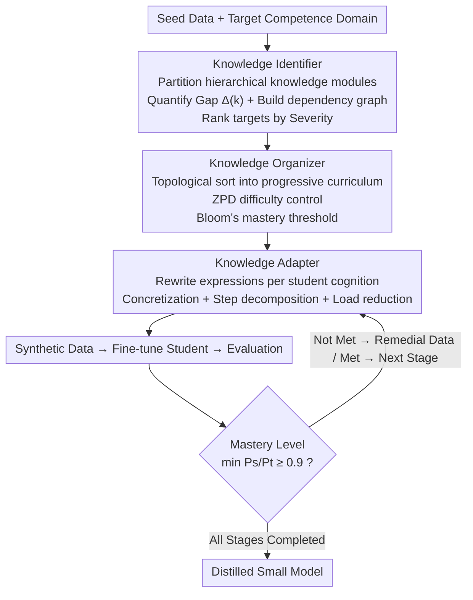

# Pedagogically-Inspired Data Synthesis for Language Model Knowledge Distillation

**Conference**: ICLR 2026  
**arXiv**: [2602.12172](https://arxiv.org/abs/2602.12172)  
**Code**: None  
**Area**: Model Compression  
**Keywords**: Knowledge Distillation, Synthetic Data, Curriculum Learning, Pedagogically-Inspired, LLM Compression

## TL;DR

This paper proposes the IOA (Identifier-Organizer-Adapter) framework, which draws on Bloom’s mastery learning principles and Vygotsky’s Zone of Proximal Development (ZPD) theory. It achieves pedagogy-driven LLM knowledge distillation through three stages: diagnosing knowledge deficiencies, designing progressive curricula, and adapting to cognitive levels.

## Background & Motivation

Limitations of existing LLM knowledge distillation methods:

**Missing Knowledge Identification**: Synthetic data lacks targeting toward the specific knowledge deficiencies of the student model.

**Missing Knowledge Organization**: Data generation lacks instructional sequencing, ignoring the progressive learning trajectory of knowledge.

**Missing Knowledge Adaptation**: The cognitive capacity of the student model is neglected, as complex expressions from the teacher model are used directly.

Core Analogy: Treating LLM distillation as a pedagogical process—the teacher (large model) must dynamically select teaching content and strategies based on the student's (small model) prior knowledge and learning progress.

## Method

### Overall Architecture

IOA treats distillation as a lesson tailored for a specific student: First, the Identifier diagnoses which knowledge the student model has not mastered and the order in which to supplement it. Then, the Organizer arranges this knowledge into a progressive curriculum from easy to difficult based on prerequisite relationships. Finally, the Adapter rewrites each knowledge point into expressions digestible at the student’s current cognitive level. Data is synthesized, fine-tuned, and assessed stage-by-stage, with progression allowed only upon reaching mastery.

### Key Designs

**1. Knowledge Identifier: Diagnosing what to teach rather than aimless data injection**

A pain point in general distillation is the lack of target for synthetic data—the teacher prompts randomly regardless of student strengths and weaknesses. The Identifier first partitions the target competence domain into a set of hierarchical knowledge modules $\mathcal{D} = \{K_1, K_2, \ldots, K_m\}$, then quantifies the teacher-student gap $\Delta(k) = \frac{P_T(k) - P_S(k)}{P_T(k)}$. Only modules with $\Delta(k) > \tau_{gap}=0.3$ are marked as genuine deficiencies, focusing the data budget where the student actually struggles. Furthermore, as knowledge has prerequisites, the Identifier constructs a knowledge dependency graph $G=(V,E)$ via conditional performance analysis and ranks deficiencies using $\text{Severity}(k) = \alpha \cdot \Delta(k) + (1-\alpha) \cdot \text{Connectivity}(k)$—considering both the gap size and how central the point is to the dependency graph.

**2. Knowledge Organizer: Sequencing diagnosis results into a progressive curriculum**

Identifying gaps is insufficient; one must decide when to teach. The Organizer performs a topological sort on the dependency graph, ensuring prerequisite knowledge is taught before dependent knowledge. It superimposes two pedagogical constraints: first, Vygotsky’s Zone of Proximal Development (ZPD), which keeps the difficulty increment between adjacent stages $\leq \tau_{ZPD} = 0.15$ so every step is within the student's reach; second, Bloom’s Mastery Learning, requiring $\min_{k \in s_i} \frac{P_S(k)}{P_T(k)} \geq \tau_{mastery} = 0.9$ (i.e., reaching 90% of the teacher's level for all points in that stage) before proceeding. This "remediation if failed" mechanism prevents early knowledge from being diluted by a sudden influx of data.

**3. Knowledge Adapter: Rewriting knowledge into a format understandable to the student**

Even with the correct order, small models cannot digest the complex expressions of a >100B teacher model. During data generation, the Adapter performs cognitive adaptation on the teacher's explanations: concretizing abstract concepts, explicitly decomposing complex reasoning into followable step chains (extraction → identification → equation → solution → verification), managing cognitive load (starting with simple 2x2 integer coefficient instances), optimizing representation formats, and reducing linguistic complexity by replacing technical jargon with simple equivalents.

### Loss & Training

Each stage follows a closed-loop of "Synthetic Data → Fine-tuning → Evaluation → Mastery Check → Remediation or Progression." Each round focuses on approximately 20–30% of deficient modules. In experiments, OpenAI o1 / DeepSeek-R1 (>100B parameters) serve as teachers, while student models include Qwen2.5-3B/7B/14B, LLaMA-3.1-8B, and LLaMA-3.2-3B.

## Key Experimental Results

### Main Results (OpenAI o1 Teacher, Qwen2.5-3B Student)

| Method | DollyEval | GSM8K | MATH | HumanEval | MBPP | GPQA-D |
|------|----------|-------|------|----------|------|--------|
| Undistilled | 25.37 | 37.24 | 5.79 | 22.46 | 31.58 | 7.95 |
| Self-Instruct | 32.18 | 43.69 | 7.12 | 25.63 | 36.27 | 9.28 |
| MADA (Prev. SOTA) | 36.42 | 52.04 | 13.15 | 33.39 | 42.18 | 11.93 |
| **IOA (Ours)** | **38.16** | **55.79** | **15.53** | **40.64** | **47.86** | **13.74** |

### Key Metrics Comparison

| Metric | IOA vs MADA Gain | IOA vs Undistilled Gain |
|------|-----------------|----------------------|
| MATH | +2.38 (+18.1%) | +9.74 (+168%) |
| HumanEval | +7.25 (+21.7%) | +18.18 (+81%) |
| GSM8K | +3.75 (+7.2%) | +18.55 (+49.8%) |
| DollyEval | +1.74 (+4.8%) | +12.79 (+50.4%) |

### Key Findings

- The student model retains 94.7% of the teacher's performance on DollyEval with less than 1/10 the parameters.
- MATH improved by 19.2% and HumanEval by 22.3% compared to SOTA baselines.
- Pedagogical principles significantly enhance distillation effects on complex reasoning tasks.
- Staged requirements of Bloom's mastery learning effectively mitigate knowledge forgetting.

## Highlights & Insights

- Interdisciplinary Innovation: Systematically introduces pedagogical theories (Bloom, Vygotsky) into LLM distillation.
- The three-stage design of IOA comprehensively addresses "what to teach, when to teach, and how to teach."
- The construction of the knowledge dependency graph and conditional performance analysis are data-driven and quantifiable.
- Gains on complex reasoning tasks far exceed those on simple instruction following, aligning with pedagogical theoretical expectations.

## Limitations & Future Work

- Knowledge module decomposition relies on the teacher LLM's self-organization, which may not be entirely accurate.
- The total time overhead for staged training is significant due to multiple evaluation and remediation rounds.
- Pedagogical hyperparameters ($\tau_{mastery}=0.9$, $\tau_{ZPD}=0.15$) require empirical tuning.
- Knowledge forgetting across stages was not fully explored—later training might interfere with knowledge from earlier stages.

## Related Work & Insights

- Comparison with DeepSeek-R1 distillation: IOA introduces structured curricula and cognitive adaptation rather than simple fine-tuning.
- Comparison with Lion/MADA: IOA's knowledge targeting and progressive learning make distillation more systematic and efficient.
- Insight: Effective distillation requires not only high-quality data but also sound pedagogical strategies.

## Rating

- Novelty: ⭐⭐⭐⭐⭐ Highly innovative pedagogy-driven distillation framework.
- Experimental Thoroughness: ⭐⭐⭐⭐ Verified across multiple models and benchmarks, though many main results are in appendices.
- Writing Quality: ⭐⭐⭐⭐ Intuitive pedagogical analogies, though method sections are heavy on formulas.
- Value: ⭐⭐⭐⭐⭐ Provides a systematic new paradigm for black-box distillation.

<!-- RELATED:START -->

## Related Papers

- [\[ICLR 2026\] Knowledge Distillation for Large Language Models through Residual Learning](knowledge_distillation_for_large_language_models_through_residual_learning.md)
- [\[AAAI 2026\] Condensed Data Expansion Using Model Inversion for Knowledge Distillation](../../AAAI2026/model_compression/condensed_data_expansion_using_model_inversion_for_knowledge_distillation.md)
- [\[ICLR 2026\] Knowledge Distillation as Decontamination? Revisiting the "Data Laundering" Concern in Classification Tasks](knowledge_distillation_as_decontamination_revisiting_the_data_laundering_concern.md)
- [\[ACL 2026\] Find Your Optimal Teacher: Personalized Data Synthesis via Router-Guided Multi-Teacher Distillation](../../ACL2026/model_compression/find_your_optimal_teacher_personalized_data_synthesis_via_router-guided_multi-te.md)
- [\[ICLR 2026\] Distillation of Large Language Models via Concrete Score Matching](distillation_of_large_language_models_via_concrete_score_matching.md)

<!-- RELATED:END -->
