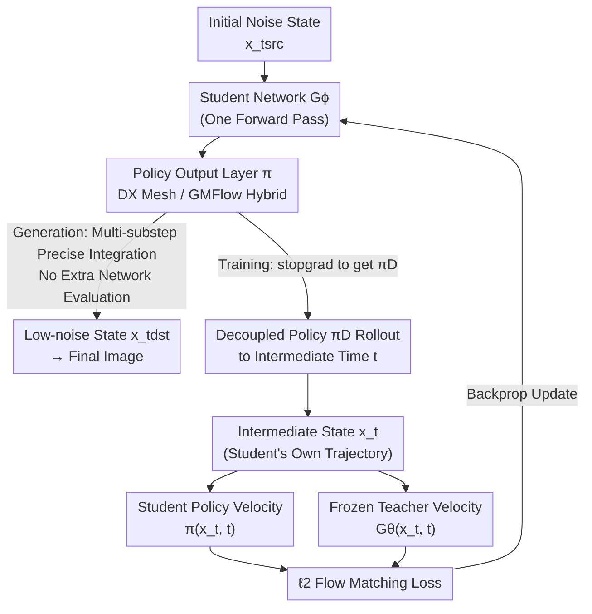

# π-Flow: Policy-Based Few-Step Generation via Imitation Distillation

**Conference**: ICLR 2026  
**arXiv**: [2510.14974](https://arxiv.org/abs/2510.14974)  
**Code**: Available (see paper Comments)  
**Area**: Image Generation / Diffusion Model Distillation  
**Keywords**: Flow matching model distillation, few-step generation, policy learning, imitation distillation, DiT

## TL;DR

Proposes π-Flow, which modifies the output layer of a student flow model to predict a "policy." This policy performs precise ODE integration through dynamic flow velocities across multiple sub-steps within a single network evaluation. By employing an imitation distillation method to match teacher velocities on the student's own trajectories, it achieves stable and scalable few-step generation while avoiding the quality-diversity trade-off.

## Background & Motivation

While diffusion and flow matching models offer superior generation quality, they requires a large number of steps (e.g., 50–1000 ODE solver steps) during inference, significantly limiting efficiency in practical applications. Distillation is the core approach to accelerating these models.

### Limitations of Prior Work

**Format Mismatch**:
   - The teacher model outputs a **velocity field**—instantaneous changes in the direction of the flow.
   - The student model is typically required to output **denoised data (shortcut prediction)**—directly predicting the final result.
   - This format mismatch leads to complex and unstable distillation processes.

**Quality-Diversity Trade-off**:
   - Methods like Distribution Matching Distillation (DMD) use KL divergence to match distributions.
   - However, KL divergence tends toward mode covering or mode seeking, making it difficult to achieve both simultaneously.
   - In practical large models (FLUX, Qwen-Image), this results in a significant drop in diversity.

**Training Instability**:
   - Many methods require online generation of student samples, training discriminators, or using adversarial training.
   - These strategies increase training complexity and instability.

### Goal

To design a distillation method that allows the student model to maintain the same "velocity prediction" format as the teacher, thereby:
- Avoiding format mismatch.
- Using a simple $\ell_2$ flow matching loss.
- Compressing steps while preserving both quality and diversity.

## Method

### Overall Architecture

π-Flow aims to solve the chain of "format mismatch → complex training → compromised quality or diversity" in few-step distillation. The Mechanism is as follows: the student performs **one** network forward pass at each coarse step, but instead of outputting a single-point velocity or a denoised result, it outputs a **policy** describing a continuous velocity field for that interval. With this policy, precise ODE integration can be performed over hundreds of sub-steps within the interval without further network evaluations, completely decoupling "network evaluation steps" from "integration sub-steps." During training, the student first generates a trajectory using its own policy, then queries teacher velocities at these trajectory points and aligns them using a standard $\ell_2$ loss—reframing distillation as DAgger-style "online imitation learning." The following diagram illustrates how the inference (generation path) and training (π-ID alignment path) share the same policy mechanism:

### Key Designs

**1. Policy Output Layer (policy): Decoupling Network Evaluations and ODE Integration Sub-steps**

Traditional few-step students perform only one or two "shortcut jumps" per coarse step, mapping noise directly to denoised results; the larger the jump, the more severe the error accumulation. Although multi-step teachers provide fine integration, they require a network evaluation for every sub-step, which is too slow. The Core Idea of π-Flow is to let the student no longer output a single-point velocity at $t_{src}$, but instead a **network-free policy** $\pi$—a function that provides a closed-form velocity for any state $(x_t, t)$ within the interval: $\pi(x_t, t) = G_\phi(x_{t_{src}}, t_{src})(x_t, t)$. Once the policy is obtained, high-precision ODE integration can be performed across hundreds of sub-steps in the interval $[t_{dst}, t_{src}]$ as $x_{t_{dst}} = x_{t_{src}} + \int_{t_{src}}^{t_{dst}} \pi(x_t, t) dt$. These sub-steps **reuse the same network forward pass and do not increase network evaluations**. The paper provides two policy instances: the DX policy (dynamic-$\hat{x}_0$) makes the network predict an $N$-point grid of $\hat{x}_0$ at equal intervals with linear interpolation between sub-steps, but is not robust to state perturbations; the GMFlow policy parameterizes the output as a Gaussian mixture velocity distribution, providing velocities dynamically based on $x_t$ and $t$, which is more robust and performs better in experiments. Consequently, "minimal network evaluation + dense integration sub-steps" are both achieved, which is fundamental to maintaining quality at 1–4 NFE.

**2. Imitation Distillation (π-ID): Aligning Teacher Velocity on Student Trajectories to Suppress Error Accumulation**

If following the traditional path of "training students on teacher trajectories," the student will enter states during inference never seen during training, causing errors to diverge—a common source of instability in few-step distillation. Since policy rollouts and teacher ODE integration share the **exact same format**, π-Flow can directly apply imitation learning: using DAgger-style on-policy training (π-ID), the student first predicts a policy $\pi$, detaches it as $\pi_D$ (with GM dropout), and performs a high-precision rollout with small steps ($1/128$) to an intermediate time $t$ to obtain a state $x_t$ on the **student's own trajectory**. Then, $x_t$ is fed to both the student policy and the frozen teacher, using the teacher's velocity at that point as a "correction signal" to pull the deviated trajectory back on track. Treating the teacher as an expert and the student as an imitator to align expert behavior on the imitator's own state distribution naturally eliminates the distribution shift between training and inference.

**3. Standard $\ell_2$ Flow Matching Loss: Format Alignment Simplifies Training to Basic Velocity Matching**

Because the student still outputs a velocity (parameterized as a policy), it matches the teacher's output format. The distillation loss reduces to point-wise velocity matching:
$$\mathcal{L}_\phi = \frac{1}{2} \|G_\theta(x_t, t) - \pi(x_t, t)\|_2^2$$
Gradients are backpropagated through the policy $\pi$ to the student $G_\phi$. This means no discriminators, adversarial training, or distribution matching like DMD are required—the latter forced a choice between mode covering and mode seeking via KL divergence, causing diversity collapse in large models like FLUX and Qwen-Image. π-Flow uses $\ell_2$ to inherit the teacher's flow matching objective, preserving diversity while keeping the training pipeline fully compatible with conventional flow matching, ensuring stability and scalability.

## Key Experimental Results

### Main Results: ImageNet 256×256

| Method | NFE | FID ↓ | Architecture |
|------|-----|-------|------|
| **Ours (π-Flow)** | **1** | **2.85** | DiT |
| Best 1-NFE (same arch) | 1 | >2.85 | DiT |
| Teacher (multi-step) | 50+ | ~2.0 | DiT |

π-Flow achieves a 2.85 FID with 1-NFE, outperforming all known 1-NFE models of the same architecture.

### Large-Scale Model Experiments

| Model | Method | NFE | Quality | Diversity |
|------|------|-----|------|--------|
| FLUX.1-12B | DMD | 4 | Good | **Significant Drop** |
| FLUX.1-12B | **Ours (π-Flow)** | 4 | **Good** | **Maintains Teacher Level** |
| Qwen-Image-20B | DMD | 4 | Good | **Significant Drop** |
| Qwen-Image-20B | **Ours (π-Flow)** | 4 | **Good** | **Maintains Teacher Level** |

### Ablation Study

| Configuration | Key Metric | Description |
|------|---------|------|
| Direct Velocity (No Policy) | Higher FID | Lacks sub-step integration precision |
| Teacher Trajectory Training | Higher FID | Distribution shift present |
| Student Trajectory (Imitation Dist) | **Lowest FID** | Avoids distribution shift |
| Linear vs. Constant Policy | Linear Better | Finer sub-step velocity description |
| Increased Sub-steps | FID Improved | Diminishing marginal returns |

### Key Findings

1. **1-NFE SOTA**: On ImageNet 256², π-Flow sets the best record for 1-NFE with the same architecture at 2.85 FID.
2. **Solving Quality-Diversity Trade-off**: On FLUX.1-12B and Qwen-Image-20B (4 NFE), π-Flow maintains teacher-level diversity, whereas DMD methods show significant diversity collapse.
3. **Training Stability**: Stable training is achieved using the standard $\ell_2$ loss without complex training strategies.
4. **Effectiveness of Policy**: Even simple linear policies significantly improve the precision of sub-step ODE integration.
5. **Imitation Distillation > Teacher Trajectory Distillation**: Training on the student's own trajectory is more effective than training on the teacher's trajectory.
6. **Scalability to Large Models**: Successfully applied to generative models with 12B and 20B parameters.

## Highlights & Insights

1. **Elegant Core Insight**: Reframing the distillation problem as an imitation learning problem, where the student imitates the teacher's "behavior" (velocity) on its own trajectory, rather than trying to match the teacher's "result" (generated data). This shift in perspective is the paper's greatest contribution.
2.  **Clever Policy Design**: By predicting policy parameters (instead of step-wise velocities), the student model obtains a precise description of a full ODE segment in one forward pass. This carries almost no extra computational overhead but greatly enhances integration accuracy.
3. **Simplicity**: The entire approach requires only a standard $\ell_2$ flow matching loss, without the need for adversarial training, distribution matching, or additional networks.
4. **Addressing DMD's Pain Point**: Maintaining diversity in large models (FLUX, Qwen-Image) is a primary failure mode for competing methods like DMD; π-Flow avoids KL divergence optimization and thus naturally solves this issue.
5. **RL and Generative Model Intersection**: Introducing the imitation learning framework from reinforcement learning into generative model distillation is an inspiring cross-domain connection.

## Limitations & Future Work

1. **Policy Expressivity**: The currently used linear policy is relatively simple; more complex policies (e.g., piecewise polynomials or learnable basis functions) might further improve performance.
2. **Computational Overhead**: While sub-step integration does not require extra network evaluations, querying the teacher's velocity at sub-step points still requires computation during training.
3. **Theoretical Analysis**: Lacks a theoretical analysis framework for the convergence and approximation error of imitation distillation.
4. **Non-image Modalities**: Verified only on image generation; its applicability to video, 3D, audio, etc., remains unexplored.
5. **Comparison with More Baselines**: In large model experiments, it is primarily compared with DMD, while comparisons with other distillation methods (like Consistency Models) are less comprehensive.
6. **Adaptive Choice of Sub-steps**: The number of sub-steps currently needs to be manually set; adaptive selection might be superior.

## Related Work & Insights

### Distillation Methods

- **DMD/DMD2 (Yin et al.)**: Distribution Matching Distillation, matches distributions via KL divergence, but suffers from diversity loss.
- **Consistency Models (Song et al.)**: Achieves few-step generation via consistency training.
- **Progressive Distillation (Salimans & Ho)**: Progressively reduces step counts.
- **InstaFlow, BOOT**: Other flow model distillation methods.

### Theoretical Connections

- **Imitation Learning (DAgger, GAIL)**: π-Flow’s imitation distillation conceptually relates to the "online aggregation" of DAgger—both train on the learner's own distribution.
- **Flow Matching (Lipman et al., Liu et al.)**: π-Flow maintains the velocity prediction format of flow matching.

### Related Work & Insights

1. Format consistency is crucial in distillation—maintaining consistent output formats between teacher and student greatly simplifies training.
2. Viewing the few-step generation problem as "how to describe an ODE trajectory with few parameters" is more natural than "how to jump directly to the end."
3. Cross-domain idea migration (RL → Generative Models) can bring new design methodologies.

## Rating

- Novelty: ⭐⭐⭐⭐⭐ — The combination of the policy output layer and imitation distillation is a brand-new distillation paradigm.
- Experimental Thoroughness: ⭐⭐⭐⭐ — Coverage of ImageNet, FLUX, and Qwen-Image across various scenarios with thorough ablation.
- Writing Quality: ⭐⭐⭐⭐ — Clear concepts and intuitive naming (π-Flow, policy, imitation distillation).
- Value: ⭐⭐⭐⭐⭐ — Solves the core quality-diversity trade-off in large model distillation, holding significant importance for generative model acceleration.

<!-- RELATED:START -->

## Related Papers

- [\[CVPR 2026\] Adaptive Video Distillation: Mitigating Oversaturation and Temporal Collapse in Few-Step Generation](../../CVPR2026/model_compression/adaptive_video_distillation_mitigating_oversaturation_and_temporal_collapse_in_f.md)
- [\[ICLR 2026\] UniFlow: A Unified Pixel Flow Tokenizer for Visual Understanding and Generation](uniflow_a_unified_pixel_flow_tokenizer_for_visual_understanding_and_generation.md)
- [\[CVPR 2026\] Phased DMD: Few-step Distribution Matching Distillation via Score Matching within Subintervals](../../CVPR2026/model_compression/phased_dmd_few-step_distribution_matching_distillation_via_score_matching_within.md)
- [\[ICLR 2026\] LightMem: Lightweight and Efficient Memory-Augmented Generation](lightmem_lightweight_and_efficient_memory-augmented_generation.md)
- [\[ICLR 2026\] Q&C: When Quantization Meets Cache in Efficient Generation](qc_when_quantization_meets_cache_in_efficient_generation.md)

<!-- RELATED:END -->
