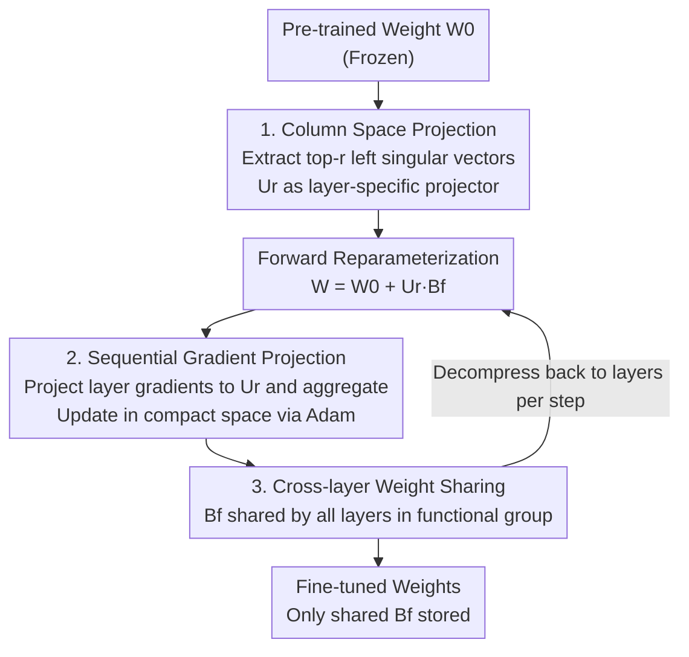

# PiCa: Parameter-Efficient Fine-Tuning with Column Space Projection

**Conference**: ICLR 2026  
**OpenReview**: [https://openreview.net/forum?id=32G5SjCAMV](https://openreview.net/forum?id=32G5SjCAMV)  
**Code**: https://github.com/hjunseoh/PiCa  
**Area**: Model Compression / Parameter-Efficient Fine-Tuning (PEFT)  
**Keywords**: PEFT, LoRA, SVD, Column Space Projection, Weight Sharing

## TL;DR
PiCa demonstrates that projecting the fine-tuning update $\Delta W$ onto the principal column space of pre-trained weights (the subspace spanned by top-$r$ left singular vectors) is a theoretically supported and effective inductive bias. Building on this, it enables layers within the same functional group to share a single trainable matrix, achieving stable performance gains over SOTA methods like SVFT while using fewer parameters than rank-1 LoRA across NLP and vision tasks.

## Background & Motivation
**Background**: Fine-tuning large models is essential for creating domain experts, but full parameter updates are prohibitively expensive. PEFT mitigates this by freezing the backbone and training a minimal set of parameters. LoRA has become mainstream due to its simplicity, while variants like DoRA and VeRA further compress parameter budgets.

**Limitations of Prior Work**: Most LoRA variants rely on **randomly initialized** low-rank matrices, failing to explicitly leverage the geometric structure and prior knowledge inherent in pre-trained weights. Naively reducing rank to save parameters leads to significant performance degradation. Another line of work (SVFT, SVDiff, DiTASK) utilizes the singular value/vector structures of pre-trained weights to maintain performance with fewer parameters but **lacks theoretical explanation** for why the spectral structure of pre-trained weights serves as a good fine-tuning inductive bias.

**Key Challenge**: A trade-off exists between parameter budget and performance. Further compression requires more intelligent use of structural priors, yet existing SVD-based methods rely on empirical success without analytical foundations, leaving it unclear which subspace to project onto and why.

**Goal**: (1) Provide a theoretical foundation for using pre-trained spectral structures in fine-tuning; (2) Design a practical algorithm that outperforms the most parameter-efficient LoRA/DoRA configurations.

**Key Insight**: The authors observe that fine-tuning is inherently a **small update** from $W_0$ to $W^*$ ($\|W_0\|\gg\|\Delta W\|$). According to Wedin's Theorem (Lemma 3.1), the principal singular structures of $W_0$ and $W^*$ are highly aligned when updates are small—implying that the dominant directions of $\Delta W$ should fall within the principal column space of $W_0$.

**Core Idea**: Fix the top-$r$ left singular vectors $U_r$ of pre-trained weights as projectors, learn only a small set of coefficients for "moving within this subspace," and share these coefficients across layers within the same functional group.

## Method

### Overall Architecture
PiCa reformulates fine-tuning to preserve pre-trained geometric structures while learning compact updates in the principal column space. For each weight matrix $W_0^{f,i}$ (functional group $f$, layer $i$), SVD is performed to extract top-$r$ left singular vectors $U_r^{f,i}$ as **layer-specific, frozen** projectors. The fine-tuned weights are expressed in reparameterized form:

$$W^{f,i} = W_0^{f,i} + U_r^{f,i} B^f,$$

where $B^f \in \mathbb{R}^{r \times n}$ is a zero-initialized trainable matrix **shared across all layers in the same functional group $f$** (e.g., query/key/value). During training, gradients for each layer are projected onto its respective $U_r^{f,i}$, aggregated into the shared compact space, updated via Adam, and then decompressed. This leverages unique pre-trained geometry for each layer while compressing trainable parameters from "per-layer" to "per-group."

### Key Designs

**1. Column Space Projection: Constraining updates to the principal column space**

Addressing the issue that LoRA uses random matrices, PiCa provides Theorem 1: Let $W_0=U\Sigma V^\top$. If the fine-tuned weight $W^*=(UP)\Sigma^*(VQ)^\top$ and the deviations $P=I+E^P, Q=I+E^Q$ satisfy $|E_{ij}|<\epsilon$ element-wise, the approximation error of projecting $\Delta W$ onto the top-$r$ left singular subspace $U_r$ satisfies:

$$\big\|\Delta W - U_r U_r^\top \Delta W\big\|_F^2 \le \sum_{i=r+1}^{\min(m,n)}\sigma_i^2(\Delta W) + O(\epsilon).$$

The first term is the optimal rank-$r$ approximation error defined by the Eckart–Young theorem; $O(\epsilon)$ accounts for the slight shift between $W_0$ and $W^*$. Using DeBERTaV3, the authors empirically show that elements of $E^P, E^Q$ concentrate near 0 (Fig. 2), making $O(\epsilon)$ negligible. Thus, $\Delta W$ is almost entirely captured by the pre-trained column space $U_r$. Theorem 1 provides theoretical support for why this specific projection is effective.

**2. Sequential Gradient Projection: Implementing cumulative projection for iterative training**

Theorem 1 describes the projection of the final $\Delta W$, but training is iterative. Theorem 2 bridges this gap: under $L$-smooth and gradient-bounded ($\|\nabla\ell\|_F\le G$) assumptions, the difference between $W_T$ (projecting once at the end) and $P_T$ (projecting gradients via $\Pi_{U_r}=U_rU_r^\top$ at each step) is bounded:

$$\|W_T-P_T\|_F \le \tfrac{\eta^2}{2}LG\,T(T-1) + O((\eta L T)^3).$$

This indicates that per-step gradient projection effectively approximates cumulative projection given a reasonable learning rate $\eta$. PiCa integrates this into the optimizer (e.g., Adam): gradients are compressed into the $r \times n$ space using $(U_r^{f,i})^\top$, moments are maintained in this compact space, and updates are decompressed back via $U_r^{f,i}$.

**3. Cross-layer Weight Sharing within Functional Groups**

To further reduce parameters, PiCa shares the trainable matrix $B^f$ **across all layers performing the same functional role**. Layers for a group $f \in \{\text{query, key, value, \dots}\}$ share a single $B^f \in \mathbb{R}^{r \times n}$, while $U_r^{f,i}$ remains layer-specific. Unlike VeRA/Tied-LoRA which share random projections, PiCa delegates "layer uniqueness" to the deterministic pre-trained projectors $U_r^{f,i}$ while sharing the "trainable adaptation" $B^f$. This configuration reduces trainable parameters by up to $7\times$ without performance loss.

### Loss & Training
PiCa maintains the original task loss but modifies the parameterization and optimization path. The only trainable parameters are the shared matrices $B^f$ (zero-initialized), while $U_r^{f,i}$ are frozen. Training follows Algorithm 1 (Adam with PiCa), where momentum and variance are maintained in the $r \times n$ space. Hyperparameters are aligned with SVFT for fair comparison.

## Key Experimental Results

### Main Results
Evaluations include mathematical reasoning (GSM-8K, MATH via Gemma-2B/7B, LLaMA-3-8B), common sense reasoning (8 datasets via Gemma-7B), NLU (GLUE via DeBERTaV3-base), and vision tasks (VTAB-1K, DreamBooth).

Mathematical Reasoning (GSM-8K / MATH, excerpt):

| Model | Method | #Params | GSM-8K | MATH |
|------|------|---------|--------|------|
| Gemma-2B | SVFT$_P$ | 0.19M | 40.34 | 14.38 |
| Gemma-2B | PiCa$_{r=32}$ | 0.67M | 41.32 | 15.22 |
| Gemma-2B | SVFT$^R$ | 6.35M | 50.03 | 15.56 |
| Gemma-2B | PiCa$_{r=256}$ | **5.37M** | **52.77** | **16.36** |
| LLaMA-3-8B | PiCa$_{r=32}$ | 1.38M | **73.54** | **24.14** |
| LLaMA-3-8B | PiCa$_{r=256}$ | 11.01M | 76.12 | 24.88 |

PiCa achieves superior performance with the **fewest** parameters in high-rank configurations and remains optimal or sub-optimal in low-rank settings (fewer parameters than rank-1 LoRA). In common sense reasoning, PiCa$_{r=128}$ (5.11M params) achieves an 84.47 average, setting SOTA on 7/8 datasets with $13\times$ fewer parameters than LoRA.

### Ablation Study

| Configuration | #Params | Avg. Common Sense | Explanation |
|------|---------|------|------|
| Random Space Projection | 5.37M | 63.18 | Projection to random subspace |
| Column Space (Ours) | 5.37M | **67.60** | Projection to principal column space, +4.42 |
| PiCa w/o Sharing (rank 16) | 35.8M | Baseline | Independent $B$ per layer |
| PiCa w/ Sharing (rank 128) | 5.1M | Comparable to w/o sharing | $7\times$ fewer parameters with no drop |

### Key Findings
- **Column space projection is the source of performance**: Replacing it with random subspace projection results in a 4.42 point drop, validating Theorem 1.
- **Weight sharing is virtually free**: The shared rank-128 version (5.1M) matches the non-shared rank-16 version (35.8M), saving $7\times$ parameters.
- **Outperforming SOTA with fewer parameters**: PiCa consistently outperforms LoRA/DoRA and SVFT while requiring a smaller parameter budget.

## Highlights & Insights
- **Theoretical Grounding for SVD-PEFT**: Uses Eckart–Young and Wedin’s theorems to bound projection error, providing a "theory-first" design.
- **Optimizer-level Integration**: Theorem 2 ensures that per-step gradient projection works, allowing optimizer states to be maintained in the compact space, saving memory.
- **Intelligent Sharing**: Unlike prior methods that share random projections, PiCa shares trainable coefficients and lets deterministic pre-trained structures handle layer differences.

## Limitations & Future Work
- **Loading Overhead**: Storing only $B^f$ requires re-computing SVD for $W_0$ at load time. This is a trade-off between storage and initialization speed.
- **Theoretical Boundaries**: Theorem 1 assumes $\|\Delta W\|\ll\|W_0\|$. Performance in scenarios requiring massive shifts from pre-trained distributions is not fully explored.
- **Sharing Granularity**: Functional grouping is effective but coarse. Future work could explore adaptive ranks or finer-grained grouping per layer.

## Related Work & Insights
- **vs LoRA / DoRA / VeRA**: These use random low-rank matrices; PiCa uses frozen pre-trained singular vectors as projectors with theoretical guarantees.
- **vs SVFT / SVDiff / DiTASK**: These lack the analytical foundation provided by PiCa's Theorem 1/2. PiCa outperforms SVFT consistently.
- **vs VeRA / Tied-LoRA**: They share random projections; PiCa shares trainable adaptation while keeping unique pre-trained structures per layer to prevent performance loss.

## Rating
- Novelty: ⭐⭐⭐⭐⭐ First to provide Eckart–Young/Wedin level guarantees for column-space PEFT.
- Experimental Thoroughness: ⭐⭐⭐⭐⭐ Extensive NLP and vision tasks with multiple models and ranks.
- Writing Quality: ⭐⭐⭐⭐ Clear link between theory and algorithm, though notation is dense.
- Value: ⭐⭐⭐⭐⭐ Practically useful for multi-adapter deployment due to extreme parameter efficiency.

<!-- RELATED:START -->

## Related Papers

- [\[ICLR 2026\] SumRA: Parameter Efficient Fine-Tuning with Singular Value Decomposition and Summed Orthogonal Basis](sumra_parameter_efficient_fine-tuning_with_singular_value_decomposition_and_summ.md)
- [\[ICLR 2026\] Memba: Membrane-driven Parameter-Efficient Fine-Tuning for Mamba](memba_membrane-driven_parameter-efficient_fine-tuning_for_mamba.md)
- [\[ICLR 2026\] TRAC: Tensor-Train Based Across-Layer Compression for Parameter-Efficient Fine-Tuning](trac_tensor-train_based_across-layer_compression_for_parameter-efficient_fine-tu.md)
- [\[ICLR 2026\] Sculpting Subspaces: Constrained Full Fine-Tuning in LLMs for Continual Learning](sculpting_subspaces_constrained_full_fine-tuning_in_llms_for_continual_learning.md)
- [\[ICML 2025\] Parameter-Efficient Fine-Tuning of State Space Models](../../ICML2025/model_compression/parameter-efficient_fine-tuning_of_state_space_models.md)

<!-- RELATED:END -->
