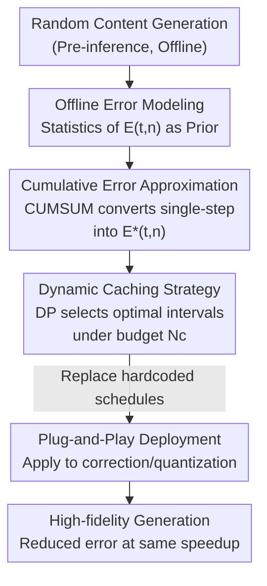

# Plug-and-Play Fidelity Optimization for Diffusion Transformer Acceleration via Cumulative Error Minimization

**Conference**: ICLR 2026  
**OpenReview**: [https://openreview.net/forum?id=pt4iKnAm0M](https://openreview.net/forum?id=pt4iKnAm0M)  
**Code**: https://github.com/leaves162/CEM  
**Area**: Model Compression / Diffusion Model Acceleration  
**Keywords**: Diffusion Transformer, Caching Acceleration, Cumulative Error, Dynamic Programming, Plug-and-Play

## TL;DR
CEM achieves high-fidelity DiT generation by modeling intrinsic "timestep × cache interval" errors offline and applying dynamic programming to find an optimal caching strategy under a given acceleration budget. It serves as a zero-overhead, plug-and-play plugin for various caching acceleration and quantization methods.

## Background & Motivation
**Background**: Diffusion Transformers (DiTs) have become the dominant architecture for image/video generation. However, the inherently serial denoising process and high computational cost of attention lead to slow inference (seconds for images, minutes for videos). To achieve training-free acceleration, caching methods reuse hidden states between adjacent timesteps or layers to skip forward passes.

**Limitations of Prior Work**: Naive caching continuously accumulates noise, with errors growing exponentially relative to the cache interval, severely damaging fidelity. Consequently, existing methods add "error correction" mechanisms: one category is **token pruning** (ToCa, DuCa, FastCache—retaining a subset of important tokens for real computation during reuse), and the other is **predictive reuse** (TaylorSeer, ICC—using historical trends via Taylor expansion or gradient extrapolation to predict features instead of direct reuse).

**Key Challenge**: These error corrections are built upon **fixed or overly simplistic caching schedules**. For instance, ToCa/DuCa vary intervals linearly with timesteps, while TaylorSeer/ICC use **constant** intervals. However, the sensitivity of different denoising stages to caching varies drastically. Fixed schedules fail to capture these complex dynamics, meaning corrections are merely patching an already high baseline of cumulative error. A few attempts to optimize caching (TeaCache with real-time estimation, AdaCache restricted to video trajectories, AdaptiveDiffusion with third-order costs bound to U-Net) either introduce **online overhead** that offsets speedup or are tied to specific ratios/architectures, making them incompatible with general error correction methods.

**Goal**: To find an "optimal caching strategy" that adapts to any acceleration budget and can be directly applied to existing error correction methods and quantized models without introducing online computational overhead or requiring retraining.

**Key Insight**: The authors observe that model sensitivity to caching is **model-intrinsic and content-independent**. Thus, this sensitivity can be modeled **offline** as a one-time prior and used via a look-up table during inference, completely avoiding real-time estimation overhead.

**Core Idea**: Formalize caching strategy selection as an optimization problem: "minimize cumulative error under an acceleration budget constraint." Solve for the global optimum using offline error priors and dynamic programming as a plug-and-play plugin (CEM).

## Method

### Overall Architecture
CEM aims to replace hardcoded caching schedules with a "smarter" timetable. It consists of three steps: **Offline Error Modeling**—statistically measuring the error $E(t,n)$ incurred by reuse at timestep $t$ with interval $n$ using random samples before inference; **Dynamic Caching Strategy**—using dynamic programming to select the interval combination that minimizes cumulative error given an acceleration budget $N_c$; and **Plug-and-Play Deployment**—replacing the fixed schedules in ToCa/DuCa/TaylorSeer or quantized models like Q-DiT. During inference, only one DP run on a precomputed $N\times T$ error matrix (~1ms) is required.

### Key Designs

**1. Offline Error Modeling: Measuring model sensitivity once using content-independent samples**

To solve the "online overhead of real-time estimation," CEM moves error modeling to an offline phase. It defines error as a 2D function of both **denoising timestep $t$ and cache interval $n$**. Letting the model output at timestep $t$ with input $x$ be $D(x,t)$, flattened to $D'$, the difference between the "real output" and "cached output from $n$ steps ago" is measured via normalized inner product (cosine distance):

$$E(t, n) = \frac{1}{N_s}\sum_{i=0}^{N_s-1}\left[1 - \frac{D'(x,t)\cdot D'(x,t+n)}{\|D'(x,t)\|_2 \cdot \|D'(x,t+n)\|_2}\right]$$

Where $N_s$ is the number of random samples. The Key Insight: this error reflects **intrinsic sensitivity** and is content-independent. Figure 3 validates the "distribution consistency hypothesis"—offline error distributions have low variance, and real inference errors fall within the priority distribution range. Modeling once per model is sufficient. Cosine distance outperforms L1/L2 because it is robust to scale differences in sparse DiT features.

**2. Cumulative Error Approximation (CEA): Approximating real cumulative error via CUMSUM**

Offline $E(t,n)$ models **single-step** error, whereas caching involves continuous accumulation. Modeling cumulative error directly is exponentially expensive. CEM finds that a **simple cumulative integration along the time dimension** of $E(t,n)$ approximates real cumulative error well:

$$E^*(t, n) = \mathrm{CUMSUM}(E(t,n),\ \dim=0)$$

Weighting factors are applied to amplify differences between intervals. This linear integration captures how input perturbations propagate and accumulate across DiT modules due to high structural similarity between inputs and outputs. Ablations show that adding CEA to DCS consistently improves performance across models.

**3. Dynamic Caching Strategy (DCS): Formulating scheduling as a DP problem with optimal substructure**

With $E^*(t,n)$ as the cost, CEM evaluates the **entire** caching strategy. The problem naturally exhibits optimal substructure. Let $dp[t][j]$ be the minimum total error denoised to timestep $t$ with $j$ cache events. The transition equation is:

$$dp[t][j+1] = \min_{n\in N,\ t>0}\{E^*(t,n) + dp[t+n][j]\},\quad j\in[1,N_c],\ t\in[T,1]$$

where $N$ is the set of candidate intervals. The goal is to minimize $dp[1][N_c]$. Since the DP runs on **offline priors**, it takes only ~1ms and the matrix consumes ~0.88 KB. This enables replacing fixed schedules with global optimums at zero online cost.

**4. Plug-and-Play Deployment: Harmonizing budgets across methods**

CEM does not modify error correction mechanisms; it only replaces their internal hardcoded schedules. It enhances **pruning-based** (ToCa, DuCa) and **predictive** (TaylorSeer) methods, as well as **quantized models** (Q-DiT). It eliminates the need for manual interval hyperparameter tuning (e.g., $N$ in TaylorSeer), as the acceleration budget $N_c$ directly controls CEM across any speedup ratio.

## Key Experimental Results

### Main Results
Evaluated on 9 models/quantization methods across 3 tasks (T2I, T2V, C2I), applied to 5 SOTA methods (FasterSD, TeaCache, ToCa, DuCa, TaylorSeer) and Q-DiT.

| Task / Model | Baseline | Metric | Baseline | +CEM | Note |
|------|------|------|------|------|------|
| T2I SD1.5 | FasterSD | FID↓ | 21.62 | **19.99** | Better than original model (21.75) |
| T2I PixArt-α | DuCa(N5) | FID↓ | 41.56 | **27.57** | -13.99 with lower latency |
| T2I FLUX.1-dev | TaylorSeer(N6) | IR↑ | 0.9410 | **0.9811** | Zero online overhead |
| T2V Hunyuan | TaylorSeer(N6) | VBench(%)↑ | 79.78 | **81.24** | +1.46, beats original (78.46) |
| T2V Wan2.1-1.3B | TaylorSeer(N6) | VBench(%)↑ | 75.31 | **76.18** | At 5.56× speedup |
| C2I DiT-XL/2 (DDIM) | DuCa(N5) | FID↓ / IS↑ | 6.07 / 199.64 | **3.96 / 218.66** | >3× speedup, PSNR +6.37 |
| Quantization Q-DiT (W6A8) | Q-DiT | IS↑ / Latency | 237.34 / 0.45s | **240.36 / 0.22s** | Extra 2× speedup over quantization |

CEM frequently allows accelerated methods to **surpass the fidelity of the original unaccelerated models** while maintaining or reducing FLOPs/latency.

### Ablation Study

| Configuration | PixArt-α FID↓ | Hunyuan VBench↑ | DiT-XL/2 FID↓ / IS↑ |
|------|------|------|------|
| Vanilla (Fixed Interval) | 30.04 | 77.64 | 3.83 / 213.12 |
| + DCS (DP Strategy) | 28.69 | 79.21 | 2.73 / 234.78 |
| + DCS w/ CEA (Cumulative Error Approx) | **27.94** | **80.44** | **2.65 / 235.11** |

### Key Findings
- **DCS is the primary driver**: Dynamic scheduling alone significantly improves FID/IS, proving offline modeling captures intrinsic error distributions.
- **CEA adds stability**: Cumulative integration further improves metrics, likely providing a smoothing effect against content fluctuations.
- **Negligible Overhead**: Offline modeling adds only ~8-10% time compared to one generation run and is done once. Inference DP is ~1ms.
- **Sample count insensitivity**: Fidelity converges with as few as 10 random samples.
- **Error Metric**: Cosine distance is superior to L1/L2 for DiT feature sparsity.

## Highlights & Insights
- **Paradigm shift: Offline Prior Modeling**: The core insight is that model sensitivity is intrinsic and content-independent. Moving estimation offline removes the online overhead bottleneck seen in methods like TeaCache.
- **CUMSUM for Cumulative Error**: Using linear integration to approximate an exponentially complex process is an elegant engineering trick, backed by the observation of high structural similarity in DiT.
- **Algorithmizing Scheduling**: Moves beyond heuristic schedules (linear/constant) to a formal DP problem, enabling a globally optimal sequence shared across runs for a given budget.
- **Universal Orthogonal Enhancement**: By only modifying the timetable, it orthogonally enhances pruning, prediction, and quantization methods with minimal migration costs.

## Limitations & Future Work
- Offline modeling is required once for every new model; for large video models (e.g., Hunyuan VRAM 72.62GB), this step has a resource threshold.
- The "content-independence" assumption was validated statistically, but its robustness against extreme out-of-distribution prompts remains to be fully stress-tested.
- Reliance on structural similarity for CUMSUM might lead to accuracy drops in non-DiT architectures or modules where this similarity is weak.
- Joint optimization of the error prior with advanced samplers (e.g., DPM-Solver) is an unexplored direction.

## Related Work & Insights
- **vs. Pruning (ToCa/DuCa)**: These reduce error via computation on important tokens but use fixed schedules; CEM provides an optimal baseline schedule for these corrections to work on.
- **vs. Prediction (TaylorSeer/ICC)**: CEM eliminates the need for manual constant interval parameters ($N$) by providing a budget-controlled optimal sequence.
- **vs. Online (TeaCache)**: CEM avoids the overhead of real-time multi-polynomial fitting by modeling error distributions as offline priors.
- **vs. AdaCache/AdaptiveDiffusion**: CEM is model-agnostic and generalizes across images, videos, and quantization, unlike U-Net focused or video-specific predecessors.

## Rating
- Novelty: ⭐⭐⭐⭐ Significant paradigm shift to offline prior + DP optimization.
- Experimental Thoroughness: ⭐⭐⭐⭐⭐ Extensive coverage across 9 models and 5 acceleration baselines.
- Writing Quality: ⭐⭐⭐⭐ Clear motivation and logical framework.
- Value: ⭐⭐⭐⭐⭐ Zero-overhead plug-and-play capability with high practical utility.

<!-- RELATED:START -->

## Related Papers

- [\[ICLR 2026\] RAPID$^3$: Tri-Level Reinforced Acceleration Policies for Diffusion Transformer](rapid3_tri-level_reinforced_acceleration_policies_for_diffusion_transformer.md)
- [\[CVPR 2025\] Plug-and-Play Versatile Compressed Video Enhancement](../../CVPR2025/model_compression/plug-and-play_versatile_compressed_video_enhancement.md)
- [\[ICLR 2026\] ERTACache: Error Rectification and Timesteps Adjustment for Efficient Diffusion](ertacache_error_rectification_and_timesteps_adjustment_for_efficient_diffusion.md)
- [\[ICML 2026\] Plug-and-Play Spiking Operators: Breaking the Nonlinearity Bottleneck in Spiking Transformers](../../ICML2026/model_compression/plug-and-play_spiking_operators_breaking_the_nonlinearity_bottleneck_in_spiking_.md)
- [\[ICLR 2026\] DiffVax: Optimization-Free Image Immunization Against Diffusion-Based Editing](diffvax_optimization-free_image_immunization_against_diffusion-based_editing.md)

<!-- RELATED:END -->
