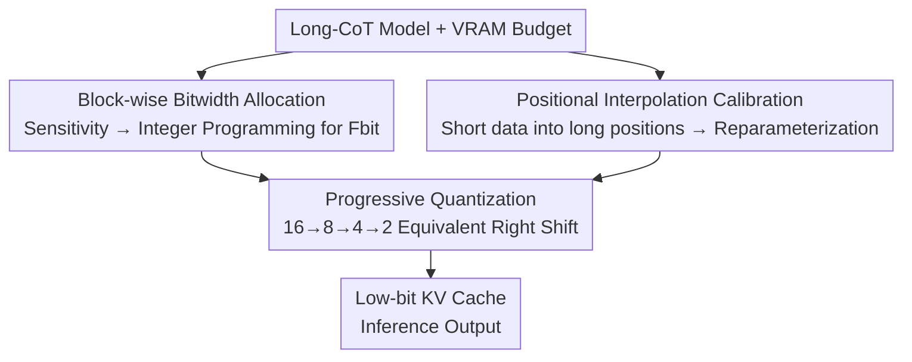

# PM-KVQ: Progressive Mixed-Precision KV Cache Quantization for Long-CoT LLMs

**Conference**: ICLR 2026  
**OpenReview**: [https://openreview.net/forum?id=Vem6FQvRvq](https://openreview.net/forum?id=Vem6FQvRvq)  
**Code**: https://github.com/thu-nics/PM-KVQ  
**Area**: Model Compression  
**Keywords**: KV Cache Quantization, Mixed Precision, Long Chain-of-Thought, Positional Interpolation, Cumulative Error

## TL;DR
To address the KV Cache VRAM explosion in Long Chain-of-Thought (long-CoT) reasoning models, PM-KVQ utilizes "progressive precision reduction + per-block bitwidth allocation" to maximize the VRAM budget and mitigate cumulative quantization errors. It further employs "short data + Positional Interpolation" for calibration to approximate long-sequence distributions. PM-KVQ improves reasoning benchmark accuracy by up to 8% under the same VRAM constraints while achieving 2.73–5.18× throughput compared to the 16-bit FP baseline.

## Background & Motivation
**Background**: Reasoning models like OpenAI-o1, DeepSeek-R1, and QwQ extend chain-of-thought sequences to tens of thousands or even 128K tokens. However, this causes KV Cache VRAM to skyrocket—for DeepSeek-Qwen-32B with a 32K context and batch size 16, the KV Cache consumes 128GB, exceeding the weights themselves. Post-Training Quantization (PTQ) for KV Cache (replacing BF16 with low-bit integers) is an effective compression method. Techniques like KIVI, QServe, MiKV, and RotateKV have been extensively studied for short contexts (<8K).

**Limitations of Prior Work**: Directly applying these short-context methods to long-CoT leads to severe performance degradation due to two reasons. First, **large cumulative error**: existing methods immediately quantize Key/Value to the target low bitwidth (e.g., 2-bit) at every decoding step. This quantization error accumulates as the sequence grows, destroying reasoning capabilities by tens of thousands of tokens. Crucially, they **fail to fully utilize the VRAM budget**—starting with the lowest bitwidth even when hardware memory is available wastes opportunities to reduce error. Second, **short calibration data does not reflect long-sequence distributions**: RoPE injects positional information into Key channels using varying frequencies. Low-frequency channel cycles can exceed 32K tokens (e.g., 54,410 tokens for DeepSeek-R1-Distill-Qwen-7B). Calibrating with 512/2048 tokens fails to sample these distributions, leading to inaccurate outlier calibration and high errors.

**Key Challenge**: There is a mismatch between the "fixed bitwidth/immediate quantization" approach and the "dynamically available VRAM budget" in long sequences. Furthermore, extending calibration sequences directly is infeasible due to the $O(N^2)$ complexity of self-attention.

**Core Idea**: Instead of using the lowest bitwidth from the start, store KV Cache in high precision and progressively reduce bitwidth as VRAM reaches its limit to spend the budget on error mitigation. Simultaneously, use Positional Interpolation to "squeeze" long-context information into short calibration data, approximating long-sequence distributions with minimal overhead.

## Method

### Overall Architecture
PM-KVQ is a post-training quantization (PTQ) scheme consisting of three techniques implemented in two stages. **Pre-inference (offline)**: Sensitivity of each transformer block is estimated on a calibration set, and bitwidth allocation is modeled as an integer programming problem to determine the target $F_{bit}$ for each block. Then, "short data + Positional Interpolation" is used for channel-level outlier reparameterization (migrating Key outliers to Query). **In-inference (online)**: Each block initially stores KV Cache in 16-bit. When the VRAM budget is reached, an "Equivalent Right Shift" progressively compresses existing cache from 16→8→4→2 bits until the allocated $F_{bit}$ is reached.

### Key Designs

**1. Progressive Quantization: High-precision storage with on-demand bitwidth reduction**

This explicitly addresses cumulative error and under-utilized VRAM. Unlike existing methods that quantize to 2-bit immediately, PM-KVQ calculated the capacity per block based on the budget. It **initially stores KV Cache in 16-bit** (minimum error). Once the budget is full, it triggers a "bitwidth contraction," reducing the existing cache bitwidth following levels of $16 \to 8 \to 4 \to 2$ to accommodate more tokens. The core is the **Equivalent Right Shift** operator, which is mathematically equivalent to "dequantizing $2b$-bit cache and re-quantizing to $b$-bit" but implemented using only integer addition and shifting:

$$X_b = \left\lfloor (2^{2b} - 2^b + 1)(X_{2b} + 2^{b-1}) \right\rceil >> 3b$$

The zero point remains $Z_b = Z_{2b}$, and the scale factor is adjusted to $S_b = (2^b + 1)S_{2b}$ to preserve dynamic range. This outperforms simple truncation or modified shifts and incurs negligible overhead as it only triggers when VRAM is full.

**2. Block-wise Bitwidth Allocation: Assigning VRAM to sensitive transformer blocks**

While prior methods use uniform bitwidth, PM-KVQ employs first-order Taylor approximation to estimate the impact of a block's quantization error on the loss. For a Key $K_i$: $L(Q_b(K_i)) \approx L(K) + G_{K_i} \odot (K_i - Q_b(K_i))$. Sensitivity $s_{i,b}$ for the $i$-th block at $b$-bit is defined as the $\ell_1$ norm of the weighted error:

$$s_{i,b} = \|G_{K_i} \odot (K_i - Q_b(K_i))\|_1 + \|G_{V_i} \odot (V_i - Q_b(V_i))\|_1$$

The selection is modeled as an **integer programming** problem: minimize $\sum_i \sum_b x_{i,b} s_{i,b}$ subject to $\sum_b x_{i,b}=1$ and total KV Cache memory $\leq M$. Deeper blocks are typically found to be more sensitive and are allocated higher bitwidths.

**3. Positional Interpolation Calibration: Approximating long-sequence distributions**

Key outliers are concentrated in specific channels. PM-KVQ uses channel-level reparameterization to migrate outliers from Key to Query using a migration factor $\lambda_i = (\max_m |K_{m,i}|)^{\alpha}$. To solve the issue where 512-token calibration misses low-frequency RoPE cycles, **Positional Interpolation (PI)** is used. By scaling the position index $m$ by a factor $s$ (e.g., $s=4$), a 2,048-token sequence covers the range of 8,192 tokens, capturing the Key distribution of longer sequences without extra computation.

### Loss & Training
PM-KVQ is a pure PTQ method without weight updates. Offline calibration uses 512 samples of 2,048 tokens from the RedPajama arXiv subset with $s=4$. $\alpha$ is searched in $[0,1]$ to minimize attention reconstruction loss. Following KIVI, the first token and the most recent 128 tokens are kept in INT16. Per-group (size 128) asymmetric quantization is used. Bitwidth candidates are $\{4,8\}$ for LLaMA-8B and $\{2,4\}$ for others.

## Key Experimental Results

### Main Results
Evaluated on DeepSeek-R1-Distill-Qwen/LLaMA (7B–70B) and QwQ-32B across AIME, CMIMC, and LiveCodeBench. Table shows Pass@1:

| Model | Method | Bitwidth | AIME-2024 | CMIMC-2024 | LiveCode |
|------|------|------|-----------|-----------|----------|
| Qwen-7B | 16-16 Baseline | 16 | 41.04 | 27.29 | 26.29 |
| Qwen-7B | RotateKV | 2 | 0.00 | 0.00 | 0.00 |
| Qwen-7B | KIVI | 2 | 32.08 | 20.83 | 19.00 |
| Qwen-7B | **PM-KVQ (BS=40)** | 2 | **40.00** | **26.46** | **24.57** |
| LLaMA-8B | KIVI | 4 | 41.25 | 26.25 | 30.29 |
| LLaMA-8B | **PM-KVQ (BS=6)** | 4/8 | **47.71** | **28.13** | 31.71 |
| Qwen-14B | KIVI | 2 | 48.13 | 27.71 | 34.43 |
| Qwen-14B | **PM-KVQ (BS=12)** | 2/4 | **67.71** | **47.71** | **42.14** |

Ours achieves up to 8% higher accuracy than KIVI at the same VRAM. On Qwen-14B, KIVI drops 21.87% on CMIMC-2024, while PM-KVQ drops only 1.87%. PM-KVQ achieves 2.73–5.18× throughput vs. 16-bit.

### Ablation Study

| Configuration | AIME-2024 pass@1 | Description |
|------|------------------|------|
| Direct Right Shift | 12.08 | Simple truncation, -32.09% |
| Modified Right Shift | 28.75 | -15.42% |
| **Equivalent Right Shift (Ours)** | **38.33** | Significant improvement |
| Calibration 2048, $s=1$ | 46.67 | Without PI |
| Calibration 2048, $s=4$ | 48.33 | Equivalent to 8192 context |
| Calibration 2048, $s=16$ | 46.67 | $s$ too large distort distribution |

### Key Findings
- Bitwidth contraction is crucial: Equivalent Right Shift is 26.25% better than Direct Shift by preserving distributions.
- Deeper blocks and the first block in Qwen-7B are highly sensitive and require higher bitwidths.
- PI with $s=4$ on 2,048 tokens matches the accuracy of 8,192-token calibration.

## Highlights & Insights
- **Reversing quantization timing**: Storing high precision until the memory limit is reached effectively "trades" idle VRAM for reduced cumulative error.
- **Equivalent Right Shift**: Compresses "dequantize-then-quantize" into pure integer shifts, maintaining precision with zero overhead.
- **Inverse PI usage**: While PI is for context length extrapolation, using it for calibration "for free" captures long-sequence RoPE distributions without $O(N^2)$ costs.

## Limitations & Future Work
- Accuracy is evaluated via fake quantization; real deployment requires dedicated CUDA kernels for the contraction operator.
- Sensitivity is estimated with first-order Taylor, which might miss extreme non-linearities.
- $s$ has an upper limit; extremely long contexts might still face calibration mismatches.
- Primarily targets long-CoT reasoning; gains on short-context benchmarks are less significant.

## Related Work & Insights
- **vs KIVI**: PM-KVQ adopts KIVI's INT16 window strategy but replaces fixed bitwidths with progressive reduction and mixed precision, leading to significantly better accuracy in long sequences (+15%).
- **vs MiKV / RotateKV**: These methods fail (result zeroing) at 2-bit long-CoT, whereas PM-KVQ remains robust.
- **vs QServe**: Enhances QServe's reparameterization by fixing the calibration distortion caused by RoPE using Positional Interpolation.

## Rating
- Novelty: ⭐⭐⭐⭐ 
- Experimental Thoroughness: ⭐⭐⭐⭐⭐ 
- Writing Quality: ⭐⭐⭐⭐ 
- Value: ⭐⭐⭐⭐

<!-- RELATED:START -->

## Related Papers

- [\[ICLR 2026\] STaMP: Sequence Transformation and Mixed Precision for Low-Precision Activation Quantization](stamp_sequence_transformation_and_mixed_precision_for_low-precision_activation_q.md)
- [\[AAAI 2026\] KVmix: Gradient-Based Layer Importance-Aware Mixed-Precision Quantization for KV Cache](../../AAAI2026/model_compression/kvmix_gradient-based_layer_importance-aware_mixed-precision_.md)
- [\[ICLR 2026\] Channel-Aware Mixed-Precision Quantization for Efficient Long-Context Inference](channel-aware_mixed-precision_quantization_for_efficient_long-context_inference.md)
- [\[ICLR 2026\] MicroMix: Efficient Mixed-Precision Quantization with Microscaling Formats for Large Language Models](micromix_efficient_mixed-precision_quantization_with_microscaling_formats_for_la.md)
- [\[ICLR 2026\] AnyBCQ: Hardware Efficient Flexible Binary-Coded Quantization for Multi-Precision LLMs](anybcq_hardware_efficient_flexible_binary-coded_quantization_for_multi-precision.md)

<!-- RELATED:END -->
