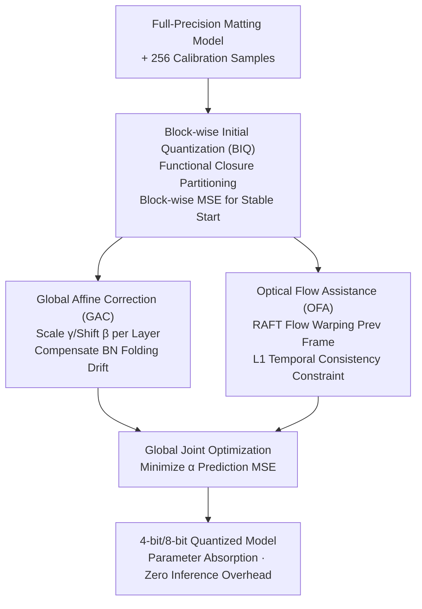

# Post-Training Quantization for Video Matting

**Conference**: ICLR 2026  
**OpenReview**: [https://openreview.net/forum?id=XAXT7A8EWh](https://openreview.net/forum?id=XAXT7A8EWh)  
**Code**: None  
**Area**: Model Compression  
**Keywords**: Post-training quantization, Video matting, Optical flow prior, BN statistics correction, Low-bit quantization

## TL;DR
This paper proposes PTQ4VM, the first post-training quantization framework specifically designed for video matting models. By utilizing a "Block-wise Initial Quantization + Global Affine Correction + Optical Flow Assistance" triad, it reduces errors by 10%–20% compared to existing PTQ methods under 4-bit settings, approaching full-precision performance while achieving an 8× reduction in computational cost.

## Background & Motivation

**Background**: Video matting involves estimating an alpha mask $\alpha \in [0,1]$ for the foreground frame-by-frame, satisfying the composition equation $I = \alpha F + (1-\alpha) B$. It is widely used in film, virtual reality, and video conferencing. To run in real-time on mobile or edge devices, model compression is necessary, with quantization (converting FP32 weights/activations to low-bit integers) being the most direct acceleration method.

**Limitations of Prior Work**: Quantization-Aware Training (QAT) yields good results but requires extensive labeled data and retraining, which is unfriendly for video matting where labeling is expensive. Post-Training Quantization (PTQ) requires only a small amount of calibration data and no retraining, offering high deployment efficiency; however, **PTQ specifically for video matting is almost non-existent**. Directly applying general-purpose PTQ methods for vision tasks fails because matting models have deep topologies and rely on limited calibration data, causing unstable convergence. Furthermore, quantization errors propagate layer-by-layer in low-bit settings, leading to artifacts. Crucially, the recurrent structures in matting models used for temporal dependencies are extremely sensitive to quantization noise, disrupting learned temporal dynamics and causing flickers or jitter.

**Key Challenge**: The essence of PTQ is finding optimal scaling factors $s$ and zero points $z$ for weights/activations using minimal data. Video matting presents two particularities ignored by general PTQ: first, **statistical drift**, where the standard process of folding BN into convolutional layers causes mean/variance of intermediate activations to deviate significantly from the full-precision network due to cumulative quantization error, making folded weights $W_f$ no longer match the actual input distribution; second, **temporal consistency**, as independent frame-by-frame quantization cannot constrain motion continuity between adjacent frames.

**Goal**: Systematically establish a PTQ pipeline for video matting, addressing three sub-problems: ensuring stable calibration convergence, compensating for statistical distortion introduced by quantization, and injecting temporal constraints during the PTQ phase.

**Key Insight**: The authors are the first to identify the widely overlooked problem of statistical drift after BN folding. They observe that since PTQ requires a very small calibration set and short iterations, the optical flow prior—previously considered too computationally expensive for training—becomes affordable.

**Core Idea**: A three-stage PTQ pipeline consisting of "stable block-wise optimization + global affine correction for statistical drift + optical flow prior for temporal consistency" is proposed to replace direct end-to-end quantization, allowing 4-bit quantized models to approach full-precision matting quality.

## Method

### Overall Architecture

The input to PTQ4VM is a pre-trained full-precision video matting model (primarily RVM, an encoder-decoder with recurrent structures) and a small calibration set of only 256 images. it outputs a 4-bit/8-bit quantized model. The process involves two stages: **Stage 1 (BIQ)** divides the network into functional closures and performs block-wise initial quantization using MSE to obtain a stable starting point. **Stage 2** performs global fine-tuning based on the initial quantization, coordinated by two components: **GAC** applies learnable scaling/shifting scalars to each quantized weight layer to compensate for cumulative statistical drift, and **OFA** uses optical flow computed by RAFT to warp the previous frame's prediction to the current frame as a temporal prior for L1 constraint. Both stages' parameters can eventually be absorbed into quantization parameters, resulting in zero additional overhead during inference.

### Key Designs

**1. BIQ (Block-wise Initial Quantization): Using Functional Closures for Stable Convergence and Local Dependency**

Direct end-to-end quantization optimization for matting networks often faces training instability and difficult convergence, especially for efficient models with depthwise separable convolutions, which often drop to random performance levels after PTQ. Conversely, layer-wise calibration ignores inter-layer dependencies and consumes excessive memory for video tasks. The authors choose **block-wise** partitioning as a middle ground. The partitioning is specific: rather than a fixed number of layers, it uses "dependency-aware topological partitioning." Each calculation block $B_i$ is defined as a **functional closure**—the smallest topological unit where internal recurrent state updates are self-contained. This prevents the recurrent structures from being bisected, preserving temporal integrity. For each block $B_i$, the quantized input $x_{q,in}$ comes from the output of previous quantized blocks, while the full-precision input $x_{fp,in}$ comes from previous full-precision blocks, both originating from the same calibration sample. The objective is to iteratively minimize the MSE between the quantized output $Y_q$ and full-precision output $Y_{fp}$, while learning optimal weight rounding and adaptive scaling factors for input activations. This step provides a fast and stable starting point for subsequent global calibration.

**2. GAC (Global Affine Correction): Directly Calibrating Post-Quantization Weights to Compensate for Overlooked BN Statistical Drift**

This is the core observation of the paper. Standard PTQ folds BN into the preceding layer to obtain an equivalent weight $W_f$, which is lossless in full precision. However, the accumulation of quantization errors causes intermediate activation statistics (mean, variance, distribution shape) to deviate significantly from the full-precision network, which is further amplified by non-linearities like ReLU/Tanh. Consequently, $W_f$ derived from "original full-precision statistics" no longer matches the actual input distribution, and activation quantizers (relying only on simple min/max statistics) cannot compensate for this "standard form" deviation, leading to accuracy drops. Prior methods like cross-layer equalization or high-bias absorption are ineffective on complex models because errors are reshaped layer-by-layer. The authors propose directly calibrating **post-quantization** weights: introducing two scalar parameters—scale $\gamma_i$ and shift $\beta_i$—to the folded weights of each convolutional layer $i$:

$$W'_{f,q,i} = \gamma_i W_{f,q,i} + \beta_i$$

Activation scaling factors $s'_{a,i}$ are also optimized simultaneously. These parameters $\{\gamma_i\}, \{\beta_i\}, \{s'_{a,i}\}$ are jointly optimized to minimize the **MSE between final alpha prediction $\hat\alpha$ and ground truth $\alpha$**. After calibration, they are absorbed into the quantization parameters. This mechanism does not rely on complex modeling of specific layers and is universally applicable atop existing PTQ methods, reducing errors by up to 20%.

**3. OFA (Optical Flow Assistance): Using Adjacent Frame Flow as a Temporal Prior to Suppress Flickering**

Independently predicting alpha frame-by-frame often leads to temporal flickering and inconsistency. The authors introduce optical flow constraints: utilizing RAFT to calculate the flow field $F_{t-1\to t}$ between adjacent input frames $I_{t-1}, I_t$, the model's prediction for the previous frame $\hat\alpha_{t-1}$ is warped to the current coordinates to obtain a motion-compensated estimation $\tilde\alpha_t = \text{Warp}(\hat\alpha_{t-1}, F_{t-1\to t})$. This serves as a strong temporal prior for the current frame. The model's direct prediction $\hat\alpha_t = M_Q(I_t)$ is then aligned with this prior using an L1 loss:

$$L_{OFA} = \|\hat\alpha_t - \tilde\alpha_t\|_1$$

While optical flow estimation is computationally expensive, PTQ requires very few iterations. The flow $F$ can be **pre-computed** and cached for the calibration set, making $L_{OFA}$ computation nearly cost-free during calibration loops. This design smoothes transitions and helps the model distinguish moving foreground from similar static backgrounds.

### Loss & Training

Stage 1 (BIQ) uses block-wise output MSE to learn rounding and activation scaling. Stage 2 jointly optimizes GAC's $\gamma_i, \beta_i, s'_{a,i}$ using final alpha prediction MSE, supplemented by the OFA $L_{OFA}$ (L1 temporal regularization). The calibration set consists of 256 frames sampled from the VM dataset, with pre-computed optical flow.

## Key Experimental Results

Evaluations were conducted on the VM (Video Matting) dataset and D646 (Image Matting) dataset (unseen during training to test generalization). Metrics include SAD/MAD, MSE, Grad, Conn (lower is better), and DTSSD for video temporal consistency. Comparisons were made against naive MSE, BRECQ, and QDrop PTQ methods.

### Main Results

| Dataset | Method | Bit | FLOPs(G) | MAD↓ | MSE↓ | DTSSD↓ |
|---------|--------|-----|----------|------|------|--------|
| VM | RVM (FP32) | W32A32 | 4.57 | 6.08 | 1.47 | 1.36 |
| VM | Our PTQ RVM | W8A8 | 1.14 | 6.03 | 1.29 | 1.46 |
| VM | RVM-QDrop | W4A4 | 0.57 | 24.36 | 18.02 | 4.70 |
| VM | Our PTQ RVM | W4A4 | 0.57 | 20.81 | 11.17 | 3.77 |
| D646 | RVM-QDrop | W4A4 | 1.02 | 47.91 | 40.15 | 2.36 |
| D646 | Our PTQ RVM | W4A4 | 1.02 | 45.69 | 38.60 | 1.31 |

Under W8A8, the proposed method nearly matches or locally exceeds FP32 performance (MAD 6.03 vs 6.08 on VM). In W4A4 settings where typical methods crash, this method reduces alpha errors by approximately 20% compared to QDrop (MSE 18.02 → 11.17) and remains superior on uncalibrated D646, proving generalization. 4-bit quantization achieves 8× FLOPs savings compared to FP32.

### Ablation Study

| Config | Bit | MAD↓ | MSE↓ | DTSSD↓ |
|--------|-----|------|------|--------|
| BRECQ | W4A4 | 168.34 | 161.61 | 5.10 |
| BRECQ+GAC | W4A4 | 50.75 | 39.84 | 8.01 |
| BRECQ+GAC+OFA | W4A4 | 46.16 | 27.29 | 3.15 |
| QDrop | W4A4 | 24.36 | 18.02 | 4.70 |
| QDrop+GAC | W4A4 | 22.01 | 11.85 | 3.96 |
| QDrop+GAC+OFA | W4A4 | 20.81 | 11.17 | 3.77 |

### Key Findings
- **GAC is the largest contributor to error reduction**: It pulls BRECQ from a MAD of 168.34 (complete failure) to 50.75 at W4A4, indicating that compensating for BN statistical drift is crucial for low-bit settings.
- **OFA primarily improves temporal consistency**: Adding OFA to GAC consistently lowers DTSSD (e.g., BRECQ 8.01 → 3.15), and further reduces MSE, confirming the temporal prior stabilizes both frames and accuracy.
- **Strong Generalization**: Despite calibration only on VM videos, it leads on unseen D646 image data. The framework was also validated on pure CNN (MODNet) and Transformer (MatAnyone) architectures.

## Highlights & Insights
- **Isolating "overlooked BN folding statistical drift"** as the primary cause of PTQ failure and resolving it with a simple per-layer affine adjustment ($\gamma W + \beta$) is both explainable and plug-and-play for any PTQ method.
- **Leveraging the "low iteration" nature of PTQ to use optical flow**: Flow is too expensive for QAT but feasible for PTQ's small calibration set with pre-computation, demonstrating a precise judgment of cost-benefit.
- **Functional closure partitioning** protects the temporal integrity of recurrent structures, suggesting that for RNN/recurrent models, quantization granularity must respect state boundaries—a transferable insight for other temporal model compressions.

## Limitations & Future Work
- It relies on external RAFT optical flow quality; errors in flow during large occlusions or fast motion might pollute the temporal prior (not discussed in depth).
- Main results focus on CNN-RNN like RVM; detailed Transformer matting (MatAnyone) results are limited to the appendix.
- At W4A4, MAD on D646 remains high (45.69 vs FP32 7.28), indicating significant quality loss in the image domain at ultra-low bits.
- Sensitivity to GAC/OFA hyperparameters and scalability to higher resolution videos were not extensively explored.

## Related Work & Insights
- **vs. BRECQ/QDrop**: These are general PTQ methods (block reconstruction / simulated quantization perturbation). This work uses them as baselines and adds GAC+OFA, reducing errors by 10%–20% on W4A4 by specifically targeting matting's statistical drift and temporal consistency.
- **vs. Cross-Layer Equalization / High-bias Absorption**: Those adjust weights *before* quantization; this study finds them ineffective for complex models and instead calibrates weights *after* quantization.
- **vs. QAT**: While QAT requires extensive labels and retraining, this work follows the PTQ route with only 256 frames and no retraining, making it significantly more efficient for deployment.

## Rating
- Novelty: ⭐⭐⭐⭐ First systematic PTQ framework for video matting; novel statistical drift perspective and use of optical flow in PTQ.
- Experimental Thoroughness: ⭐⭐⭐⭐ Validated across bits, datasets, and architectures with clear ablations, though ultra-low bit gaps remain in the image domain.
- Writing Quality: ⭐⭐⭐⭐ Solid motivation and clear functional division of components.
- Value: ⭐⭐⭐⭐ Practical compression solution for edge deployment of video matting; GAC is highly transferable.

<!-- RELATED:START -->

## Related Papers

- [\[ICLR 2026\] SliderQuant: Accurate Post-Training Quantization for LLMs](sliderquant_accurate_post-training_quantization_for_llms.md)
- [\[ICLR 2026\] Training Dynamics Impact Post-Training Quantization Robustness](training_dynamics_impact_post-training_quantization_robustness.md)
- [\[AAAI 2026\] QuantVSR: Low-Bit Post-Training Quantization for Real-World Video Super-Resolution](../../AAAI2026/model_compression/quantvsr_low-bit_post-training_quantization_for_real-world_video_super-resolutio.md)
- [\[ICLR 2026\] PTQ4ARVG: Post-Training Quantization for AutoRegressive Visual Generation Models](ptq4arvg_post-training_quantization_for_autoregressive_visual_generation_models.md)
- [\[ICLR 2026\] Quant-dLLM: Post-Training Extreme Low-Bit Quantization for Diffusion Large Language Models](quant-dllm_post-training_extreme_low-bit_quantization_for_diffusion_large_langua.md)

<!-- RELATED:END -->
