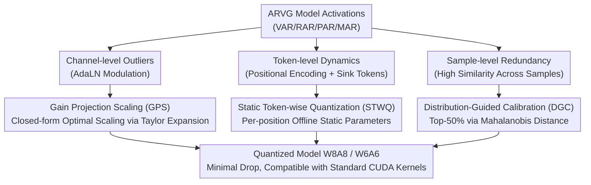

# PTQ4ARVG: Post-Training Quantization for AutoRegressive Visual Generation Models

**Conference**: ICLR 2026  
**arXiv**: [2601.21238](https://arxiv.org/abs/2601.21238)  
**Code**: [GitHub](http://github.com/BienLuky/PTQ4ARVG)  
**Area**: Model Compression  
**Keywords**: Visual Generation, Autoregressive Models, Post-Training Quantization, Activation Quantization, Outlier Suppression

## TL;DR

Proposes PTQ4ARVG, the first systematic PTQ framework tailored for AutoRegressive Visual Generation (ARVG) models. It addresses three unique quantization challenges in ARVG through Gain Projection Scaling (GPS), Static Token-wise Quantization (STWQ), and Distribution-Guided Calibration (DGC).

## Background & Motivation

**Background**: AutoRegressive Visual Generation (ARVG) models (VAR, RAR, PAR, MAR) have surpassed diffusion models in image generation quality. However, they suffer from large model sizes (2-3B parameters) and slow inference (e.g., PAR-3B takes >3 seconds per image). Post-Training Quantization (PTQ) is an effective means to compress weights and activations to low bits to accelerate inference and reduce memory without retraining.

**Key Challenge**: Directly applying mature quantization methods from LLMs or ViTs to ARVG leads to significant precision drops because ARVG activations exhibit three distinct outlier structures across orthogonal dimensions:

- **Severe Channel-level Outliers**: Activations modulated by AdaLN (Adaptive LayerNorm) modules show extreme range variations across channels. Layer-wise quantization is distorted by these outlier channels.
- **Highly Dynamic Token-level Activations**: Positional encodings cause activations to fluctuate sharply along the token dimension. Furthermore, tokens acting as initial conditions form "sink tokens" with extreme numerical values in all linear layers.
- **Sample-level Distribution Redundancy**: Network activations are highly similar across different samples (especially for unconditional generation). Randomly sampled calibration sets contain significant redundancy, causing quantization parameters to bias toward "mediocre" distributions and miss boundary cases.

**Goal**: To provide training-free solutions for each of these three ARVG-specific challenges, forming the first systematic PTQ framework for ARVG.

## Method

### Overall Architecture

PTQ4ARVG is a training-free post-training quantization framework aiming to compress ARVG models like VAR/RAR/PAR/MAR to W8A8 or even W6A6 with minimal quality loss. The core idea addresses ARVG quantization difficulties across channel, token, and sample dimensions using three complementary components: Gain Projection Scaling (GPS) for channel-level outliers, Static Token-wise Quantization (STWQ) for token-level dynamics, and Distribution-Guided Calibration (DGC) for sample-level redundancy. These components are applied sequentially: GPS migrates the quantization difficulty of outlier channels from activations to weights, STWQ pre-determines quantization parameters for each token position offline, and DGC selects informative samples for calibration. All parameters are computed offline, resulting in zero online overhead during inference.

### Key Designs

**1. Gain Projection Scaling (GPS): Replacing Manual Scaling with Closed-form Optimal Solutions**

Targeting channel-level outliers, where AdaLN-modulated activations exhibit extreme range variations. Unlike empirical factors used in SmoothQuant or OS+, GPS formulates scaling as an optimization problem. By applying Taylor expansion to the quantization loss, the loss change caused by scaling factor $s_2$ is decomposed into "activation-side loss reduction" and "weight-side loss increase." Defining scaling gain $g(s_2) = g_{\bm{x}} - g_{\bm{W}_{:,1}}$ and setting its derivative with respect to $s_2$ to zero yields the closed-form optimal scaling factor:

$$s_2 = s_1 \frac{\sqrt{\sum|{\Delta W_{2,i} x_2}|}}{\sqrt{\sum|{W_{2,i} \Delta x_2}|}}$$

The numerator and denominator are determined by weight quantization error $\Delta W$ and activation quantization error $\Delta x$, respectively. This adaptively balances scaling intensity based on actual errors and represents the first scaling strategy with rigorous mathematical derivation.

**2. Static Token-wise Quantization (STWQ): Turning Dynamic Quantization into Offline Parameters via Fixed Sequences**

Targeting token-level dynamics. Positional encodings cause activations to fluctuate across the token dimension, and conditional tokens form "sink tokens" in MHSA/FFN layers. While LLMs require expensive online dynamic quantization due to variable lengths, ARVG has two unique properties: fixed token counts and highly stable (position-invariant) distributions at specific token positions across samples. STWQ assigns a set of per-position static quantization parameters to AdaLN modules. For linear layers, it calibrates sink tokens and normal tokens separately to prevent extreme values from distorting the overall range. Percentile calibration is used instead of outlier-sensitive min-max. All parameters are computed offline, ensuring zero online calibration overhead and compatibility with standard CUDA kernels.

**3. Distribution-Guided Calibration (DGC): Filtering Redundant Samples via Mahalanobis Distance**

Targeting sample-level redundancy. Activations in ARVG (especially unconditional ones) are highly similar, leading to redundant information in random calibration sets. DGC uses Mahalanobis distance $\rho(x) = \sqrt{(x-u)^T S^{-1} (x-u)}$ to measure the "distribution entropy" of each sample relative to the overall distribution. Samples that are further from the mean (non-typical) have higher values. Only the top-50% samples with highest distribution entropy are kept. This ensures the calibration set is both non-redundant and covers boundary activations.

### Loss & Training

The framework is training-free. GPS derives from a closed-form solution of convex optimization after Taylor expansion. STWQ uses percentile calibration for high precision, and DGC performs only sample selection. None of these update model weights. Evaluation is conducted on ImageNet to generate 50K images for calculating FID, sFID, IS, and Precision.

## Key Experimental Results

### Main Results (VAR-d16 / VAR-d24 - W8A8 Quantization)

| Method | VAR-d16 FID ↓ | VAR-d16 IS ↑ | VAR-d24 FID ↓ | VAR-d24 IS ↑ |
|------|-------------|-------------|-------------|-------------|
| FP | 3.60 | 283.21 | 2.33 | 317.16 |
| SmoothQuant | 4.29 | 229.87 | 4.42 | 246.68 |
| OS+ | 4.11 | 230.41 | 4.14 | 250.61 |
| OmniQuant | 4.19 | 226.92 | - | - |
| **PTQ4ARVG** | **3.82** | **268.19** | **2.69** | **304.82** |

### 6-bit Results (VAR-d24)

| Method | FID ↓ | IS ↑ | Precision ↑ |
|------|------|------|------------|
| SmoothQuant W6A6 | >10 | <200 | Severe Degradation |
| **PTQ4ARVG W6A6** | **~4.5** | **~280** | Strong Competitiveness |

### Key Findings

- PTQ4ARVG significantly outperforms existing PTQ methods in both 8-bit and 6-bit settings.
- Mathematically optimized scaling in GPS consistently beats empirical methods like SmoothQuant and RepQ-ViT.
- STWQ handles token-level variance with zero inference overhead, whereas dynamic methods (DTWQ) introduce a 0.5× speed penalty.
- DGC significantly improves calibration quality by removing redundant samples.
- Effectiveness is demonstrated across four ARVG architectures: VAR, RAR, PAR, and MAR.

## Highlights & Insights

- Precise problem definition: First to systematically identify and solve the three major challenges of ARVG quantization.
- GPS provides the first rigorous mathematical derivation for scaling strategies, establishing a theoretical foundation.
- STWQ cleverly exploits the fixed token length of ARVG—a property LLMs cannot use due to variable sequence lengths.
- Experimental coverage of four ARVG architectures (VAR/RAR/PAR/MAR) demonstrates high generalizability.

## Limitations & Future Work

- Results for 4-bit quantization are not shown, possibly due to severe precision degradation in ARVG models at that bitwidth.
- Remark 1 of GPS is based on statistical observation rather than a strict proof.
- No comparison with very recent methods like SVDQuant (though the latter requires custom CUDA kernels).
- ARVG models are relatively smaller than LLMs; the actual demand for quantization compression might be less urgent than for LLMs.

## Related Work & Insights

- Difference from SmoothQuant: GPS replaces empirical factors with mathematical optimization.
- Difference from LLM Dynamic Quantization: Leverages ARVG fixed token lengths to achieve zero-overhead static quantization.
- Difference from Diffusion PTQ: ARVG lacks timesteps but possesses token-level dynamics, requiring different solutions.
- Insight: Unique architectural properties of models can be fully exploited by quantization methods.

## Rating

- Novelty: ⭐⭐⭐⭐ First ARVG PTQ framework; unique theoretical derivation for GPS.
- Experimental Thoroughness: ⭐⭐⭐⭐⭐ Comprehensive validation across four models and deployment verification.
- Writing Quality: ⭐⭐⭐⭐ Thorough problem analysis, though formula derivations occupy significant space.
- Value: ⭐⭐⭐⭐ Lays the foundation for efficient deployment of ARVG models.

<!-- RELATED:START -->

## Related Papers

- [\[ICLR 2026\] Shift-and-Sum Quantization for Visual Autoregressive Models](shift-and-sum_quantization_for_visual_autoregressive_models.md)
- [\[ICLR 2026\] Inlier-Centric Post-Training Quantization for Object Detection Models](inlier-centric_post-training_quantization_for_object_detection_models.md)
- [\[ICLR 2026\] Post-Training Quantization for Video Matting](post-training_quantization_for_video_matting.md)
- [\[ICLR 2026\] Training Dynamics Impact Post-Training Quantization Robustness](training_dynamics_impact_post-training_quantization_robustness.md)
- [\[ICLR 2026\] Gradient-Aligned Calibration for Post-Training Quantization of Diffusion Models](gradient-aligned_calibration_for_post-training_quantization_of_diffusion_models.md)

<!-- RELATED:END -->
